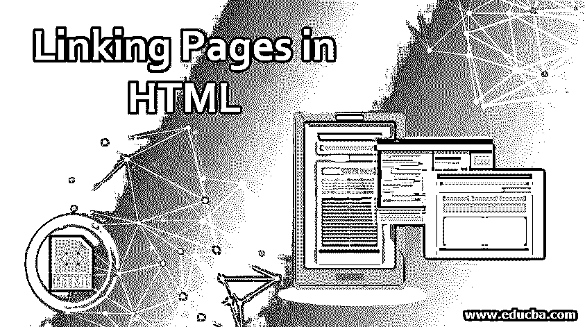
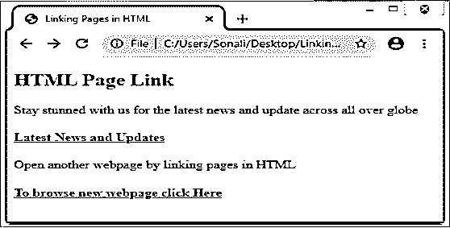
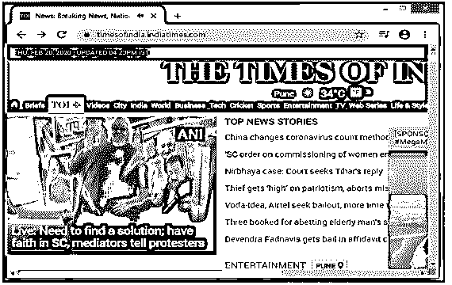
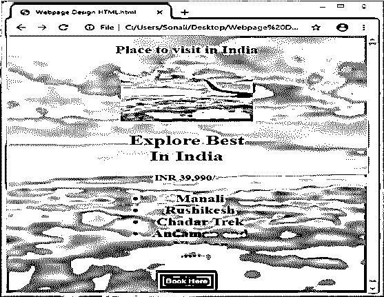
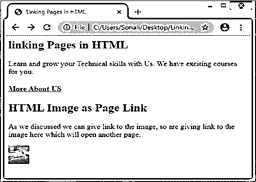
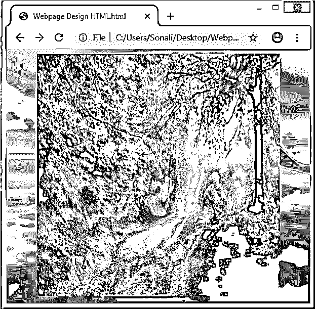
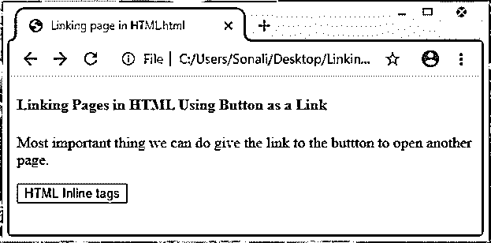
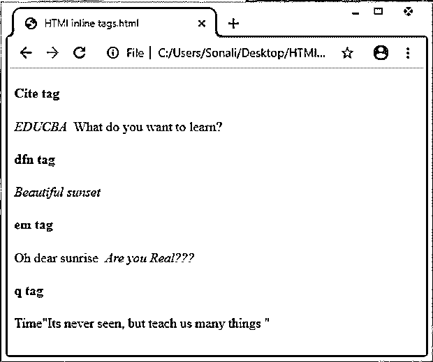

# 在 HTML 中链接页面

> 原文：<https://www.educba.com/linking-pages-in-html/>




## HTML 中链接页面的介绍

链接被简单地定义为文本，它是可点击的，所以当这个文本被点击时，它有助于从一个页面移动到另一个页面。你可以链接到任何元素，比如页面、图片或者网站，从一个页面移动到另一个页面。HTML 链接使用了带有 href 属性的

### HTML 中链接页面的语法

让我们看看如何使用 HTML 链接页面，如下所示:

<small>网页开发、编程语言、软件测试&其他</small>

**语法:**

```
<a href="url"> Text_Content </a>
```

在上面的语法**，**中，锚标签帮助定义和打开一个新的目标页面或文档，使用像目标链接这样的定义属性。

这就像我们之前在 HTML 文件路径内容中看到的绝对文件路径一样。

**语法:**

```
<a href="url"></a**>**
```

我们还可以通过使用相同的语法定义内容的简单路径来打开网站的特定页面或部分。

如果我们必须打开一个特定的页面，那么也可以使用相对文件路径，比如

**语法:**

```
<a href="page_name.html"></a>
```

我们可以使用 HTML 链接做一件更有趣的事情，因为我们可以打开一个空白的浏览器窗口，或者使用语法在一个新窗口中打开我们的网页。

**语法:**

```
<a href="Browser's _URL" target="_blank"></a>
```

如果我们想在父窗口中打开网页，也可以使用如下语法:

**语法:**

```
<a href="path" target="_parent"> </a>
```

### 如何使用 HTML 链接页面？

如前所述，我们已经看到了如何使用带有 href 属性的锚标记来链接网页、图像和其他文档，这是通过定义绝对和相对文件路径来实现的。

我们还熟悉如何处理链接的目标，以实现一些功能，如打开新的空白窗口，在父窗口中打开网页，在自己的窗口中打开页面，就像我们默认使用的那样，使用 _top 属性在完整的浏览器窗口中打开文档等等。

#### 创建书签的链接

让我们看看如何使用 HTML 中的链接创建书签锚。这些功能可以作为我们网页的书签；每当我们想从大页面数据中找到一些东西时，只需定义一些文本或文档作为链接，直接跳转到这个目标位置。

要定义 bookmark，我们必须将 id 作为一个属性添加到一个特定的元素中，通过传递一个名为' # '的符号，我们实际上希望跳转到这个元素的值，这个符号包含在 href 的标签

**举例:**

```
<a href="#home"> Homepage </a>
<h4 id="home"> Home </a>
<h6>This code works as a bookmark, so can jump directly to the home
Section by clicking on link </h6>
```

也可以直接从另一个页面打开特定的部分，只需将该页面的 url 定义到带有 href 属性的 anchor 标记中；内容如下:

**举例:**

```
<a href="Demo.html #contactus"> Contact US </a>
```

#### 下载文档的链接

借助 HTML 中的链接，我们还可以创建帮助我们下载文档的链接。它有同样的事情定义文本作为一个链接，只是增加了目标文件的路径作为一个网址，所以每当我们点击这个链接，连接的文件或网页自动下载。所以我们可以下载 PDF、zip、jpg 等文件类型。

**举例:**

```
<a href="downloads/demo.pdf"> This will download file in PDF format </a>
<a href="downloads/brochures.zip"> This will download file in zip
Format </a>
<a href="downloads/dinjo.jpg"> This will download file as a Image</a>
```

**图片作为 HTML 链接:**HTML 链接的另一个特性是将图片视为 HTML 文档中的链接；这可以定义如下:

**举例:**

```
<a href="demo.html">  </a>
```

按钮作为链接:你也可以在 HTML 中定义一个按钮作为链接；此外，我们必须添加一些 javascript 代码。因此，每当点击事件发生时，它将打开链接的页面。

### HTML 中链接页面的示例

下面举几个例子

#### 示例#1

在这个例子中，我们添加了一个简单的 HTML 链接到一个网站，另一个是本地存储在我们系统中的网页。

**代码:**

```
<!DOCTYPE html>
<html>
<head>
<title>Linking Pages in HTML</title>
</head>
<body>
<h2>HTML Page Link</h2>
<p>Stay stunned with us for the latest news and update across all over globe </p>
<h4><a href="https://timesofindia.indiatimes.com/">Latest News and Updates</a></h4>
<p>Open another webpage by linking pages in HTML</p>
<h4><a href="Webpage%20Design%20HTML.html">To browse new webpage click Here</a></h4>
</body>
</html>
```

**输出:**




对于第一个链接，它将打开网站




对于第二个链接，它将打开一个存储在本地系统的网页




#### 实施例 2

这是一个例子，说明我们使用链接在一个新的标签页中打开网页，当它被点击时，图像作为一个链接打开一个新的文档。

**代码:**

```
<html>
<head>
<title>Linking Pages in HTML</title>
</head>
<body>
<h2>linking Pages in HTML</h2>
<p>Learn and grow your Technical skills with Us. We have exciting courses for you.</p>
<h4><a href="https://www.educba.com/" target="_blankwindow">More About US</a></h4>
<h2>HTML Image as Page Link</h2>
<p>As we discussed we can give link to the image, so are giving link to the image here which will open another page.</p>
<a href="Webpage%20Design%20HTML.html">

</a>
</body>
</html>
```

**输出:**




在新目标窗口中打开另一个页面的第一个链接:


图像作为打开另一个网页的链接:




#### 实施例 3

在这个例子中，我们使用按钮作为链接。

**代码:**

```
<!DOCTYPE html>
<html>
<body>
<h4>Linking Pages in HTML Using Button as a Link</h4>
<p>Most important thing we can do give the link to the button to open another page.</p>
<button onclick="document.location='HTML inline tags.html'">HTML Inline tags</button>
</body>
</html>
```

**输出:**




每当我们要点击按钮时，它将作为一个链接打开另一个页面:




### 结论

最后，在 HTML 中链接页面可以通过使用带有 href 属性的

### 推荐文章

这是一个用 HTML 链接网页的指南。在这里，我们讨论如何通过使用 HTML 和示例来链接页面。您也可以看看以下文章，了解更多信息–

1.  [HTML 中的 TextArea 标签](https://www.educba.com/textarea-tag-in-html/)
2.  [HTML 格式的日期](https://www.educba.com/date-in-html/)
3.  [HTML 块元素](https://www.educba.com/html-block-elements/)
4.  [HTML 元音变音符](https://www.educba.com/html-umlaute/)


