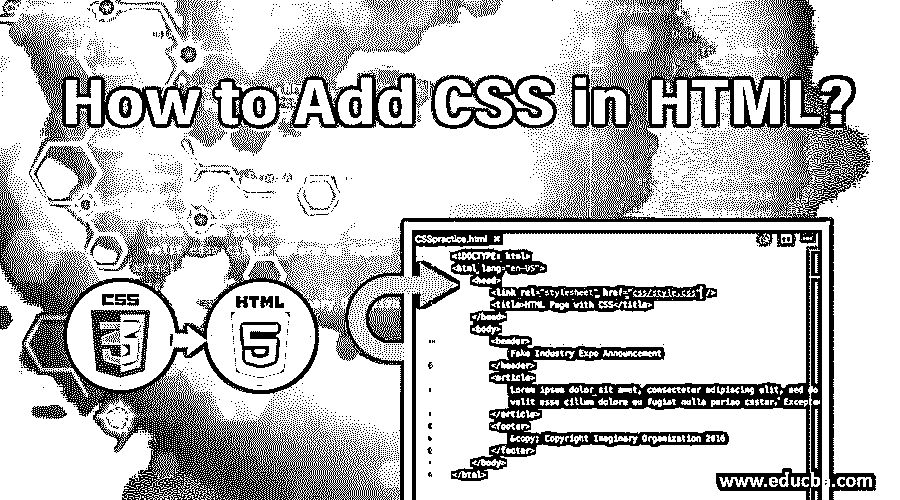
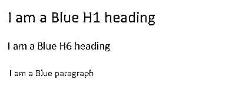
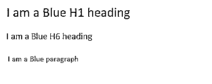
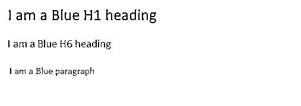

# 如何在 HTML 中添加 CSS？

> 原文：<https://www.educba.com/how-to-add-css-in-html/>




## 在 HTML 中添加 CSS 概述

级联样式表，通常称为 CSS，为 web 开发人员提供了一种根据自己的选择来设计网页样式的方法。对于最终用户来说，简单的 HTML 页面如果没有在 [CSS 中定义的样式格式，将会显得](https://www.educba.com/what-is-css/)非常丑陋和无聊。因此，在现代网站中，CSS 是一个非常重要的组件，它能给网站一个漂亮的、吸引人的、吸引人的外观。传统上，CSS 只负责控制网站的外观和感觉，但不断升级和新的 [CSS 为 web 开发人员和设计人员提供了](https://www.educba.com/css-arrow/)控制网站响应能力的能力，使网页具有适用于笔记本电脑、平板电脑和移动屏幕的独特 UI。

由于 CSS 是每个网站的必需品，它需要灵活，易于按照设计者的要求来定义。此外，由于 CSS 定义可能是非常细粒度的，因此它需要可重用，以便将相同的样式格式一起应用于几个组件。幸运的是，CSS 的功能确实满足这些要求。

<small>网页开发、编程语言、软件测试&其他</small>

### 在 HTML 中添加 CSS 的方法

可以使用以下任一或所有选项将 CSS 添加到网页中。现在，让我们详细探讨这 3 种方法。

#### 1.内嵌 CSS

使用内联 CSS，HTML 设计者可以使用“style”属性在 HTML 元素的标记本身中定义样式信息。它确实有一些优点和缺点，我们将很快用几个例子来讨论。内联 CSS 是应用 CSS 最基本的方法。使用这种方法，我们可以一次只对一个 HTML 元素应用样式。它不提供任何样式重用。样式信息在 HTML 元素的开始标记中定义，并作为值提供给“style”属性。

在下面的例子中，我们使用内联 CSS 改变 h1、h6 和 p 元素的字体颜色。

**代码:**

```
<!DOCTYPE html>
<html>
<body>
<h1 style="color:blue;">I am a Blue H1 heading</h1>
<h1 style="color:blue;">I am a Blue H6 heading</h1>
<p style="color:blue;">I am a Blue Paragraph</p>
</body>
</html>
```

**输出:**




在上面的例子中，我们想要做的就是[将 H1、H6 和 P 标签的字体颜色](https://www.educba.com/css-font-color/)改为蓝色。尽管想要应用相同的样式信息，但我们无法重用它，必须为每个元素单独定义 3 次。由于缺乏可重用性和更多的时间消耗，当设计一个有几个页面的网站时，内联 CSS 不是首选。此外，用内联样式定义制作一个移动响应网站几乎是不可能的。

#### 2.内部 CSS

在内部 CSS 中，HTML 设计者可以在类和 id 引用的帮助下，在 HTML 页面的 部分的标记中定义样式信息。我们将在本教程的下一节深入探讨内部 CSS。如前所述，内部 CSS 是在应用它的 HTML 代码所在的 HTML 文件中定义的。HTML 代码位于主体中，而 CSS 位于标题中的

现在让我们尝试同样的例子，但是用内部 CSS 实现。

**代码:**

```
<!DOCTYPE html>
<html>
<head>
.bluecolor {
color : blue ;
}
</head>
<body>
<h1 class = " bluecolor "> I am a Blue H1 heading </h1>
<h1 class = " bluecolor "> I am a Blue H6 heading </h1>
<p class = " bluecolor "> I am a Blue Paragraph </p>
</body>
</html>
```

**输出:**




如上例所示，我们只需声明一次样式信息，然后多次使用它。虽然内部 CSS 增加了大量样式的可重用性，但是在一个 HTML 文件中定义的 CSS 不能在另一个文件中使用。此外，在同一个文件中声明 CSS 和 HTML 可能会显著增加文件大小，并可能导致加载文件时的延迟。

#### 3.外部 CSS

顾名思义，外部 CSS 可以通过在由扩展名保存的外部 CSS 文件中定义所有 CSS 信息来应用于网页。并且可以在需要应用样式的 HTML 文件中使用<link> 标签导入。构建外部 CSS 机制是为了克服内部和内联 CSS 的缺点。外部 css 需要一个. CSS 文件来携带所有样式信息。然后，该文件可以链接到任意数量的 HTML 文件，其中 HTML 元素引用在链接的 CSS 文件中定义的 id 或类。

这种链接是在 HTML link 标签的帮助下实现的。我们用一个例子来理解这个。我们将创建一个名为 mystyles 和扩展名的 CSS 文件。css 该文件将联系以下数据:

**代码:**

```
.bluecolor{
color:blue;
}
```

现在我们将在 HTML 文件中添加以下内容:

```
<!DOCTYPE html>
<html>
<head>
<link rel="stylesheet" href="mystyles.css">
</head>
<body>
<h1 class = " bluecolor "> I am a Blue H1 heading </h1>
<h1 class = " bluecolor "> I am a Blue H6 heading </h1>
<p class = " bluecolor "> I am a Blue Paragraph </p>
</body>
</html>
```

上述代码将在浏览器中产生以下输出:

**输出:**




### 结论

通过上面的例子，我们可以得出结论，外部 CSS 将是在网站中实现 CSS 的最有效的方式，因为它提供了最高程度的代码可重用性和有限的时间消耗。所有专业开发和流行的主题也是使用外部 CSS 构建的，因为它使网页设计变得非常容易管理和高效。

### 推荐文章

这是一个如何在 HTML 中添加 CSS 的指南？在这里，我们讨论了 html 中 css 的概述和前 3 种方法，并给出了示例和代码实现。您也可以阅读以下文章，了解更多信息——

1.  [CSS 的用途](https://www.educba.com/uses-of-css/)
2.  [HTML 中的 Iframes】](https://www.educba.com/iframes-in-html/)
3.  [CSS 选择器的类型](https://www.educba.com/types-of-css-selectors/)
4.  [CSS 格式化程序](https://www.educba.com/css-formatter/)


