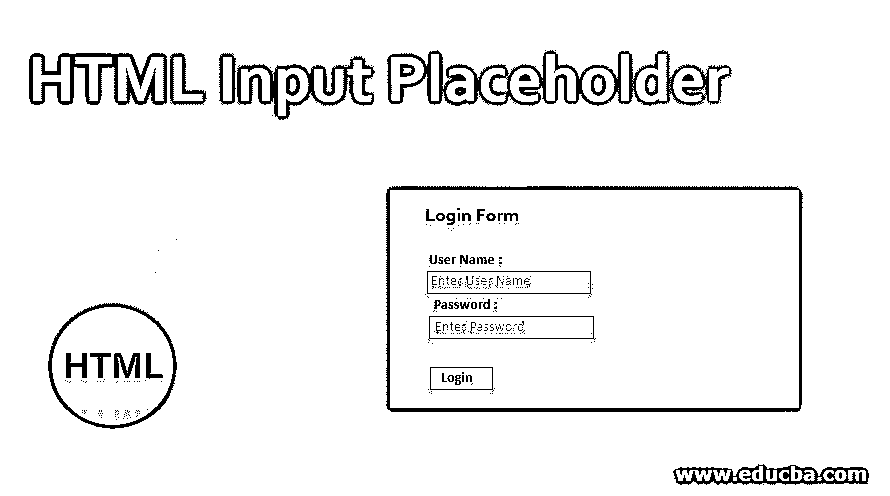
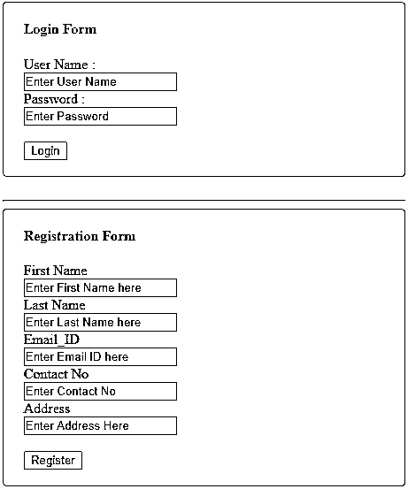
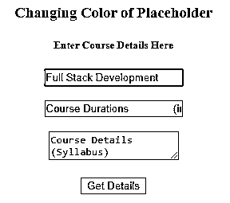
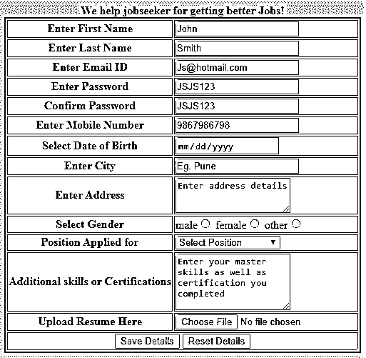

# HTML 输入占位符

> 原文：<https://www.educba.com/html-input-placeholder/>




## HTML 输入占位符介绍

HTML 输入占位符作为给定元素的提示，帮助识别给定输入字段的所需值。这可以在用户实际输入之前用于输入 textfield 或 textarea。它从作为占位符文本包含的相应选择器元素中选择值，并在用户将输入输入到输入字段时将其显示为建议。在输入字段中放置占位符使得用户可以很容易地在给定的输入字段中输入所需的值。所以它最小化了用户的努力。基本上，占位符是浅灰色的，但是我们也可以通过使用一些 CSS 属性来改变它的颜色。

**语法:**

<small>网页开发、编程语言、软件测试&其他</small>

让我们看看占位符的语法，它将如何在输入字段中使用。

```
<element placeholder="placeholder_text">
```

<textfield>和<textarea>元素的属性是占位符。占位符被视为用户在输入字段中输入实际输入值的某种提示。</textarea></textfield>

可以使用一些 CSS 代码来设置占位符的样式，如下所示:

```
::placeholder{
//CSS code;
}
```

占位符可以通过使用对比度等功能来实现，对比度描述了占位符的颜色比输入字段的背景要浅，可用性定义了当您在输入字段中输入内容时，用作占位符的文本必须消失。

通过在输入字段旁边定义占位符，也被视为使用输入字段占位符的最佳方式。

这些输入字段将用于一些伪类，如启用、禁用、只读、读写、占位符显示、默认、选中、不确定、有效、无效、范围内、范围外、必需、可选、空白以及更多其他类。

像类一样，有许多属性也将被使用，如 max、maxlength、min、minlength、pattern、required、step、type 等。

让我们看看占位符将如何用于输入文本:

```
<input type="text " placeholder="placeholder-text">
```

该语法适用于简单的输入文本字段，因此您将通过使用 placeholder 属性帮助用户在输入字段中添加适当的输入。placeholder——文本只是关于用户实际要在这个输入框中输入什么的建议。

我们使用占位符的另一个地方是输入文本区。在此输入字段中，我们可以通过使用占位符来建议用户可以给出的确切输入内容，这样，它将有助于获取适当输入值的用户以及输入输入以获得更好用户体验的用户。

```
<input type="textarea" placeholder="placeholder-text">
```

占位符中有两个不同的东西，一个是:placeholder-showed，表示当输入是通过输入字段中可用的占位符文本时，输入的选择就完成了，而另一个是::placeholder，用于为占位符提供样式。

占位符不能作为标题或标签属性，也不能作为两者的替代物。

我们可以改变占位符的样式，在任何浏览器中显示相同的占位符，对于这个场景，我们必须为特定的浏览器应用 CSS 代码，这样它将在每个浏览器中显示相同的内容。

### HTML 输入占位符的示例

以下是下面提到的例子。

#### 示例#1

在本例中，我们将创建一个登录表单和一个注册表单，其中所有输入字段都使用占位符，因此 HTML 代码和输出如下所示:

**代码:**

```
<!DOCTYPE html>
<html>
<head>
<meta name="viewport" content="width=device-width, initial-scale=1">
<style>
.container {
padding: 2px 12px;
}
.card {
border: 1px solid blue;
border-radius: 5px;
padding-left: 5%;
}
</style>
</head>
<body >
<div class="card">
<h4>Login Form</h4>
<form action="#">
<label for="username">User Name : </label><br>
<input type="text" name="username" placeholder="Enter User Name"><br>
<label for="pw">Password : </label><br>
<input type="password" name="pw" placeholder="Enter Password" ><br><br>
<input type="submit" value="Login"><br><br>
</form>
</div>
<br><hr>
<div class="card">
<h4>Registration Form</h4>
<form>
<label for="fname">First Name</label><br>
<input type="text" name="fname" placeholder="Enter First Name here"><br>
<label for="lname">Last Name</label><br>
<input type="text" name="lname" placeholder="Enter Last Name here"><br>
<label for="email">Email_ID</label><br>
<input type="email" name="email" placeholder="Enter Email ID here"><br>
<label for="mobileno">Contact No</label><br>
<input type="number" name="fname" placeholder="Enter Contact No"><br>
<label for="address">Address</label><br>
<input type="textarea" name="address" placeholder="Enter Address Here"><br><br>
<input type="submit" value="Register"><br><br>
</form>
</div>
</body>
</html>
```

**输出:**




#### 实施例 2

在这个例子中，我们将看到如何改变占位符的颜色。

**代码:**

```
<!DOCTYPE html>
<html>
<head>
<title>Placeholder Color Demo</title>
</head>
<style>
::placeholder{
color: coral;
}
</style>
<body>
<center>
<h3> Changing Color of Placeholder </h3>
<h5>Enter Course Details Here</h5>
<form action="#">
<input type="text" name="cname" placeholder="Course Name">
<br> <br>
<input type="text" name="duration" placeholder="Course Durations
(in Months)">
<br> <br>
<textarea placeholder="Course Details (Syllabus)"></textarea>
<br><br>  <input type="submit" value="Get Details">
</form>
</center>
</body>
</html>
```

**输出:**




#### 实施例 3

这是 HTML 占位符的又一个例子，它可以在输入字段和文本区域工作。

**代码:**

```
<html>
<head>
<title>HTML Placeholder</title>
</head>
<body>
<form >
<table border="2" align="center" width="500" bgcolor="lightblue" >
<caption><b>We help jobseeker for getting better Jobs!</b></caption>
<tr>
<th>Enter First Name</th>
<td><input type="text" name="fn" placeholder="John" required/></td>
</tr>
<tr>
<th>Enter Last Name</th>
<td><input type="text" placeholder="Smith" required/ ></td>
</tr>
<tr>
<th>Enter Email ID</th>
<td><input type="email" placeholder="Js@hotmail.com" required/></td>
</tr>
<tr>
<th>Enter  Password</th>
<td><input type="password" placeholder="JSJS123" required/></td>
</tr>
<tr>
<th>Confirm Password</th>
<td><input type="password" placeholder="JSJS123" required/></td>
</tr>
<tr>
<th>Enter Mobile Number</th>
<td><input type="number" placeholder="9867986798" required/></td>
</tr>
<tr>
<th>Select Date of Birth</th>
<td><input type="date" placeholder="30-04-1994"/></td>
</tr>
<tr>
<th>Enter City</th>
<td><input type="city" placeholder="Eg. Pune"/></td>
</tr>
<tr>
<th>Enter Address</th>
<td><textarea rows="3" cols="20" placeholder="Enter address details"></textarea></td>
</tr>
<tr>
<th>Select Gender</th>
<td>
male<input type="radio" name="g" />
female<input type="radio" name="g" />
other<input type="radio" name="o"/>
</td>
</tr>
<tr>
<th>Position Applied for</th>
<td>
<select name="position">
<option value="" selected="selected" disabled="disabled">Select Position</option>
<option value="1">.NET Developer</option>
<option value="2">UX-UI Designer</option>
<option value="3">Full Stack Developer</option>
<option value="4">Digital Marketing</option>
</select>
</td>
</tr>
<tr>
<th>Additional skills or Certifications</th>
<td><textarea rows="5" cols="20" placeholder="Enter your master skills as well as certification you completed"></textarea></td>
</tr>
<tr>
<th>Upload Resume Here</th>
<td><input type="file"/ ></td>
</tr>
<tr>
<td colspan="2" align="center"><input type="submit" value="Save Details"/>
<input type="reset" value="Reset Details"/>
</td>
</tr>
</table>
</form>
</body>
</html>
```

**输出:**




**结论**

根据以上所有信息，我们可以说 HTML 占位符只不过是一种与文本输入域或文本区域相关的文本、建议或提示。因此，用户可以很容易地从占位符中获取信息，并在输入字段中输入适当的信息。

### 推荐文章

这是一个 HTML 输入占位符的指南。这里我们讨论 HTML 输入占位符的例子以及代码和输出。您也可以看看以下文章，了解更多信息–

1.  [HTML 图片标签](https://www.educba.com/html-picture-tag/)
2.  [HTML 罢工标签](https://www.educba.com/html-strike-tag/)
3.  [HTML 中没有边框的表格](https://www.educba.com/table-without-border-in-html/)
4.  [HTML 中的嵌套表格](https://www.educba.com/nested-table-in-html/)


