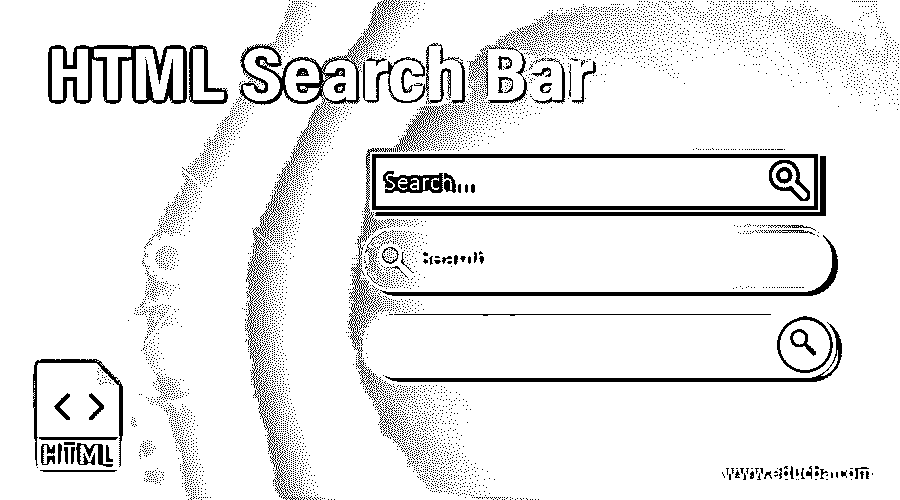
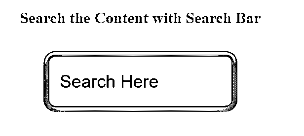
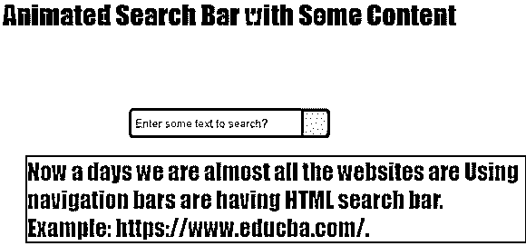

# HTML 搜索栏

> 原文：<https://www.educba.com/html-search-bar/>




## HTML 搜索栏简介

HTML 中的搜索栏是一个文本字段，如果我们知道实际句子之间的关键字，就可以搜索内容。通常，搜索框总是添加在导航栏中。我们还可以根据客户需求在导航栏中添加按钮、下拉列表和锚点，以及搜索框。一般来说，它被放在页面的顶部以方便导航。它将由<input class="”form-control”" type="”text”" placeholder="”Search”">创建。根据客户要求，设计颜色有所不同。

*   **实时场景:**如今我们几乎所有的网站都在使用导航条，都是一样的。
*   **举例:**[**【https://www.educba.com/】**](https://www.educba.com/)从这个网站你可以看到下面的搜索栏。


<small>网页开发、编程语言、软件测试&其他</small>

为什么我们在 HTML 中使用 CSS？

提供所有页面之间的公共逻辑；我们使用 CSS 文件来编写公共逻辑，而不是在每个 HTML 页面中编写相同样式的逻辑。并在每个带有<link>标签的 HTML 页面中包含这个 CSS 页面。

### HTML 中的搜索栏是如何工作的？

这用于通过任何关键字搜索内容；如果在页面上找到搜索关键字，将显示结果。它可以用下面的语法来设计。

**语法:**

```
<div class="navBar">
<a class="active" href="#">Link1</a>
<a href="#">Link2</a>
<a href="#">Link3</a>
<a href="#">Link4</a>
.
.
.
.
<input type="text" placeholder="search here">
</div>
```

### 例子

以下是一些例子:

#### 1.搜索栏

**代码:**

```
<!DOCTYPE html>
<html>
<head>
<title>Search Bar</title>
<style>
h1 {
text-align: center;
color: blue;
}
* {
outline: none;
}
html, body {
height: 100%;
min-height: 100%;
}
body {
margin: 0;
background-color: brown;
}
.tableBar {
display: table;
width: 100%;
}
.tableDivision {
display: table-cell;
vertical-align: middle;
}
input, button {
margin: 0;
border: 0;
background-color: transparent;
color: green;
font-family: sans-serif;
padding: 0;
}
.top {
position: absolute;
top: 50%;
border-radius: 20px;
transform: scale(0.6);
margin: -83px auto 0 auto;
background-color: white;
left: 0;
right: 0;
width: 550px;
box-shadow: 0 10px 40px aqua, 0 0 0 20px blue;
padding: 35px;
}
form {
height: 96px;
}
input[type="text"] {
font-size: 60px;
line-height: 1;
width: 100%;
height: 96px;
}
input[type="text"]::placeholder {
color: red;
}
#myID {
padding-left: 35px;
width: 1px;
}
button {
width: 84px;
height: 96px;
cursor: pointer;
position: relative;
display: block;
}
#myCircle {
height: 43px;
margin-top: 0;
border-width: 15px;
position: relative;
top: -8px;
border: 15px solid #fff;
background-color: transparent;
border-radius: 50%;
left: 0;
width: 43px;
transition: 0.5s ease all;
background-color: transparent;
border-radius: 50%;
}
button span {
position: absolute;
top: 68px;
border-radius: 10px;
transform: rotateZ(52deg);
transition: 0.5s ease all;
width: 45px;
left: 43px;
display: block;
height: 15px;
background-color: transparent;
display: block;
}
button span:before, button span:after {
content: '';
position: absolute;
background-color: #fff;
border-radius: 10px;
bottom: 0;
right: 0;
transform: rotateZ(0);
transition: 0.5s ease all;
width: 45px;
height: 15px;
transition: 0.5s ease all;
}
#myID:hover #myCircle {
top: -1px;
width: 67px;
height: 15px;
border-width: 0;
background-color: #fff;
border-radius: 20px;
}
#myID:hover span {
top: 50%;
width: 25px;
margin-top: 3px;
left: 56px;
transform: rotateZ(0);
}
#myID:hover button span:before {
transform: rotateZ(52deg);
bottom: 11px;
}
#myID:hover button span:after {
bottom: -11px;
transform: rotateZ(-52deg);
}
#myID:hover button span:before, #myID:hover button span:after {
right: -6px;
width: 40px;
background-color: lime;
}
</style>
</head>
<body>
<h1>Search the Content with Search Bar</h1>
<div class="top">
<form method="get" action="#">
<div class="tableBar">
<div class="tableDivision">
<input type="text" placeholder="Search Here" required>
</div>
<div class="tableDivision" id="myID">
<button type="submit">
<div id="myCircle"></div>

</button>
</div>
</div>
</form>
</div>
</body>
</html>
```

**输出:**




#### 2.动画搜索栏

**代码:**

```
<!DOCTYPE html>
<html>
<head>
<title>Search Bar</title>
<style>
@import url(https://fonts.googleapis.com/css?family=Open+Sans);
body {
background: white;
font-family: fantasy;
}
h1 {
color: red;
text-align: center;
}
.main {
border: solid 2px brown;
font-size: 28px;
color: maroon;
width: 600px;
margin: 150px;
}
.searchTop {
width: 100%;
display: flex;
position: relative;
}
.searchBar {
width: 100%;
border: 3px solid navy;
height: 20px;
border-radius: 5px 0 0 5px;
border-right: none;
padding: 5px;
outline: none;
color: green;
}
.searchBar:focus {
color: purple;
}
.searchButton {
width: 40px;
height: 36px;
font-size: 20px;
text-align: center;
color: white;
border: 1px solid gray;
border-radius: 0 5px 5px 0;
cursor: pointer;
background: gray;
border-radius: 0 5px 5px 0;
cursor: pointer;
}
.topDiv {
width: 30%;
top: 50%;
left: 50%;
transform: translate(-50%, -50%);
position: absolute;
left: 50%;
transform: translate(-50%, -50%);
}
</style>
</head>
<body>
<h1>Animated Search Bar with Some Content</h1>
<div class="topDiv">
<div class="searchTop">
<input type="text" class="searchBar"
placeholder="Enter some text to search?">
<button type="submit" class="searchButton">
<i class=""></i>
</button>
</div>
</div>
<div class="main">Now a days we are almost all the websites are
Using navigation bars are having HTML search bar. Example:
https://www.educba.com/.</div>
</body>
</html>
```

**输出:**




#### 3.动画搜索栏

**代码:**

```
<!DOCTYPE html>
<html>
<head>
<title>Search Bar</title>
<style>
h1
{
color: maroon;
text-align: center;
}
body {
background-image: linear-gradient(to right, green, brown);
}
.topDiv {
position: absolute;
top: 50%;
left: 50%;
transform: translate(-40%, 40%);
height: 40px;
border-radius: 40px;
padding: 10px;
background: #2f3640;
border-radius: 40px;
padding: 10px;
}
.topDiv:hover>.searchBar {
width: 250px;
padding: 0 5px;
}
.topDiv:hover>.button {
background: white;
color: blue;
}
.button {
color: red;
float: right;
height: 45px;
border-radius: 50%;
background: aqua;
width: 45px;
justify-content: center;
align-items: center;
transition: 0.35s;
display: flex;
align-items: center;
transition: 0.35s;
}
.searchBar {
border: none;
background: none;
float: left;
padding: 0;
color: white;
outline: none;
transition: 0.4s;
line-height: 40px;
font-size: 16px;
width: 0px;
line-height: 40px;
padding: 0;
color: white;
}
@media screen and (max-width: 630px) {
.topDiv:hover>.searchBar {
width: 160px;
padding: 0 5px;
}
}
</style>
</head>
<body>
<h1>Animated Search Bar with radius</h1>
<div class="topDiv">
<input class="searchBar" type="text" name="" placeholder="Search">
<button class="button" href="#">
<i class="material-icons"> search </i>
</button>
</div>
</body>
</html>
```

**输出:**


**解释:**当我们点击移动光标到搜索按钮时，它会打开一个文本字段来输入一些内容。

### 结论

它用于通过使用不同的功能来搜索同一页面或整个页面中的内容。我们还可以使用 CSS 属性给搜索栏添加一些动画和颜色。

### 推荐文章

这是一个 HTML 搜索栏的指南。这里我们讨论 HTML 中的搜索栏是如何工作的，并举例说明如何用正确的代码和输出来实现。您也可以浏览我们的其他相关文章，了解更多信息——

1.  [HTML 地理定位](https://www.educba.com/html-geolocation/)
2.  [HTML 部分标签](https://www.educba.com/html-section-tag/)
3.  [HTML Tooltip](https://www.educba.com/html-tooltip/)
4.  [HTML 字体](https://www.educba.com/html-schriftart/)


