# 如何安装 CentOS？

> 原文：<https://www.educba.com/install-centos/>

## 如何安装 Centos？

以下文章概述了如何安装 CentOS？ [CentOS](https://www.educba.com/what-is-centos/) (社区企业操作系统)是从 2004 年 3 月发布的红帽企业 Linux (RHEL)衍生而来的 Linux 发行版。它是免费的，因此在用户、网络主机和小企业中很受欢迎。它最初是作为 CAOS Linux 的构建工件出现的。它在 2010 年 7 月成为最受欢迎的 Linux 发行版，几乎 30%的服务器都在使用它，但是 Debian 在 2012 年 1 月超过了它。红帽于 2014 年 1 月宣布赞助 CentOS，由此 CentOS 商标的所有权被授予红帽。

CentOS 开发人员使用红帽的源代码开发了一个类似于 RHEL 的最终产品，旨在实现 RHEL 的功能兼容性。一个由 Red Hat 员工和 CentOS 开发人员组成的名为“管理委员会”的团队成立了，以进一步开发发行版并支持各个工作组。CentOS 不断发展，因此为最新软件提供了平台。新的开发是通过记住已经活跃的组件的稳定性来完成的。它对于操作系统的虚拟化非常有用和高效。

<small>网页开发、编程语言、软件测试&其他</small>

### CentOS 的版本

CentOS 发布的版本有很多。

| **CentOS 版本** | **发布日期** |
| **2.1** | 2004 年 5 月 14 日 |
| **3.1** | 2004 年 3 月 19 日 |
| **3.3** | 2004 年 9 月 17 日 |
| **3.4** | 2005 年 1 月 23 日 |
| **3.5** | 二零零五年六月十日 |
| **3.6** | 2005 年 11 月 1 日 |
| **3.7** | 二零零六年四月十日 |
| **3.8** | 2006 年 8 月 25 日 |
| **3.9** | 二零零七年七月二十六日 |
| **4.0** | 2005 年 3 月 9 日 |
| **4.1** | 二零零五年六月十二日 |
| **4.2** | 二零零五年十月十三日 |
| **4.3** | 二零零六年三月二十一日 |
| **4.4** | 二零零六年八月三十日 |
| **4.5** | 二零零七年五月十七日 |
| **4.6** | 二零零七年十二月十六日 |
| **4.7** | 二零零八年九月十三日 |
| **4.8** | 2009 年 8 月 21 日 |
| **4.9** | 2011 年 3 月 2 日 |
| **5.0** | 二零零七年四月十二日 |
| **5.1** | 2007 年 12 月 2 日 |
| **5.2** | 二零零八年六月二十四日 |
| **5.3** | 2009 年 3 月 31 日 |
| **5.4** | 2009 年 10 月 21 日 |
| **5.5** | 2010 年 5 月 14 日 |
| **5.6** | 2011 年 4 月 8 日 |
| **5.7** | 2011 年 9 月 13 日 |
| **5.8** | 2012 年 3 月 7 日 |
| **5.9** | 2013 年 1 月 17 日 |
| **5.10** | 2013 年 10 月 19 日 |
| **5.11** | 2014 年 9 月 30 日 |
| **6.0** | 2011 年 7 月 10 日 |
| **6.1** | 2011 年 12 月 9 日 |
| **6.2** | 2011 年 12 月 20 日 |
| **6.3** | 2012 年 7 月 9 日 |
| **6.4** | 2003 年 3 月 9 日 |
| **6.5** | 2013 年 12 月 1 日 |
| **6.6** | 2014 年 10 月 28 日 |
| **6.7** | 2015 年 8 月 7 日 |
| **6.8** | 2016 年 5 月 25 日 |
| **6.9** | 2017 年 4 月 5 日 |
| **6.10** | 2018 年 7 月 3 日 |
| **7.0-1406** | 2014 年 7 月 7 日 |
| **7.1-1503** | 2015 年 3 月 31 日 |
| **7.2-1511** | 2015 年 12 月 14 日 |
| **7.3-1611** | 2016 年 12 月 12 日 |
| **7.4-1708** | 2017 年 9 月 13 日 |
| **7.5-1804** | 2018 年 5 月 10 日 |
| **7.6-1810** | 2018 年 12 月 3 日 |

版本 3 支持 6 年，版本 4 支持 7 年，而版本 5、6 和 7 将维持 10 年。版本 4、5、6 和 7 支持不同版本中的不同体系结构，如 i386 系统。架构 ia64、ppc、SPARC、Alpha 和 s390 仅在版本 4 中受支持。CentOS 版本 7 支持 Armhfp 和 aarch64。

### 安装 Centos 7 的步骤

现在，让我们看看如何使用以下步骤安装 CentOS 7:

#### 步骤 1:下载 ISO 映像

必须从以下链接下载 CentOS 的副本:[https://www.centos.org/download/](https://www.centos.org/download/)。

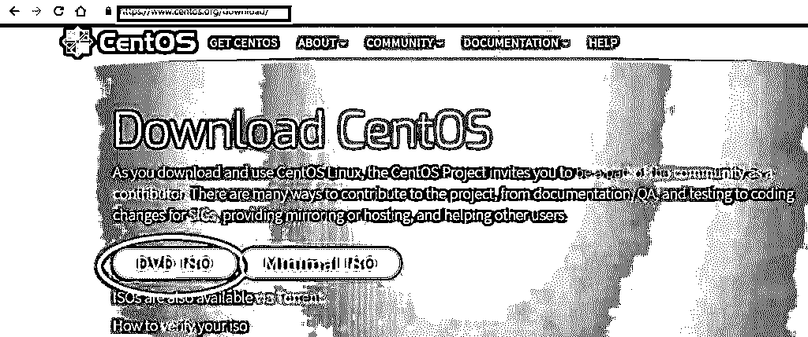

#### 步骤 2:选择 ISO 映像

选择适合您的系统或根据您的需要的图像。

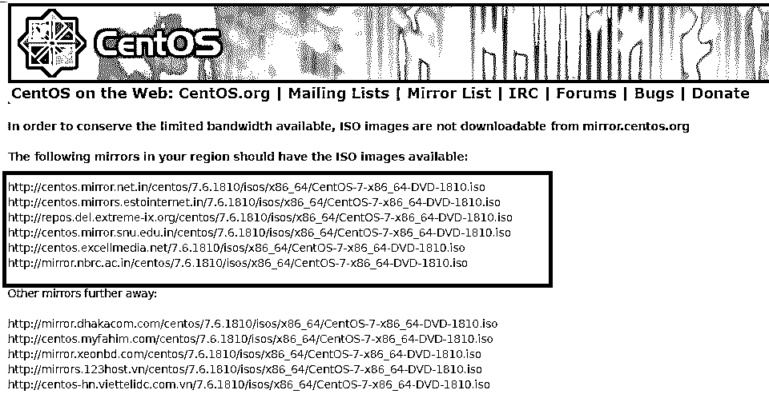

#### 步骤 3:制作可引导驱动器

只需使用 dd 命令将 iso 文件传输到 USB，或者可以使用 Win32DiskImager 或 Etcher。

**# DD if =/iso/CentOS-7-x86 _ 64-DVD-1602-99 . iso of =/dev/sdb**

确保您的 USB 至少有 4.3 GB 的可用空间。

#### 第四步:开始安装 Centos

将创建的 USB 放入适当的驱动器，启动计算机，选择可引导单元，将出现如下所示的窗口。

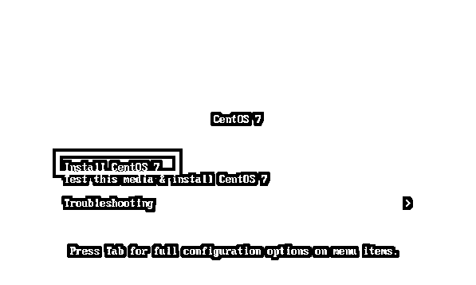

选择“安装 CentOS 7”并按回车键。

系统将开始加载媒体安装程序。

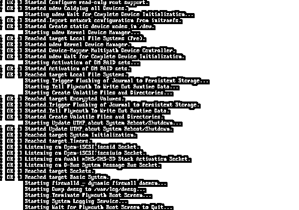

#### 第五步:选择所需的语言

选择安装过程中要使用的适当语言，然后按继续。

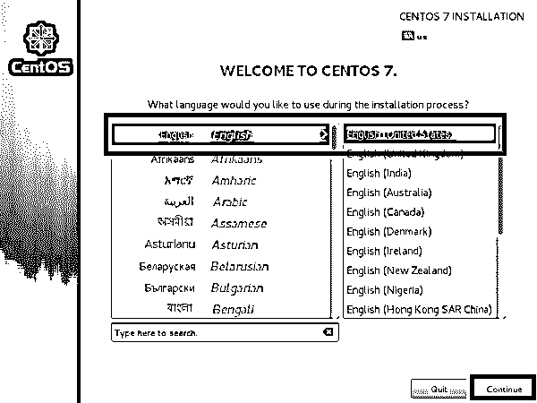

#### **第六步:定制您的系统**

将出现安装摘要窗口，其中有许多选项。根据自己的需要逐一更改设置。

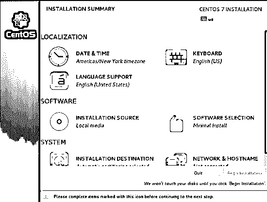

点击日期和时间，改变地图上的位置，然后点击完成。

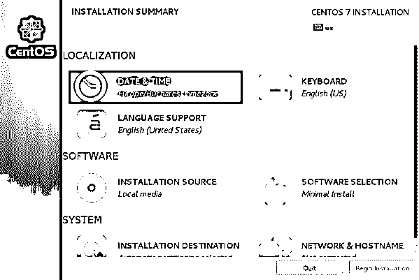

将出现一个地图，并选择您的时区。

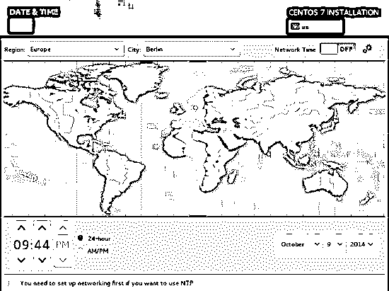

现在，通过单击键盘来更改键盘设置。

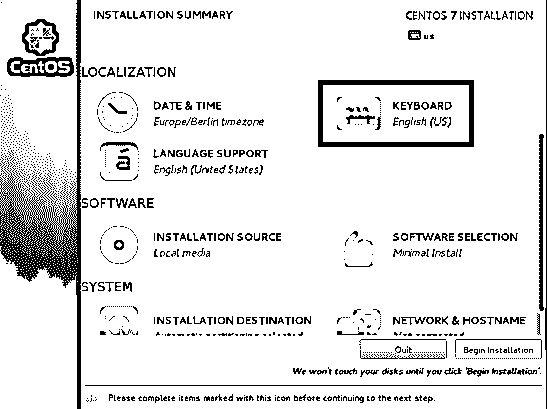

将出现一个窗口。选择一种语言，然后单击+图标添加更多键盘布局。

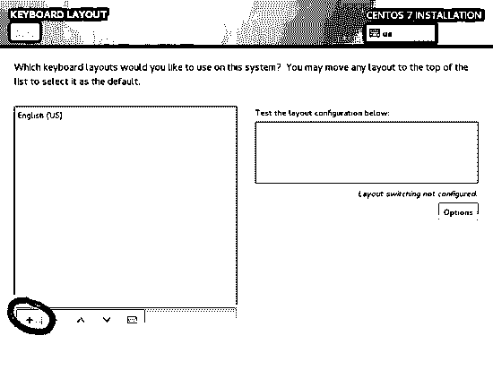

安装源将是自动检测的安装介质。如果你有任何其他的安装源，那么你可以相应地放置路径。

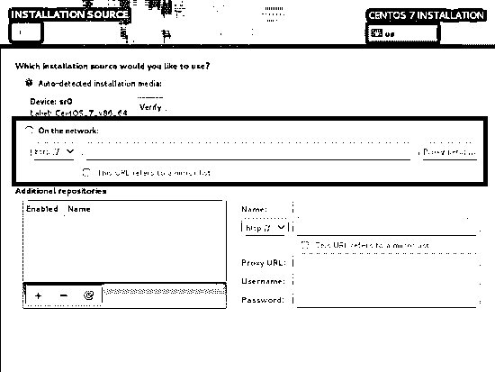

现在更改“安装目的地”，也可以进行手动分区。对于手动分割，点击“我将配置分割”。

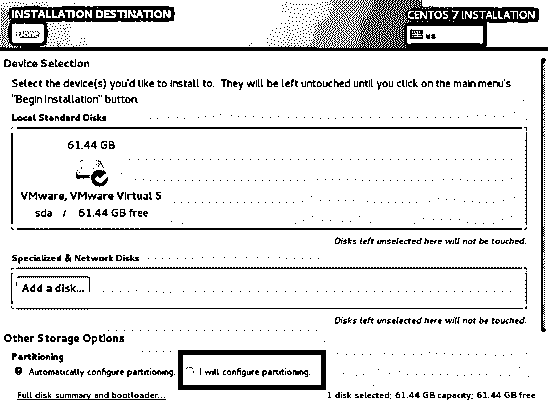

现在，您可以自定义网络和主机名设置。

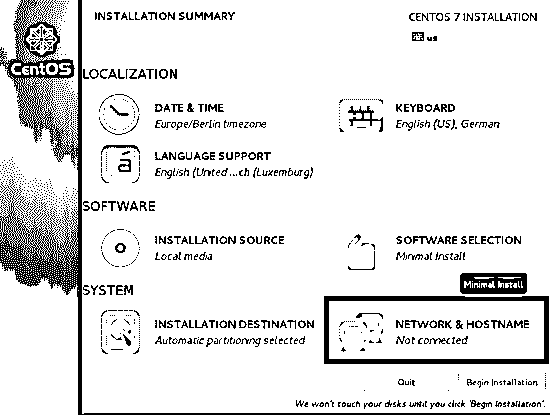

添加主机名，然后单击配置以自定义以太网部分。

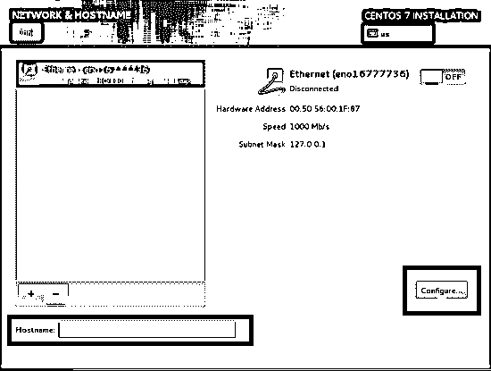

现在窗口将会出现。您可以根据需要添加 [IPv4 和 IPv6](https://www.educba.com/ipv4-vs-ipv6/) 设置。

现在接通连接。将显示连接的所有细节。

点击完成后。

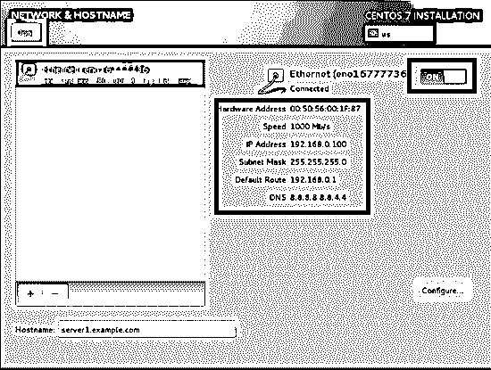

现在，我们可以通过单击“开始安装”按钮开始安装 Centos。

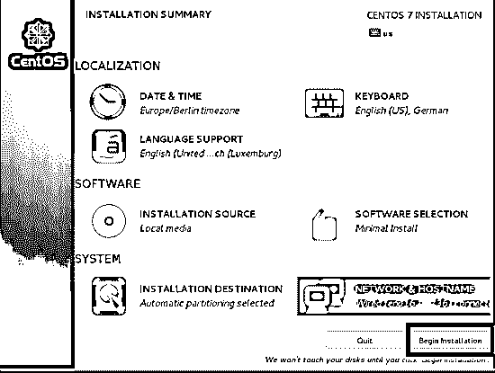

安装 Centos 的过程将开始。现在我们需要提供用户设置。

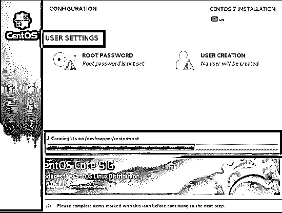

首先，让我们设置 root 密码。点击 ROOT 密码。将出现一个窗口。设置您选择的 root 密码，然后单击 Done。

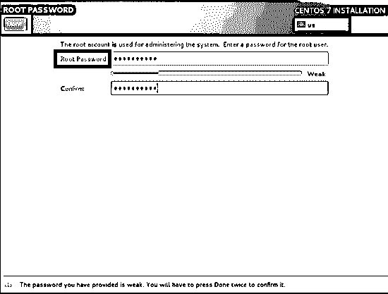

现在我们将创建一个用户。

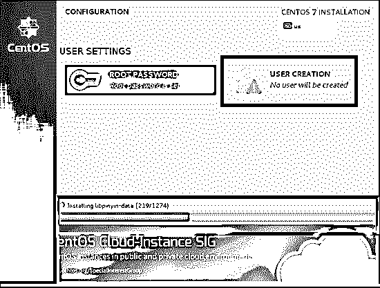

点击“用户创建”,填写所需的详细信息，创建一个用户，然后按“完成”。

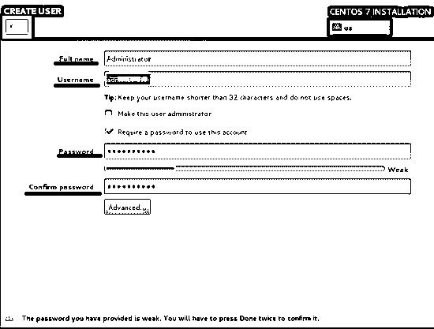

现在，等待一段时间。安装完成后，它会要求重新启动您的系统，所以单击重新启动按钮。

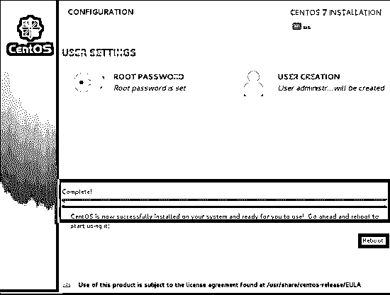

重新启动后，您的登录屏幕将会打开。

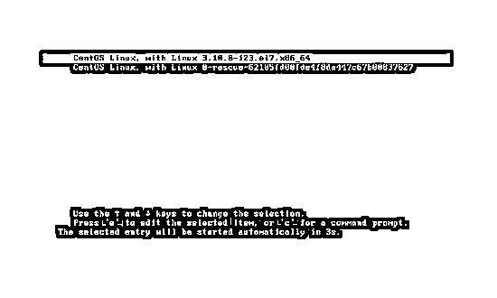

输入您的用户登录详细信息。

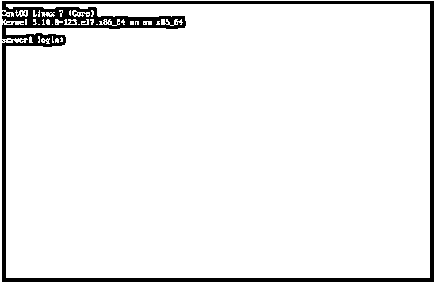

现在，您的 CentOS 7 已成功安装在您的系统上。现在 install 需要软件来执行其他任务，并开始使用 Linux 的 CentOS 发行版。

### 推荐文章

这是如何安装 CentOS 的指南？这里，我们介绍了使用不同版本的 CentOS 以更简单的方式安装 CentOS 的不同步骤。您也可以阅读以下文章，了解更多信息——

1.  [安装 Java 8](https://www.educba.com/install-java-8/)
2.  [安装卡珊德拉](https://www.educba.com/install-cassandra/)
3.  [安装。网络](https://www.educba.com/install-dot-net/)
4.  [安装引导程序](https://www.educba.com/install-bootstrap/)

