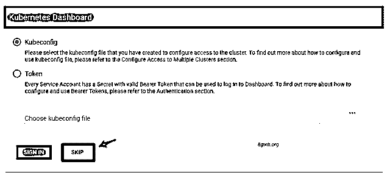
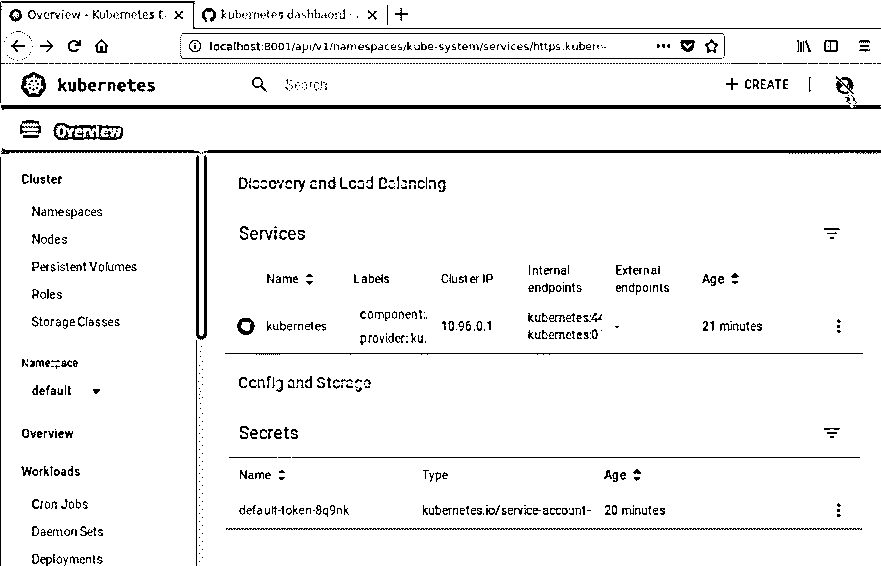
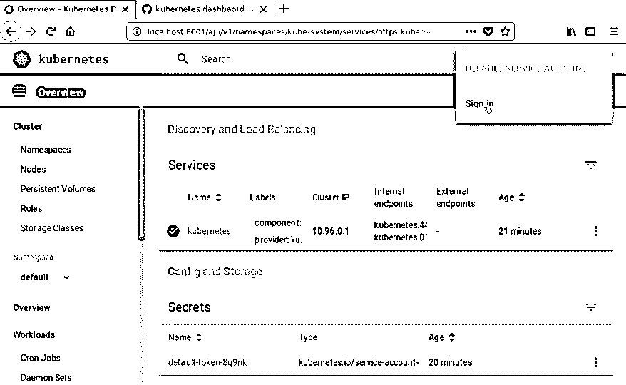
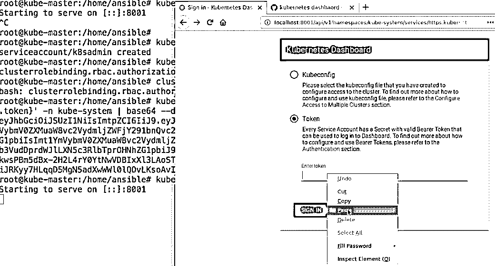
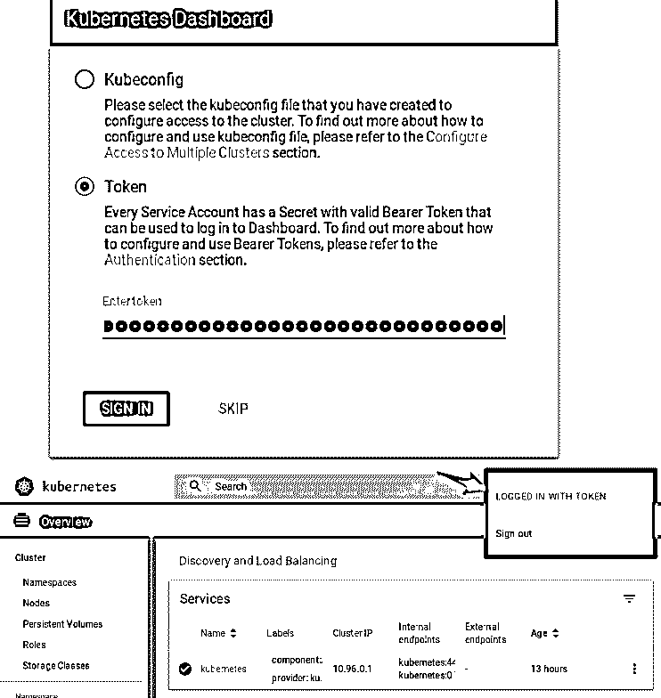

# 安装库面板

> 原文：<https://www.educba.com/install-kubernetes-dashboard/>

## 如何安装 Kubernetes Dashboard 概述

以下文章提供了安装 Kubernetes Dashboard 的概要。 [Kubernetes 是一个](https://www.educba.com/what-is-kubernetes/)容器管理工具。这个工具的主要目标是部署容器，缩放和清除容器，平衡容器负载。它不是基于集装箱化平台；它提供了管理多个容器的解决方案。它支持多种云和裸机环境。它是 100%开源的，用 Gonne 编写。两年前，谷歌推动 Kubernetes 开源。它的一个关键卖点是，它已经被用来运行谷歌的庞大系统很长时间了。Kubernetes Dashboard 是一个基于网络的用户界面，用于 [Kubernetes 集群](https://www.educba.com/kubernetes-alternatives/?source=leftnav)。

Kubernetes 为用户提供了一个仪表板来与 Kubernetes 进行交互并执行一些任务。Kubernetes dashboard 允许用户对他们的应用程序进行故障排除，在 Kubernetes 集群上添加容器化的应用程序，并有效地管理它们。它还概述了在 Kubernetes 上运行的所有应用程序。Kubernetes dashboard 显示集群上运行的所有资源的状态，如果出现错误，它会显示该信息。在本文中，我们将看到 Kubernetes 仪表板的安装过程。

<small>网页开发、编程语言、软件测试&其他</small>

### 安装 Kubernetes 仪表板的步骤

要安装 Kubernetes 仪表板，请仔细遵循以下步骤:

如果你有$HOME/。kube/config 文件，如果它没有列在 Kube Config 环境变量中，那么运行下面的命令。

**代码:**

`export KUBECONFIG=/etc/kubernetes/admin.conf`

#### 步骤 1:如何部署 Kubernetes 仪表板？

要部署 Kubernetes 仪表板，请运行以下命令:

**代码:**

`kubectl create -f https://raw.githubusercontent.com/kubernetes/dashboard/master/src/deploy/recommended/kubernetes-dashboard.yaml`

那么输出将如下所示:

`secret/kubernetes-dashboard-certs created
serviceaccount/kubernetes-dashboard created
role.rbac.authorization.k8s.io/kubernetes-dashboard-minimal created
rolebinding.rbac.authorization.k8s.io/kubernetes-dashboard-minimal created
deployment.apps/kubernetes-dashboard created
service/kubernetes-dashboard created`

#### 步骤 2:如何验证仪表板服务正在运行？

创建仪表板后，验证 SVC/部署已启动并正在运行。

#### 步骤 3:如何描述安装 Kubernetes Dashboard？

要查看 svc 信息，请运行以下命令。

**代码:**

`kubectl describe svc/kubernetes-dashboard -n Kube-system`

之后，为了验证 Kubernetes dashboard pods 已经启动并正在运行，下面给出了运行命令:

**代码:**

`kubectl get pods --all-namespaces`

您可以授予 Dashboard 的服务帐户完全管理权限。为此，您必须在 ClusterRoleBinding 下创建。

**代码:**

`cat dashboard-admin.yaml
apiVersion: rbac.authorization.k8s.io/v1beta1
kind: ClusterRoleBinding
metadata:
name: kubernetes-dashboard
labels: k8s-app: kubernetes-dashboard
roleRef: API groups: rbac.authorization.k8s.io
kind: ClusterRole
name: cluster-admin
subjects: - kind: ServiceAccount
name: kubernetes-dashboard
namespace: Kube-system
Copy the YAML file based on installation method and save that file as given name: a dashboard-admin.yaml`

使用下面给出的命令来部署它。

**代码:**

`kubectl create -f dashboard-admin.yaml
The output will be as follows:
clusterrolebinding.rbac.authorization.k8s.io/kubernetes-dashboard created`

之后，您可以使用登录页面上的跳过选项来访问 Dashboard。

#### 步骤 4:如何访问已安装的 Kubernetes 仪表板？

要设置代理，请运行以下命令:

**代码:**

`kubectl proxy --address 0.0.0.0 --accept-hosts '.*'
Starting to serve on [::]:8001`

要访问已安装的 Kubernetes 仪表板，请运行以下命令:

**代码:**

`HTTP://<IP>:<PORT>/api/v1/namespaces/Kube-system/services/https:kubernetes-dashboard:/proxy/#!/login`

之后，您可以看到仪表板页面。

然后，转到仪表板页面上的控制面板，单击登录，如下所示。

#### 步骤 5:如何使用令牌安装 Kubernetes Dashboard 身份验证？

一、创建新的服务账户

为此，运行以下命令:

**代码:**

`kubectl create serviceaccount k8sadmin -n Kube-system
The output will be as follows
serviceaccount/k8sadmin created`

**二。之后，使用下面的命令**创建一个具有集群管理员权限的 ClusterRoleBinding

**代码:**

`kubectl create cluster role binding k8sadmin --clusterrole=cluster-admin --serviceaccount=kube-system:k8sadmin
then the output will be as follows clusterrolebinding.rbac.authorization.k8s.io/k8sadmin created`

要获取令牌，请运行以下命令:

**代码:**

`kubectl get secret -n Kube-system | grep k8sadmin | cut -d " " -f1 | xargs -n 1 | xargs kubectl get secret -o 'jsonpath={.data.token}' -n Kube-system | base64 --decode`

然后，我们将获得 base64 解码的令牌作为输出，如下所示:

**代码:**

`eyJhbGciOiJSUzI1NiIsImtpZCI6IiJ9.eyJpc3MiOiJrdWJlcm5ldGVzL3NlcnZpY2VhY2NvdW50Iiwia3ViZXJuZXRlcy5pby9zZXJ2aWNlYWNjb3VudC9`

复制此令牌并将其粘贴到令牌按钮下。

现在您已经登录到 Kubernetes 仪表板。

#### 第六步:如何删除 Kubernetes dashboard Services？

要删除 Kubernetes 仪表板服务，1 st 检查我们想要删除的服务在哪里。即这些服务的路径。

要检查这一点，请运行给定的命令:

**代码:**

`daemon sets,replica sets,services,deployments,pods,RC --all
After that, we can delete services with their paths
kubectl delete replica sets/kubernetes-dashboard -n Kube-system
kubectl delete svc/kubernetes-dashboard -n Kube-system
kubectl delete deployments/kubernetes-dashboard -n Kube-system
kubectl -n Kube-system delete $(kubectl -n Kube-system get pod -o name | grep dashboard)`

#### 第七步:如何编辑 Kubernetes 仪表板服务？

要编辑 Kubernetes dashboard 服务，请运行给定的命令:

**代码:**

`kubectl edit svc/kubernetes-dashboard -n kube-system`

### 推荐文章

这是一个指南，安装 Kubernetes 仪表板。在这里，我们已经讨论了安装 Kubernetes Dashboard 的基本概述和最简单的方法。您也可以浏览我们推荐的其他文章，了解更多信息——

1.  [什么是大数据技术？](https://www.educba.com/what-is-big-data-technology/)
2.  [Splunk vs Spark](https://www.educba.com/splunk-vs-spark/)
3.  [如何安装 Kubernetes？](https://www.educba.com/install-kubernetes/)
4.  [如何安装 Spark](https://www.educba.com/how-to-install-spark/)

