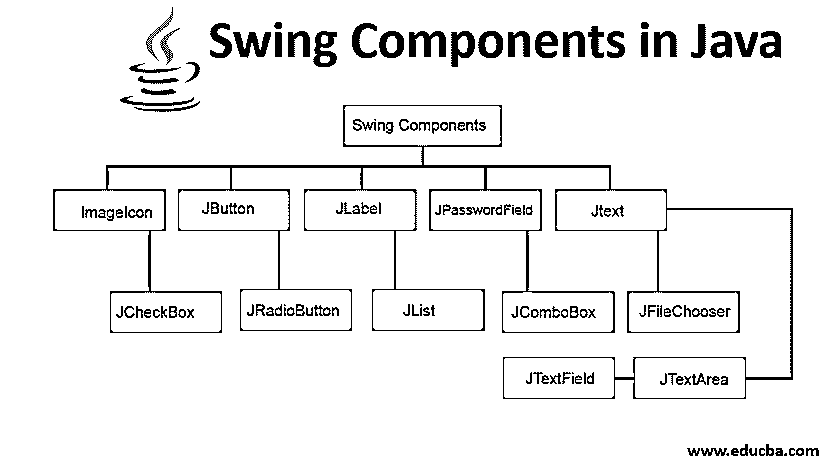

# Java 中的 Swing 组件

> 原文：<https://www.educba.com/swing-components-in-java/>




## Java 中的 Swing 组件简介

Swing 组件是应用程序的基本构建块。我们知道 Swing 是一个用于 Java 的 GUI 部件工具包。每个应用程序都有一些基本的用户交互界面。例如，按钮、复选框、单选按钮、文本字段等。这些共同构成了 Swing 中的组件。

总而言之，Swing 组件是一个 [Java](https://www.educba.com/applications-of-java/) 应用程序中的交互元素。我们将在本文中看到各种 Swing 组件，并看到几个例子。请注意，这些示例是简单的代码片段。您可以在您的应用程序中使用它们，并根据您的应用程序架构对它们进行定制。

<small>网页开发、编程语言、软件测试&其他</small>

### Java 中 Swing 的 13 大组件

以下是 swing 在 java 中的不同组件:

#### 1\. ImageIcon

ImageIcon 组件从位于源 URL 的图像创建图标大小的图像。

**举例:**

```
ImageIcon homeIcon = new ImageIcon("simg/home.jpg");
```

这将返回一个主页按钮的图标。string 参数是源图像所在的路径。

**Note:** We would be using this image icon in further examples.

#### 2\. JButton

JButton 类用于在 UI 上创建一个按钮。按钮可以包含一些显示文本或图像。单击和双击时，它会生成一个事件。一个 [JButton](https://www.educba.com/jbutton-in-java/) 可以通过调用它的一个构造函数在应用程序中实现。

**举例:**

```
JButton okBtn = new JButton("Ok");
```

这个构造函数返回一个带有文本 Ok 的按钮。

```
JButton homeBtn = new JButton(homeIcon);
```

它返回一个带有 home 图标的按钮。

```
JButton btn2 = new JButton(homeIcon, "Home");
```

它返回一个带有 home 图标和文本 Home *的按钮。*

#### 3\. JLabel

JLabel 类用于在 UI 上呈现只读文本标签或图像。它不会生成任何事件。

**举例:**

```
JLabel textLbl = new JLabel("This is a text label.");
```

这个构造函数返回一个带文本的标签。

```
JLabel imgLabel = new JLabel(homeIcon);
```

它返回一个带有主页图标的标签。

#### 4.jtextfield(jtextfield)

[JTextField](https://www.educba.com/jtextfield-in-java/) 呈现一个可编辑的单行文本框。用户可以在框中输入未格式化的文本。若要初始化文本字段，请调用其构造函数并向其传递一个可选的整数参数。此参数设置以列数度量的框的宽度。它不限制可以在框中输入的字符数。

**举例:**

```
JTextField txtBox = new JTextField(20);
```

它呈现一个 20 列宽的文本框。

#### 5.JTextArea

JTextArea 类呈现多行文本框。与 JTextField 类似，用户可以在字段中输入非格式化文本。JTextArea 的构造函数还需要两个整型参数，它们定义了列中文本区域的高度和宽度。它不限制用户可以在文本区输入的字符数。

**举例:**

```
JTextArea txtArea = new JTextArea("This text is default text for text area.", 5, 20);
```

上面的代码呈现了一个高 5 行、宽 20 列的多行文本区域，默认文本在文本区域中初始化。

#### 6.jpassword field(jpassword 字段)

[JPasswordField](https://www.educba.com/jpasswordfield/) 是 JTextField 类的子类。它呈现一个文本框，用项目符号掩盖了[用户输入的](https://www.educba.com/java-user-input/)文本。这用于在应用程序中插入密码。

**举例:**

```
JPasswordField pwdField = new JPasswordField(15);
var pwdValue = pwdField.getPassword();
```

它返回一个 15 列宽的密码字段。getPassword 方法获取用户输入的值。

#### 7 .复选框

JCheckBox 呈现一个带有标签的复选框。复选框有两种状态——开/关。选中时，状态为开，并且在框中显示一个小勾号。

**举例:**

```
CheckBox chkBox = new JCheckBox("Show Help", true);
```

它返回一个带有“显示帮助”标签的复选框。注意构造函数中的第二个参数。它是一个布尔值，指示复选框的默认状态。True 表示复选框默认为打开状态。

#### 8.JRadioButton

JRadioButton 用于在 UI 中呈现一组[单选](https://www.educba.com/javafx-radio-button/)按钮。用户可以从组中选择一个选项。

**举例:**

```
ButtonGroup radioGroup = new ButtonGroup();
JRadioButton rb1 = new JRadioButton("Easy", true);
JRadioButton rb2 = new JRadioButton("Medium");
JRadioButton rb3 = new JRadioButton("Hard");
radioGroup.add(rb1);
radioGroup.add(rb2);
radioGroup.add(rb3);
```

上面的代码创建了一个按钮组和三个单选按钮元素。然后，所有三个元素都被添加到组中。这确保了一次只能从组中的可用选项中选择一个选项。默认选择的选项设置为“简单”。

#### 9.JList

JList 组件呈现一个可滚动的元素列表。用户可以从列表中选择一个或多个值。这种选择行为由开发人员在代码中定义。

**举例:**

```
DefaultListItem cityList = new DefaultListItem();
cityList.addElement("Mumbai"):
cityList.addElement("London"):
cityList.addElement("New York"):
cityList.addElement("Sydney"):
cityList.addElement("Tokyo"):
JList cities = new JList(cityList);
cities.setSelectionModel(ListSelectionModel.SINGLE_SELECTION);
```

上面的代码呈现了一个包含 5 个项目的城市列表。选择限制设置为 SINGLE_SELECTION。如果允许多重选择，则将行为设置为 MULTIPLE_INTERVAL_SELECTION。

#### 10.JComboBox

JComboBox 类用于呈现选项列表的下拉列表。

**举例:**

```
String[] cityStrings = { "Mumbai", "London", "New York", "Sydney", "Tokyo" };
JComboBox cities = new JComboBox(cityList);
cities.setSelectedIndex(3);
```

可以通过 setSelectedIndex 方法指定默认的 selected 选项。上面的代码将 Sydney 设置为默认的 selected 选项。

#### 11.JFileChooser

JFileChooser 类呈现一个文件选择工具。该组件允许用户从本地系统中选择一个文件。

**举例:**

```
JFileChooser fileChooser = new JFileChooser();
JButton fileDialogBtn = new JButton("Select File");
fileDialogBtn.AddEventListner(new ActionListner(){
fileChooser.showOpenDialog();
})
var selectedFile = fileChooser.getSelectedFile();
```

上面的代码创建了一个文件选择器对话框，并将其附加到按钮上。点击按钮将打开文件选择器对话框。所选文件通过 getSelectedFile 方法返回。

#### 12.JTabbedPane

JTabbedPane 是另一个非常有用的组件，可以让用户在应用程序的选项卡之间切换。这是一个非常有用的工具，因为它允许用户浏览更多的内容，而无需导航到不同的页面。

**举例:**

```
JTabbedPane tabbedPane = new JTabbedPane();
tabbedPane.addTab("Tab 1", new JPanel());
tabbedPane.addTab("Tab 2", new JPanel());
```

上面的代码创建了一个带有两个选项卡的面板，标题分别为 Tab 1 和 Tab 2。

#### 13.杰利德

组件显示一个滑块，用户可以拖动它来改变它的值。构造函数有三个参数——最小值、最大值和初始值。

**举例:**

```
JSlider volumeSlider = new JSlider(0, 100, 50);
var volumeLevel = volumeSlider.getValue();
```

上面的代码创建了一个从 0 到 100 的滑块，初始值设置为 50。用户选择的值由 getValue 方法返回。

### 结论

现在，您已经掌握了 Swing 组件的要点，强烈建议您更深入地探索。Swing 组件玩起来很有趣，可以帮助创建一些真正酷的应用程序。因此，通过将这些组件包含在您的 Swing 应用程序中，让您亲身体验这些组件。

### 推荐文章

这是 Java 中 Swing 组件的指南。在这里，我们讨论了基本概念和 13 个最有用的组件以及一个例子。您也可以阅读以下文章，了解更多信息——

1.  [Java 中的 jscrollpand](https://www.educba.com/jscrollpane-in-java/)
2.  [Java 中的 jscrollpand](https://www.educba.com/jscrollpane-in-java/)
3.  [Java 中的 JDialog](https://www.educba.com/jdialog-in-java/)
4.  [Java 中的 card layout](https://www.educba.com/cardlayout-in-java/)


