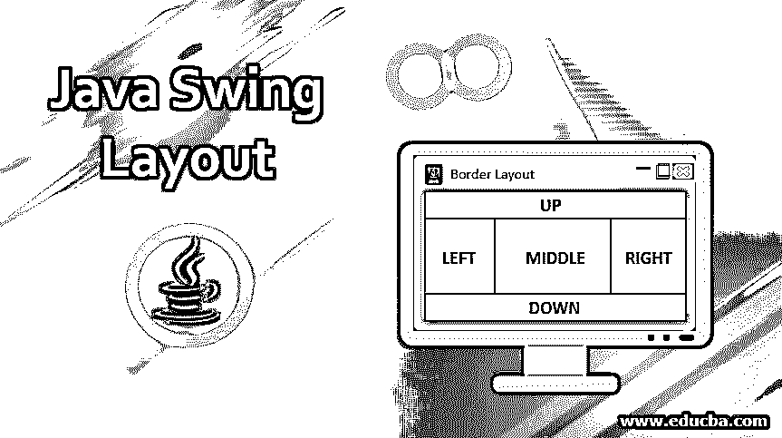
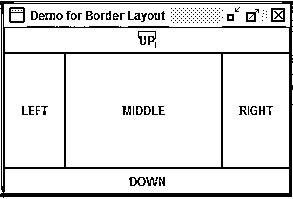
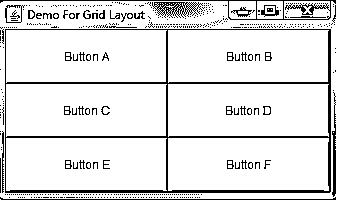
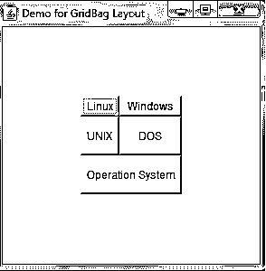
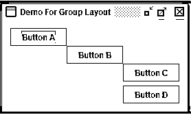
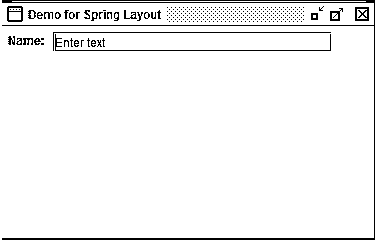
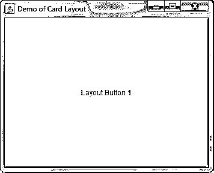

# Java Swing 布局

> 原文：<https://www.educba.com/java-swing-layout/>




## Java Swing 布局简介

Java Swing Layout 是一个用户界面形式的概要，它有一堆选项，用于创建各种具有当代布局选择的应用程序。“Swing”通常用于在 Java 平台上开发 windows 应用程序。借助 Java Swing 布局产生的布局类型有网格布局、边框布局、分组布局、弹簧布局、卡片布局等。，这需要添加基本的 java 和其他相关的包。

### 如何用 Java 创建 Swing 布局？

我们只需要导入所需的包和基本的 java 编码来创建它。您可以参考带有代码的示例部分，了解如何实现不同的布局。

<small>网页开发、编程语言、软件测试&其他</small>

**语法:**

要以编程方式在 Java Swing 中设计布局，您应该遵循 Java 的基本语法。只需导入 javax.swing.*包和 java.awt。*包装。

### 例子

本教程用例子和用法解释了各种 JFrmae 布局。以下是一些例子。

#### 示例 1–边框布局

在这个例子中，我们将看到如何在不同的边界或截面布局中划分一个框架。这里我们将把框架分成 5 个不同的部分。

**代码:**

```
package borderLayoutDemo;
import javax.swing.JButton;
import javax.swing.JFrame;
import javax.swing.JPanel;
import java.awt.BorderLayout;
public class BorderLayoutDemo {
public static void main(String[] args) {
JFrame.setDefaultLookAndFeelDecorated(true);
JFrame fj = new JFrame("Demonstration of Border Layout");
fj.setDefaultCloseOperation(JFrame.EXIT_ON_CLOSE);
JButton jbtn1 = new JButton("UP");
JButton jbtn2 = new JButton("DOWN");
JButton jbtn3 = new JButton("LEFT");
JButton jbtn4 = new JButton("RIGHT");
JButton jbtn5 = new JButton("MIDDLE");
JPanel pnl = new JPanel();
pnl.setLayout(new BorderLayout());
pnl.add(jbtn1, BorderLayout.NORTH);
pnl.add(jbtn2, BorderLayout.SOUTH);
pnl.add(jbtn3, BorderLayout.WEST);
pnl.add(jbtn4, BorderLayout.EAST);
pnl.add(jbtn5, BorderLayout.CENTER);
fj.add(pnl);
fj.pack();
fj.setVisible(true);
}
}
```

**输出:**




#### 示例 2–流程布局

在这里，我们将创建一个窗口，在这个窗口中，框架内的组件按一个方向排列:从左到右，直到框架结束。此后，组件将自动获取新行并相应地对齐。

**代码:**

```
package flowLayoutDemo;
import javax.swing.JButton;
import javax.swing.JFrame;
import javax.swing.JPanel;
import java.awt.FlowLayout;
public class FlowLayoutDemo {
public static void main(String[] args) {
JFrame.setDefaultLookAndFeelDecorated(true);
JFrame fj = new JFrame("Demonstration of Flow Layout");
fj.setDefaultCloseOperation(JFrame.EXIT_ON_CLOSE);
// Define new buttons
JButton jbtn1 = new JButton("Button A");
JButton jbtn2 = new JButton("Button B");
JButton jbtn3 = new JButton("Button C");
JPanel pnl = new JPanel();
pnl.setLayout(new FlowLayout());
pnl.add(jbtn1);
pnl.add(jbtn2);
pnl.add(jbtn3);
fj.add(pnl);
fj.pack();
fj.setVisible(true);
}
}
```

**输出:**


#### 示例 3–网格布局

让我们以 java Swing 的情况下网格布局的实现为例。在这个例子中，我们将看到如何使用网格布局以类似网格的方式对齐组件。

**代码:**

```
package gridLayoutDemo;
import java.awt.Button;
import java.awt.GridLayout;
import javax.swing.JFrame;
public class GridLayoutDemo extends JFrame {
public static void main(String[] args) {
GridLayoutDemo gld = new GridLayoutDemo();
}
public GridLayoutDemo() {
setVisible(true);
setDefaultCloseOperation(EXIT_ON_CLOSE); //indicates terminate operation on close of window
GridLayout gl = new GridLayout(3, 2);//create grid layout frame
setLayout(gl);
setTitle("Demo For Grid Layout");
setSize(200, 200);
add(new Button("Button A"));
add(new Button("Button B"));
add(new Button("Button C"));
add(new Button("Button D"));
add(new Button("Button E"));
add(new Button("Button F"));
}
}
```

**输出:**




#### 示例 4–网格袋布局

在这个例子中，我们将看到如何使用网格袋布局以定制的网格方式对齐组件。

**代码:**

```
package gridBagLayoutDemo;
import java.awt.Button;
import java.awt.CardLayout;
import java.awt.FlowLayout;
import java.awt.GridBagConstraints;
import java.awt.GridBagLayout;
import javax.swing.JFrame;
public class GridBagLayoutDemo extends JFrame {
public static void main(String[] args) {
GridBagLayoutDemo gbld = new GridBagLayoutDemo();
}
public GridBagLayoutDemo() {
setSize(300, 300);
setPreferredSize(getSize());
setVisible(true);
setDefaultCloseOperation(EXIT_ON_CLOSE);
GridBagLayout gbl = new GridBagLayout();
GridBagConstraints gbcnt = new GridBagConstraints();
setLayout(gbl);
setTitle("Demo for GridBag Layout");
GridBagLayout layout = new GridBagLayout(); //create grid bag layout
this.setLayout(layout);
//below code is customization of grid fashion
gbcnt.fill = GridBagConstraints.HORIZONTAL;
gbcnt.gridx = 1;
gbcnt.gridy = 0;
this.add(new Button("Linux"), gbcnt);
gbcnt.gridx = 2;
gbcnt.gridy = 0;
this.add(new Button("Windows"), gbcnt);
gbcnt.fill = GridBagConstraints.HORIZONTAL;
gbcnt.ipady = 20;
gbcnt.gridx = 1;
gbcnt.gridy = 1;
this.add(new Button("UNIX"), gbcnt);
gbcnt.gridx = 2;
gbcnt.gridy = 1;
this.add(new Button("DOS"), gbcnt);
gbcnt.gridx = 1;
gbcnt.gridy = 2;
gbcnt.fill = GridBagConstraints.HORIZONTAL;
gbcnt.gridwidth = 2;
this.add(new Button("Operation System"), gbcnt);
}
}
```

**输出:**




#### 示例 5–小组布局

顾名思义，group 布局不同的组件，并按顺序或并行排列它们。这里，按钮 A、B 和 C 是顺序模式，而按钮 C 和 D 是平行分组的。

**代码:**

```
package groupLayoutDemo;
import javax.swing.GroupLayout;
import javax.swing.JButton;
import javax.swing.JFrame;
import javax.swing.JPanel;
public class GroupLayoutDemo {
public static void main(String[] args) {
JFrame.setDefaultLookAndFeelDecorated(true);
JFrame frame = new JFrame("Demo For Group Layout");
frame.setDefaultCloseOperation(JFrame.EXIT_ON_CLOSE);
JButton jbtn1 = new JButton("Button A");
JButton jbtn2 = new JButton("Button B");
JButton jbtn3 = new JButton("Button C");
JButton jbtn4 = new JButton("Button D");
JPanel pnl = new JPanel();
pnl.setSize(200, 200);
GroupLayout lyt = new GroupLayout(pnl);
lyt.setAutoCreateGaps(true);
lyt.setAutoCreateContainerGaps(true);
pnl.setLayout(lyt);
// Set for horizontal and vertical group
lyt.setHorizontalGroup(lyt.createSequentialGroup().addComponent(jbtn1).addComponent(jbtn2)
.addGroup(lyt.createSequentialGroup().addGroup(lyt
.createParallelGroup(GroupLayout.Alignment.LEADING).addComponent(jbtn3).addComponent(jbtn4))));
lyt.setVerticalGroup(
lyt.createSequentialGroup().addComponent(jbtn1).addComponent(jbtn2).addComponent(jbtn3).addComponent(jbtn4));
frame.add(pnl);
frame.pack();
frame.setVisible(true);
}
}
```

**输出:**




#### 示例 6–弹簧布局

顾名思义，弹簧布局限制了组件之间的距离。

**代码:**

```
package springLayoutDemo;
import javax.swing.JLabel;
import javax.swing.JTextField;
import javax.swing.JFrame;
import javax.swing.JPanel;
import javax.swing.SpringLayout;
public class SpringLayoutDemo {
public static void main(String[] args) {
JFrame.setDefaultLookAndFeelDecorated(true);
JFrame frme = new JFrame("Demo for Spring Layout");
frme.setDefaultCloseOperation(JFrame.EXIT_ON_CLOSE);
// Define the panel to hold the components
JPanel pnl = new JPanel();
SpringLayout lyt = new SpringLayout();
JLabel lbl = new JLabel("Name: ");
JTextField txt = new JTextField("Enter text", 25);
pnl.setSize(200, 200);
pnl.setLayout(lyt);
pnl.add(lbl);
pnl.add(txt);
// Put constraint on components
lyt.putConstraint(SpringLayout.WEST, lbl, 6, SpringLayout.WEST, pnl);
lyt.putConstraint(SpringLayout.NORTH, lbl, 6, SpringLayout.NORTH, pnl);
lyt.putConstraint(SpringLayout.WEST, txt, 6, SpringLayout.EAST, lbl);
lyt.putConstraint(SpringLayout.NORTH, txt, 6, SpringLayout.NORTH, pnl);
frme.add(pnl);
frme.pack();
frme.setVisible(true);
}
}
```

**输出:**




#### 示例 7–卡片布局

卡片布局现在用得不多了。这种布局基本上是将一个组件堆叠在另一个组件上，形成一张卡片。您可以忽略代码异常，因为它会向您显示输出。

**代码:**

```
package cardLayoutDemo;
import java.awt.Button;
import java.awt.CardLayout;
import java.awt.Container;
import java.awt.event.ActionEvent;
import java.awt.event.ActionListener;
import javax.swing.JFrame;
public class CardLayoutDemo extends JFrame implements ActionListener {
public static CardLayout crd = new CardLayout(70, 60);
public static Container cn;
@Override
public void actionPerformed(ActionEvent e) {
crd.next(cn);
}
public static void main(String[] args) {
CardLayoutDemo cld = new CardLayoutDemo();
}
public CardLayoutDemo() {
setVisible(true);
setDefaultCloseOperation(EXIT_ON_CLOSE);
CardLayout cl = new CardLayout();
setLayout(cl);
setTitle("Demo of Card Layout");
setSize(200, 200);
add(new Button("Layout Button 1"));
add(new Button("Layout Button 2"));
add(new Button("Layout Button 3"));
add(new Button("Layout Button 4"));
add(new Button("Layout Button 5"));
add(new Button("Layout Button 6"));
}
}
```

**输出:**




### 推荐文章

这是一个 Java Swing 布局指南。在这里，我们讨论基本概念，如何用 java 创建 swing 布局，以及示例和输出。您也可以浏览我们推荐的其他文章，了解更多信息——

1.  [Java Swing 中的定时器](https://www.educba.com/timer-in-java-swing/)
2.  [Java 中的 JTable](https://www.educba.com/jtable-in-java/)
3.  [Java 字符串串联](https://www.educba.com/java-string-concatenation/)
4.  [Java Swing 按钮](https://www.educba.com/java-swing-button/)


