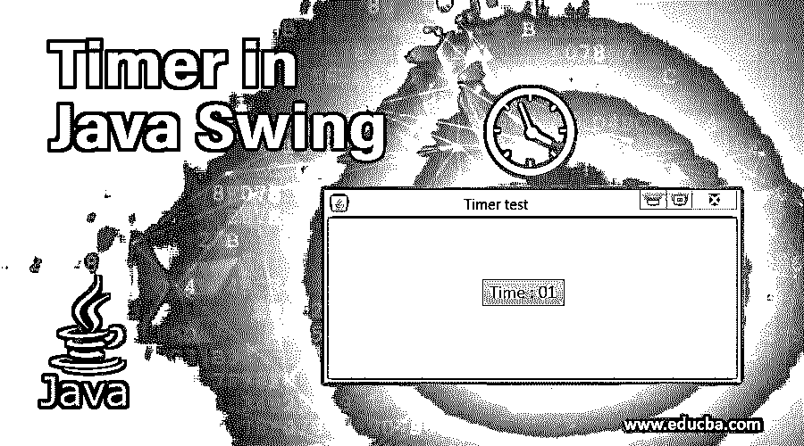
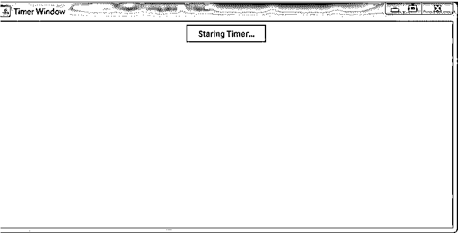
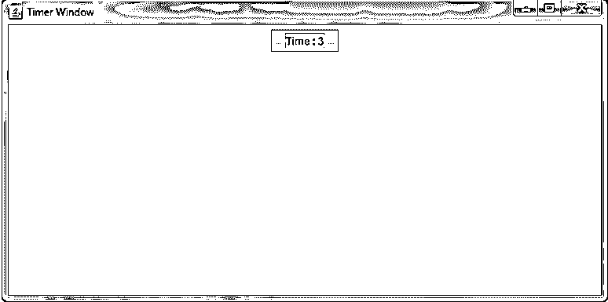
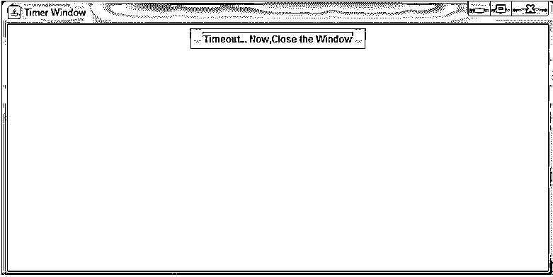
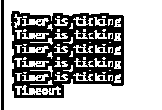

# Java Swing 中的定时器

> 原文：<https://www.educba.com/timer-in-java-swing/>




## Java Swing 中的定时器介绍

“timer”这个词是自定义的，java 中的“Swing”对于开发基于窗口的应用程序很有用。因此，使用 java swing 的定时器工具，我们可以开发基于窗口的酷定时器应用程序。在这篇文章中，我们将通过不同的例子来看看如何使用这个包。

### Java Swing 中如何使用定时器？

这是一个非常有用的工具，它可以帮助我们为特定时间间隔内发生的一些动作实现计时器，或者在计时器运行的同时实现重复的任务。摇摆计时器非常方便。您只需要调用与计时器相关联的任何动作事件，该动作将一直持续到计时器结束。现在的问题是，计时器将如何结束？它也在你的手中。您只需要以毫秒为单位指定时间，仅此而已。一旦计时器结束，指定的动作事件将自动停止。

<small>网页开发、编程语言、软件测试&其他</small>

### Java Swing 中定时器的例子

这里我们将讨论 Java Swing 中 Timer 的一些代码示例。我建议您逐行阅读代码，因为我已经提到了代码中的行内注释，以获得更好的可读性和理解。

#### 示例#1

在这个例子中，我们的目标是在显示任何消息的情况下启动一个计时器，该消息只是输出，直到计时器结束，我们看到显示“超时”消息，程序结束。消息的显示是由 swing 计时器触发的动作事件。计时器结束后，会显示超时信息，指示回转计时器结束。您应该仔细阅读带有内联注释的代码，以理解它是如何实现的。

**代码:**

```
import java.awt.event.*;
import javax.swing.*;
public class SwingTimerDemo {
static public void main(String [] args) {
try{
ActionListener ticktock = new ActionListener() {
public void actionPerformed(ActionEvent evnt) {
System.out.println("Swing timer started"); //display of this message is basically an action which is associated with swing timer until timer stops
}
};
Timer timer = new Timer(555 ,ticktock); //timer is ticking
timer.setRepeats(false); //by using this, we are asking to off timer once
timer.start();
Thread.sleep(5555);
System.out.println("Timeout"); //timer ends and this message is displayed
} catch (InterruptedException expn) {
}
}
}
```

**输出:**


在上图中，您可以看到输出控制台中启动的计时器。一段时间后，您将在输出中看到消息“超时”,表明程序已完成。

**最终输出:**


#### 实施例 2

在这里，我们将采取一个例子，我们将创建一个窗口，其中将有一个按钮，计时器运行。定时器结束后，将显示一条关闭窗口消息，指示定时器结束。我们的目标是用一个动作事件启动一个定时器，这个动作事件是一个窗口的创建，这个窗口有一个按钮和按钮内显示的相关消息，这个消息随着时间的推移而变化。因此，我们还将在这里使用 JFrame 创建一个窗口，以便我们可以在其中创建一个带有时间更改标签的按钮。消息的显示是由 swing 计时器触发的动作事件。计时器结束后，会显示超时信息，指示回转计时器结束。为了可读性和理解性，请遵循代码的行内注释。

**代码:**

```
import javax.swing.*;
import java.awt.*;
import java.awt.event.*;
class TimerWindow extends JFrame implements ActionListener{  //creation of an window using JFrame
private int start = 1;
private JButton jbtn; //creation of button inside the JFrame window
private Timer swingtimer; //swing timer instance
TimerWindow(int tm)
{
start += tm;
setTitle("Timer Window");
setLayout(new FlowLayout());
setTimer();
setSize(700,350);
setVisible(true);
setDefaultCloseOperation(JFrame.EXIT_ON_CLOSE);
}
private void setTimer()
{
jbtn = new JButton("Staring Timer...");
add(jbtn);
swingtimer = new Timer(2222,this);
swingtimer.start();
}
public void actionPerformed(ActionEvent evnt)
{
start--;
if(start>=1)
{
jbtn.setText("Time : "+start); //changing the label of button as the timer decrases
}else{
jbtn.setText("Timeout... Now,Close the Window");
swingtimer.stop();
}
}
}
public class TimerInSwing {
static public void main(String[] args) {
TimerWindow tw = new TimerWindow(5);
}
}
```

**输出:**

运行上面的程序后，你会看到一个框会弹出来。在窗口(名为“计时器窗口”)内，您会看到一个标有“启动计时器”的按钮。




随着时间的推移，计时器开始计时，按钮的标签会随着时间变化，如“时间:5”，然后是“时间:4”，以此类推。请参见下面的示例截图。




最后，计时器停止，按钮标签也如我们在代码中定义的那样发生了变化。下面是它的截图。程序完成后，您现在可以关闭窗口。




#### 实施例 3

在这个例子中，我们将看到如何触发一个动作，只要计时器继续，就显示重复的消息。当计时器停止时，将显示超时。为了更好地理解，建议您仔细阅读带有内联注释的代码。

**代码:**

```
import java.awt.event.ActionEvent;
import java.awt.event.ActionListener;
import javax.swing.Timer;
public class TimerInSwingDemonstration {
static public void main(String[] args) {
Timer swingtimer = new Timer(1111, new SwingTimerActionListener());
swingtimer.start(); //timer started
try {
Thread.sleep(5555);
} catch (InterruptedException e) {
}
swingtimer.stop();
System.out.println("Timeout");
}
}
class SwingTimerActionListener implements ActionListener {
public void actionPerformed(ActionEvent evnt) {
System.out.println("Timer is ticking"); //action event is triggered by display of message
}
}
```

**输出:**




### 结论

主题“java swing 中的定时器”的学习到此结束，您可以看到我们是如何利用 Java Swing 的定时器功能触发事件动作的。在您机器的 java 编译器中编写上述示例中提到的代码，并验证输出。如果你不自己写代码，对代码的学习将是不完整的。

### 推荐文章

这是一个 Java Swing 中的定时器指南。这里我们讨论基本概念，如何在 Java Swing 中使用定时器，以及 Java Swing 的例子。您也可以浏览我们推荐的其他文章来了解——

1.  [摇摆交易策略](https://www.educba.com/swing-trading-strategies/)
2.  [Java 中的 Swing 组件](https://www.educba.com/swing-components-in-java/)
3.  [Java Swing 布局](https://www.educba.com/java-swing-layout/)
4.  [Java Swing 按钮](https://www.educba.com/java-swing-button/)


