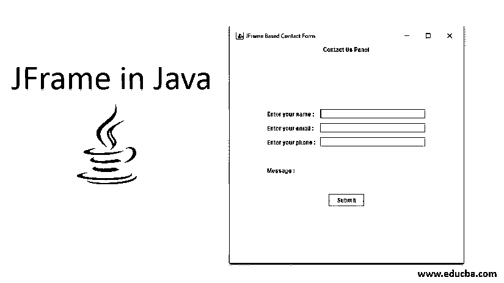
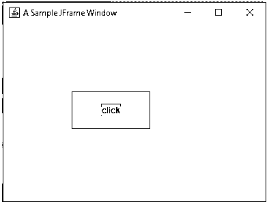
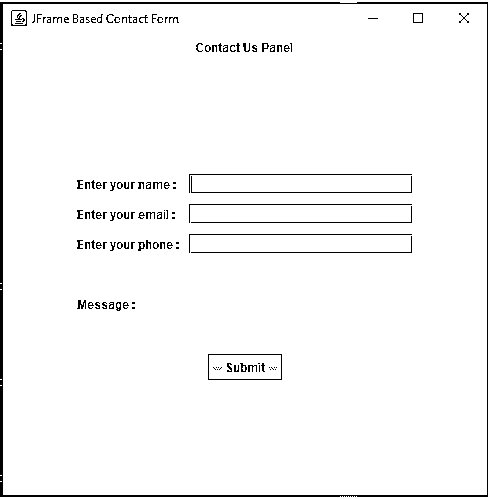

# Java 中的 JFrame

> 原文：<https://www.educba.com/jframe-in-java/>




## Java 中的 JFrame 简介

JFrame 是一个 java 类，由 Java 的 Frame 类扩展而来。JFrame 被视为主窗口。在 JFrame 中，可以添加不同的元素，比如标签、文本字段、按钮。JFrame 上的这些元素创建了[图形用户界面。](https://www.educba.com/what-is-gui/)

JFrame 也称为 Swing 顶级容器。Swing 指的是用 JAVA 创建应用程序的 GUI 部件工具包。Swing 是轻量级的，与平板形式无关。应用程序中的 JFrame 类可以通过以下方式创建

<small>网页开发、编程语言、软件测试&其他</small>

公共类 JFrame 扩展 Frame 实现 WindowConstants、Accessible、RootPaneContainer

### JFrame 构造函数

JFrame 构造函数&下面给出了它的描述。

1.  **JFrame()**–JFrame()是一个 JFrame 类构造函数，用于创建新的框架。默认情况下，它保持不可见。
2.  **JFrame(String title，graphics configuration GC)**–该构造函数在指定的图形配置&中创建一个 JFrame，并在参数中指定标题。
3.  **JFrame(graphics configuration GC)**–该构造函数在指定的图形配置中创建一个 JFrame，就像在参数中一样。
4.  **JFrame(String title)**–这个构造函数创建一个 JFrame，它具有参数中指定的标题。

### JFrame 方法

JFrame 类提供了一些在使用 JFrame 时起重要作用的方法。

**1。accessible context getaccessible context()–**该方法获取与 JFrame 保持关联的可访问上下文。

**2。container getContentPane()–**该方法创建 JFrame 的 ContentPane 对象。

**3。component getGlassPane()–**该方法为 JFrame 创建 GlassPane 对象。

**4。int getDefaultCloseOperation()–**当用户点击这个框架上的关闭按钮时，这个方法返回操作。

**5。JMenuBar getJMenuBar()–**使用此方法在帧上创建的菜单栏集。

**6。JLayeredPane getLayeredPane()–**这个方法返回 LayeredPane 对象。

**7。JRootPane getRootPane()–**这个方法返回 RootPane 对象。

下面给出的方法[8–15]需要在方法的开头添加访问修饰符“protected”—

**8。addImpl(Component comp，Object constraints，int index)–**该方法为该帧添加指定的子元素。

**9。JRootPane createRootPane()–**创建构造函数调用的默认根窗格&。

10。void frame init()–它由构造函数调用来初始化 JFrame。

**11。布尔 isRootPaneCheckingEnabled()–**对添加& setLayout 的调用是否被转发到 contentPane 由该方法验证

**12。String paramString()–**这个方法以 String 的形式返回 JFrame。

13。void processWindowEvent(window event e)–该方法处理窗口组件上发生的窗口事件。

**14。void setRootPane(JRootPane root)–**该方法设置 RootPane 属性。

15。void setRootPaneCheckingEnabled(boolean enabled)–这个设置调用添加& setLayout 是否转发到 contentPane。

16。static boolean is defaultlookandfeel decorated()–如果新创建的 JFrames 具有由当前外观提供的窗口装饰，则该方法返回 true。

**17。TransferHandler getTransferHandler()–**该方法获取 transfer handler 属性。

18。void remove(Component comp)–为了从 JFrame 容器中删除特定的组件，我们可以使用这个方法。

**19。void repaint(long time，int x，int y，int width，int height)–**该方法用于在几毫秒内重画组件内部的特定矩形。

20。void setContentPane(Container content pane)–content pane 的属性就是用这个方法设置的。

**21。void setDefaultCloseOperation(int operation)–**由该方法设置的默认操作，当用户启动一个框架的关闭操作时将发生。

**22。void setGlassPane(组件 GlassPane)–**可以使用此方法设置 glassPane 属性。

**23。使用此方法可以设置窗口框的 void seticon Image(Image img)–**图标。

**24。void setJMenuBar(JMenuBar MenuBar)–**JFrame 的 Menubar 可以用这个方法设置。

**25。void setLayeredPane(JLayeredPane jlPane)–**LayeredPane 属性通过此方法设置。

**26。void setLayout(布局管理器管理器)–**布局管理器通过使用此方法创建。

**27。void setTransferHandler(TransferHandler new handler)–**这个函数设置与 transfer handler 相关的属性，这个函数创建一个机制来支持组件的数据传输。

**28。void update(Graphics g)–**这个调用 paint 来给框架&元素着色

### Java 中 JFrame 的例子

以下是下面提到的例子。

#### 示例#1

请参见下面给出的例子

```
import javax.swing.*;
public class demoJFrame extends JFrame{
JFrame frame;
demoJFrame(){
setTitle("A Sample JFrame Window");
JButton button = new JButton("click");
button.setBounds(100, 100, 115, 55);
add(button);
setDefaultCloseOperation(JFrame.EXIT_ON_CLOSE);
setSize(400, 300);
setLayout(null);
setVisible(true);
}
public static void main(String[] args){
new demoJFrame();
}
}
```

在上面给出的例子中，swing 库被导入以包含不同的类来处理 Frame & events。在下面的截图中，使用 swing 库的 JFrame 类创建了一个框架。




#### 实施例 2

在这个例子中，使用 JFrame、Layout & Events 类的多种方法在框架内创建表单。

```
import javax.swing.*;
import java.awt.event.*;
import java.awt.FlowLayout;
import java.awt.GridBagConstraints;
import java.awt.GridBagLayout;
import java.awt.Insets;
public class JFrameDemo{
public static void main(String[] args){
// Create frame with title Registration Demo
JFrame frame= new JFrame();
frame.setTitle("JFrame Based Contact Form");
JPanel mainPanel = new JPanel();
mainPanel.setLayout(new BoxLayout(mainPanel, BoxLayout.Y_AXIS));
JPanel headingPanel = new JPanel();
JLabel headingLabel = new JLabel("Contact Us Panel");
headingPanel.add(headingLabel);
JPanel panel = new JPanel(new GridBagLayout());
// Constraints for the layout
GridBagConstraints constr = new GridBagConstraints();
constr.insets = new Insets(5, 5, 5, 5);
constr.anchor = GridBagConstraints.WEST;
// Setting initial grid values to 0,0
constr.gridx=0;
constr.gridy=0;
JLabel nameLabel      = new JLabel("Enter your name :");
JLabel emailLabel      = new JLabel("Enter your email :");
JLabel phoneLabel     = new JLabel("Enter your phone :");
JLabel msgLabel        = new JLabel("Message :");
JTextField nameInput           = new JTextField(20);
JTextField emailInput           = new JTextField(20);
JTextField phoneInput          = new JTextField(20);
JTextArea textArea = new JTextArea(5, 20);
panel.add(nameLabel, constr);
constr.gridx=1;
panel.add(nameInput, constr);
constr.gridx=0; constr.gridy=1;
panel.add(emailLabel, constr);
constr.gridx=1;
panel.add(emailInput, constr);
constr.gridx=0; constr.gridy=2;
panel.add(phoneLabel, constr);
constr.gridx=1;
panel.add(phoneInput, constr);
constr.gridx=0; constr.gridy=3;
panel.add(msgLabel, constr);
constr.gridx=1;
panel.add(textArea, constr);
constr.gridx=0; constr.gridy=4;
constr.gridwidth = 2;
constr.anchor = GridBagConstraints.CENTER;
// Button with text "Register"
JButton button = new JButton("Submit");
// add a listener to button
button.addActionListener(new ActionListener()
{
public void actionPerformed(ActionEvent e)
{
headingLabel.setText("Thanks for Contacting us. We'll get back to you shortly.");
nameInput.setText("");
emailInput.setText("");
phoneInput.setText("");
textArea.setText("");
}
});
panel.add(button, constr);
mainPanel.add(headingPanel);
mainPanel.add(panel);
frame.add(mainPanel);
frame.pack();
frame.setSize(500, 500);
frame.setLocationRelativeTo(null);
frame.setDefaultCloseOperation(JFrame.EXIT_ON_CLOSE);
frame.setVisible(true);
}
}
```

在上面给出的例子中，使用 JFrame 创建了一个窗口框架。使用 JPanel()类方法创建元素。其他库正用于布局和事件。以下是编译和运行 Java 代码后的截图。




### 结论

JFrame 是 swing 包的类，主要用于创建 JFrame。我们可以说 JFrame 窗口可以通过实例化 JFrame 类来创建。大多数新的 GUI Java 代码库[都使用 JavaFX](https://www.educba.com/javafx-label/) ，这是 Java 最新版本中 swing 的替代品。在接下来的日子里，由于最新版本的 Java 库&的扩展特性，程序员们正在转向 [JavaFX。](https://www.educba.com/javafx-slider/)

### 推荐文章

这是 Java 中 JFrame 的指南。这里我们将详细讨论 JFrame 的构造函数和方法，并给出相应的例子。您也可以看看以下文章，了解更多信息–

1.  [Java 中的 jscrollpand](https://www.educba.com/jscrollpane-in-java/)
2.  [Java 中的 JDialog](https://www.educba.com/jdialog-in-java/)
3.  [Java 中的 JTextField](https://www.educba.com/jtextfield-in-java/)
4.  [JLabel in Java](https://www.educba.com/jlabel-in-java/)


