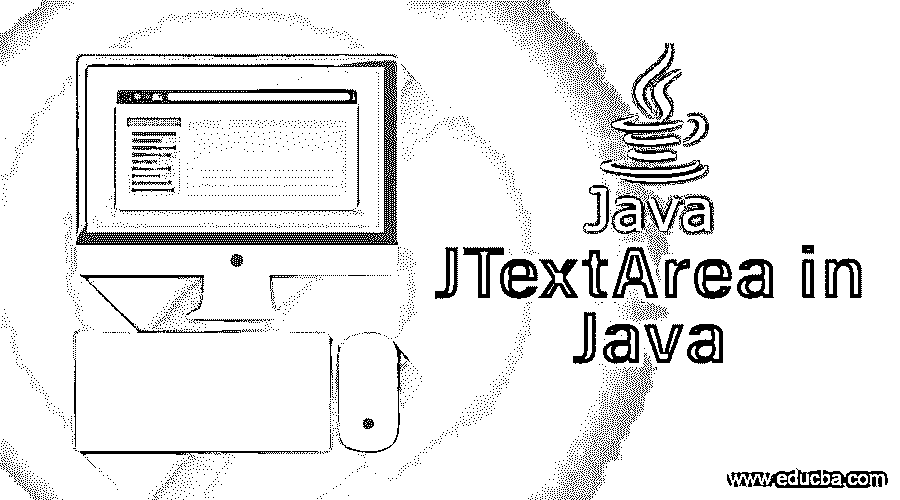
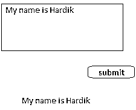
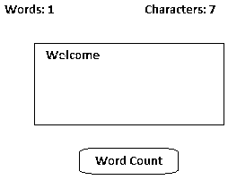

# Java 中的 JTextArea

> 原文：<https://www.educba.com/jtextarea-in-java/>




## Java 中的 JTextArea 概述

当我们谈到 Java 和 swing 包时，JTextArea 是其中的一部分。它表示包含文本的区域的多行显示，也可用于文本编辑。它用来继承 Java 的组件类。文本字体可以设置为不同的大小和颜色，甚至可以随新文本一起添加。基本上，所有这些文本区域都可以根据要求和用户的需要进行定制。它是一个轻量级组件，用于与 java.awt.TextArea 类一起提供源代码兼容性，在 Java . awt . textarea 类中可以很容易地映射兼容性。

### Java 中 JTextArea 的构造函数

让我们研究一下不同类型的构造函数:

<small>网页开发、编程语言、软件测试&其他</small>

*   **JTextArea():** 用于构建一个新的基于文本的空白区域。
*   **JTextArea(int row，int column):** 这个 JTextArea 类似于未参数化的 JTextArea，区别在于它使用了行和列参数。它用于构造一个新的基于文本字段的区域和固定数量的行和列。
*   **JTextArea(String s):** 用于和给定的初始文本一起构造一个新的基于文本的区域。
*   **JTextArea(String s，int row，int column):** 这个更类似于那些字符串值或包含行和列参数化值的值，因此，它构造了一个给定的初始文本和固定数量的行和列值。

### Java 中 JTextArea 的方法

在了解了与 JTextArea 相关的各种构造函数之后，让我们也来看看 Java 中构成 JTextArea 基础的一些主要方法。

*   **Append(String s):** 顾名思义，这个方法用于给一个给定的字符串追加文本区域的文本。
*   **setFont(Font f):** 该方法用于将文本区域的字体大小和字体类型固定为给定的字体。
*   **getLineCount():** 该函数用于获取文本区文本字段中的行数。
*   **setColumns(int c):** 用于设置文本区域的列数以及给定的整数。
*   **setRows(int r):** 这个函数用来设置文本区域的行数以及给定的整数。
*   **getColumns():** 这个函数用于获取文本区域字段的列数。
*   getRows(): 这个函数用来获取一个特定文本区域的行数。

### JTextArea 的示例

让我们借助一个解释如何创建 JTextArea 字段的基本示例来研究 JTextArea。

#### 示例#1

用 Java 程序创建一个示例 JTextArea 字段。

**代码:**

```
//importing basic packages and relevant classes
import javax.swing.*;
import java.awt.event.*;
import java.io.*;
import java.awt.*;
class txt extends JFrame implements ActionListener {
// creating JFrame with frame f
static JFrame F1;
// creating JButton with button b
static JButton B1, B2, B4, B3;
// creating label to display text label l
static JLabel L1, L2;
// creating a public text area to create a text area jjt
static JTextArea jjt;
// creating a default constructor
txt()
{
}
// creating main class for compiler entry
public static void main(String args[]) throws IOException
{
// creation of a frame for storing text field option and a Jbutton field
F1 = new JFrame("Entered Text Field");
// creation of a new label for storing display text field option
L1 = new JLabel("Not entered anything");
// creation of a new button for submit
B1 = new JButton("submit button");
// creation of an object for text class
txt te = new txt();
// adding an addActionListener event to button
B1.addActionListener(te);
// creation of a new text area. Also specify rows and column numbers
jjt = new JTextArea(100, 100);
//creation of a new JPanel
JPanel P1 = new JPanel();
// addition of the text area and the button to the new panel added
P1.add(jjt);
F1.add(P1);
P1.add(L1);
P1.add(B1);
// setting the frame size in squared form
F1.setSize(100, 100);
//to display
F1.show();
}
// Whenever the button is pressed for actionPerformed
public void actionPerformed(ActionEvent e)
{
//implementation of getActionCommand
String s1 = e.getActionCommand();
if (s1.equalsIgnoreCase("submit button")) {
// setting of label text to field text
L1.setText(jjt.getText());
}
}
}
```

**输出:**




#### 实施例 2

在这个例子中，我们将看到使用 JTextArea 显示一个公共文本。

**代码:**

```
//importing basic packages and relevant classes
import java.io.*;
import java.awt.*;
import javax.swing.*;
import java.awt.event.*;//defining a class TxtEG
class TxtEG
{
//calling a default constructor after creation
TxtEG(){
//creation of frames with the object f
JFrame f= new JFrame();
// creation of a JTextArea
JTextArea area=new JTextArea("Welcome");
//setting boundary
area.setBounds(10,30, 200,200);
//adding properties to the frame
f.setVisible(true);
f.setSize(300,300);
f.add(area);
f.setLayout(null);
}
//declaring method main
public static void main(String args[]) throws IOException
{
new TxtEG();
}}
```

**输出:**


#### 实施例 3

在本例中，我们将了解 Java JTextArea 以及动作监听器字段和事件。

**代码:**

```
//importing basic packages and relevant classes
import javax.swing.*;
import java.io.*;
import java.awt.event.*;
import java.awt.*;
//defining the class which is implementing the interface ActionListener
class TarEG implements ActionListener{
//Defining labels, button and Jtext area
JLabel l1,l2;
JTextArea area;
JButton b;
//defining the default contructor
TarEG() {
//Defining JFrames, Labels and set other important properties
JFrame f= new JFrame()
l1=new JLabel();
//Setting bounds
l1.setBounds(50,25,100,30);
//Setting labels
l2=new JLabel();
l2.setBounds(160,25,100,30);
//Defining new
area=new JTextArea();
//Setting different bounds
area.setBounds(20,75,250,200);
b=new JButton("Word Count");
b.setBounds(100,300,120,30);
//Adding action listeners and putting the value to this to point to current object value
b.addActionListener(this);
//adding properties
f.setVisible(true);
f.setLayout(null);
f.add(l1);f.add(area);f.add(b);f.add(l2);
f.setSize(450,450);
}
//declaring the actionPerformed event
public void actionPerformed(ActionEvent e){
//declaring string text area
String text=area.getText();
//splitting words based on the string value
String words[]=text.split("\\s");
//calculating the length of words
l1.setText("Words: "+words.length);
//setting the character length
l2.setText("Characters: "+text.length());
}
//declaring the main function
public static void main(String[] args) {
new TarEG();
}
}
```

**输出:**




### 结论

在本教程中，我们学习了 Java Swings 中最关键的组件，即 JTextArea，它对于形成窗口和文本区域非常重要。我希望你喜欢这篇文章。通过关注我们的博客获得更多类似的文章来扩展您的支持。

### 推荐文章

这是 Java 中 JTextArea 的指南。这里我们讨论不同类型的构造函数，java 中 JTextArea 的方法，以及例子和代码实现。您也可以阅读以下文章，了解更多信息——

1.  [Java 中的 jscrollpand](https://www.educba.com/jscrollpane-in-java/)
2.  [Java 中的布局](https://www.educba.com/layout-in-java/)
3.  [Java 中的 JTextField](https://www.educba.com/jtextfield-in-java/)
4.  [Java 部署工具](https://www.educba.com/java-deployment-tools/)


