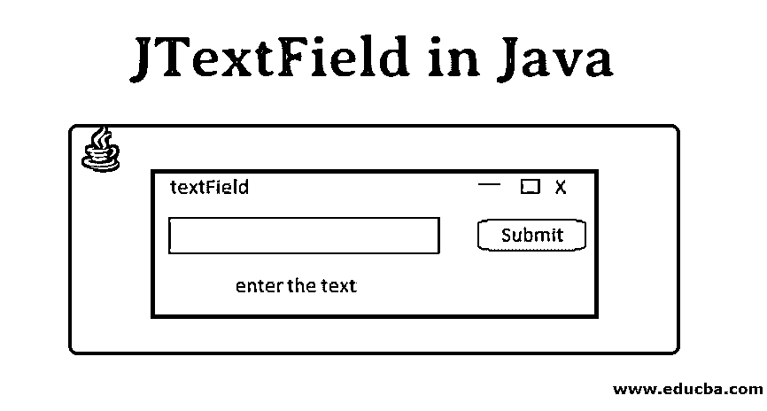
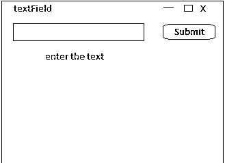
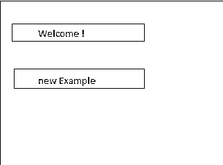
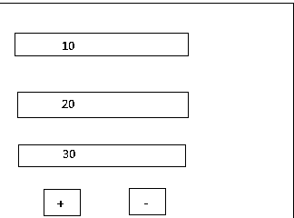

# Java 中的 JTextField

> 原文：<https://www.educba.com/jtextfield-in-java/>




## Java 中的 JTextField 简介

当我们谈到 Java 编程语言时，有两个段与之相关联，一个是核心 Java，一个是高级 Java。功能[如 OOPs 概念](https://www.educba.com/object-oriented-programming-in-java/)如[多态](https://www.educba.com/what-is-polymorphism/)、[抽象、封装](https://www.educba.com/abstraction-vs-encapsulation/)等。以及其他功能，如异常处理、集合、小程序等。与核心 Java 相关联，而 Swing、Hibernate、 [Struts](https://www.educba.com/what-is-struts/) 等特性。构成高级 Java 的组件。JTextField 也是 Java Swing 的一个特性，它允许对文本进行单行编辑。主要目的是保持其稳定性和与 java.awt.TextField 的兼容性，并形成 javax.swing 包不可或缺的一部分。它继承了 JTextComponent 类，并利用了 SwingConstant 接口。

让我们研究一下 JTextField 中的各种构造函数:

<small>网页开发、编程语言、软件测试&其他</small>

属于该类的构造函数有:

1.  JTextField(): 这些是负责创建新文本字段的构造函数。
2.  **JTextField(int columns):** 顾名思义，参数列用于表示一个新的空 TextField 中的列号。
3.  **JTextField(String text):** 参数 String text 用于用一个新的空文本字段表示一个初始化的给定字符串。
4.  **JTextField(String text，int columns):** 这是一个构造函数，用于创建一个空文本字段，该字段包含提供的字符串和指定数量的列。
5.  **JTextField(Document doc，String text，int columns):** 用于利用给定的存储模型和指定的列数。

### JTextField 的方法

现在让我们来看看 java 中 JTextField 的一些主要方法。

1.  **setColumns(int n):** 顾名思义，该方法用于设置文本字段中指定的列数。
2.  **setFont(Font f):** 该功能用于显示和设置文本字段显示文本的字体。
3.  **addActionListener(action listener I):**该方法用于设置文本字段的动作监听器。
4.  **Int getColumns():** 这个方法用于获取文本字段中的列号。

### 利用文本字段

文本字段的主要目的是设置基本级别的文本控件，用户可以通过它输入较小的文本值。每当用户确认一个文本输入时，通常是通过按 Enter 键来完成的，可以看到文本字段触发一个动作事件。如果需要从用户那里获得多行输入，建议使用文本区域。

让我们看一些基本创建文本字段的代码及其用法。

```
public class TDemo extends JPanel implements ActionListener {
public JtField tField;
public JtArea tArea;
public TDemo() {
super(new Layout());
tField = new JtField(20);
tField.addActionListener(this);
tArea = new JtArea(5, 20);
tArea.setEditable(false);
JScrollPane scrollPane = new JScrollPane(tArea);
Constraints c = new Constraints();
c.gridwidth = Constraints.REMAINDER;
c.fill = Constraints.HORIZONTAL;
add(tField, c);
c.fill = Constraints.BOTH;
c.wx = 1.0;
c.wy = 1.0;
add(scrollPane, c);
}
public void act(ActionEvent evt) {
String txt = tField.getText();
tArea.append(txt);
tField.selectAll();
tArea.setCaretPosition(tArea.getDocument().getLength());
}
private static void GUI() {
JFrame frame = new JFrame("TDemo");
frame.add(new TDemo());
frame.pack();
frame.setVisible(true);
}
public static void main(String[] args) throws IOException{
javax.swing.SwingUtilities.invokeLater(new Runnable() {
public void run() {
GUI();
}
});
}
}
```

Swing API 使用了几个类，这些类或者包含文本字段，或者是文本字段的变体。

1.  **JFormattedTextField:** 一个 JTextField 子类，它赋予您指定用户可输入的合法字符集的权限。
2.  **JPasswordField:** 与显示用户键入字符无关的子类。
3.  JComboBox: 这个框可以编辑，还提供了一个菜单，里面有多组字符串可供选择。
4.  **JSpinner:** [JSpinner 用于](https://www.educba.com/jspinner/)将一个格式化的文本字段与几个小按钮组合在一起，使用户能够选择上一个和下一个可用值。

### Java 中的 JTextField 示例

现在让我们来看一些例子

#### 示例#1

**代码:**

```
import javax.swing.*;
import java.awt.event.*;
class Jteobjxt exteobjnds JFrame implements ActionListeobjner {
static JLabel l;
static JButton b;
static JFrame f;
static JTField t;
// creating default constructor for Jteobjxt example
Jteobjxt()
{
}
// public static void main class
public static void main(String[] args)
{
// new frame creation
f = new JFrame("JTField");
// new label creation
l = new JLabel("");
// new button creation
b = new JButton("submit button createobjd");
// new object creation
Jteobjxt teobj = new Jteobjxt();
// adding addActionListeobjner to my created button
b.addActionListeobjner(teobj);
// creating a column of 16 numbers
t = new JTField(16);
// panel creation
JPanel p = new JPanel();
// adding Jtextfield and buttons to panel
p.add(t);
p.add(b);
p.add(l);
// adding panel to frame created
f.add(p);
// setting the size of frame created earlier
f.setSize(300, 300);
f.show();
}
// checking whether the button is pressed or not
public actionPerformed(ActionEvent e)
{String s1 = e.getActionCommand();
if (s1.equalsIgnoreCase("submit")) {
l.setJteobjxt(t.getJteobjxt());
// set the field object as the blank value
t.setJteobjxt("  ");
}
}
}
```

**输出:**




#### 实施例 2

**代码:**

```
import javax.swing.*;
import java.io.*;
class TextEg
{
public static void main(String args[])  throws IOException
{
JFrame f= new JFrame("Example of TextField ");
//variable declaration
JTextField t12,t22;
t12=new JTextField("Welcome!");
t12.setBounds(10,100, 100,30);
//declaring new example
t22=new JTextField("new example");
//setting bounds
t22.setBounds(10,150, 100,30);
//adding into frames
f.add(t12); f.add(t22);
f.setSize(200,200);
f.setVisible(true);
}
}
```

**输出:**




#### 实施例 3

**代码:**

```
import javax.swing.*;
import java.io.*;
import java.awt.event.*;
public class Teg implements ActionListener{
JTextField tf12,tf22,tf32;
JButton b12,b22;
Teg(){
JFrame f2= new JFrame();
tf12=new JTextField();
tf12.setBounds(10,50,100,20);
tf22=new JTextField();
tf22.setBounds(10,50,100,20);
tf32=new JTextField();
tf32.setBounds(10,50,100,20);
//setting the setEditable as False
tf32.setEditable(false);
//addition operator
b12=new JButton("+");
b12.setBounds(10,50,100,20);
//subtraction operator
b22=new JButton("-");
b22.setBounds(10,50,100,20);
//this is used to refer to the current value
b12.addActionListener(this);
b22.addActionListener(this);
//addition into all frames
f2.add(tf12);f2.add(tf22);f2.add(tf32);f2.add(b12);f2.add(b22);
f2.setSize(100,200);
//setting layout (default) to null
f2.setLayout(null);
f2.setVisible(true);
}
public void actionPerformed(ActionEvent e) {
String s12=tf12.getText();
String s22=tf22.getText();
int a2=Integer.parseInt(s12);
int b2=Integer.parseInt(s22);
int c2=0;
//conditional statement start
if(e.getSource()==b12){
c2=a2+b2;  //addition
}else if(e.getSource()==b22){
c2=a2-b2;  //subtraction
}
//printing final result
String res=String.valueOf(c2);
tf32.setText(res);
}
public static void main(String[] args) {
new Teg();
} }
```

**输出:**




### 推荐文章

这是 Java 中 JTextField 的指南。在这里，我们讨论 Java 中 JTextField 的方法和例子，以及 TextField 的用法。您也可以看看以下文章，了解更多信息–

1.  [Java 包](https://www.educba.com/java-packages/)
2.  [Java 中的 JPanel](https://www.educba.com/jpanel-in-java/)
3.  [Java 中的 jscrollpand](https://www.educba.com/jscrollpane-in-java/)
4.  [JLabel in Java](https://www.educba.com/jlabel-in-java/)


