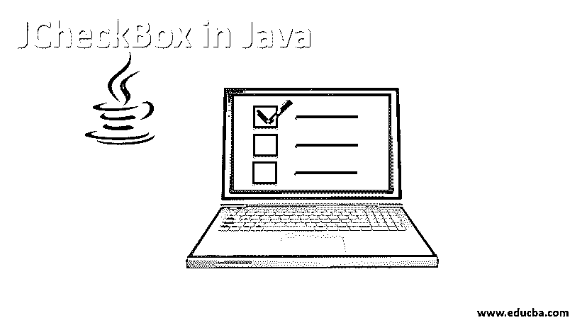
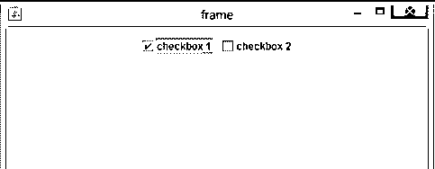

# java 中的复选框

> 原文：<https://www.educba.com/jcheckbox-in-java/>




## Java 中的 JCheckBox 简介

JAVA 中的 JCheckBox 类可以用作开关来关闭或打开任何功能。这个类基本上创建了一个复选框，提供了两个选项:开和关。这里的开和关由系统内部表示为真或假。然后，通过点击复选框进入“开”状态。再次单击它会将复选框的状态从“开”更改为“关”。这个类继承了 JToggleButton 类的特性。这个类有多种变体，我们将在本文中进一步讨论。

### 用 Java 实现 JCheckBox 的语法和程序

JCheckBox 类可以声明如下:

<small>网页开发、编程语言、软件测试&其他</small>

**代码**:

```
public class JCheckBox extends JToggleButton implements Accessible
```

解释:这里，public 是一个访问修饰符，它声明任何外部或内部函数都可以使用这个类。JToggleButton”是其 characters/JCheckBox 正在使用属性的父类。

**代码:**

```
// This is the java Program created to explain the JCheckBox class in JAVA. We should get checkboxes in the output of this program.
import java.awt.event.*; // these are the main libraries imported to inherit important classes and functions from JAVA standard event library
import java.awt.*;
import javax.swing.*; // Importing swing library
class test extends JFrame {
// declaring new frame
static JFrame tf;
//Here main class will start
public static void main(String[] args)
{
// JFrame function is used to cerate a new frame.
tf = new JFrame("frame");
// This function will help in decidong the layout of the frame.
tf.setLayout(new FlowLayout());
// We are creating two checkboxes here by invoking the object of JCheckBox class.
JCheckBox cbox1 = new JCheckBox("JCheckBox 1", true);
JCheckBox cbox2 = new JCheckBox("JCheckBox 2");
// JPanel is a class which we will use to create an object of. This object is then invoked to add check bx on this panel created.
JPanel pl = new JPanel();
// This function is adding the above defined check boxes to the panel.
pl.add(cbox1);
pl.add(cbox2);
// This function will add a panel to frame.
tf.add(pl);
// This function will set the frame size
tf.setSize(400, 400);
tf.show(); // This function will help in showing the frame defined above.
}
}
```

**输出:**





### java 中复选框的构造函数

有几个构造函数可以用来调用这个类。其中一些解释如下:

*   JJCheckBox(): 这个构造函数创建一个不包含文本和图标的空白复选框。默认情况下，使用此构造函数创建的复选框是未选中的。
*   **JChechBox(String s):** 这个构造函数将导致创建一个未选中的复选框，但是这个复选框将包含一个通过构造函数参数以字符串数据类型格式传递的文本。在本例中，我们传递了字符串“S”，它将与复选框一起显示。
*   **JCheckBox(String text，boolean selected):** 如果要求有一个默认选中的复选框，就使用这个构造函数。这个功能是通过一个布尔值“on”启用的，这个值通过一个参数发送给这个构造函数。文本也在这个构造函数的帮助下显示，它是通过参数传递的，就像前面的构造函数一样。
*   **JCheckBox(Action a):** 这个构造函数创建一个复选框，它的属性来自于动作。该操作与复选框构造函数的所有用户所需属性一起提供。然后，复选框从操作中派生其属性。
*   **JCheckBox(Icon i):** 这个构造函数返回一个包含图标的 CheckBox，这个图标是通过一个“Icon i”形式的参数传递给 checkbox 的。
*   **JCheckBox(Icon I，boolean selected):** 该构造函数返回一个复选框，其中包含一个图标和一个“on”状态，该状态通过参数传递给复选框。默认情况下，此复选框将被选中。
*   **JCheckBox(String text，Icon I，boolean selected):** 这个构造函数将返回一个 CheckBox，该 checkbox 应用了所有三个属性。这三个属性是文本、图标和状态，它们通过构造函数参数传递。

### Java 中 JCheckBox 的方法

下面解释的是在 Java 中与 JCheckBox 类链接的方法:

*   **Accessible Context getaccessible Context():**该方法用于获取与该复选框关联的可访问上下文。AccessibleContext 类负责与所有可访问对象相关的信息。该信息包含可访问的角色、对象的名称和状态以及其他相关信息。因此，这个类为用户提供了更多的可访问性，并使界面对用户友好。
*   **受保护的字符串 paramString():** 这个方法用来获取一个表示 JCheckBox 状态的字符串。此方法通常由调试器在调试时使用。返回的字符串可能因其实现而异；它也可以为空。
*   **getStateChange():** 如果 checkbox 的值改变了，这个方法返回 true。例如，复选框的值已从状态“开”更改为“关”，反之亦然；然后通过这种方法记录这种转变。如果我们想根据复选框值的变化触发任何动作，就使用这个函数。这链接到复选框的项目监听器。
*   **setSelected(boolean b):** 该方法用于根据传递的参数值将复选框设置为“开”或“关”状态。布尔值 true 表示“开”，false 表示“关”。
*   **getText():** 这个函数用来获取复选框的文本。我们捕获返回文本，并可以根据用户的要求使用它。
*   **setText(String s):** 与前面的方法类似，这个方法用于将文本设置到复选框中。在这个方法中作为参数传递的文本在复选框中被传递一个 stext。

### 结论

因此，在 java swings 中设计了 JCheckBox 类来实现 JtoggleButton 类函数，以得到结果复选框。复选框可以默认为选中或取消选中，这取决于我们调用它的构造函数。复选框是表单的一个重要元素，用于获取用户不希望输入的值。例如，我们希望记录申请人已经完成的所有认证，在这种情况下，我们可以提供包含认证名称文本的复选框。对于这些选项，用户可以选择一个或多个复选框。该响应可以被记录下来以供以后参考。这是一个重要的数据收集工具，几乎用于所有的申请表格。在 MCQs 中也可以看到它的应用。

### 推荐文章

这是 Java 中 JCheckBox 的指南。这里我们讨论用 Java 实现 JCheckBox，用构造函数和方法。您也可以浏览我们的其他相关文章，了解更多信息-

1.  [Java 中的 JTextField](https://www.educba.com/jtextfield-in-java/)
2.  [Java 中的 JDialog](https://www.educba.com/jdialog-in-java/)
3.  [Java 中的 JFrame](https://www.educba.com/jframe-in-java/)
4.  [Java 中的流程布局](https://www.educba.com/flowlayout-in-java/)


