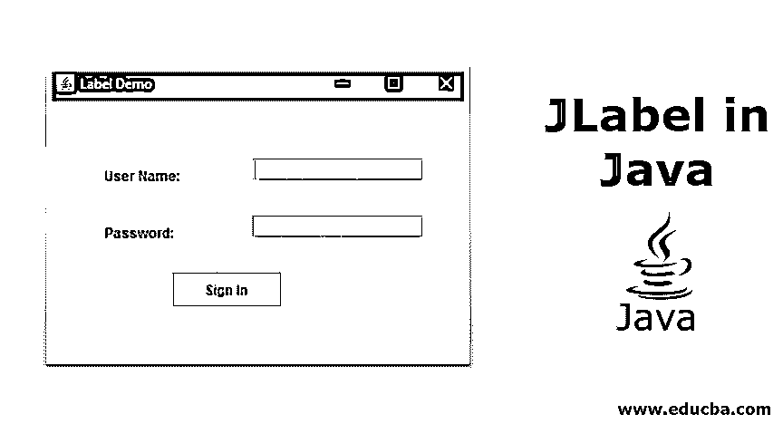
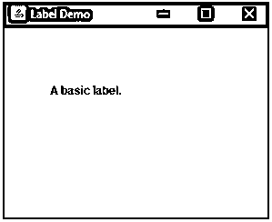
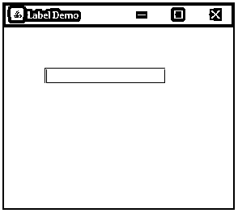
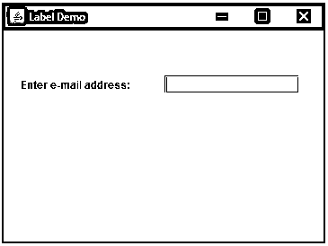
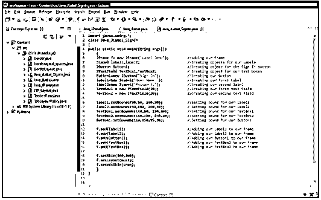
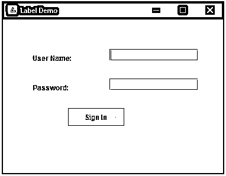

# JLabel in Java

> 原文：<https://www.educba.com/jlabel-in-java/>




## Java 中的 JLabel 简介

JLabel 是 Java Swing 包中的许多 Java 类之一。swing 包中的 JLabel 类能够显示文本和/或图片。与 Swing 包中的其他类类似，JLabel 显示的标签和标签内容使用水平和垂直对齐方式进行对齐。程序员可以通过设置对齐方式来指定标签内容在标签显示区域的显示位置。

默认情况下，文本(更具体地说是标签文本)垂直对齐并显示在显示区域的中央，而图像或图片默认情况下水平居中显示。

<small>网页开发、编程语言、软件测试&其他</small>

我们还可以轻松地指定位置，并显示相对于图像的文本。如上所述，文本通常显示在图像的末尾，文本垂直对齐。

这是 Swing 中最简单的 GUI 组件。来自 Swing 包的 JLabel 组件与来自 [AWT 包](https://www.educba.com/what-is-awt-in-java/)的标签几乎相同，不同之处在于 JLabel 不包含用户可编辑的“只读”文本。JLabel 仅用于在屏幕上显示文本消息或图标/图像或两者，但它不能对来自用户的事件做出反应，例如鼠标焦点或关键字焦点。

### Java 中 JLabel 的示例

我们可以通过为这个类创建和使用一个实例来简单地使用 JLabel。下面是为 JLabel 类创建一个对象并打印我们的标签“基本标签”后的屏幕截图。

在这里，我们创建了一个 JLabel 类的对象，名为“Label ”,带有一个标签文本“一个基本标签”。你可以简单地把它写成:

```
JLabel label1 = new JLabel("A basic label."); OR
JLabel label1;
label1 = new JLabel("A basic label.");
```

它将显示为:




### Java 中 JLabel 的用途

JLabel 不会对用户执行的输入事件(如鼠标焦点或键盘焦点)做出反应。它只是一个不可编辑的文本或图像或图标或两者。JLabel 通常与那些自身没有能力解释或展示其用途的组件一起使用。创建的 JLabel 对象将在我们的 GUI 上为我们的用户提供文本指令或[信息。](https://www.educba.com/what-is-gui/)

例如，用于输入姓名或密码等的文本区域需要一个标签来告诉用户关于文本框的信息。

下面通过截图解释了这个例子。

如果不使用 JLabel，用户将看不到文本框，因为它们没有告诉自己用户应该在文本字段中输入什么。以下面的例子为例，我们添加了一个没有任何标签的文本字段。




注意，您可以使用下面一行简单的代码简单地添加一个文本字段。

```
JTextField textEmail = new JTextField(20); //creating object for text field
textEmail.setBounds(50,50, 150,20); //setting the bounds for the text box
```

但是如果这个文本字段和 JLabel 结合使用，就会出现如下图，会更有意义，不是吗？

下面是另一个例子，我们使用了以前的文本字段，并添加了一个简单的单行字符串“输入电子邮件地址”，建议用户需要在给定的文本区域添加他/她的电子邮件地址。

如上所示，我们可以简单地添加一个文本字段。现在我们也将添加一个标签，如下所示:

```
textLabel = new JLabel("Enter e-mail address:");
JTextField textEmail = new JTextField(20);
textLabel.setBounds(20,50,150,20);
textEmail.setBounds(180,50, 150,20);
```




这是我们创造的一个简单的例子。这是一个简单的程序，显示一个文本字段和一个标签。我们还可以使用 JLabel 的另一种常用方法添加图标，这种方法称为 setIconTextGap 方法。这个方法帮助程序员指定我们的文本和图像应该分开显示多少像素。

### JLabel 的构造函数

Java JLabel 类有几个构造函数，可以用来创建具有不同特征的标签。

1.  这个构造函数创建了一个没有任何文本的空标签。类别的这个执行个体会建立没有影像的标签，并以空字串或文字做为标题。该文本可以在以后设置。
2.  **JLabel (Icon Image):** 这个构造函数创建一个只有指定图标或图像的标签。图标或图像文件可以在您自己的文件系统中使用。
3.  **JLabel (String Text):** 这个实例在声明我们的构造函数时创建了一个带有特定文本的标签。除了上面提到的基本构造函数，我们还有以下可以使用的。
4.  **JLabel (Icon Image，int horizontalAlignment):** 这个构造函数实例用于创建一个指定的图像或图标，并进行水平对齐。
5.  **JLabel(String text，int horizontalAlignment):** 这个构造函数实例用于创建一个指定的文本，并进行水平对齐。
6.  **JLabel (String text，Icon icon，int horizontalAlignment):** 该构造函数实例用于创建指定的图像或图标，文本以及其对齐方式为‘水平’。

### JLabel 的示例

下面是创建一个简单的“登录表单”程序的例子，该程序为两个文本字段添加了两个标签来显示它们的性质。我们还添加了一个按钮，它有自己的标签，显示文本为“登录”。

**代码:**

```
import javax.swing.*;
class Java_JLabel_SignIn
{
public static void main(String args[])
{
//Adding our Frame
JFrame f= new JFrame("Label Demo");
//Creating objects for our Labels
JLabel label1,label2;
//Creating object for Sign In button
JButton Button1;
//Creating object for our text boxes
JTextField TextBox1,TextBox2;
//Creating our button
Button1=new JButton("Sign In");
//Creating our first Label
label1=new JLabel("User Name:");
//Creating our second label
label2=new JLabel("Password:");
//Creating our first text field
TextBox1 = new JTextField(20);
//Creating our second text field
TextBox2 = new JTextField(20);
//Setting bound for our Label1
label1.setBounds(50,50, 100,30);
//Setting bound for our Label2
label2.setBounds(50,100, 100,30);
//Setting bound for our TextBox1
TextBox1.setBounds(180,50, 150,20);
//Setting bound for our TextBox2
TextBox2.setBounds(180,100, 150,20);
//Setting bound for our Button1
Button1.setBounds(110,150,95,30);
//Adding our Label1,Label2,TextBox1,TextBox2,Button1 to our frame
f.add(label1);
f.add(label2);
f.add(Button1);
f.add(TextBox1);
f.add(TextBox2);
f.setSize(300,300);
f.setLayout(null);
f.setVisible(true);
}
}
```

**输出:**

你可以看到下面的代码，我已经用 Eclipse 编写了代码。




当执行上面的代码行时，我们得到下面的窗口作为输出。看看这个:




### JLabel 中使用的常用方法

我们已经讨论了 JLabel 以及如何创建一个文本或图标。下面是在我们的程序中通常与 JLabel 一起使用的另一个方法列表。这些是 JLabel 类常用的方法。

1.  **getIcon ():** 这个方法用于显示我们的标签已经显示的图像。
2.  **setIcon(Icon i):** 这个方法帮助设置我们的图标显示到我们的图像，I。
3.  **getText():** 这个方法返回标签显示的文本。
4.  **setText(String s):** 这个方法简单地将标签显示的文本设置为字符串 s。

以上是一些通常与 JLabel 一起使用的方法，例如 setDisplayedMnemonic、getDisplayedMnemonic 等。

JLabel 是 JComponent 的后代，用于创建简单的文本或图标标签。如果需要，它们用于在图形界面上为我们的用户提供文本说明和其他信息，以简化他们的体验。

当我们需要一个需要显示消息或图像的图形界面组件时，我们使用 Swing 包中的 JLabel 组件。

### 推荐文章

这是 Java 中 JLabel 的指南。这里我们讨论 JLabel 中使用的目的、构造函数、例子和常用方法。您也可以阅读以下文章，了解更多信息——

1.  [JOptionPane in Java](https://www.educba.com/joptionpane-in-java/)
2.  [Java 中的 JTextField](https://www.educba.com/jtextfield-in-java/)
3.  [Java 中的 JDialog](https://www.educba.com/jdialog-in-java/)
4.  [Java 中的 jscrollpand](https://www.educba.com/jscrollpane-in-java/)


