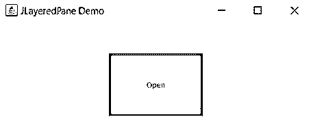
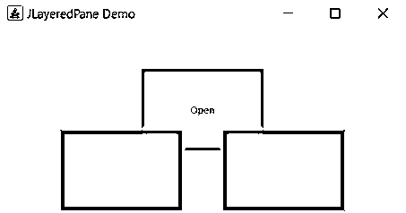
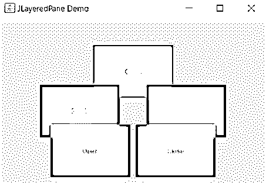
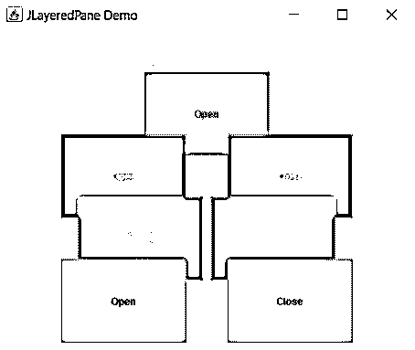
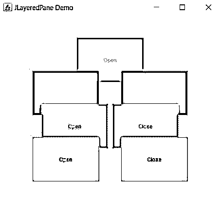
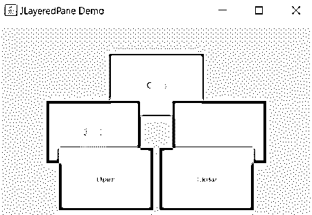
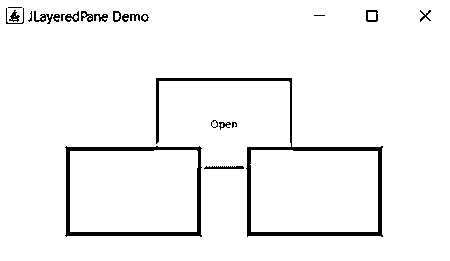
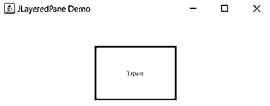

# JLayeredPane

> 原文： [https://www.educba.com/jlayeredpane/](https://www.educba.com/jlayeredpane/)


## JLayeredPane 简介

JLayeredPane 是一个 Swing 组件，它使我们能够将组件添加到不同的层。“不同层”的一个常见示例是弹出 JLayeredPane。当我们必须显示一些对话框、警告或信息时，我们使用弹出窗口。这可以使用 JLayeredPane 来实现。

**声明:**

<small>网页开发、编程语言、软件测试&其他</small>

```
public class JLayeredPane extends JComponent implements Accessible
```

**Layers of JLayeredPane**

下面是 JLayeredPane 的一些层，详细解释如下:

*   **DEFAULT_LAYER:** 这是标准层，也是最底层，插入了大多数组件。
*   **PALETTE _ LAYER:**jlayeredpanes 的这一层位于默认层之上，对于浮动工具栏和调色板非常有用。
*   **MODAL _ LAYER:**JLayeredPane 的这一层用于模型对话框，显示在调色板层之上。
*   **POPUP _ LAYER:**jlayeredpane 的这一层用于显示模态层之上的弹出窗口。
*   **DRAG_LAYER:** 拖动组件时，组件显示在该层(弹出层上方)。拖动完成后，组件将显示在其原始层中。

**构造函数细节:**这是唯一创建 JLayeredPane 的构造函数。

```
public JLayeredPane()
```

### JLayeredPane 的方法详细信息

以下是我们使用的一些方法:

**1。protected void add impl(Component comp，Object constraints，int index):** 该方法将一个组件添加到该容器的指定索引处。此外，会通知 LayoutManager 使用指定的 constraints 对象将指定的组件添加到此容器的布局中。为此，使用了 addLayoutComponent 方法。

**2。public void remove(int index):** 这个方法从这个窗格的指定索引中删除一个组件。

**3。public void removeAll():** 从这个窗格中删除所有组件。

**4。public boolean isotimizeddrawingenabled():**如果窗格中的层可以重叠，则无法进行优化绘制，并返回 false。否则为真。

**5。public static void putLayer(JComponent c，int layer):** 这个方法为一个 JComponent 设置层。这种方法不会导致任何副作用，如绘画，添加，删除等。要获得这些副作用，可以使用 setLayer()方法。

**6。public static int getLayer(JComponent c):**该方法返回指定 JComponent 的 Layer 属性。

**7。public static JLayeredPane getLayeredPaneAbove(Component c):**该方法返回包含指定组件的第一个 JLayeredPane，如果没有找到 JLayeredPane，则返回 null。

**8。public void setLayer(Component c，int layer):** 该方法设置指定组件的 JLayeredPane 属性。它使组件位于指定层的最底部。

**9。public void setLayer(Component c，int Layer，int position):** 该方法设置指定组件的 layer 属性，并设置组件在该层中的位置。

10。public int getLayer(Component c):该方法返回指定组件的 Layer 属性。

**11。public int getIndexOf(Component c):**这个方法返回指定组件在窗格中的索引，忽略层。最上面的组件位于索引 0 处，最下面的组件位于最高索引处。

**12。public void moveToFront(Component c):**该方法将指定的组件移动到其当前层的顶部(位置 0)。

13。public void move to back(Component c):该方法将指定的组件移动到其当前层的底部(位置-1)。

**14。public void set position(Component c，int position):** 该方法设置指定组件在其所在层中的位置，其中 0 是最上面的位置，而–1 是最下面的位置。

15。public int getPosition(Component c):该方法返回组件在其所在层内的相对位置。

16。public int highestLayer(): 这个方法返回当前所有子层中最高层的值。如果没有子节点，则返回 0。

**17。public int lowestLayer():** 该方法返回当前所有子层中最低层的值。如果没有子节点，则返回 0。

18。public int getcomponentcountinterer(int layer):该方法返回指定层中当前存在的子节点数量。

**19。public Component[]getComponentsInLayer(int layer):**该方法返回指定层中存在的数组中的组件。

20。public void paint(Graphics g): 这个方法在指定的图形上下文中绘制这个 JLayeredPane。

**21。受保护的哈希表<组件，整数> getComponentToLayer():** 这个方法返回一个哈希表，将组件映射到层。

**22。受保护的整数 getObjectForLayer(int layer):**该方法返回与指定层相关联的整数。

**23。protected int insertIndexForLayer(int layer，int position):** 该方法根据指定的层和位置确定并返回插入新子节点的正确位置。

**24。protected String paramString():**这个方法返回这个窗格的字符串表示。此方法在内部用于调试目的。

**25。public AccessibleContext getaccessible context():**这个方法返回与这个窗格关联的 accessible context。

### Example of JLayeredPane

以下是一个示例，并附有解释:

**代码:**

```
import java.awt.Color;
import javax.swing.JButton;
import javax.swing.JFrame;
import javax.swing.JLayeredPane;
public class JLayeredPaneDemo {
public static void main(String[] args) {
JFrame frame = new JFrame("JLayeredPane Demo");
frame.setDefaultCloseOperation(JFrame.EXIT_ON_CLOSE);
frame.setSize(520, 530);
JLayeredPane jLayeredPane = new JLayeredPane();
JButton jButton1 = new JButton("Open");
jButton1.setBackground(Color.green);
jButton1.setBounds(175, 50, 150, 100);
jLayeredPane.add(jButton1, JLayeredPane.DEFAULT_LAYER);
JButton jButton2 = new JButton("Open");
JButton jButton3 = new JButton("Close");
jButton2.setVisible(false);
jButton3.setVisible(false);
jButton2.setBackground(Color.RED);
jButton3.setBackground(Color.RED);
jButton2.setBounds(75, 125, 150, 100);
jButton3.setBounds(275, 125, 150, 100);
jLayeredPane.add(jButton2, JLayeredPane.PALETTE_LAYER);
jLayeredPane.add(jButton3, JLayeredPane.PALETTE_LAYER);
JButton jButton4 = new JButton("Open");
JButton jButton5 = new JButton("Close");
jButton4.setVisible(false);
jButton5.setVisible(false);
jButton4.setBackground(Color.MAGENTA);
jButton5.setBackground(Color.MAGENTA);
jButton4.setBounds(95, 200, 150, 100);
jButton5.setBounds(255, 200, 150, 100);
jLayeredPane.add(jButton4, JLayeredPane.MODAL_LAYER);
jLayeredPane.add(jButton5, JLayeredPane.MODAL_LAYER);
JButton jButton6 = new JButton("Open");
JButton jButton7 = new JButton("Close");
jButton6.setVisible(false);
jButton7.setVisible(false);
jButton6.setBackground(Color.CYAN);
jButton7.setBackground(Color.CYAN);
jButton6.setBounds(75, 275, 150, 100);
jButton7.setBounds(275, 275, 150, 100);
jLayeredPane.add(jButton6, JLayeredPane.POPUP_LAYER);
jLayeredPane.add(jButton7, JLayeredPane.POPUP_LAYER);
JButton jButton8 = new JButton("Close");
jButton8.setVisible(false);
jButton8.setBackground(Color.GRAY);
jButton8.setBounds(175, 350, 150, 100);
jLayeredPane.add(jButton8, JLayeredPane.DRAG_LAYER);
frame.add(jLayeredPane);
frame.setVisible(true);
jButton1.addActionListener(e -> {
jButton2.setVisible(true);
jButton3.setVisible(true);
});
jButton2.addActionListener(e -> {
jButton4.setVisible(true);
jButton5.setVisible(true);
});
jButton3.addActionListener(e -> {
jButton2.setVisible(false);
jButton3.setVisible(false);
});
jButton4.addActionListener(e -> {
jButton6.setVisible(true);
jButton7.setVisible(true);
});
jButton5.addActionListener(e -> {
jButton4.setVisible(false);
jButton5.setVisible(false);
});
jButton6.addActionListener(e -> {
jButton8.setVisible(true);
});
jButton7.addActionListener(e -> {
jButton6.setVisible(false);
jButton7.setVisible(false);
});
jButton8.addActionListener(e -> {
jButton8.setVisible(false);
});
}
}
```

**解释**

在这个例子中，我们实现了一个程序，显示了 JLayeredPane 的不同层，以及如何在窗格中插入/移除组件。

*   首先，我们创建了一个框架，并向其中添加了一个 JLayeredPane。
*   然后在 JLayeredPane 的不同层中添加按钮。
*   将动作监听器附加到按钮上以显示或隐藏下一层。
*   层中按钮的位置已设置，因此看起来很合适。

**输出:**

1.这是我们的应用程序，这个绿色按钮被添加到最底层。




2.当用户点击第一层的绿色按钮时，第二层被打开。




3.当点击第二层中的打开按钮时，JLayeredPane 中的第三层被打开。




4.当点击第三层中的打开按钮时，第四层被打开。




5.当点击第四层中的打开按钮时，第五层被打开。


6.当点击第五层中的关闭按钮时，JLayeredPane 层被关闭。




7.当点击第四层中的关闭按钮时，JLayeredPane 层被关闭。




8.当点击第三层中的关闭按钮时，JLayeredPane 层被关闭。




9.当点击第二层的关闭按钮时，该层被关闭。




### 结论

JLayeredPane 易于使用，是 Swing 中的重要组件。在重叠的情况下，很容易在组件之间做出决定。

### 推荐文章

这是 JLayeredPane 的指南。在这里，我们讨论 JLayeredPane 的层、构造函数和方法，以及示例和代码实现。您也可以阅读以下文章，了解更多信息——

1.  [Java 中的 JFrame](https://www.educba.com/jframe-in-java/)
2.  [Java 中的 JComponent](https://www.educba.com/jcomponent-in-java/)
3.  [Java 中的 JCheckBox](https://www.educba.com/jcheckbox-in-java/)
4.  [Java 中的哈希表](https://www.educba.com/hashtable-in-java/)


