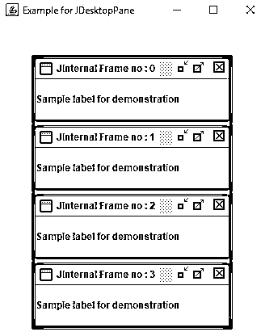
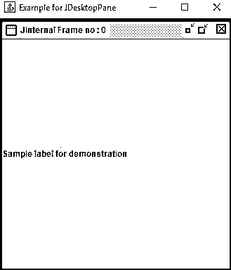
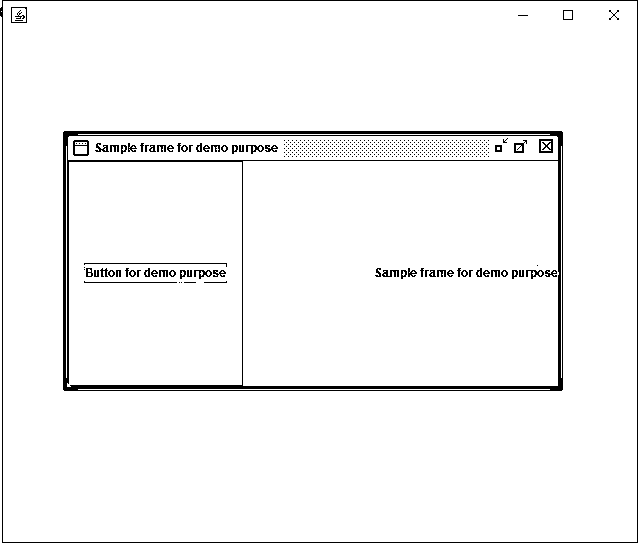

# JDesktopPane

> 原文：<https://www.educba.com/jdesktoppane/>


## JDesktopPane 简介

JDesktopPane 是 JavaFX 中可用的一个类，可用于生成多文档接口，该接口可以包含许多窗口或应用程序页面。这是通过分别在主窗口和内部窗口中使用 contentPane 和 JInternalFrame 来实现的。

**语法:**

<small>网页开发、编程语言、软件测试&其他</small>

```
JDesktopPane jdp = new JDesktopPane();
```

其中，JDesktopPane()充当用于创建新 JDesktopPane 的构造函数方法。

JDesktopPane 中使用的其他方法有 getUI()、remove(int i)、removeAll()、getDragMode()、getAllFrame()、getUIClassID()、UpdateUI()、paramString()、setDragMode(int dm)、selectFrame(Boolean fwd)等。

**构造器:**

它只有一个构造函数 JDesktopPane()，帮助创建新的 JDesktopPane。

### 方法

它有许多执行多种功能的方法。以下是 JDesktopPane 的常用方法:

1.  **getAllFrames** **():** 返回当前显示在桌面的 JInternalFrames。
2.  **getAllFramesInLayer****(int l):**返回当前显示在桌面指定层 l 的 JInternalFrames。
3.  **getDesktopManager****():**管理特定于桌面的用户界面动作的桌面管理器将被返回。
4.  **getAccessibleContext****():**将返回与 JDesktopPane 相关的 AccessibleContext。
5.  ****():**返回渲染组件的观感对象。**
***   **移除** **(int i):** 索引组件 I 将从该窗格中移除。*   **removeAll** **():** 集装箱中的每一个部件都将被移除。*   **getDragMode** **():** 将返回桌面窗格当前使用的拖动样式。*   **getSelectedFrame****():**将返回桌面窗格中当前活动的 JInternalFrame。如果不存在活动的 JInternalFrame，则返回 null。*   **setUI****(****desktoppanei****user interface):**将设置呈现组件的观感对象。*   **setDragMode****(int dm):**拖动样式 DM 将在桌面窗格中设置。*   **移除** **(** **组件** **cmp):** 组件 cmp 将从容器中移除。*   **选择框架** **(布尔前进):** JInternalFrame 将被选中，这是桌面窗格中的下一个。*   **setSelectedFrame****(JInternalFrame****JF****):**将设置桌面窗格中当前活动的 JInternalFrame。*   ****ClassID****():**将返回呈现组件的观感对象的名称。*****   **updateUI** **():** 一个看起来感觉对象有变化的通知会从 UIManager 更新。*   **setDesktopManager****(****DesktopManager****d):**将设置 desktop manager，处理桌面的用户界面动作。*   **paramString** **( ):** 将为 JDesktopPane 返回字符串表示。*   **addImpl****(****Component****cmp，****Object****const，int i):** 指定的组件 CMP 将被添加到容器中的索引 I 处****

 ****### 实现 JDesktopPane 的程序

现在，让我们看看不同的 JavaFX 程序:

#### 程序# 1–创建带有 4 个窗口的 JDesktopPane

**代码:**

```
// Java program to create JDesktopPane
import java.awt.BorderLayout;
import java.awt.Container;
import javax.swing.JDesktopPane;
import javax.swing.JFrame;
import javax.swing.JInternalFrame;
import javax.swing.JLabel;
// Class that extends JFrame class
public class JDesktopPaneExample extends JFrame
{
// constructor of the created class
public JDesktopPaneExample()
{
// create a desktoppane dp
CustomDesktopPane dp = new CustomDesktopPane();
// create  a container
Container cp = getContentPane();
// add the desktoppane to the container
cp.add(dp, BorderLayout.CENTER);
// display the pane
dp.display(dp);
// set a title
setTitle("Example for JDesktopPane");
// set the size
setSize(350,400);
// set visibility as true
setVisible(true);
}
// main method
public static void  main(String args[])
{
// call the constructor
new JDesktopPaneExample();
}
}
class CustomDesktopPane extends JDesktopPane
{
//no of frames
int n = 4;
//set the value for x and y
int x = 40, y = 40;
//definition of the function display
public void display(CustomDesktopPane dp)
{
//loop to create n number of frames
for(int  i = 0; i < n ; ++i )
{
//create a JInternalFrame
JInternalFrame jf = new JInternalFrame("JInternal Frame no : " + i ,  true, true, true, true);
// set bounds for the frame
jf.setBounds(x, y, 250, 60);
//create container
Container cnt = jf.getContentPane( ) ;
// add the label to the container
cnt.add(new JLabel("Sample label for demonstration "));
//add the JInternalFrame to the desktoppane
dp.add( jf );
// set visibility as true
jf.setVisible(true);
// increment the value of y
y += 85;
}
}
}
```

**输出:**




此处，显示了一个窗格，其中有 4 个内部框架和 4 个标签用于演示。假设 JInternalFrame no:0 最大化，结果如下所示:




同样，所有其他窗口也可以像上面这样最大化。

#### 程序# 2–用一个内部框架创建

**代码:**

```
//Java program to create JDesktopPane with one internal fr
import java.awt.BorderLayout;
import javax.swing.JButton;
import javax.swing.JDesktopPane;
import javax.swing.JFrame;
import javax.swing.JInternalFrame;
import javax.swing.JLabel;
//class
public class JDesktopPaneExample {
//main method
public static void main(final String[] args) {
//create a JFrame
JFrame fr = new JFrame();
//window close when close button when it is clicked
fr.setDefaultCloseOperation(JFrame.EXIT_ON_CLOSE);
//create a JDesktopPane
JDesktopPane dp = new JDesktopPane();
// create an internal frame
JInternalFrame iframe = new JInternalFrame("Sample frame for demo purpose", true, true, true, true);
// add internal frame to desktopPane
dp.add(iframe);
// set the bounds for internal frame
iframe.setBounds(60, 100, 500, 260);
// create a label
JLabel lb = new JLabel(iframe.getTitle(), JLabel.CENTER);
// create a button
JButton btn = new JButton("Button for demo purpose");
// add label to the internal frame
iframe.add(lb, BorderLayout.EAST);
// add button to the internal frame
iframe.add(btn, BorderLayout.WEST);
// set the visibility of internal frame as true
iframe.setVisible(true);
fr.add(dp, BorderLayout.CENTER);
// set the size of frame
fr.setSize(650, 550);
// set the visibility of  frame as true
fr.setVisible(true);
}
}
```

**输出:**




在执行代码时，将显示一个框架，其中有一个按钮和一个标签。

### 结论

JDesktopPane 用于包含多个窗口的多文档界面或应用程序中。许多产品将此面板用于商业目的。主要产品包括 Microsoft PowerPoint、Allaire HomeSite、Corel Draw 和 Symantec Visual Café。在所有这些产品中，将出现包含所有其他窗口的主桌面窗格。为了使用这个窗格，实例化 javafx.swing.JDesktopPane 类。

### 推荐文章

这是 JDesktopPane 的指南。这里我们讨论 JDesktopPane 的语法、构造函数、使用的方法和不同的例子。您也可以阅读以下文章，了解更多信息——

1.  [JColorChooser](https://www.educba.com/jcolorchooser/)
2.  [Java 中的 JPanel](https://www.educba.com/jpanel-in-java/)
3.  [JavaFX 布局](https://www.educba.com/javafx-layouts/)
4.  [如何用 Java 创建 Webservice？](https://www.educba.com/how-to-create-webservice-in-java/)


****