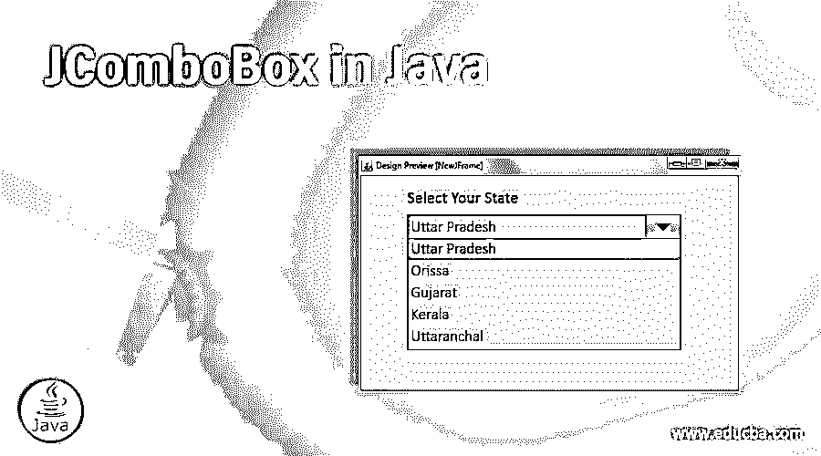
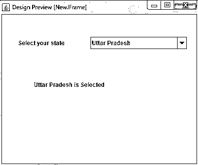

# Java 中的 JComboBox

> 原文：<https://www.educba.com/jcombobox-in-java/>




## Java 中的 JComboBox 简介

JComboBox 属于 Java Swing 包。它扩展了 [JComponent 类](https://www.educba.com/jcomponent-in-java/)。JComboBox 由包含元素列表的弹出菜单表示，用户可以从列表中选择一个选项或元素。根据需要和程序员，它可以是可编辑的或不可编辑的。默认情况下，结合按钮和下拉列表的功能是不可编辑的。不可编辑的 JComboBox 具有文本字段和下拉列表的功能。用户可以键入或单击箭头按钮来查看下拉列表。组合框需要更少的空间，因此在尺寸很小或有限时非常有用。

**语法:**

<small>网页开发、编程语言、软件测试&其他</small>

让我们看看声明 javax.swing.JComboBox 类的语法。

```
public class JComboBox extends JComponent implements ItemSelectable, ListDataListener, ActionListener, Accessible
```

### JComboBox 构造函数

下面提到了常用的构造函数:

*   **JComboBox():** 它使用默认数据模型创建一个新的空 JComboBox。
*   **JComboBox(Object[]items):**用指定数组中列出的元素创建一个新的 JComboBox。
*   **JComboBox(矢量<？> items):** 它用指定 vector 中列出的元素创建一个新的 JComboBox。
*   **JComboBox(ComboBoxModel M):**它用指定的 combobox model 中列出的元素创建一个 JComboBox。

### JComboBox 方法

以下是一些解释的方法。

*   **addItem(Object item):** 它将新项目添加到 JComboBox 中。
*   **addItemListener(ItemListener I):** It adds an ItemListener to JComboBox.
*   **getItemAt(int i):** 用于获取索引 I 处的项目。
*   **getItemCount():** 用于获取列表中的项目数。
*   **getSelectedItem():** 用于获取选中的项目。
*   **removeItemAt(int i):** 这个函数用于删除索引 I 处的一个项目。
*   **setEditable(boolean b):** 用于确定 JComboBox 是否可以编辑。
*   **setSelectedIndex(int i):** 用于选择出现在索引 I 的 JComboBox 的一个项目。
*   **showPopup():** 它使 JComboBox 显示弹出窗口。
*   **setUI(ComboBoxUI ui):** 用于设置渲染组件的 L & F 对象。
*   **setSelectedItem(Object a):**用于将 JComboBox 显示区的选中项设置为一个参数中的对象。
*   **setSelectedIndex(int a):** 用于选择出现在索引 a 的项目。
*   **setPopupVisible(布尔 v):** 用于设置弹出窗口的可见性。
*   **setModel(combobox model a):**用于设置 JComboBox 获取项目列表所使用的数据模型。
*   **setMaximumRowCount(int count):**用于设置 JComboBox 可以显示的最大行数。
*   **setEnabled(boolean b):** 用于启用 JComboBox 来选择项目。
*   **remove item(Object an Object):**用于从项目列表中删除项目。
*   **removeAllItems():** 用于删除项目列表中的所有项目。
*   **remove ActionListener(action listener I):**帮助移除 action listener。
*   **isPopupVisible():** 它告诉弹出窗口的可见性。
*   **addPopupMenuListener(popup menu listener I):**用于添加 popup menu listener，以监听来自弹出窗口的所有通知消息。
*   **getActionCommand():** 用于返回动作命令。
*   **getEditor():** 用于向编辑器返回帮助，编辑并绘制组合框字段中选中的项目。
*   getItemCount(): 给出了物品列表中的物品数量。
*   **getItemListeners():** 它给出了添加到组合框中的所有 ItemListeners 的数组。
*   **createDefaultKeySelectionManager():**它给出了默认键选择管理器的实例
*   **fireItemStateChanged(item event e):**它使所有对该事件的发生感兴趣的侦听器都能得到关于该事件的通知。
*   **firePopupMenuCanceled():** 用于通知 PopupMenu 的监听器 JComboBox 的弹出已经被取消。
*   **firePopupMenuWillBecomeInvisisble():**用于通知 PopupMenu 的监听器 JComboBox 的 popup 已经不可见。
*   用于通知 PopupMenu 的监听器 JComboBox 的弹出窗口已经可见。
*   **set editor(combobox editor a):**用于设置编辑器帮助编辑和绘制组合框字段中的选中项。
*   **setActionCommand(字符串 a):** 用于设置动作命令。
*   **getUI():** 它给出了与该组件相关的感觉和外观对象。
*   **paramString():** 它给出了组合框的字符串表示。
*   **getUIClassID():** 它给出了与该组件相关的感觉和外观对象的名称。
*   **getAccessibleContext():** 用于获取与组合框相关的关联上下文。

### Java 中的 JComboBox 示例

创建 JComboBox 并向其添加元素的简单程序。

**代码:**

```
import java.awt.event.*;
import java.awt.*;
import javax.swing.*;
class state extends JFrame implements ItemListener {
static JFrame f;
static JLabel a, b;
static JComboBox c;
public static void main (String [] args)
{
f = new JFrame ("frame");
state st = new state ();
f.setLayout (new FlowLayout());
String str[] = { "Uttar Pradesh", "Orissa", "Gujarat", "Kerala", "Uttaranchal" };
c = new JComboBox (str);
c.addItemListener (st);
a = new JLabel ("select your city ");
b = new JLabel ("Uttar Pradesh is Selected");
a.setForeground (Color.red);
b.setForeground (Color.blue);
JPanel pa = new JPanel ();
pa.add (a);
pa.add (c);
pa.add (b);
f.add (pa);
f.setSize (400, 300);
f.show ();
}
public void itemStateChanged (ItemEvent e)
{
if (e.getSource () == c) {
b.setText (c.getSelectedItem () + “is Selected");
}
}
}
```

**输出:**

**

** 

### 结论

在本文中，我们讨论了 JComboBox 的创建、构造函数和方法。如果我们的空间有限，这是非常有用的。它是文本字段和下拉列表的组合，比列表占用更少的空间，因此比列表更受欢迎。

### 推荐文章

这是 Java 中 JComboBox 的指南。这里我们用例子讨论 JComboBox 的基本概念、创建、构造函数和方法。您还可以浏览我们推荐的其他文章——

1.  [Java 中的变量](https://www.educba.com/variables-in-java/)
2.  [Java 中的 2D 数组](https://www.educba.com/2d-arrays-in-java/)
3.  [Java 包](https://www.educba.com/java-packages/)
4.  [JLabel in Java](https://www.educba.com/jlabel-in-java/)


