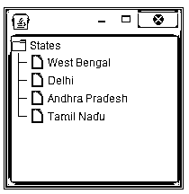

# Java 中的 JTree

> 原文：<https://www.educba.com/jtree-in-java/>


## Java 中的 JTree 简介

JTree 是 Java swing 方法论中使用的一个概念。它用于显示按特定顺序排列的分层数据。它还有一个根节点，这是 Java 框架中最重要的节点。另外，在编程语言中，只要需要显示数据的层次结构，就会用到 Jtree 概念。存在子节点，其中也显示子节点的显示。每个根节点都有子节点。然而，如果特定根节点没有子节点，则该节点被称为叶节点。下面显示了一个 Jtree 实现的例子，其中蔬菜和水果作为根节点，因为它们被细分为许多其他节点。这种情况下的子节点是辣椒、胡萝卜、卷心菜和土豆，它们位于根节点蔬菜之下。此外，其他子节点是香蕉、芒果、苹果和葡萄，它们位于也可以创建的根节点水果下。


<small>网页开发、编程语言、软件测试&其他</small>

### JTree 在 Java 中的工作

根节点下可以有多个节点，也称为子节点。还有 JTable、JFile 和 JList 的实例。JTable 用于显示任意大小的表格，而 JList 给出了一个[下拉列表，我们可以从中选择一个项目并在显示中使用它。在 JTree 列表中还有 JFrame 的用法，它可以用来在 Java 编程语言中阐明和构建一个框架。](https://www.educba.com/dropdown-list-in-html/)

#### 构造器

通常有三个构造函数，它们将 Jtree 显示为一个类，如下所示:

*   **Jtree()**–构造函数与类名同名，并且没有任何返回值。它为 JTree 类创建了一个简单的模型。
*   **JTree(Object value[])**–在这种情况下，对象通过构造函数传递。所有被传递的对象都是根节点的子节点，它被表示在比根节点更低的级别上。
*   **Jtree(TreeNode root)**–这里的根节点是根据给定的命令构建的 TreeNode。所有子节点都将位于根节点 TreeNode 下。

Jtree 中还显示了一些方法。

#### 方法

一些方法如下:

*   **Public tree model get model()**–显示树的模型，其数据是使用 Java 编程语言中的 Jtree 显示的。
*   **Public int getRowCount()**–上面提到的函数用于计算 Jtree 示例中的行数。行数还提到了 Jtree 根节点下的子节点数。
*   **Public void addTreeSelectionListener(TreeSelectionListener)**–在 Jtree 面板的树选择中添加一个监听器。

### Java 中的 JTree 示例

首先，我们看到编码语言中的一个 Jtree 例子。Jtree 是 Swing 方法的一部分，它就是从那里派生出来的。首先导入 javax.swing 文件，然后创建类示例。程序中只有一个根节点，而程序中有多个子节点。在一个根节点下可以创建不同的节点。在下面的程序中，我们显示了一个彩色的根节点，然后我们注意到有一个名为 state 的子节点。现在，在状态节点下，节点下有各种状态，称为子节点。在代码中添加子节点非常容易。也可以添加其他状态。

基本上，在编程概念中，Jtree 用于[创建层次结构](https://www.educba.com/hierarchy-in-tableau/)。第一个在顶部，而最后一个在底部。创建的根节点可以有子节点。这个例子是一个程序，其中层次结构是一个优先级，然后才是变量。显然，Java 是一种面向对象的编程语言，它有一个默认的可变树节点，然后节点被创建。

没有子节点的根节点称为叶节点。我们还可以设置创建的节点的大小。在这个程序中，我们将大小设置为 150，150 是正在创建的节点的高度和宽度。还有一个 main()被创建，它有助于程序的主结构。在这种情况下没有 IO 异常，因此导入 java.io.*包不会被导出。默认情况下，字符串参数也在 main()中创建。

在下面的代码中，我们看到了树。我们在国家印度下添加了四个州，并将其作为一个 Jtree。执行 Jtree 的代码如下所示:

**代码:**

```
import javax.swing.*;
import javax.swing.tree.DefaultMutableTreeNode;
public class Example {
JFrame f;
Example(){
f=new JFrame();
DefaultMutableTreeNode country=new DefaultMutableTreeNode("India");
DefaultMutableTreeNode state=new DefaultMutableTreeNode("States");
country.add(state);
DefaultMutableTreeNode wb=new DefaultMutableTreeNode("West Bengal");
DefaultMutableTreeNode del=new DefaultMutableTreeNode("Delhi");
DefaultMutableTreeNode ap=new DefaultMutableTreeNode("Andhra Pradesh");
DefaultMutableTreeNode tn=new DefaultMutableTreeNode("Tamil Nadu");
state.add(wb); state.add(del); state.add(ap); state.add(tn);
JTree jt=new JTree(state);
f.add(jt);
f.setSize(200,200);
f.setVisible(true);
}
public static void main(String[] args) {
new Example();
}}
```

**输出:**




### 结论

在本文中，我们将看到 Jtree 的功能，以及它如何作为一个类使用，并包含实现它的构造函数和方法。Jtree 用于显示数据的层次结构，它被用于许多行业，如电信、金融、工业应用等。Jtree 是 Java Swing 方法的一部分，对于显示根节点以及作为根节点一部分的子节点非常有用。在本文中，我们还看到了一个用于显示根节点层次结构的代码。就像树有根一样，代码也有许多根可以用来显示子节点。第一个节点总是根节点，它以非常智能的方式显示子节点。分层数据在所有行业都很重要，它与 Excel VBA 或任何其他编程语言都有很大不同。

### 推荐文章

这是 Java 中 JTree 的指南。在这里，我们还将讨论 Java 中 JTree 的引入，以及它的工作原理和构造函数。您也可以看看以下文章，了解更多信息–

1.  [Java 中的 JFrame](https://www.educba.com/jframe-in-java/)
2.  Java 中的 jfile chooser
3.  [Java 中的包装类](https://www.educba.com/wrapper-class-in-java/)
4.  [Java 中的继承](https://www.educba.com/inheritance-in-java/)


