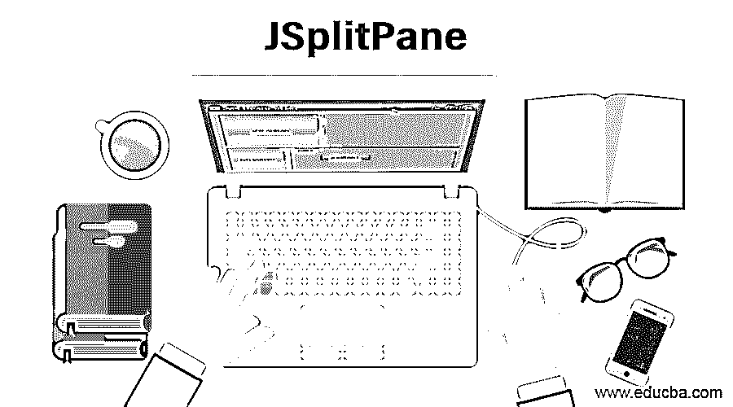

# JSplitPane

> 原文： [https://www.educba.com/jsplitpane/](https://www.educba.com/jsplitpane/)




## JSplitPane 简介

它是一个 [Java Swing 组件](https://www.educba.com/swing-components-in-java/)，帮助基于 L & F(观感)实现划分两个组件。它还有助于调整组件的大小，即使是最小的大小。但是，如果组件的最小尺寸大于 JSplitPane，那么就不能调整大小。诸如垂直和水平 splitpane 的两种类型目前分别基于从左到右和从上到下的对齐方式。JSplitPane 的语法、构造函数和方法将在下面的章节中详细讨论。

**语法:**

<small>网页开发、编程语言、软件测试&其他</small>

```
public class JSplitPane extends JComponent implements Accessible
```

这里，它扩展了 [JComponent 类](https://www.educba.com/jcomponent-in-java/)并实现了可访问的接口。

### JSplitPane 构造函数

它有不同的带参数和不带参数的构造函数。下面会提到它们。

*   **JSplitPane():** 使用组件的 2 个按钮从左到右(水平)创建一个新的拆分窗格。

*   **JSplitPane(int orientation):**使用指定的方向创建一个新的拆分窗格。

*   **JSplitPane(int orientation，boolean redraw):** 使用指定的方向和重绘样式创建一个新的拆分窗格。

*   **JSplitPane(int orientation，boolean redraw，Component leftcmp，Component rightcmp):** 一个新的拆分窗格被创建，具有指定的方向和重绘样式，左右组件。
*   **JSplitPane(int orientation，Component leftcmp，Component rightcmp):** 一个新的分割窗格被创建，具有指定的方向、左侧和右侧组件。

### JSplitPane 的 29 大方法

它提供了执行多种操作的方法。下表列出了这些问题:

| **方法** | **解释** |
| getOrientation() | 将返回 SplitPane 的方向。 |
| getUIClassID() | 将返回呈现组件的(外观)L&F 类的名称。 |
| 格推() | (观感)将返回呈现组件的 L&F 对象。 |
| getDividerSize() | 将返回分隔线的大小。 |
| getAccessibleContext() | 将返回与 SplitPane 链接的 AccessibleContext |
| setUI(SplitPaneUI u) | (观感)将设置呈现组件的 L&F 对象。 |
| paramString() | JSplitPane 的表示将采用字符串格式 |
| getMinimumDividerLocation() | 将返回分割线的最小或最小位置。 |
| 移除(组件 cmp) | 拆分窗格中的子组件将被移除。 |
| getDividerLocation() | 将返回传递给 setDividerLocation 的最后一个值。 |
| isOneTouchExpandable() | 将返回属性“oneTouchExpandable”。 |
| setRightComponent(组件 cmp) | Splitpane 的右组件将被设置为 cmp |
| isContinuousLayout() | 将返回属性“continuousLayout” |
| getMaximumDividerLocation() | 将返回分割线的最大或最大位置。 |
| setLeftComponent(组件 cmp) | Splitpane 的左侧组件将被设置为 cmp |
| setBottomComponent(组件 cmp) | Splitpane 的底部组件将被设置为 cmp |
| setdivideze(int s) | 将设置分隔线的大小。 |
| setOneTouchExpandable(boolean ST) | 将设置属性“oneTouchExpandable”。 |
| setResizeWeight(双 w) | 当 splitpane 大小改变时，此方法有助于指定如何分配额外的空间。 |
| setLastDividerLocation(int loc) | 将设置分隔线的最后位置。 |
| setTopComponent(组件 CMP) | Splitpane 的顶部组件将被设置为参数 CMP。 |
| setdividerrocation(int loc) | 将设置分隔线的位置。 |
| 移除(整数索引) | 所述索引处的组件将被移除 |
| setContinuousLayout(布尔值 n) | 将设置属性“连续布局”值。为了连续重新显示子组件，该值必须为真 |
| getTopComponent () | Splitpane 的顶部组件将使用此方法返回。 |
| setDividerLocation (double loc) | 分隔线的位置将被设置为 SplitPane 大小的百分比。 |
| getRightComponent() | 将返回 Splitpane 的右组件。 |
| getBottomComponent() | 将返回 Splitpane 的底部组件。 |
| addImpl(组件 CMP，对象 cob，int in) | 提到的组件将被添加到拆分窗格中。 |

### 实现 JSplitPane 的程序

现在，让我们看一个演示 JSplitPane 的示例程序:

**代码:**

```
// Java program to demonstrate JSplitPane
import java.awt.*;
import javax.swing.*;
class JSplitPaneExample extends JFrame
{
//declare the Vertical Pane, Horizontal pane and Panels
private  JSplitPane VerticalPane;
private  JSplitPane HorizontalPane;
private  JPanel  P1;
private  JPanel  P2;
private  JPanel  P3;
Color cl=new Color(190,190,240);
//constructor of the class
public JSplitPaneExample()
{
setTitle( "Example to demonstrate JSplitPane" );
//setting the background color
setBackground( Color.*orange* );
//object of the panel
JPanel PanelObj = new JPanel();
//set borderlayout for the panel
PanelObj.setLayout( new BorderLayout() );
getContentPane().add( PanelObj );
// Create three different panels
P1Creation();
P2Creation();
P3Creation();
P1.setBackground(cl);
P2.setBackground(cl);
P3.setBackground(cl);
// Create vertical and horiontal splitter pane
VerticalPane = new JSplitPane( JSplitPane.*VERTICAL_SPLIT* );
PanelObj.add( VerticalPane, BorderLayout.*CENTER* );
HorizontalPane = new JSplitPane( JSplitPane.*HORIZONTAL_SPLIT* );
HorizontalPane.setLeftComponent( P1 );
HorizontalPane.setRightComponent( P2 );
VerticalPane.setLeftComponent( HorizontalPane );
VerticalPane.setRightComponent( P3 );
}
//create panel 1 with 5 buttons
public void P1Creation()
{
P1 = new JPanel();
P1.setLayout( new BorderLayout() );
// Add 5 button
P1.add( new JButton( "N" ), BorderLayout.*NORTH* );
P1.add( new JButton( "S" ), BorderLayout.*SOUTH* );
P1.add( new JButton( "E" ), BorderLayout.*EAST* );
P1.add( new JButton( "W" ), BorderLayout.*WEST* );
P1.add( new JButton( "C" ), BorderLayout.*CENTER* );
}
//create panel 2 with 3 buttons
public void P2Creation()
{
P2 = new JPanel();
P2.setLayout( new FlowLayout() );
P2.add( new JButton( "Button A" ) );
P2.add( new JButton( "Button B" ) );
P2.add( new JButton( "Button C" ) );
P2.add( new JButton( "Button D" ) );
P2.add( new JButton( "Button E" ) );
}
//create panel 3 with 1 buttons
public void P3Creation()
{
P3 = new JPanel();
//set borderlayout
P3.setLayout( new BorderLayout() );
//set preferred size
P3.setPreferredSize( new Dimension( 400, 100 ) );
//set the minimum size
P3.setMinimumSize( new Dimension( 100, 50 ) );
P3.add( new JLabel( "Special information: " ), BorderLayout.*NORTH* );
P3.add( new JTextArea(), BorderLayout.*CENTER* );
}
public static void main( String args[] )
{
// Create an object of the class
JSplitPaneExample obj = new JSplitPaneExample();
//call pack method that helps the subcomponents of preferred size
obj.pack();
//shows the window
obj.setVisible( true );
}
}
```

**输出:**

**T2】**


 **这里，输出由包含不同按钮的 3 个面板生成。在面板 1 中，存在五个按钮 N、E、W、S 和 C，而在面板 2 中，存在五个按钮 A、B、C、D 和 E。在底部，还有一个特殊信息面板。

### 结论

它是 Java 中的一个 Swing 组件，有助于根据外观和感觉(L&F)实现来划分组件。此外，组件还可以调整到最小尺寸。在本文档中，详细讨论了 JSplitPanel 的构造函数、方法和示例程序。

### 推荐文章

这是一个 JSplitPane 的指南。在这里，我们讨论的意义，构造函数和前 29 个方法及其描述，以及程序来实现 JSplitPane。您也可以浏览我们推荐的其他文章，了解更多信息——

1.  [Java 中的构造函数](https://www.educba.com/constructor-in-java/)
2.  [Java 中的 JPanel](https://www.educba.com/jpanel-in-java/)
3.  [Java 中的 JFrame](https://www.educba.com/jframe-in-java/)
4.  [Java 中的 JList](https://www.educba.com/jlist-in-java/)


**