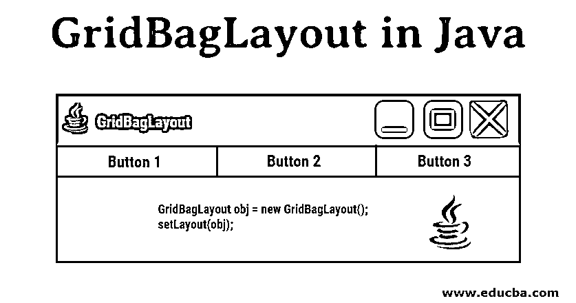
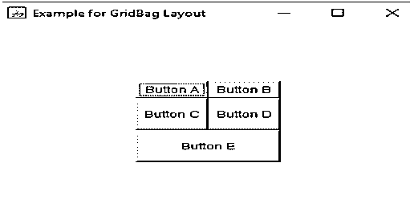
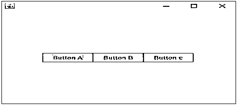

# Java 中的 GridBagLayout

> 原文：<https://www.educba.com/gridbaglayout-in-java/>




## Java 中的 GridBagLayout 简介

GridBagLayout 是 Java 提供的最复杂、最强大、最复杂的布局管理器之一。GridBagLayout 垂直、水平或沿基线对齐组件。根据要求，组件的宽度可以相同，也可以不同。它们维护和管理动态单元格，其中显示区域由一个或多个单元格组成。这些组件与 GridBagConstraints 实例相关联，其中约束的对象有助于在网格上排列组件的显示区域。GridBagLayout 是 java.awt 包的一部分，下面几节让我们看看 GridBagLayout 的构造函数、方法和实现。

### Java 中 GridBagLayout 的构造函数

Java.awt.GridBagLayout 使用以下语法声明。

<small>网页开发、编程语言、软件测试&其他</small>

```
public class GridBagLayout extends Object implements LayoutManager2, Serializable
```

GridBagLayout()是 GridBagLayout 的构造函数，它有助于创建网格包布局管理器。首先，我们在无参数构造函数的帮助下为 GridBagLayout 类创建对象

```
GridBagLayout obj = new GridBagLayout();
setLayout(obj);
```

让我们看看 java.awt.GridBagLayout 类的一些字段。

*   **PREFERRED_SIZE:** 指定组件的首选网格大小。这里，它也可以是必须用于特定范围值的间隙。
*   **DEFAULT_SIZE:** 指定组件的网格大小。这里，它也可以是必须用于特定范围值的间隙。
*   **defaultConstraints:** 包含默认值的 gridbag 约束的实例保存在这里。
*   **layoutInfo:** Gridbag 的布局细节保存在此。
*   **rowWeights:** 覆盖此处保存的行权重。
*   MAXGRIDSIZE: 它有助于向后兼容。
*   **rowHeights:** 覆盖保持行的最小高度。

### Java 中 GridBagLayout 的方法

以下是 GridBagLayout 的几种方法，可用于不同的目的。

*   **removeLayoutComponent(Component cmpn):**从布局中删除指定的组件。
*   **addLayoutComponent(Component cmpn，Object objcons):** 将约束的指定对象添加到指定组件的布局中。
*   **getLayoutAlignmentY(Container CNT):**返回沿 y 轴的对齐方式。
*   **addLayoutComponent(String name，Component cmpn):** 将约束的指定对象添加到具有特定名称的指定组件的布局中。
*   **toString():** 网格袋布局中的值以字符串的形式返回。
*   **getLayoutAlignmentX(Container CNT):**返回沿 x 轴对齐。
*   **get constraints(Component cmpn):**返回组件的指定约束。
*   **maximumLayoutSize(Container CNT):**容器中的组件以最大尺寸返回。
*   **minimumLayoutSize(Container cntmin):**容器中的组件以最小尺寸返回。
*   **preferredLayoutSize(Container cntpref):**容器中的组件以首选维度返回。
*   **arrangeGrid(Container CNT):**它有助于排列网格。
*   **adjustForGravity(GridBagConstraints cn，Rectangle rect):** 根据约束的几何形状，该方法将宽度、x、高度和 y 字段调整到正确的值。
*   **getLayoutDimensions():** 使用此方法确定列的宽度和行的高度。
*   **getLayoutInfo(Container cnt，int sizeflag):** 已经过时，用于向后兼容。
*   **getLayoutOrigin():** 它决定了布局区域的原点，在目标容器的图形坐标空间中。
*   **getlayoverthets():**使用此方法确定列的权重和行的高度。
*   **getMinSize(Container cnt，GridBagLayoutInfo inf):** 基于从 getLayoutInfo 获得的细节，返回主文件的最小大小。
*   **invalidate layout(Container CNT):**如果布局管理器中存在一些缓存信息，它会使布局无效。
*   **layout Container(Container CNT):**指定的集装箱将使用此网格袋布局进行布局。
*   **点位置(int x，int y):** 这个方法使用 x 和 y 来识别包含所提到的点的单元格。
*   **lookupConstraints(组件 cmp):** 检索上述组件的约束。
*   **setConstraints(Component cmp，GridBagConstraints const):** 在布局中设置所述组件的约束。

### 用 Java 实现 GridBagLayout 的程序

现在，让我们看看用 Java 实现 GridBagLayout 的程序。

#### 程序#1

```
// Java program to implement GridBagLayout layout manager
//import the packages needed
import java.awt.Button;
import java.awt.GridBagConstraints;
import java.awt.GridBagLayout;
import javax.swing.*;
//GridExample class extends JFrame
public class GridExample extends JFrame{
//main method
public static void main(String[] args) {
//object of the class GridExample
GridExample ge = new GridExample();
}
//constructor of class GridExample
public GridExample() {
// Object of GridBagLayout
GridBagLayout gl = new GridBagLayout();
// Object of GridBagConstraints
GridBagConstraints gc = new GridBagConstraints();
// GridBagLayout is set
setLayout(gl);
// Method to set JFrame Title.
setTitle("Example for GridBag Layout ");
GridBagLayout ll = new GridBagLayout();
this.setLayout(ll);
//components in horizontal
gc.fill = GridBagConstraints.HORIZONTAL;
//left most row and top most column
gc.gridx = 0;
gc.gridy = 0;
//Button A added
this.add(new Button("Button A"), gc);
gc.gridx = 1;
gc.gridy = 0;
//Button B added
this.add(new Button("Button B"), gc);
gc.fill = GridBagConstraints.HORIZONTAL;
//increase component height by 20 pixels
gc.ipady = 20;
gc.gridx = 0;
gc.gridy = 1;
//Button C added
this.add(new Button("Button C"), gc);
gc.gridx = 1;
gc.gridy = 1;
///Button D added
this.add(new Button("Button D"), gc);
gc.gridx = 0;
gc.gridy = 2;
gc.fill = GridBagConstraints.HORIZONTAL;
gc.gridwidth = 2;
//Button E added
this.add(new Button("Button E"), gc);
// set the size
setSize(200, 300);
setPreferredSize(getSize());
//GUI visible to user
setVisible(true);
//exit on clicking close button
setDefaultCloseOperation(EXIT_ON_CLOSE);
}
}
```

**样本输出:**




在这里，创建了一个 GridBagLayout，它有五个按钮，如 A、B、C、D 和 E。有几种方法用于设置大小、标题、GUI 可见性等。

#### 程序#2

```
//Java program to implement GridBagLayout
import java.awt.*;
import javax.swing.*;
public class GridExample {
//main method
public static void main(String[] args) {
//object of JFrame
JFrame jf = new JFrame();
//exit on clicking close button
jf.setDefaultCloseOperation(JFrame.EXIT_ON_CLOSE);
//object of container
Container cn = jf.getContentPane();
//set layout
cn.setLayout(new GridBagLayout());
//object of constraints
GridBagConstraints gc = new GridBagConstraints();
gc.gridx = 0;
gc.gridy = GridBagConstraints.RELATIVE;
cn.add(new JButton("Button A"));
cn.add(new JButton("Button B"));
gc.fill = GridBagConstraints.HORIZONTAL;
cn.add(new JButton("Button c"));
// set the size
jf.setSize(400, 300);
//GUI visible to user
jf.setVisible(true);
}
}
```

**样本输出:**




这个程序用另一种方法实现了 GridBagLayout。但是，这里没有设置标题，只有 3 个按钮。

### 结论

GridBagLayout 是 Java 中一个强大、灵活和复杂的布局管理器，它由 java.awt 包提供。它将组件垂直、水平或沿直线对齐。GridBagLayout 的语法、构造函数、方法和实现在本文档中有解释。

### 推荐文章

这是一个 Java 中 GridBagLayout 的指南。这里我们讨论用 Java 实现 GridBagLayout 的方法和程序。您也可以看看以下文章，了解更多信息–

1.  [Java 中的布局](https://www.educba.com/layout-in-java/)
2.  [Java 中的 JDialog](https://www.educba.com/jdialog-in-java/)
3.  [Java 注释](https://www.educba.com/java-annotations/)
4.  [Java 中的 BorderLayout](https://www.educba.com/borderlayout-in-java/)


