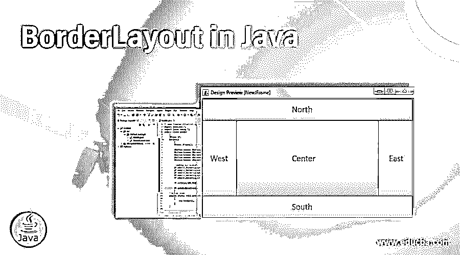
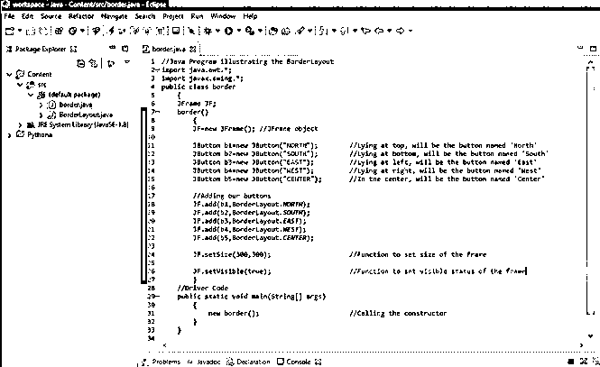
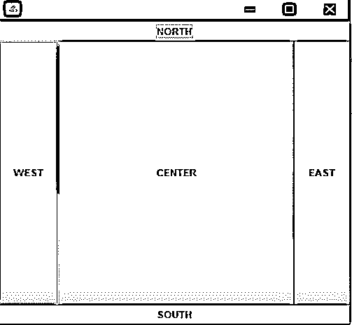
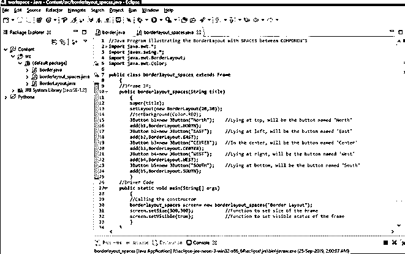
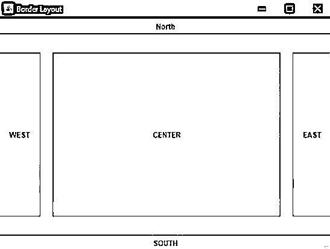
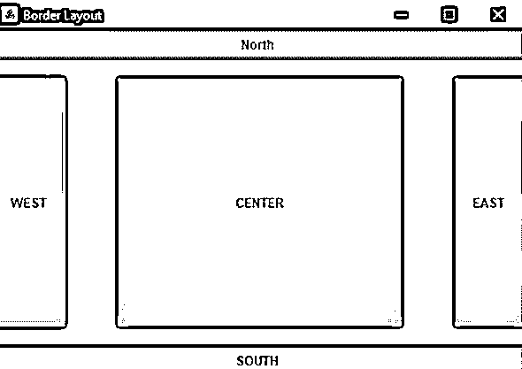

# Java 中的 BorderLayout

> 原文：<https://www.educba.com/borderlayout-in-java/>




## Java 中的 BorderLayout 简介

Java 中的 BorderLayout 或布局管理器是每个容器对象都有的对象，它控制其布局，即组件的大小和位置。通俗地说，这些[布局管理器用于](https://www.educba.com/layout-manager-in-java/)以一种特殊或特定的方式安排组件。“LayoutManager”可以说是一个由其所有类实现的接口。有一些 AWT 和 SWING 类已经作为布局管理器提供，供一般使用。其中一些列举如下:

1.  边界布局
2.  方框布局
3.  [SpringLayout](https://www.educba.com/flowlayout-in-java/)
4.  [流程布局](https://www.educba.com/flowlayout-in-java/)
5.  [群组布局](https://www.educba.com/grouplayout-in-java/)
6.  网格布局等

在讨论 BorderLayout 之前，让我们先讨论一些问题。

<small>网页开发、编程语言、软件测试&其他</small>

计算机世界中的几乎所有东西都是分层次组织的，要么是为了更好的存储，要么是为了创建一个简单的检索系统。用于使用可用的 AWT 类创建 GUI 的布局管理器是这种分层系统的一部分。它被称为包容层次结构。虽然本文的重点将放在一个叫做 BorderLayout 的可用布局管理器上，但在此之前，我们应该知道 BorderLayout 在这个层次结构中的位置。贯穿框架、GUI 组件、容器等的树形结构。开始于:

1.  首先，一个顶级容器或顶级容器类，如 JFrame、JApplet 或 JDialog，它充当这个容器层次结构的“根”。
2.  第二，对于在屏幕上作为 GUI 组件出现的组件，它必须包含在容器层次结构中。
3.  第三，一个组件只需要或将要包含在一个容器中。
4.  第四，每个顶级容器都会有一个内容窗格，不严格地说，每个可见的 GUI(直接或间接)都包含在这个内容窗格中。

### 什么是 BorderLayout？

BorderLayout 类是布局管理器类之一，被认为是窗口对象的默认布局。JFrame、JWindow、 [JDialog 等窗口对象使用](https://www.educba.com/jdialog-in-java/)这个类来显示为 GUI 组件。BorderLayout 用于布局容器，即排列和调整其组件的大小。边框布局将这些组件分成五个不同的区域。在五个地区中，四个地区或区域被称为北、南、东、西，中间的区域被称为中心。每个区域只能包含一个组件。边框布局提供了用于定位组件的常数集合。这里讨论的区域由名为北、南、东、西的相应常数标识，并且常数用于作为中心的中间区域。我们在使用边框布局添加组件时使用这些常量。我们的代码中使用的每个区域的常数如下所示:

*   **public static final int NORTH:**容器顶部的 NORTH 布局常量。
*   **public static final int SOUTH:**容器底部的 SOUTH 布局常量。
*   **public static final int CENTER:**容器中间的中心布局常量。
*   **public static final int WEST:**容器右侧的 WEST 布局常量。
*   **public static final int EAST:**容器左侧的东布局常量。

除了上面列出的常量，BorderLayout 还提供了其他定位常量，如 PAGE_START、PAGE_END 等。

### Java 中的 BorderLayout 构造函数

BorderLayout 构造函数用于创建组件之间有间隙或没有间隙的新边框布局。边框布局构造函数使用 gap 和 gap 参数来指定组件之间的水平间距和垂直间距。下面讨论了边框布局构造函数:

我们将逐一讨论它们以及它们的示例。

#### 1.BorderLayout()

BorderLayout 类用于创建一个边框布局，但组件之间没有间隙。以下是使用 BorderLayout()构造函数的示例代码。以下程序在其实例类为“border”的 JFrame 中创建组件。你可以在下面的截图中看到(代码后)，有五个区域。

我们的代码使用五个 JButton 创建了五个区域[，然后使用 add()方法将它们添加到布局或 JFrame 中。JFrame 的大小和可见性分别确定。setSize()方法用于设置框架的大小，set visibility()方法用于设置框架的可见性。](https://www.educba.com/jbutton-in-java/)

**代码**

```
//Java Program illustrating the BorderLayout
import java.awt.*;
import javax.swing.*;
public class border
{
JFrame JF;
border()
{
JF=new JFrame(); //JFrame object
//Lying at top, will be the button named 'North'
JButton b1=new JButton("NORTH");
//Lying at bottom, will be the button named 'South'
JButton b2=new JButton("SOUTH");
//Lying at left, will be the button named 'East'
JButton b3=new JButton("EAST");
//Lying at right, will be the button named 'West'
JButton b4=new JButton("WEST");
//In the center, will be the button named 'Center'
JButton b5=new JButton("CENTER");
//Adding our buttons
JF.add(b1,BorderLayout.NORTH);
JF.add(b2,BorderLayout.SOUTH);
JF.add(b3,BorderLayout.EAST);
JF.add(b4,BorderLayout.WEST);
JF.add(b5,BorderLayout.CENTER);
//Function to set size of the Frame
JF.setSize(300, 300);
//Function to set visible status of the frame
JF.setVisible(true);
}
//Driver Code
public static void main(String[] args)
{
//Calling the constructor
new border();
}
}
```

在下面的截图中，你可以看到代码在文本编辑器中的样子。我已经使用 Eclipse 作为我的文本编辑器。




当代码运行时，将显示以下输出。

**输出:**




#### 2.BorderLayout (int hgap，int vgap)

BorderLayout (int hgap，int vgap)也可以写成 BorderLayout (int，int)用于创建具有给定水平(hgap)和垂直(vgap)间隙或间距的边框布局。下面是使用 BorderLayout (int，int)构造函数的示例代码。下面的程序在一个 JFrame 中创建组件，其实例类是“border ”,方法与上面类似，但有垂直和水平的间隙。你可以在下面的截图中看到(代码之后)。

我们的代码使用 BorderLayout()中的 vgap 和 hgap 参数创建了五个区域，它们之间有间隙。再次为 JFrame 单独确定大小和可见性。setSize()方法用于设置框架的大小，set visibility()方法用于设置框架的可见性。

您可以看到使用带有 vgap 和 hgap 参数的 BorderLayout 生成帧的代码，在区域之间创建间隙或空间，如下所示:

**代码**

```
//Java Program illustrating the BorderLayout with SPACES between COMPONENTS
import java.awt.*;
import javax.swing.*;
import java.awt.BorderLayout;
import java.awt.Color;
public class borderlayout_spaces extends Frame
{
public borderlayout_spaces(String title)
{
super(title);
setLayout(new BorderLayout(20,30));
//setBackground(Color.RED);
//Lying at top, will be the button named 'North'
JButton b1=new JButton("North");
add(b1,BorderLayout.NORTH);
//Lying at left, will be the button named 'East'
JButton b2=new JButton("EAST");
add(b2,BorderLayout.EAST);
//In the center, will be the button named 'Center'
JButton b3=new JButton("CENTER");
add(b3,BorderLayout.CENTER);
//Lying at right, will be the button named 'West'
JButton b4=new JButton("WEST");
add(b4,BorderLayout.WEST);
//Lying at bottom, will be the button named 'South'
JButton b5=new JButton("SOUTH");
add(b5,BorderLayout.SOUTH);
}
//Driver Code
public static void main(String[] args)
{
//Calling the constructor
borderlayout_spaces screen =
new borderlayout_spaces("Border Layout");
screen.setSize(300,300); //Function to set size of the Frame
screen.setVisible(true); //Function to set visible status of
the frame
}
}
```

在下面的截图中，你可以看到代码在文本编辑器中的样子。

代码行“setLayout(new BorderLayout(20，30))；”如下图所示设置输出。这里 20 是水平间距，30 代表垂直间距。




当代码运行时，将显示以下输出。

**输出:**




此外，您可以尝试其他属性，例如，设置背景颜色。在上面的代码中，如果您看到一个注释代码行为“setBackground(Color。红色)；”如果您在未注释该行的情况下尝试此代码，您的框架将如下所示:




除了边框布局，还有其他常用的方法，例如:

1.  **toString():** 返回表示边框布局状态的字符串。
2.  **getVgap():** 返回组件之间的垂直间距。
3.  **getHgap():** 返回组件之间的水平间距。
4.  **setVgap(int vgap):** 用于设置组件之间的垂直间隙。
5.  **setHgap(int hgap):** 用于设置组件之间的水平间隙等。

本文讨论了一些用于布局 windows 框架和 GUI 的强大布局管理器。本文还介绍了使用两个不同的构造函数手工编写代码布局[，这两个构造函数分别是 java.awt.BorderLayout 类和 java.awt.BorderLayout(int，int)类，这可能很有挑战性。但是你应该试着放弃。如果没有，可以尝试使用 java.awt.GroupLayout 布局管理器。您也可以在布局管理器中使用构建工具，例如 NetBeans IDE，它是创建 GUI 的一个很好的工具。](https://www.educba.com/constructor-in-java/)

### 推荐文章

这是 Java 中的 BorderLayout 指南。这里我们讨论 Java 中的 BorderLayout 介绍，带代码和输出的 BorderLayout 构造函数。您也可以浏览我们的其他相关文章，了解更多信息-

1.  [Java 中的布局](https://www.educba.com/layout-in-java/)
2.  [Java 中的网格布局](https://www.educba.com/grid-layouts-in-java/)
3.  [Java 中的变量](https://www.educba.com/variables-in-java/)
4.  [复制 Java 中的构造函数](https://www.educba.com/copy-constructor-in-java/)


