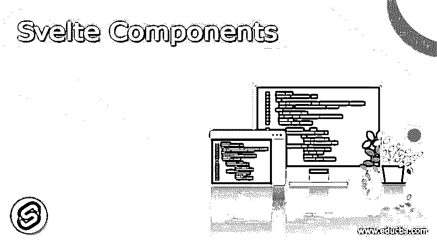
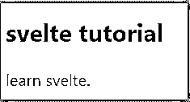

# 纤细的部件

> 原文：<https://www.educba.com/svelte-components/>

## 纤巧组件简介

*   苗条组件类似于创建 web 应用程序的“react”或“vue”框架组件。
*   苗条组件是代码的可重用部分，用于组合 HTML、CSS 和 JavaScript 代码。
*   苗条组件是使用 HTML、JavaScript 和 CSS 等基本 web 技术的自包含代码。
*   svelte 组件是一个 JavaScript 框架，用于创建快速应用程序和交互式界面的一部分。
*   svelte 组件类似于其他 web 应用程序组件，它处理“svelte”扩展文件。
*   svelte 组件将 web 应用程序分成小的部分，以使应用程序变得简单和有序。
*   svelte 组件使用 svelte 框架创建小型用户界面来消除 web 应用程序的复杂性。
*   svelte 框架是基于组件的架构，不同的组件用于快速、有序和用户友好的应用程序。

### 纤细的部件

*   苗条的框架是基于组件的。这个框架使用不同的组件来创建小的用户界面。
*   不同的组件创建应用程序的页眉、页脚、侧面导航栏和主要内容。
*   组件放在 svelte 文件的脚本标签、主标签和样式标签中。
*   根组件是苗条框架的主要组件。该组件创建带有“苗条”扩展名的文件。

#### 根组件

示例:Application.svelte

根组件分为接口的三个部分。

<small>网页开发、编程语言、软件测试&其他</small>

*   标题组件
*   页脚组件
*   内容组件

内容组件分为两部分。

1.  模态分量
2.  侧栏组件

#### 根组件

*   根组件将所有组件存储在一个文件中。
*   该组件使用不同的接口进行分类。
*   根组件使用 HTML、CSS 和 JavaScript 标记创建。
*   示例:Application.svelte

#### 标题组件

*   header 组件创建 web 应用程序的头部。
*   header 组件用于应用程序的顶部。
*   您可以在 header 组件中添加多个选项卡和按钮。
*   例如:标题。苗条的

#### 页脚组件

*   页脚组件创建 web 应用程序的页脚。
*   header 组件用于应用程序的底部。
*   您可以在页脚组件中添加多个选项卡和按钮。
*   您可以向应用程序添加内容和所需的链接。
*   例如:页脚。苗条的

#### 内容组件

*   内容组件创建 web 应用程序的核心部分。
*   内容组件用于应用程序的中间部分或中心部分。
*   您可以在内容组件中添加多个选项卡和按钮。
*   您可以向应用程序添加内容和所需的链接。
*   其他高级功能和工具用于连接用户。
*   该组件在应用程序的中间部分创建模型和侧栏组件。
*   示例:Contents.svelte

#### 模态分量

*   模态组件是内容组件的一部分。
*   该组件用于 web 应用程序的中心部分。
*   模式组件创建组件并存储其他工具或组件。
*   您可以在内容组件中添加多个选项卡和按钮。
*   您可以向应用程序添加内容和所需的链接。
*   其他高级功能和工具用于连接用户。
*   示例:Modals.svelte

#### 侧栏组件

*   根组件将侧栏组件存储在一个文件中。
*   侧栏组件是内容组件的一部分。
*   该组件用于 web 应用程序的左侧或右侧。
*   模式组件创建组件并存储其他工具或组件。
*   您可以在内容组件中添加多个选项卡和按钮。
*   您可以向应用程序添加内容和所需的链接。
*   其他高级功能和工具用于连接用户。
*   示例:Sidebar.svelte

**关于根(App)组件的基本信息**

*   根组件将所有组件存储在一个文件中。
*   该组件用于核心文件或用于另一个文件并将其导入。
*   根(App)组件文件主要包含三个 web 技术标签。
*   JavaScript 技术正在表示或使用
*   HTML 技术表示或使用标记标签，如

    、

    等。
*   CSS 技术正在表示或使用
*   svelte 文件使用标签，以便 JavaScript，HTML 和 CSS。

`

 write HTML code here… 

`

**举例:**

`

 learn {topic}. 

`

**输出:**

*   JavaScript 用主题名创建变量。
*   HTML 创建“div”组件。
*   该组件包含带有 JavaScript 变量的文本。
*   CSS 样式包含一个“div”组件的标记组件。

**嵌套组件组件**

*   根组件将所有组件存储在一个文件中。
*   苗条者创建另一个组件文件。
*   该文件通过脚本中的导入标记与根组件文件连接。
*   您可以创建多个组件文件，如页眉、页脚、内容文件。
*   上述文件必须与 root/App 组件文件连接。

``

**根组件**

*   根组件将所有组件存储在一个文件中。
*   该组件使用不同的接口进行分类。
*   根组件使用 HTML、CSS 和 JavaScript 标记创建。
*   例如:应用程序。苗条的

**模态分量**

*   该组件用于 web 应用程序的中心部分。
*   模式组件创建组件并存储其他工具或组件。
*   示例:Modals.svelte

**举例**:

`File name: Application.svelte

<Modals/>

 learn {topic}. 

File name: Modals.svelte
<h2> svelte tutorial </h2>`

**输出:**

*   javascript 使用嵌套组件的“导入”功能。
*   另一个组件与根组件连接。
*   JavaScript 用主题名创建变量。
*   HTML 创建“div”组件。
*   该组件包含带有 JavaScript 变量的文本。
*   CSS 样式包含一个“div”组件的标记组件。

### 结论

*   纤细的组件创建多个界面，并通过一个链接连接。
*   该组件用于创建一个用户友好的、有吸引力的、简单的 web 应用程序。
*   纤巧的组件有助于降低编码的复杂性和负荷。

### 推荐文章

这是一个苗条组件的指南。这里我们分别讨论定义，各种苗条的成分。您也可以看看以下文章，了解更多信息–

1.  [数据库管理系统组件](https://www.educba.com/dbms-components/)
2.  [Java 中的 AWT 组件](https://www.educba.com/awt-components-in-java/)
3.  [原生脚本组件](https://www.educba.com/nativescript-components/)
4.  [离子成分](https://www.educba.com/ionic-components/)

