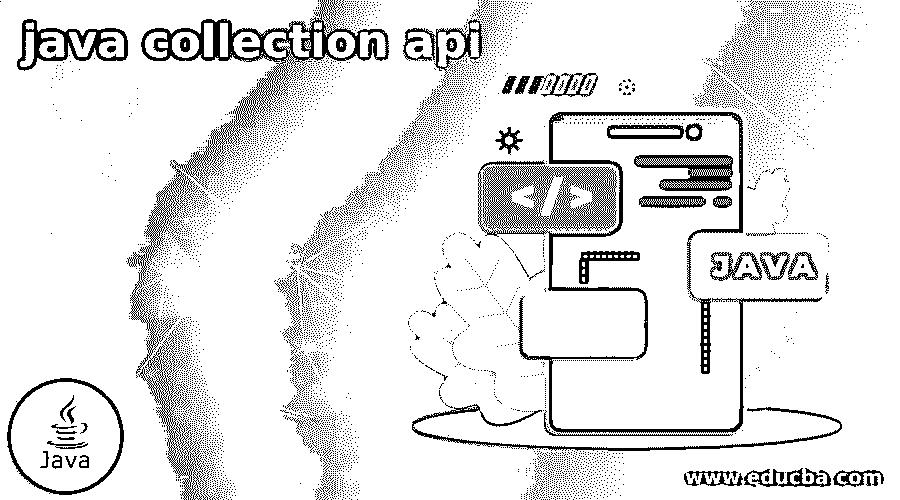

# java 集合 api

> 原文：<https://www.educba.com/java-collection-api/>




## java 集合 api 简介

Java 集合 api 主要定义为一组类和接口，这些类和接口可以支持用户在指定对象集合上的操作，并且这些类和接口比其他功能更灵活、更强大和更规则，这些功能具有像 vector、map、arrays、list 这样的类和接口，甚至其他 util 类和函数将用于替换数据及其表示的细节，这具有集合框架的优点，并且它提供了它支持的语言的不相关 API 之间的互操作性。

### Java 集合 API 和实现

集合 API 是应用程序编程接口，它为可以与列表集合一起操作的核心算法集提供了可重用的功能。它有一些 util 包，并且包含一些集合框架可能需要的默认类和接口。以下类型是一些 java 集合 API，

<small>网页开发、编程语言、软件测试&其他</small>

*   **集合接口:**这是集合层次结构的父根，它实现了创建应用程序的方法。
*   **迭代器接口:**使用这个接口，我们可以迭代“for，while，etc”等循环的数据。
*   **设置接口:**默认接口之一，不支持列表中的重复元素。
*   **列表接口:**列表接口用于存储和访问存储器中的采集数据。它有一些执行操作的默认方法。
*   **队列接口:**该接口遵循数据结构的 FIFO(先进先出)顺序，这意味着首先插入的元素将从第一个中移除，如果我们想要添加，它将在列表中添加新元素。
*   **出列接口:**这个出列称为双端队列，它是类似于队列的数据项的有序集合。比如它有两个末端，比如前后位置。
*   **Map 接口:**集合中最常用的接口，使用默认方法，通过使用键值对项来操作值。
*   列表迭代器接口:列表迭代器接口允许在任何方向上遍历元素，并且它还获得列表中的当前位置。
*   **有序集合界面:**按照元素升序维护的集合界面。这通常用于有序集合，如单词列表和其他成员区域。
*   **排序映射接口:**这也和 Sorted-Set 一样，但是这里排序的数据是键值对。

### java 集合 api 示例

以下是下面提到的例子。

#### 示例#1

**代码:**

```
import java.util.*;
public class Sample {
public static void main(String[] args) {
ArrayList<String> aLst=new ArrayList<String>();
aLst.add("Your first array list value is January");
aLst.add("Your second array list value is February");
aLst.add("Your third array list value is March");
aLst.add("Your four array list value is April");
aLst.add("Your fifth array list value is May");
Iterator itr=aLst.iterator();
while(itr.hasNext()){
System.out.println(itr.next());
}
collec collec = new HashSet();
collec.add("Your sixth array list value is June");
collec.add("Your seventh array list value is July");
collec.add("Your eigth array list value is August");
collec.add("Your ninth array list value is September");
collec.add("Your tenth array list value is October");
collec.add("Your eleventh array list value is November");
collec.add("Your twelth array list value is December");
for(obj obj : collec) {
System.out.println(obj);
}
LinkedList<String> linklst=new LinkedList<String>();
linklst.add("Welcome To The RK Group of Constructions");
linklst.add("Welcome To The KR Group of Constructions      ");
linklst.add("Welcome To The SV Group of Constructions,BSCPL Infrastructure");
linklst.add("Welcome To The VS Group of Constructions, Ozone Group Bangalore");
linklst.add("Welcome To The VSR Group of Constructions, BSCPL Infrastructure");
linklst.add("Welcome To The Royal Knit Group of Constructions, Shriram Properties");
linklst.add("Welcome To The Mithun Constructions, Pacifica Companies");
linklst.add("Welcome To The JK Group of Constructions, DRA Group");
Iterator<String> itr1=linklst.iterator();
while(itr1.hasNext()){
System.out.println(itr1.next());
}
Vector<String> v=new Vector<String>();
v.add("Welcome To The Vijay Shanthi Builders, Prestige Group,Olymia Group, Godrej Properties,Brigade Group");
v.add("Welcome To The Kay Arr and Co Rio Grande, Tata value Homes, Brigade Group, Akshaya Homes");
v.add("Welcome To The JB, Eternia, ITC Grand Chola, DEEJOS Architects, Bharath Engineering Construction company,Jehovah Nissi Archfirm");
Iterator<String> itr2=v.iterator();
while(itr2.hasNext()){
System.out.println(itr2.next());
}
}
}
```

**输出:**


在上述示例中，我们使用了一些集合列表类、接口和方法来实现基于各种场景的 java 应用程序。

#### 实施例 2

**代码:**

```
import java.util.*;
public class Sample{
public static void main(String[] args) {
Deque<String> dqueue = new ArrayDeque<String>();
dqueue.add("Laptop");
dqueue.add("Personal Computer");
dqueue.add("Tablet");
for (String str : dqueue) {
System.out.println(str);
}
}
}
```

**输出:**


在上面的例子中，我们使用了 Deque collection list 接口，并创建了 ArrayDeque <string>对象来添加、存储和检索数据。使用 for 循环迭代 dqueue 接口中的值，它将存储在 String 数据类型中。</string>

### Java Collection AP-特性和优势

java 集合 API 是应用程序编程接口，用于在各种操作中实现应用程序。java 中的集合是 util 类型的框架，它由数据库存储区域和数据结构区域的应用程序实现，以执行 CRUD 操作。主要地，集合 API 以多种方式提供了对具有指定顺序的对象的支持，并且 API 是可重用的功能，具有可以在指定集合列表上操作的核心算法集。集合 API 是为项目组提供存储和操作数据的架构的框架，并且基本上，它是将被包括在数组列表、链表、散列集、散列映射等中的数据结构的包。主要好处是减少了设计和实现任务所需的工作量。

### 结论

java 语言是一种高级语言，可用于实现独立的和基于 web 的应用程序。这取决于将在代码中使用的所需 API，他们将在不同的区域调用它，如集合 API，以执行关于存储和操作数据的用户操作。

### 推荐文章

这是一个 java 集合 API 的指南。这里我们讨论 java collection API 以及例子、特性和好处。您也可以看看以下文章，了解更多信息–

1.  [JavaFX FXML](https://www.educba.com/javafx-fxml/)
2.  [Java 电子邮件验证](https://www.educba.com/java-email-validation/)
3.  [Java 中迄今为止的时间戳](https://www.educba.com/timestamp-to-date-in-java/)
4.  [Java 中的 AWT 组件](https://www.educba.com/awt-components-in-java/)


