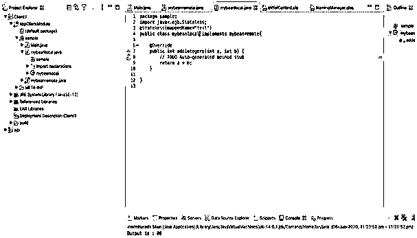

# 会话 Bean

> 原文：<https://www.educba.com/session-bean/>

## 会话 Bean 简介

会话 bean 是为封装业务逻辑而创建的不可恢复的 JAVA 包。任何需要通过网络实现并且应该单独维护的业务逻辑都可以放到会话 bean 中。会话 bean 由本地或远程 bean 根据业务需求通过网络调用。会话 bean 通过 get/set 方法调用复杂的服务器流程，从最终用户那里抽象出复杂的业务逻辑。这构成了 EJB(企业 JAVA beans)的一个重要组成部分。这主要用在我们拥有分布式资源的网络上。如上所述，它是不可恢复的，这意味着即使它是有状态会话 bean，它也不是持久的。会话 bean 中包含的数据不会保存在数据库中。

### 会话 Bean 的使用

它的使用是在分布式网络上看到的，其中资源不存在于单个位置。这个 bean 通过保存需要从源传递到目的地的信息，在不同位置的不同 bean 和客户机之间建立连接。这通过鼓励清晰和可维护的代码文件，从用户那里抽象出所有复杂的业务逻辑。会话 beans 不在数据库中存储数据，这表明它非常轻量级，不会给数据库带来负担。有不同类型的会话 beans 可以通过平滑的数据流来提高应用程序的性能。这个 bean 也用于实现 web 服务。在下一节中可以很好地理解其他功能及其类型。

<small>网页开发、编程语言、软件测试&其他</small>

### 会话 Bean 的类型

有三种类型，解释如下:

#### 1.无国籍的

即使会话 bean 与多个客户机和其他 EJB 交互，也不会保存状态。这里，当我们提到“状态”时，我们指的是“数据”。所以这个 bean 只包含业务逻辑，没有数据。它不维护与客户端的任何对话，因为它不保存状态。每当客户端调用无状态 bean 的方法时，会话 bean 的状态仅在该时间段内被激活。一旦方法功能停止，维护的客户端状态就会丢失。然后，客户端可以从会话池中挑选任何无状态会话，并使用它来实现其他流程。仅在方法调用期间维护状态。该功能使该会话 bean 成为无状态的。

#### 2.宏伟威严的

当在源和目标 bean 或客户端之间进行调用时，会保存状态。在这里，数据保存在每个会话中，以防我们需要保持进一步的沟通，这样我们就有足够的信息来开始。特定客户机和它的 bean 之间只有一个连接。这就是通常所说的“会话状态”。它不是共享的，并且从其专用客户端中排除。该状态将一直保持到客户机和 bean 之间的会话存在。如果客户端想要停止会话，则会话 bean 会被丢弃，交互也会停止。当我们需要维护各种 beans 之间的链接时，通常会使用这种方法。例如，浏览顾客的亚马逊账户。在 amazon 帐户中导航时，维护状态以跟踪客户订单、订单历史、启动退款、维护产品观察历史以及许多其他功能。所有这些功能都依赖于客户的帐户，因此状态成为维护它的一个重要参数。想象一下，如果客户 1 的付款被记录为客户 2 的付款，这是一个错误吗？

#### 3.一个

它是一个持久性 bean，每个应用程序只调用一次。这用于多个客户机同时共享单个会话 bean 的情况。Singleton 在客户端之间维护它们的状态(因为它同时在多个客户端之间交互)，但是在服务器崩溃或崩溃的情况下不维护会话。它的工作方式类似于无状态会话 bean，但不同之处在于，它只是一个处理多个客户端的会话 bean，而无状态会话 bean 在需要时会处理更多的客户端。这在 web 服务端点中使用。它用于应用程序的初始化，并在应用程序运行之前的整个过程中用作清理工具。

### 实现会话 Bean 的示例

下面是提到的例子:

#### 示例#1

**Note:** This example explains session stateless bean.

我们可以使用 Netbeanss 或 eclipse IDE 来理解会话 bean 是如何工作的。必须有许多文件，比如一个远程调用文件，另一个是本地文件，以及更多的文件来连接服务器。用户必须在 eclipse IDE 中将外部下载的 EJB jar 导入到您的项目中。我在 eclipse IDE 的 EJB 模块中创建了一个名为“client1”的项目。

向其中添加了三个文件，名为:

1.  java:它包含加法函数，带有函数定义、返回类型和值。
2.  java:它包含接口和函数名。这个函数在这里声明，它的实际定义在前面的文件中提供。
3.  java:这是一个主程序，一旦应用程序被调用，它就会被执行。它包含启动服务器和通过调用远程 bean“mybean remote”来调用存储在本地 bean“mybean local”中的函数的所有相关信息。“myremotebean”充当主 bean 和本地 bean 之间的链接。

**档案一:mybeanlocal.java**

**代码:**

`package sample;
import javax.ejb.Stateless;
@Stateless(mappedName="test")
// Changing this annotation to “stateful” will ensure that this same example works for stateful case.
public class mybeanlocal implements mybeanremote{
@Override
public int addintegers(int a, int b) {
// TODO Auto-generated method stub
return a + b;
}
}`

**档案二:mybeanremote.java**

**代码:**

`package sample;
import javax.ejb.Remote;
public interface mybeanremote {
int addintegers(int a,int b);
}`

**文件 3:Main.java**

**代码:**

`package sample;
import javax.naming.Context;
import javax.naming.InitialContext;
public class Main {
public static void main(String[] args) throws Exception{
//TODO Auto-generated method stub
Context context=new InitialContext();
mybeanremote remote=(mybeanremote)context.lookup("test");
System.*out*.println("Output is : "+remote.addintegers(40,40));
}
/* (non-Java-doc)
* @see java.lang.Object#Object()
*/
public Main() {
super();
}
}`

**输出:**

### 结论

这对于创建在不同会话上运行的企业应用程序，同时与网络中的分布式对象进行交互起着重要的作用。会话 beans 的无状态和有状态应用程序用于应用一个轻量级附加组件来维护应用程序的一致性，从而确保平滑和连续的导航以及良好的客户体验。它还用于隐藏和保护幕后复杂的业务逻辑。根据需求和技术角度，它可以通过 EJB 模块或 JAVA 来实现。

### 推荐文章

这是会话 Bean 的指南。在这里，我们讨论会话 Bean 的介绍、用途、三种类型以及代码和输出示例。您也可以浏览我们的其他相关文章，了解更多信息——

1.  [爪哇的 EJB](https://www.educba.com/ejb-in-java/)
2.  什么是 EJB？
3.  [JavaScript 追加](https://www.educba.com/javascript-append/)
4.  [Java ItemListener](https://www.educba.com/java-itemlistener/)

