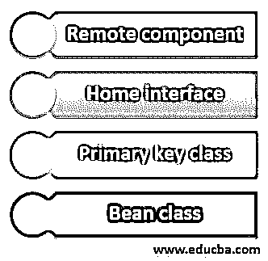
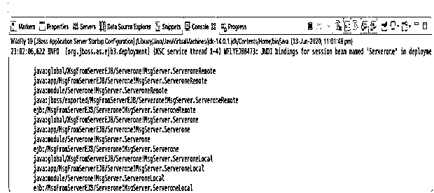

# 实体 Beans

> 原文：<https://www.educba.com/entity-beans/>

## 实体 Beans 简介

“实体 bean”是一个业务编码的持久对象，它是 JAVA 企业版的组成部分。这表示数据库中的持久数据对象。Bean 通常被称为 EJB(实体 JAVA Bean)。它们可以独立持久化，也可以将其委托给容器。它非常有弹性，因此在 JAVA EE 6 和更早版本的分布式网络中被广泛使用。容器用于托管 EJB 服务，在容器或服务器崩溃的情况下，beans 也能幸免于崩溃，因为它们链接到数据库中的主键。

这些作为 EJB 3.0 发布，然后它的超集 Java 持久性 API(应用程序编程接口)也发布了。这种技术现在已经过时了，因为从 JAVA EE 6 版本开始使用 JAVA 持久性 API。

<small>网页开发、编程语言、软件测试&其他</small>

### 实体 Bean 的组件

实体 beans 形成了存储在数据库系统中的主键的对象视图。一些例子，如果我们谈论 ERP 数据库是订单，客户主数据，材料等。由于存储在数据库中的对象与存储在 JAVA beans 中的数据的格式不同，所以使用了对象持久性属性来消除这种格式差异。

实体 bean 通过建立关系与其他实体 bean 链接，因为它们被分配了主键。Beans 可以分解成下面解释的一些组件:

**1。远程组件:**这个接口负责存储所有与 beans 相关的方法。通常，多个业务逻辑与 get 和 set 方法一起存储，以确保参数被正确地传递给函数，并通过应用正确的业务逻辑进行检索。该信息存储在一个松散耦合的 bean 中(这意味着该 bean 可以出现在网络上的任何地方，并与实体 bean 链接，以便在需要时可以调用它)。

**2。Home 接口:**home 接口用于创建实体 bean 方法。这些方法可以设置、获取或查找位于分布式网络中任何位置的实体 beans。

**3。主键类:**这是区分实体 bean 和会话 bean 的主要类之一。在线会话 bean 在会话终止后是非持久的，实体 bean 确实是持久的，因为它包含主键类。主键作为表的唯一标识符存储在数据库中。由于数据库中存在主键，实体 banns 可以被多个客户端访问，即使该 bean 的服务器或容器崩溃，也不会崩溃。一些像 hash()和 equal()这样的函数被用于该功能。

**4。Bean 类:** Bean 是一个链接到实体 Bean 的类，包含应用于实体 Bean 的业务逻辑。如果有这样的要求，这些也包含生命期持续时间。

### 实体 Bean 是如何工作的？

实体 beans 中主要涉及到两件事情，它们是服务器和客户端。我们需要单独构建调用服务器的客户端应用程序。服务器具有业务逻辑和其他同步技术，它们消费业务请求并向客户端应用程序发出响应。然后，该应用程序可以将所需格式的信息交付给请求者。我们需要一个检索逻辑的客户端应用程序。服务器应该有一个根据其功能定义的注释，可以是远程的，也可以是本地的。

下面的例子可以很好地理解这一点:

### 实现实体 Beans 的示例

在 Eclipse IDE 中创建的项目的帮助下，下面提供了实体 bean 的示例，使用的服务器是 wildly 19。我们需要确保在运行 JAVA EJB 的任何项目之前满足一些先决条件。一些先决条件是 Maven 安装与否，javaee-API-7.0 . jar API 应该在项目中导入。对于这种情况，应该在 MsgClientEJB 项目中导入一个 jboss-client.jar JAR 文件和一个以前项目(MsgServer)的文件，以便消除错误。下面的截图阐明了项目目录是如何放置的。

#### 示例#1

**项目:**

Main1: MsgClientEJB

文件 1:client PP . Java

**代码:**

`package MsgClientEJB;
import javax.naming.*;
import MsgServer.*;
import java.util.*;
public class ClientApp {
public static void main(String[] args) {
// TODO Auto-generated method stub
try{
System.out.println("Client App Started");
Properties props = new Properties();
props.put("java.naming.factory.url.pkgs","org.jboss.ejb.client.naming");
InitialContext context = new InitialContext(props);
String appName = "";
String moduleName = "MsgFromServerEJB";
String distinctName = "";
String beanName = Serverone.class.getSimpleName();
String interfaceName = ServeroneRemote.class.getName();
String name = "ejb:" + appName + "/" + moduleName + "/" + distinctName + "/" + beanName + "!" + interfaceName;
System.out.println(name);
ServeroneRemote bean = (ServeroneRemote)context.lookup(name);
String msg = bean.getMsg();
System.out.println(msg);
}catch(Exception e){
e.printStackTrace();
}
}
}`

文件 2: jobs-ebb-client.properties

**代码:**

`remote.connections=default
remote.connection.default.host=127.0.0.1
remote.connection.default.port=8080
remote.connection.default.connect.options.org.xnio.Options.SASL_POLICY_NOANONYMOUS=false`

档案 3:module-info.java

**代码:**

`/**
*
*/
/**
*@authormeghnadwivedi
*
*/
module MsgClientEJB {
requires java.naming;
requires MsgFromServerEJB;
}`

**输出:**

#### 实施例 2

主 2:msg former

文件 1:Serverone.java

**代码:**

`package MsgServer;
import javax.ejb.LocalBean;
import javax.ejb.Stateless;
/**
* Session Bean implementation class ExampleServer. This has stateless attribute as mentioned below. We can have stateful bean as
Well we implemented session bean.
*/
@Stateless
@LocalBean
public class Serverone implements ServeroneRemote, ServeroneLocal {
/**
* Default constructor.
*/
public Serverone() {
//TODO Auto-generated constructor stub
}
@Override
public String getMsg() {
return "This is a message from Server";
}
}`

档案 2:ServeroneLocal.java

**代码:**

`package MsgServer;
import javax.ejb.Local;
// This is local component of the server in JAVA language with an annotation local declared below.
@Local
public interface ServeroneLocal {
public String getMsg();
}`

档案 3:Serveroneremote.java

**代码:**

`package MsgServer;
import javax.ejb.Remote;
// This is remote component of the server in JAVA language with an annotation remote declared below.
@Remote
public interface ServeroneRemote {
public String getMsg();
}`

**输出:**

### 结论

实体 beans 始于 JAVA 应用程序的简单远程访问，其中业务逻辑和数据库实体检索逻辑可以封装在不同的模块中，并呈现在远程位置。这提供了一个自驱动的容器或服务器，它负责这个分布式环境中的同步，以确保在不同时间范围内不同位置的组件出现的问题最少。尽管在 JAVA 的升级 API 不仅使用远程访问工具，而且还使用附加功能之后，这种功能现在得到了增强。JAVA 增加的持久性 API 覆盖了更多的交互特性，这使得应用程序在网络上更加可靠和具有交互性。

### 推荐文章

这是实体 Beans 的指南。在这里，我们通过定义和它们的组件以及编程示例和它们的输出来讨论实体 Beans 的概念。您也可以浏览我们推荐的其他文章，了解更多信息——

1.  [JavaScript 数学函数(示例)](https://www.educba.com/javascript-math-functions/)
2.  [Java 布局介绍](https://www.educba.com/layout-in-java/)
3.  [9 大类 Java 编译器](https://www.educba.com/java-compilers/)
4.  [Java 中的合并排序指南](https://www.educba.com/merge-sort-in-java/)

