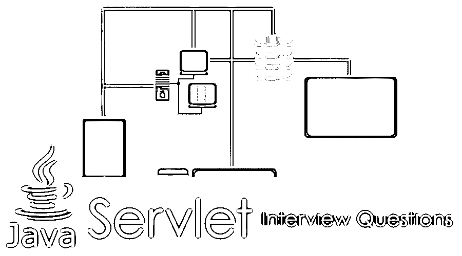

# Servlet 面试问题

> 原文：<https://www.educba.com/servlet-interview-questions/>

## Servlet 面试问答介绍

[Servlet 是](https://www.educba.com/what-is-servlet/)学习高级 java 或 [J2EE](https://www.educba.com/what-is-j2ee/) 的关键技术之一。Java Servlet 是任何使用 J2EE 平台开发[的 web 应用程序的基础。目前，所有流行的 Java web 应用框架，如 Spring、Struts 等。，其实都是基于 Servlet 的基本框架设计的。](https://www.educba.com/j2ee-interview-questions/)

现在，如果你要找一份与 Servlet 相关的工作，那么你需要准备 2022 年 Servlet 面试问题。的确，每个面试都因不同的职位而不同。在这里，我们准备了重要的 Servlet 面试问答，帮助你在面试中获得成功。

<small>网页开发、编程语言、软件测试&其他</small>

在这篇 2022 Servlet 面试问题的文章中，我们将介绍 10 个最重要和最常见的 Servlet 面试问题。这些问题分为以下两部分:

### 第 1 部分–Servlet 面试问题(基础)

第一部分涵盖了基本的 Servlet 面试问题和答案

#### Q1。在 IT 行业，我们通常会得到两个非常常见的服务器名称；人们正在调用 web 服务器和应用服务器。请给出 web 服务器和应用服务器在细节上的一些区别？

**答:**
web 服务器主要处理最终用户的请求和响应。它通常负责处理来自客户端浏览器的 HTTP 请求，并用[正确的 HTML 响应](https://www.educba.com/uses-of-html/)进行响应。web 服务器的主要用途之一是正确理解 HTML 语言，并运行在特定的 HTTP 协议上。

应用服务器，以另一种方式具有一些关键的附加特性，如企业 Java Bean (EJB)支持、事务管理能力、JMS 消息传递能力等。因此，应用服务器可以假定 web 服务器具有一些额外的特性。

#### Q2。每个 web 应用程序通常都遵循通用的 HTTP 方法。解释一下哪个 HTTP 方法可以被称为非幂等的？

**答案:**
这是面试中问的基本 Servlet 面试问题。Servlet HTTP 方法遵循一些已定义的方法结构。如果一个 HTTP 方法总是返回相同的值或相同的结果，则该方法可以被称为重要方法。假设 Servlet HTTP 的一些关键方法如 get、delete、put、head、options 都被认为是幂等方法。有趣的是，我们应该需要以这样一种方式实现那个方法，使得那些方法总是返回相同的结果。否则，servlet 将无法工作。但是 servlet POST 方法可以被认为是非幂等的方法，因为我们应该根据这个 POST 方法中每个有效请求的需求来计划一些关键变化的正确实现。

#### Q3。servlet 的两个关键方法通常在一个 [servlet 生命周期](https://www.educba.com/servlet-life-cycle/)中定义。关键方法是 Get 和 Post 请解释一下它们之间的适当区别？

**答:**
Servlet 的 GET 和 POST 方法有一些不同；不同之处在于:

*   GET 实际上是一个幂等的或安全的方法，而 POST 不是一个安全的方法，它被称为非幂等的。
*   对于 GET 方法，我们必须限制在请求中发送数据，因为 GET 方法请求应该通过请求 URL。而 POST 方法请求在通过请求体时可以包含巨大的值。
*   GET 请求肯定是不安全的，因为整个请求可以显示在 URL 中，而 POST 请求显然更安全，因为它在请求体中。
*   HTTP 的默认方法是 GET，但是我们需要外部定义 POST 来通过它处理请求。

#### Q4。解释 Servlet 中可用的 MIME 类型的细节？

**回答:**
MIME 类型是“Content-type”属性中提到的任何 Servlet 页面的响应头之一。它主要用于向客户端提及请求数据类型，以便客户端可以清楚地了解发送的确切数据是什么，如何对其进行管理并呈现给最终用户。servlet 中一些流行的 MIME 类型是文本/HTML、应用程序/XML 等。

让我们转到下一个 Servlet 面试问题

#### Q5。在 IT 行业中，一个非常常见和流行的应用是 Web 应用。请解释 web 应用程序的确切含义，如何维护可能的目录结构以正确执行或规划一个 web 应用程序？

**答:**
Web 应用是 IT 行业流行的模块之一，可以通过特定的浏览器生成静态和动态的屏幕呈现给最终用户。Apache web 服务器是当前行业中常用的关键服务器之一；它为环境提供了一个用 PHP 开发的运行的 web 应用程序。它还能够运行 java web 应用程序，这主要依赖于 servlet 和 JSP 来在 Apache webserver 环境中运行 web 应用程序。

Java Web 应用程序可以打包成。WAR，EAR 文件可以部署在任何支持的服务器上。任何 web 应用程序的普通文件夹结构都在下面的树结构中定义:

Web 应用程序根目录à WEB-INF，WEB 内容，META-INF à类，LIB，web.xml，MANIFEST。MF、JAVA 源代码、JSP 或 JS

### 第 2 部分–Servlet 面试问题(高级)

现在让我们看看高级 Servlet 面试问题。

#### Q6。详细解释一下你对 Java J2EE 中 Servlet 的清晰理解？

**答:**
[JAVA Servlet 是 Java/J2EE 环境的关键技术](https://www.educba.com/what-is-servlet/)之一，它提供了一种服务器端技术，为利用 web 服务器环境在客户端浏览器屏幕上正确显示动态和静态数据提供了极好的机会。它通常有两个关键包，javax.servlet 和 javax.servlet.http，这些包中定义的所有接口和类都可以用来设计 servlet 页面。

#### Q7。早期的 servlet 人们通常使用 CGI 来准备一个 web 应用程序，但是在 Java/J2EE 中发明了 servlet 之后，业界将直接使用 servlet。请解释一下使用 servlet 相比 CGI 的所有优势？

**答:**
CGI 技术是创建 web 应用程序并将其呈现给客户端浏览器的最古老的方法之一。Servlet 技术主要介绍了为克服 CHI 技术的一些关键问题。差异如下:

*   在客户端浏览器中处理请求和响应时，Servlet 总是比 CGI 提供更好的性能。因为 servlet 总是支持多线程，所以每个请求都会创建一个新的线程，这显然比每次创建一个新对象有助于获得更好的性能。
*   Servlet 总是独立于平台和系统的。所以用 servlet 开发的应用程序可以运行在任何支持服务器上，比如 tomcat、web sphere、Weblogic 等等。，以及任何系统平台，如 Windows、Linux 等。
*   Servlet 容器一直被 servlet 的生命周期所照顾，所以我们不需要担心一些关键的特性，如内存泄漏、安全性或垃圾收集之类的常见活动。

让我们转到下一个 Servlet 面试问题

#### Q8。Servlet 有一个常见的容器，叫做 Servlet 容器。请详细解释一下在基于 servlet 的 web 应用程序中，servlet 容器完成的一些常见任务？

**答:**
Servlet 容器是任何基于 Servlet 的应用程序的关键容器之一。它有时被称为 web 容器。servlet 容器已经执行了一些关键任务；这些是:

*   支持客户端和服务器之间的通信。
*   管理 servlet 生命周期和使用资源。
*   支持多线程
*   支持 JSP
*   一些未定义或杂项任务。

#### Q9。servlet 的一个关键对象是 Servlet 配置对象。请详细解释一下在基于 servlet 的 web 应用中使用的 ServletConfig 对象？

**答案:**
这是面试中被问得最多的 Servlet 面试问题。ServletConfig 通常保存一个特定 servlet 的配置信息。每个 servlet 应该有一个 servlet 配置对象，它总是在容器启动 servlet 之前初始化。

#### Q10。提供一些 servlet 配置和 servlet 上下文之间的适当区别？

**答:**
Servlet-Config 和 SevletContext 都在运行一个 web 应用中扮演着非常重要的角色。servlet 配置和 servlet 上下文之间的区别如下:

*   ServletConfig 对于一个单独的 servlet 总是唯一的，而 ServletContext 对于整个应用程序也是唯一的。
*   两者都包含 init 参数，servletconfig 用于一个单独的 servlet，servletcontext 用于应用程序中定义的整个 servlet。
*   ServletContext 接受添加一个属性，但 servletconfig 不接受。

### 推荐文章

这是 Servlet 面试问题和答案列表的指南。在这里，我们研究了最有用的 10 组面试问题，这样求职者就可以轻松应对面试。您也可以阅读以下文章，了解更多信息——

1.  [线程面试问题](https://www.educba.com/threading-interview-questions/)
2.  [OpenStack 面试问题](https://www.educba.com/openstack-interview-question/)
3.  [测试面试问题](https://www.educba.com/testing-interview-questions/)
4.  Servlet 中的[会话](https://www.educba.com/session-in-servlet/)

