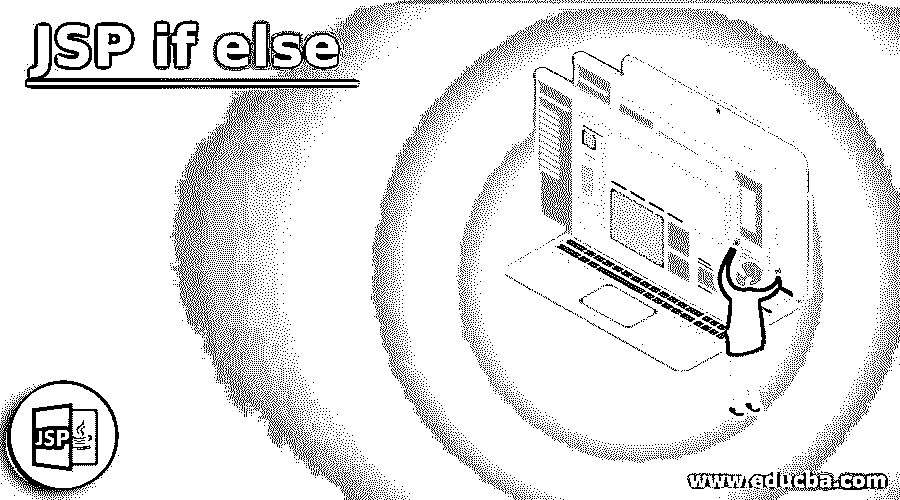
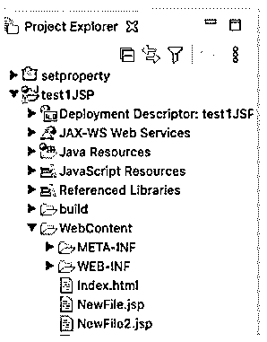

# JSP if else

> 原文：<https://www.educba.com/jsp-if-else/>




## **JSP 简介 if else**

JSP if else 循环是一个条件语句，它允许在特定条件成立时执行代码片段。这个条件语句的工作方式类似于 C/C++/Java 等传统编码语言中的 if else 条件语句。这是一种强大的影响，在编程语言中很常用。在“else-if”功能的帮助下，程序员可以使用该循环提供多个条件。

### JSP 的语法 if else

JSP if-else 循环的语法如下所示:

<small>网页开发、编程语言、软件测试&其他</small>

```
<%
if(condition)
{
Code or set of executable statements that should be processed if conditions stand true.
}
Else if() //optional
{
Code or set of executable statements that should be processed if second condition is true while the first one stands false.
}
Else //optional
{
This condition should be executed if all conditions stand false.
}
%>
```

JSP 页面上应该有 if-else 语句。JSP 页面应该存在于一个名为“WEB-INF”特定目录中。

下面是我们创建的 JSP 页面的截图，例如“newFile.jsp”和“newFile2.jsp ”,它们放在 WEB-INF 目录中。




### if else 语句是如何工作的？

如果 else 语句读取 True 或 False。当根据给定参数评估条件时，得出“真或假”或“1 或 0”的结论。

例如，要求是计数器到达数字 10 时应该停止。

因此，可以在 if()函数中编写一个条件，说明:

**代码:**

```
if(count<11)
{
count ++; //Assuming that count was initialized with 1.
}
```

这里，对于前 10 个事务，条件将为真，但是一旦计数变量达到 11，条件将变为假。

### JSP 的例子 if else

下面是一些例子。

#### 示例#1

NewFile.jsp

**代码:**

```
<%! int day = 3; %>
<html>
<head>
<title>JSP IF-ELSE</title>
</head>
<body>
<p>This is an JSP IF-ELSE Example in which today's day is compared with Sunday and according the output
screen will show the result. Here, prerequisite is that today's date should be in sync with system date.</p>
<% if (day == 1) { %>
<p> <u>yaaay</u>! Today is Sunday.. </p>
<% } else { %>
<p> Gosh! Today is a Work-day.. </p>
<% } %>
</body>
</html>
```

**输出:**


**说明:**

*   在这个例子中，变量 day 用于确定今天是否是星期天。将星期日视为一周的第一天，创建控制循环。这里传递的条件是，如果一天等于 1，否则。
*   以前，我们将 day 设计为“3”，因此当“If”语句将 day 值(即 3)与希望它为“1”的条件进行比较时，它会返回“FALSE”或“0”。请记住，计算机用“0”来表示 false。因此，这里获得了 false，所以程序的控制将跳过 if 部分下的整个代码片段，并移到“Else”部分。“Else”部分包含一个打印语句，该语句也在输出屏幕中打印。

#### 实施例 2

**代码:**

```
<html>
<head>
<title>
JSP IF ELSE- 2
</title>
</head>
<body>
<p>This program takes two input stings and compares those strings. The result is displayed on the screen on the basis of
the strings are not matching, strings are matching but cases are not or matching.</p> <br><br>
<%
String sVariable1 = "JSP";
String sVariable2 = "jsp";
//The below function compares strings stored in two different string variables.
if(sVariable1.equals(sVariable2)) {
%>
The values of string 1 and string 2 are equal.
<br/>
<%
} else if(sVariable1.equalsIgnoreCase(sVariable2)) {
%>
The values of string 1 and string 2 are same but with the difference in case letters.
<br/>
<%
} else {
%>
The values of string 1 and string 2 are not at all equal.<br/>
<%
}
%>
</body>
</html>
```

**输出:**


**说明:**

*   在本例中，名为“sVariable1”和“sVariable2”的两个字符串变量分别用值“jsp”和“JSP”声明。变量一被赋予大写字母，而字符串二被赋予小写字母。这两个字符串在不同的字符串比较函数的帮助下进行比较。这些字符串比较函数是在 JSP 库中预定义的，所以我们不需要担心这些函数的定义。这些函数在“If”和“Else if”部分中使用。
*   第一个“If”部分使用 equals()函数比较了字符串 1 和字符串 2。此函数比较字符串，并考虑大小写不匹配的情况。因此，它返回 false，因为事例与我们在该函数中提供的字符串不匹配。
*   第二个是包含 equalsIgnoreCase()函数的“Else If”部分。此函数比较字符串，比较时不考虑大小写。所以，这里函数返回真。eagles 将代码放在“Else-If”部分进行处理。打印“Else-if”部分下的打印语句。
*   最后一个名为“Else”的部分被跳过，因为只要我们满足一个条件，控制就会退出循环。

**Note:** If there is more than one condition being satisfied under the if loop then the first one which returns true will be executed and program control exits the loop. It skips other conditions. Only one code snippet under the first encountered “true” condition will be executed in the if-else control statement.

### 结论

JSP if else 是一个控制语句，让代码根据定义的条件语句派生结果执行。这不仅在 JSP 编程中被广泛使用，在其他编程语言中也是如此，比如 Java、C、C++、python 等等。在任何现有的代码中都很容易看到这些语句。它的使用将通过跳过所有不需要的代码段来减少工作量。

### 推荐文章

这是一个 JSP 的指南。这里我们讨论一下入门，if else 语句是如何工作的？并分别举例说明。您也可以看看以下文章，了解更多信息–

1.  [JSP 错误页面](https://www.educba.com/jsp-error-page/)
2.  [JSP 格式化程序](https://www.educba.com/jsp-formatter/)
3.  [JSP 登录页面](https://www.educba.com/jsp-login-page/)
4.  [JSP 复选框](https://www.educba.com/jsp-checkbox/)


