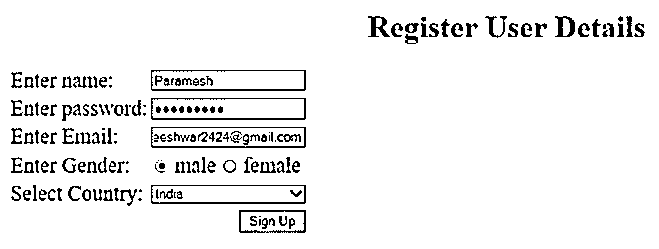

# JSP Scriptlet

> 原文：<https://www.educba.com/jsp-scriptlet/>

## JSP Scriptlet 简介

下面的文章提供了 JSP Scriptlet 的概要。JSP (Java Server Pages) Scriptlet 是一个标记，用于编写 Java 源代码来实现业务逻辑。这个 Scriptlet 标记是在 _jspService()方法中声明的。_jspService()方法总是为每个新请求创建新对象。因此，由于 Scriptlet 标记在 _jspService()方法中，它也将为每个新请求创建新对象。

JSP 中有 3 种类型的标记。

<small>网页开发、编程语言、软件测试&其他</small>

*   声明标签
*   表情标签
*   Scriptlet 标签

每个标记都有自己的规范，用于在 JSP 应用程序中插入代码。声明标记用于声明变量和方法。Expression 标记用于显示 JSP 应用程序的输出。Scriptlet 标签用于包含 Java 源代码。Scriptlet 标记主要用于表单操作页面实现。

### JSP 中如何使用 Scriptlet 标签？

在 (Scriptlet)标记中使用的 JSP Scriptlet。这将允许包括整个 Java 源代码。

**语法:**

`<% Java Source code %>
Like
<%
out.println(“content”);
<%>`

**说明:**

*   Scriptlet 标签以标签开始。
*   对于打印输出的普通 Java，我们编写 System.out.println()，但是对于 JSP，我们只编写 out.println()和 JSP web 容器自动提供的系统类。
*   JSP 中有 9 个隐式对象，其中有一个。

### 声明标记和 Scriptlet 标记之间的区别

下面给出了声明标记和 scriptlet 标记之间的区别:

| **声明标签** | **Scriptlet 标签** |
| 在标签中声明。 | 在标签中声明。 |
| 它可以声明变量和方法。 | 它只能声明变量，不能声明方法。 |
| 这个标记放在 _jspService()方法之外。 | 这个标记放在 _jspService()方法中。 |
| 它只为多个请求创建一个对象。 | 它为多个请求创建多个对象。 |

**Note:** We can write JSP code inside html page also, we can save JSP page with .html extension if html tags contains. If plain JSP code then we need to save with .jsp extension.

### JSP Scriptlet 的示例

下面是提到的例子:

#### 示例#1

显示出来。

**JSP 代码:Out.jsp**

`<%@ page language="java" contentType="text/html; charset=ISO-8859-1"
pageEncoding="ISO-8859-1"%>
<!DOCTYPE html PUBLIC "-//W3C//DTD HTML 4.01 Transitional//EN" "http://www.w3.org/TR/html4/loose.dtd">
<html>
<head>
<!-- CSS Styles -->

<meta http-equiv="Content-Type" content="text/html; charset=ISO-8859-1">
<title>JSP Scriptlet Tag</title>
</head>
<body>
<h1>Introduction JSP Scriptlet Tag</h1>

<!--scriptlet tag -->
<%
//out is implicit object of JSP
out.print(
"JSP (Java Server Pages) Scriptlet is a tag used write java source code to implement business logic. This Scriptlet tag declared inside the _jspService() method. _jspService() method always create new object for every new request. So as Scriptlet tag is inside the _jspService() method it will also create new object for every new request. There 3 types of tag in JSP 1\. Declaration tag 2\. Expression tag 3\. Scriptlet tag Each tag has their own specification to insert the code in the JSP application. Declaration tag is used to used to declare variables and methods. Expression tag is used to display output of the JSP application. Scriptlet tag is used for include Java source code.");
%>

</body>
</html>`

**输出:**

#### 实施例 2

显示公司名称的 HTML 到 JSP 操作。

**HTML 代码:company.html**

`<html>
<head>
<!-- CSS Styles -->

<meta http-equiv="Content-Type" content="text/html; charset=ISO-8859-1">
<title>JSP Scriptlet Tag</title>
</head>
<body>
<form action="company.jsp">
<h1>Company Name</h1>
<!-- when you click on Submit button then page will gotocompany.jsp file and fetch the company details and display from there -->
<label>Which Company Are you working?:</label><input type="text"
name="company" placeholder="enter your company name"><input
type="submit" value="Submit"> 
</form>
</body>
</html>`

**JSP 代码:company.jsp**

`<%@ page language="java" contentType="text/html; charset=ISO-8859-1"
pageEncoding="ISO-8859-1"%>
<!DOCTYPE html PUBLIC "-//W3C//DTD HTML 4.01 Transitional//EN" "http://www.w3.org/TR/html4/loose.dtd">
<html>
<head>
<!-- CSS Styles -->

<meta http-equiv="Content-Type" content="text/html; charset=ISO-8859-1">
<title>JSP Scriptlet Tag</title>
</head>
<body>
<h1>Well Come to My World</h1>

<!--scriptlet tag -->
<%
//out is implicit object of JSP
String name = request.getParameter("company");
out.print("I am working in " + name);
%>

</body>
</html>`

**输出:**

**提交前:**

**提交后:**

**说明:**

*   在 HTML 页面中，我们输入公司名称，一旦我们提交详细信息，然后行动到 company.jsp 文件，该公司将显示在那里。

#### 实施例 3

用户注册。

**HTML 代码:UserDetails.html**

`<html>
<title>Scriptlet Tag</title>
<head>

</head>
<body>
<h1>Register User Details</h1>
<form action="User.jsp">
<table>
<tr>
<td><label for="register_name">Enter name:</label></td>
<td><input type="text" name="name" value="" id="register_name"
style="width: 160px" /></td>
</tr>
<tr>
<td><label for="register_password"">Enter password:</label></td>
<td><input type="password" name="password"
id="register_password" style="width: 160px" /></td>
</tr>
<tr>
<td><label for="register_email">Enter Email:</label></td>
<td><input type="email" name="email" value=""
id="register_email" style="width: 160px" /></td>
</tr>
<tr>
<td><label for="register_gender">Enter Gender:</label></td>
<td><input type="radio" name="gender" value="male" /><label
for="register_gendermale">male</label><input type="radio"
name="gender" id="register_genderfemale" value="female" /><label
for="register_genderfemale">female</label></td>
</tr>
<tr>
<td><label for="register_country">Select Country:</label></td>
<td><select name="country" style="width: 160px">
<option value="india">India</option>
<option value="pakistan">US</option>
<option value="africa">Brazil</option>
<option value="china">England</option>
<option value="other">Italy</option>
<option value="other">Others</option>
</select></td>
</tr>
<tr>
<td colspan="2">

<input type="submit" id="register_0" value="Sign Up" />

</td>
</tr>
</table>
</form>
</body>
</html>`

**JSP 代码:User.jsp**

`<%@ page language="java" contentType="text/html; charset=ISO-8859-1"
pageEncoding="ISO-8859-1"%>
<!DOCTYPE html PUBLIC "-//W3C//DTD HTML 4.01 Transitional//EN" "http://www.w3.org/TR/html4/loose.dtd">
<html>
<head>
<!-- CSS Styles -->

<meta http-equiv="Content-Type" content="text/html; charset=ISO-8859-1">
<title>JSP Scriptlet Tag</title>
</head>
<body>
<h1>Well Come to My Application Form</h1>

<!--scriptlet tag -->
<%
//getting all HTML parameters
String name = request.getParameter("name");
String email = request.getParameter("email");
String gender = request.getParameter("gender");
String country = request.getParameter("country");
//out is implicit object of JSP
out.print("My Name is " + name+" ");
out.print("My Email is " + email+" ");
out.print("My Gender is " + gender+" ");
out.print("My Country is " + country);
%>

</body>
</html>`

**输出:**

**报名前:**

**报名后:**

### 结论

JSP 中的 Scriptlet 标签用于包含 Java 源代码。它总是为每个请求创建新的对象。这个 scriptlet 标记的目的是开发表单动作应用程序。

### 推荐文章

这是一个 JSP Scriptlet 的指南。这里我们讨论介绍，如何在 JSP 中使用 scriptlet 标签，以及例子。您也可以看看以下文章，了解更多信息–

1.  [JSP 脚本元素](https://www.educba.com/jsp-scripting-elements/)
2.  [JSP 生命周期](https://www.educba.com/jsp-life-cycle/)
3.  [什么是 JSP？](https://www.educba.com/what-is-jsp/)
4.  [JSP 重定向](https://www.educba.com/jsp-redirect/)

