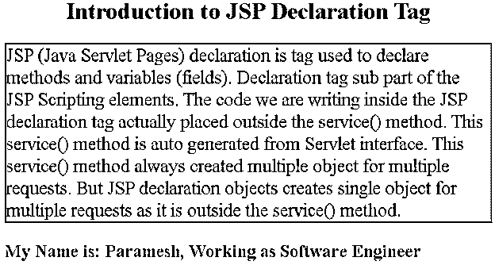
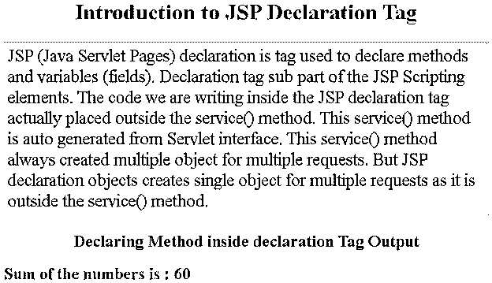
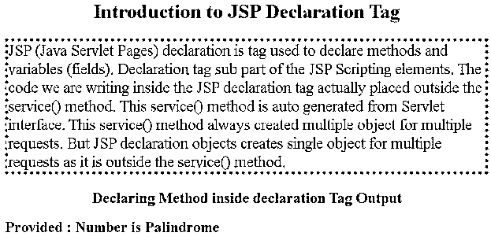

# JSP 声明

> 原文：<https://www.educba.com/jsp-declaration/>

## JSP 声明标记简介

JSP (Java Servlet Pages)声明是用于声明方法和变量(字段)的标签。“JSP 脚本元素”的声明标记子部分。我们在 this 标记中编写的代码实际上是放在 service()方法之外的。这个 service()方法是从 Servlet 接口自动生成的。这个 service()方法总是为多个请求创建多个对象。但是 JSP 声明对象为多个请求创建一个对象，因为它在 service()方法之外。

### JSP 声明标签在 JSP 中是如何工作的？

它基于(声明标签)标签中提供的值工作。基本上在这个标签里面，我们声明变量和方法。

<small>网页开发、编程语言、软件测试&其他</small>

**语法:**

`<%! variables or methods declaration%>`

### 声明标记和 Scriptlet 标记之间的区别

为了更好地理解，您必须理解声明和 scriptlet 标记之间的区别。

| **声明标签** | **Scriptlet 标签** |
| 在标签中声明。 | 在标签中声明。 |
| 它可以声明变量和方法。 | 它只能声明变量，不能声明方法。 |
| 这个标签放在 _jspService()方法之外。 | 这个标签放在 _jspService()方法中。 |
| 它只为多个请求创建一个对象。 | 它为多个请求创建多个对象。 |

***Note:** We can write JSP code inside html page also, we can save the JSP page with .html extension if html tags contain. If plain JSP code then needs to save with .jsp extension.*

### 实现 JSP 声明的示例

以下是一些例子:

#### 示例#1

声明标记中的变量。

**代码:**

`<html>
<title>
JSP Declaration Tag
</title>
<body>
<!--declaring JSP declaration tag-->
<%!
//declaring and initializing int variable
int number=214;
//declaring and initializing float variable
float salary=40000.50;
//declaring and initializing long variable
longbigNo=787878;
//declaring and initializing char variable
char alp='N';
//declaring and initializing String variable
String name="Amardeep";
%>
<!--declaring JSP expression tag-->
<!--Used to display output in JSP-->
<%= "My Class Number in Graduation: "+number+" " %>
<%= "My Salary in VerinonTechologies: "+salary+" "  %>
<%= "My Big Number: "+bigNo+" "  %>
<%= "My Favourite Alphabet: "+alp+" "  %>
<%= "My Friend Name is : "+name +" " %>
</body>
</html>`

**输出:**

#### 实施例 2

带有 CSS 样式的声明介绍内容的变量。

**代码:**

`<html>
<title>
JSP Declaration Tag
</title>
<body>
<!--declaring JSP declaration tag-->
<%!
//declaring and initializing String variable
String name="Paramesh";
%>
<!--declaring JSP expression tag-->
<!--Used to display output in JSP-->
<%="<h1 style='color:blue; text-align:center;'>Introduction to JSP Declaration Tag</h1>"%>
<%= "
JSP (Java Servlet Pages) declaration is tag used to declare methods and variables (fields). Declaration tag sub part of the JSP Scripting elements. The code we are writing inside the JSP declaration tag actually placed outside the service() method. This service() method is auto generated from Servlet interface. This service() method always created multiple object for multiple requests. But JSP declaration objects creates single object for multiple requests as it is outside the service() method.
" %>
<%= "<h2 style='color:maroon;'>My Name is: "+name+", Working as Software Engineer</h2> "  %>
</body>
</html>`

**输出:**

#### 实施例 3

声明标记和内容中的方法。

**代码:**

`<html>
<title>
JSP Declaration Tag
</title>
<body>
<!--declaring JSP declaration tag-->
<%!
//declaring method
int getSum(int x, int y, int z)
{
return x+y+z;
}
%>
<!--declaring JSP expression tag-->
<!--Used to display output in JSP-->
<%="<h1 style='color:brown; text-align:center;'>Introduction to JSP Declaration Tag</h1>"%>
<%= "
JSP (Java Servlet Pages) declaration is tag used to declare methods and variables (fields). Declaration tag sub part of the JSP Scripting elements. The code we are writing inside the JSP declaration tag actually placed outside the service() method. This service() method is auto generated from Servlet interface. This service() method always created multiple object for multiple requests. But JSP declaration objects creates single object for multiple requests as it is outside the service() method.
" %>
<%= "<h2 style='color:blue; text-align:center;'>Declaring Method inside declaration Tag Output</h2>"%>
<%= "<h2 style='color:maroon;'>Sum of the numbers is : "+getSum(10,20,30) +"</h2>" %>
</body>
</html>`

**输出:**

#### 实施例 4

声明标记和内容**中的方法和变量。**

**代码:**

`<html>
<title>
JSP Declaration Tag
</title>
<body>
<!--declaring JSP declaration tag-->
<%!
//declaring variables
int r,temp,sum=0;
String out=" ";
//declaring method
String getPalindromeOrNot(int n)
{
temp=n;
while(n>0)
{
r=n%10;  //getting remainder
sum=(sum*10)+r;
n=n/10;
}
if(temp==sum)
out="Number is Palindrome";
else
out="Number is not Palindrome";
return out;
}
%>
<!--declaring JSP expression tag-->
<!--Used to display output in JSP-->
<%="<h1 style='color:orange; text-align:center;'>Introduction to JSP Declaration Tag</h1>"%>
<%= "
JSP (Java Servlet Pages) declaration is tag used to declare methods and variables (fields). Declaration tag sub part of the JSP Scripting elements. The code we are writing inside the JSP declaration tag actually placed outside the service() method. This service() method is auto generated from Servlet interface. This service() method always created multiple object for multiple requests. But JSP declaration objects creates single object for multiple requests as it is outside the service() method.
" %>
<%= "<h2 style='color:green; text-align:center;'>Declaring Method inside declaration Tag Output</h2>"%>
<%= "<h2 style='color:fuchsia;'>Provided : "+getPalindromeOrNot(12321) +"</h2>" %>
</body>
</html>`

**输出:**

### 推荐文章

这是一个 JSP 声明指南。在这里，我们讨论 JSP 声明标记的介绍，以及它是如何工作的，还有它的例子和代码实现。您也可以浏览我们推荐的其他文章，了解更多信息——

1.  [JSP 脚本元素](https://www.educba.com/jsp-scripting-elements/)
2.  [JSP 标记库](https://www.educba.com/jsp-taglib/)
3.  [JSP 脚本程序](https://www.educba.com/jsp-scriptlet/)
4.  [JSP 重定向](https://www.educba.com/jsp-redirect/)

