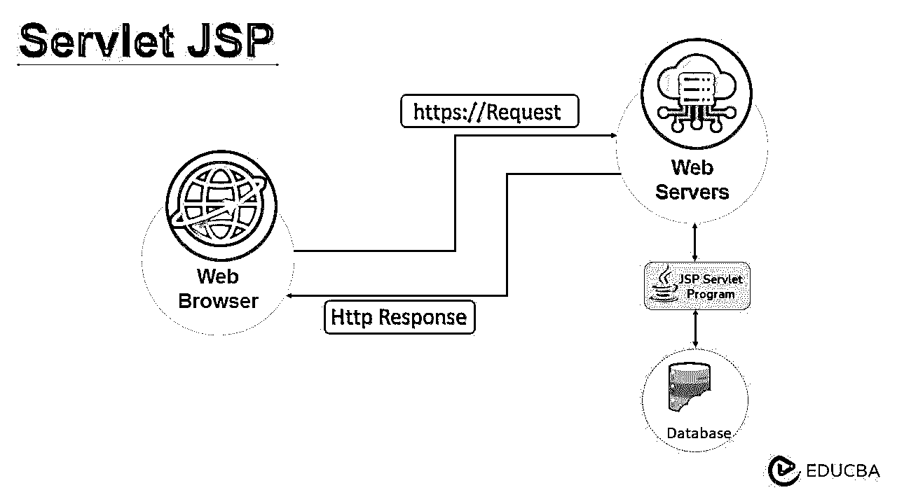

# Servlet JSP

> 原文：<https://www.educba.com/servlet-jsp/>




## Servlet JSP 简介

Servlet Java Server Pages (JSP)是一种服务器端技术，允许您构建在任何平台上工作的动态 web 应用程序。Servlet 和 JSP 可以使用所有的 Java APIs，包括 JDBC API，这使它们可以连接到企业数据库。JSP 使得用简单的步骤构建 web 应用程序变得很容易。

### 关键要点

*   **Servlet 扩展:** Servlet 技术是建立在 JSP 技术之上的。您可以在 JSP 中使用 Servlet 的所有特性。
*   易于维护:在 JSP 中，您可以很容易地将我们的业务逻辑与我们的表示逻辑分开，这使得管理变得很容易。在 Servlet 技术中，业务和表示逻辑是混合的。
*   **快速开发:**如果一个 JSP 页面发生变化，你不需要重新编译和重新部署项目。如果您想改变应用程序的外观和工作方式，您需要更新并重新编译 Servlet 代码。
*   **比 Servlet 更少的代码:**在 JSP 中，你可以使用动作标签、JSTL、自定义标签等来缩短代码。你也可以使用 EL，隐式对象和其他东西。

### 什么是 Servlet JSP？

Java 服务器页面或 JSP 是一个用于制作 web 软件的平台，就像 Servlet 高级技术一样。它是 servlet 的扩展版本，因为它比 Servlet 拥有更多的功能，比如表达式语言、JSTL 等。JSP 页面由 HTML 标记和 JSP 标记组成。JSP 页面比 Servlet 页面更容易跟上，因为您可以继续单独开发和设计。

<small>网页开发、编程语言、软件测试&其他</small>

### 如何创建 Servlet JSP Web 应用？

JSP 技术使用 HTTP 服务器的输入和输出页面创建 web 应用程序。服务器页面的请求和响应与 Servlet JSP 过程一起有效地工作。

创建 index.html 页面以显示交互式用户表单。

**文件名:index.html**

**代码:**

```
<form action = "output">
<input type = "text" name = "names">
<input type = "submit" value = "save">
<br/>
</form>
```

使用包含所需数据的 web.xml 文件。

**文件名:web.xml**

**代码:**

```
<web-app>
<servlet>
<servlet-name> educba </servlet-name>
<jsp-file> /output.jsp </jsp-file>
</servlet>
<servlet-mapping>
<servlet-name> educba </servlet-name>
<url-pattern> /output </url-pattern>
</servlet-mapping>
<context-param>
<param-name> driver_names </param-name>
<param-value>
sun.jdbc.odbc.JdbcOdbcDriver
</param-value>
</context-param>
</web-app>
```

使用 JSP 文件显示输出并连接 HTTP 服务器。

**文件名:output.jsp**

**代码:**

```
<%
out.print("Hello "+request.getParameter("names"));
String driveres = application.getInitParameter("driver_name");
out.print(" Given Database Driver name is = " +driveres);
%>
```

### Servlet JSP Web & HTTP

下面给出的是 JSP 网页和 HTTP:

#### 1.Servlet JSP Web

*   web 是互联网上的服务器网络，允许配置的文档工作。它是一种用于格式化文档的标记语言。它让你链接到其他文件，如图形，音频，视频文件等。
*   网站是一组不变的文件，比如 HTML 页面、图片、图形等。
*   Web 应用程序是在服务器上运行的网页，具有动态特性。这个网络应用可以在谷歌、脸书和推特上运行。

#### 2.Servlet JSP HTTP(超文本传输协议)

*   HTTP 是 web 服务器和客户端之间的通信方式。它是一种无状态协议，因为每个连接只能处理一个请求。使用 HTTP，客户端与服务器通信以发送请求，然后停用。
*   随着时间的推移，该系统允许更多的人连接到服务器。在这种情况下，客户机发送一个 HTTP 请求，服务器向客户机发回一个 HTML 页面。这两个步骤都使用 HTTP。

### Servlet JSP 工具

JSP 应用程序中使用了一些工具:

*   JDK (Java 开发工具包)
*   阿帕奇雄猫
*   IDE (Eclipse 或记事本)
*   专家

#### 1.JDK (Java 开发工具包)

Java 开发工具包(JDK)是一个用于制作 Java 程序和 web 应用程序的软件开发环境。它附带了运行时环境(JRE)、java 解释器/加载器、java 编译器(javac)、文档生成器(Javadoc)、归档器(jar)以及 Java web 开发所需的其他工具。

#### 2.阿帕奇雄猫

Apache Tomcat 是一个针对 Jakarta Servlet 页面、Jakarta 表达式语言和 WebSocket 技术的开源免费程序。Tomcat 为您提供了一个 HTTP web 服务器环境，并运行 Java 代码。

#### 3.IDE (Eclipse 或记事本)

IDE 附带的工具包括文本编辑器、工具栏、项目编辑器和输出查看器。ide 可以做很多不同的事情。一些重要的是编写、调试、编译和评估资源。Eclipse、NetBeans 和 Visual Studio 都是 ide 的例子。

#### 4.专家

Maven 是一个用于构建项目的自动化平台，主要用于 Java 项目。您还可以使用 Maven 构建和运行项目。它使用 JSP 技术来轻松创建应用程序。

### 常见问题解答

下面是提到的常见问题:

#### Q1。不学 Servlet 可以学 JSP 吗？

**回答:**可以，可以。但是随着您的项目变得越来越复杂，您会发现 Servlets 是处理这个过程的最佳方式，因为它们就是为此而生的。您可以只用 JSP 来驱动简单的 web 应用程序。

#### Q2。JSP 可以和 Servlet 一起使用吗？

**回答:**这种模式下，servlets 用于处理任务，JSP 页面用于表示层。Servlet 是一个控制器，负责处理请求并生成 JSP 页面需要的任何 beans。控制器还负责选择请求应该发送到哪个 JSP 页面。

#### Q3。JSP 和 Servlet 是一样的吗？

**回答:**各种协议请求都可以通过 Servlets 发送和管理。另一方面，HTTP 请求是 JSP 唯一能处理的东西。缺省情况下，Servlet 中没有打开会话管理。用户必须打开它。另一方面，JSP 中已经启用了会话管理。

### 结论

它是创建动态 web 应用程序的服务器端技术。JSP 使用 servlet 技术创建复杂的大型应用程序。对于开发者来说，开发应用程序是容易的、简单的，对于用户来说是用户友好的。

### 推荐文章

这是一个 Servlet JSP 的指南。在这里，我们讨论介绍，以及如何创建 servlet JSP web 应用程序，工具和常见问题。您也可以看看以下文章，了解更多信息–

1.  [Java 中的 Servlet 容器](https://www.educba.com/servlet-container-in-java/)
2.  [不同的 Servlet 方法](https://www.educba.com/servlet-methods/)
3.  [什么是 ServletConfig？](https://www.educba.com/servletconfig/)
4.  [创建 Servlet 类](https://www.educba.com/servlet-class/)


