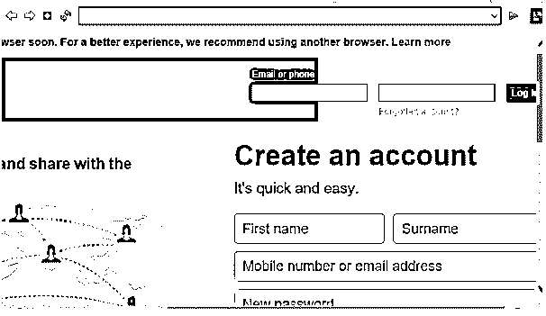
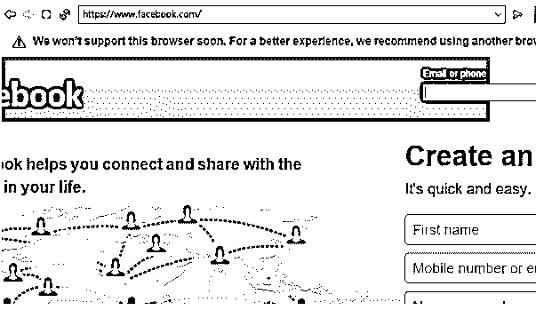

# JSP 重定向

> 原文：<https://www.educba.com/jsp-redirect/>

## JSP 重定向方法介绍

在 Java 服务器页面(jsp)中，我们希望通过使用一些 JSP 预定义的标签从一个页面导航到另一个页面。重定向是重新加载主页或我们发送请求页面并等待响应页面的选项之一。每当客户端请求的请求验证失败时，它将再次转到请求页面。页面重定向用于将重定向响应移动到网页的另一个资源。基本上我们可以在 jsp 中使用 sendRedirect()方法调用重定向页面，对客户端的请求可以在服务器内部使用，也可以在服务器外部使用。

**语法:**

<small>网页开发、编程语言、软件测试&其他</small>

`<html>
<body>
<%
------jsp logic codes---
Call the response method like response.sendRedirect(“webpage with extension(.html,.jsp”);
----- %>
</body>
</html>`

上面的代码使用 jsp 重定向方法导航客户机和服务器的交互。我们还可以使用 string s=new string(" ")之类的 string 对象来重定向网页。调用 response.setStatus()和 response.setHeader()之类的默认响应方法。每当我们在 jsp 中使用适当的方法时，这些连续的方法将在某些情况下被调用。

### 重定向方法在 JSP 中是如何工作的？

Jsp 我们不能通过使用 sendRedirect 方法简单地调用来发送像 post 和 get 方法那样的请求我们将使用 RequestDispatcher 技术来调用 jsp 中的 forward()方法请求参数在 web 应用程序中是相同的，具有相同的上下文通常 requestdispatcher 使用 getRequestDispatcher()方法来调用 servlets。

通常 jsp 使用两种不同类型的方法，如 1。请求前进和 2。请求重定向。请求转发选项控制和转发 web 应用程序内部可用的请求。如果我们使用 response.sendRedirect()方法，服务器将返回到用户请求-响应，直到等待下一个请求到来，并使用 web 浏览器 URL 显示。从一个 jsp 转发到另一个 jsp 的请求在 web 应用程序的同一个部分中。控制权的转移完全由 web 容器内部完成，浏览器或客户端不完全参与整个应用程序过程。

web 应用程序容器外部的控制需要请求重定向方法。每当用户发送请求时，重定向在同一个应用程序中不起作用，但是当应用程序机器空闲时，该方法访问用于访问同一机器中不同域的控件。重定向是从客户端发送回服务器浏览器的响应类型之一，服务器浏览器有自己的获取网页的指令，URL 浏览器中的地址将被更改。

页面重定向也与重定向相同，每当关于文件从一个位置转移到另一个位置的 web 文档或页面或任何要部署在服务器中的文件时，我们可以在关于更多用户同时访问网页的服务器中维护负载平衡器。在 sendRedirect()方法中，在用户发送请求后，无论请求在客户机中的什么位置，它都会发送到 web 容器，容器只决定请求是否会发送到它可以处理请求的特定 servlet。如果不是，那么 servlet 将根据项目需求决定将请求转移到其他 servlet 或 jsp 或任何其他扩展文件。

接收到请求后，servlet 或 jsp 调用 sendRedirect()方法将使用它来发送响应对象，它还将响应和状态代码一起发送到 web 浏览器。用户浏览器将看到特定的状态代码，并查看请求和响应资源是否会处理它们，否则浏览器将再次发送新的请求，但请求名称、资源和输出结果将显示在 web 浏览器中。但是这个过程在客户机中是无法识别的，它只知道 web 应用程序的性能，然后最终结果将在浏览器中显示或不显示。

### JSP 重定向的实现示例

#### 示例#1

**代码:**

`<html>
<body>
<form action="custom.jsp" method="POST">
Name: <input type="text" name="name"> 
City: <input type="text" name="city" />
<input type="submit" value="Submit" />
</form>
</body>
</html>
<%@ page language="java" contentType="text/html; charset=UTF-8"
pageEncoding="UTF-8"%>
<!DOCTYPE html PUBLIC "-//W3C//DTD HTML 4.01 Transitional//EN" "http://www.w3.org/TR/html4/loose.dtd">
<html>
<head>
<meta http-equiv="Content-Type" content="text/html; charset=UTF-8">
<title>Page Redirect Example</title>
</head>
<body>
<%
String name = request.getParameter("name");
String city = request.getParameter("city");
if(name.equals("siva") && city.equals("tup"))
{
response.sendRedirect("welcome.html");
}
else
{
response.sendRedirect("error.html");
}
%>
</body>
</html>
<html>
<head>
<meta http-equiv="Content-Type" content="text/html; charset=UTF-8">
<title>Success</title>
</head>
<body>
<h2>Welcome To My Domain</h2>
</body>
</html>
<html>
<head>
<meta http-equiv="Content-Type" content="text/html; charset=UTF-8">
<title>Error</title>
</head>
<body>
Please Try Again
</body>
</html>`

**输出:**

#### 实施例 2

**代码:**

`<%@ page language="java" contentType="text/html; charset=ISO-8859-1"
pageEncoding="ISO-8859-1"%>
<!DOCTYPE html PUBLIC "-//W3C//DTD HTML 4.01 Transitional//EN" "http://www.w3.org/TR/html4/loose.dtd">
<html>
<body>
<%
String site = "https://www.facebook.com" ;
response.setStatus(response.SC_MOVED_TEMPORARILY);
response.setHeader("Location", site);
response.sendRedirect(site);
%>
</body>
</html>`

**输出:**

#### 实施例 3

**代码:**

`<html>
<head>

</head>
<body>

Click the button, is automatically redirected to home page.

<form>
<input type = "button" value = "click" onclick = "sample();" />
</form>
</body>
</html>`

**输出:**

以上三个例子我们将在 jsp 中使用三种不同风格的 Redirect 选项第一个例子普通用户验证后验证，第二个例子基本 jsp 代码在同一网页中重定向后服务器响应其调用 sendRedirect 方法()而最后一个例子使用 javascript 函数调用后自动重定向网页而不使用 redirect 方法。

### 结论

总之，jsp 将通过使用一组不同的标签(如 redirect、forward 和 include)来导航网页。对于 jsp 应用程序，每个标记都有自己的实现和功能，转发和包含在 web 应用程序中表现出相同的功能和工作流，但每当我们收到来自服务器的错误响应时，都会加载相同的页面，但在重定向中，它会自动在主页中指定。

### 推荐文章

这是一个 JSP 重定向的指南。在这里，我们讨论了 JSP 中的介绍和如何重定向方法工作，以及它的例子和代码实现。您也可以浏览我们推荐的其他文章，了解更多信息——

1.  [JSP 脚本元素](https://www.educba.com/jsp-scripting-elements/)
2.  [JSP 转发](https://www.educba.com/jsp-forward/)
3.  [JSP 登录页面](https://www.educba.com/jsp-login-page/)
4.  [JSP 复选框](https://www.educba.com/jsp-checkbox/)

