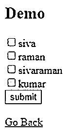
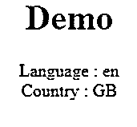
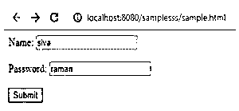
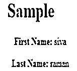

# JSP 格式化程序

> 原文：<https://www.educba.com/jsp-formatter/>

## JSP 格式化程序介绍

jsp 格式化程序也称为 jsp 代码格式化程序，它是一种识别 jsp 代码的工具，可以根据 jsp 编程语法对齐整洁和适当的格式，如缩进代码块，还包括主要的首选样式选项，如注释区域、文档，它包括其他缩进字体样式、文档换行等。jsp 代码有一组完全基于 jsp 解析器引擎的格式化程序。我们可以根据需要精确控制格式化步骤，如代码块的细节或文档区域的其他注释 sourceformatx 源代码格式化程序也是格式化 jsp 代码的工具之一。

**语法:**

<small>网页开发、编程语言、软件测试&其他</small>

它使用 sourceformatx java 甚至 jsp parse engine 等工具进行调整，这些工具使用其他专业的 java 和 jsp 代码格式化工具。

`<html>
<head>
<title>
</title>
</head>
<body>
<%
-----jsp logic---
%>
-----some logic both jsp and html codes----
</body>
</html>`

以上代码是 jsp 和 html 中的基本代码格式语法，而我们使用时，它将只在 html 中使用 java 代码，在范围之外，它将使用 html。

### JSP 格式化程序是如何工作的？

jsp 格式器使用 sourceformatx 源代码格式工具，它完全基于 jsp 解析器引擎，因此可以轻松控制代码块的全部细节，如注释和其他文档。使用 SourceFormatXjsp 格式化程序将能够把外来的 jsp 编码风格转换成我们的风格。它会在一定的时间间隔内将 jsp 源代码格式化为首选的样式。它有一些自己不同的功能缩进的功能，评论，文件和其他用户定义的元素与选项。

功能与缩进功能一起使用，注释，文件和其他元素与用户定义的选项，它指定缩进步长距离，它有括号风格的转换过程。它用于字体智能换行和文本换行。它对源代码元素进行对齐和排序，还用于智能文档样式转换。Javadoc 用于自动生成文档。Javadoc 和 doxygen 文档完全支持 Javadoc 和 doxygen 文档。Javadoc 用于智能单行注释和多行注释缩进，并消除不需要的代码。

它还用于在网页、文档和文件中添加页眉和页脚，并使用 tab2space 和 space2tab 约定在两个单词之间对齐文本，从而在约定之间处理相等的统一空白。批处理还用于格式化数据，并与一些 ide 集成，如 eclipse、netbeans、jcreator 和 intellij idea 等。使用一些文本编辑器，我们可以在这些编辑器中键入代码。它将使用一些制表符选项来对齐单词。它用于集成文本编辑器，如 ultraedit、textpad 和 editplus。使用具有行接口的强大 gui 命令。文本还包括一些 Unicode 转换行 ASCII、unix 和 mac 字符编码，即使一些独特的编码也用于格式化程序类型。

即使 SourceFormatX jsp 格式化程序也是用 draupnir soft 强大的 JSP 语法代码解析器引擎构建的，用来解析和重构 JSP 源代码文件。我们可以使用的 sourceformatxjsp 格式器概念将用于 format 和 obsfucatejsp 源代码文件，它有许多单独的文本格式选项，用于控制编码风格中的 jsp 编程语言。这些类型的风格将允许一些精确的控制，也满足一些最挑剔的编码者。如果我们使用 html 编辑器，它有一些模式列表源模式，设计模式和预览模式这三种模式将用于以不同的方式对齐 html 代码，即使对齐时间我们将使用选项，如基于用户自定义视图的预览面板类型，它将根据文本字体样式和页面对齐而变化。

### JSP 格式化程序的示例

下面是一些例子:

#### 示例#1

**代码:**

`<%@pagelanguage="java"contentType="text/html"pageEncoding="UTF-8"%>
<!DOCTYPEHTML>
<html>
<head>
<metahttp-equiv="Content-Type"content="text/html; charset=UTF-8">
<title>Sample</title>
</head>
<body>
<h2>Demo</h2>
<formmethod="post">
<inputtype="checkbox"name="n"value="siva">siva 
<inputtype="checkbox"name="n"value="raman">raman 
<inputtype="checkbox"name="n"value="sivaraman">sivaraman     
<inputtype="checkbox"name="n"value="kumar">kumar 
<inputtype="submit"value="submit">
</form>
<%
String[] s = request.getParameterValues("n");
if (s != null) {
%>
<h3>Given names:</h3>
<ul>
<%
for (String s1 : s) {
%>
<li><%= s %></li>
<%
}
%>
</ul>
<%
}
%>
 <ahref="<%=request.getRequestURI() %>">Go Back</a>
<body>
</html>`

**输出:**

#### 实施例 2

**代码:**

`<%@pageimport="java.io.*,java.util.Locale"%>
<%@pageimport="javax.servlet.*,javax.servlet.http.* "%>
<%
Locale l = request.getLocale();
String s = l.getLanguage();
String s1 = l.getCountry();
%>
<html>
<head>
<title>Sample</title>
</head>
<body>

<h1>Demo</h1>

<palign="center">
<%
out.println("Language : " + s  + " ");
out.println("Country  : " + s1   + " ");
%>

</body>
</html>`

**输出:**

#### 实施例 3

**代码:**

`<html>
<body>
<formaction="second.jsp"method="POST">
Name: <inputtype="text"name="n">
  
Password: <inputtype="text"name="pass"/>  
<inputtype="submit"value="Submit"/>
</form>
</body>
</html>
<html>
<head>
<title>Welcome To My Domain</title>
</head>
<body>

<h1>Sample</h1>
<ul>
<li>
<b>First Name:</b>
<%=request.getParameter("n")%>

</li>
<li>
<b>Last  Name:</b>
<%=request.getParameter("pass")%>

</li>
</ul>
</body>
</html>`

**输出:**

点击提交按钮后:

在上面的例子中，我们看到了带有三个不同例子的 jsp 代码格式。所有的例子，我们使用正常的 jsp 代码，如登录页面，一些 ui 元素，如复选框，按钮等。尽管我们在 jsp(第二个示例)中使用了国际化概念，但所有示例都输出了一个额外的屏幕截图，如 SourceFormatX JSP 格式化工具，用于对齐 JSP 编码，无论我们已经在 IDE 中编写了什么代码。

### 结论

jsp 网页使用应用服务器快速接受互联网上的动态代码内容。它还提供了对运行在服务器上的基于 java 的平台的完全访问，更加安全。市场上有许多代码格式工具可用于部署 jsp 代码产品。

### 推荐文章

这是一个 JSP 格式化程序的指南。这里我们讨论 JSP 格式化程序的介绍，它是如何工作的，以及相应的例子。您也可以看看以下文章，了解更多信息–

1.  [Java 中的 JSP](https://www.educba.com/jsp-in-java/)
2.  [JSplitPane](https://www.educba.com/jsplitpane/)
3.  [Java Swing 布局](https://www.educba.com/java-swing-layout/)
4.  [JSP 指令](https://www.educba.com/jsp-directives/)

