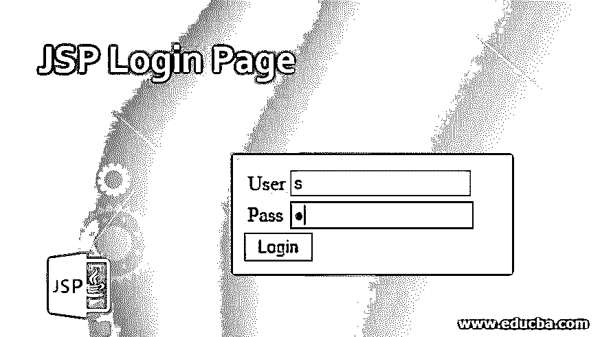
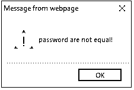

# JSP 登录页面

> 原文：<https://www.educba.com/jsp-login-page/>

## JSP 登录页面介绍

每当我们在 web 应用程序的前端使用 Java 服务器页面时，它基本上用于索引页面，如登录页面或主页，因为 html 具有预定义的标签，用于创建 textbox、scrollbox 等 UI 元素。但是，当我们使用 jsp 时，它将在同一页面中创建 html 元素和 java 逻辑代码，因此与 html 相比，代码冗余和外部内存将减少，并且更复杂，性能看起来与 html 一样快。与 servlet 相比，我们可以在 web 应用程序中单独刷新 jsp 页面，无需频繁重启应用服务器。

**语法:**

<small>网页开发、编程语言、软件测试&其他</small>

当我们在 jsp 标签中使用时，登录页面的基本语法如下。

`<html>
<body>
<form method=”get/post” action=”.jsp”>
<input type=”text” name=”user”value=””/>
<input type=”password” name=”pass”value=””/>
</form>
<%
-----some java logic for validation in both user and password---
%>
</body>
</html>`

以上代码是创建登录页面的基本步骤，当我们在 web 应用程序中使用 jsp 时，它需要 html 标记来创建 web 应用程序中的 ui 指定元素。我们可以在同一个 html 页面中使用 jsp 代码，也可以在单独的页面中编写代码，然后在 html 表单中调用它。

### 如何使用 JSP 来完成登录页面？

jsp 标签具有独立的动作标签元素、指令、脚本元素，并且具有自己的隐式对象。像 scriptlets 标记、表达式标记和声明标记这样的脚本元素用于在 html 中创建 ui 基础。当我们使用隐式对象时，请求和响应将是 jsp 的主要角色，因为它连接到前端和后端逻辑。服务器响应实例将在使用隐式对象的整个 web 应用程序中调用和使用。

在 jsp 配置中，隐式对象也是主要角色，因为在登录页面中，它在应用程序的动态 web 项目中的 web.xml 中被调用。每当用户登录到应用程序中时，会话也为每个用户计算。会话 id 将被创建，它将用于跟踪 web 应用程序中的用户。在发生错误或任何异常时，它将抛出异常，并根据应用程序中的用户要求写入应用程序项目的日志。

Jsp 指令也将用于登录应用程序。页面、包含和标记库指令是 jsp 中的三种指令。当我们在登录应用程序中使用 include 指令时，假设我们可以在浏览器中的用户会话到期后再次登录，或者我们可以使用登录页面中使用的任何其他 util 函数的日期和时间，这些指令对于在同一文件或不同文件中添加 jsp 标记非常有用，它将在 jsp 中的 include 指令中被调用。Taglib 是 jsp 元素中的自定义或用户定义的标记。

其次，JSP Action Elements 是登录页面应用程序最重要的功能，因为当我们在提交用户详细信息后创建 submit 按钮时，它将在后端进行验证，因此 time submit 按钮会在后端验证中触发一些操作，它是前端和后端逻辑代码之间的桥梁。我们可以使用一些其他的动作标签，如 forward，这两个标签将用于添加不同的或验证后的页面，如 home，contact us 等，这些页面将显示在浏览器中。通过使用 java bean 类，我们可以在 jsp 应用程序中使用 pojo 对象来存储和检索数据库中的用户数据。

### JSP 登录页面示例

下面举几个例子

#### 示例#1

**代码:**

`<!DOCTYPE html PUBLIC"-//W3C//DTD HTML 4.01 Transitional//EN""http://www.w3.org/TR/html4/loose.dtd">
<html>
<head>
<meta http-equiv="Content-Type" content="text/html; charset=ISO-8859-1">
<title>Welcome Login Form</title>
</head>
<body>
<form action="custom.jsp" method="post">
<table style="width: 50%">
<tr>
<td>User</td>
<td><input type="text" name="users"/></td>
</tr>
<tr>
<td>Pass</td>
<td><input type="password" name="password"/></td>
</tr>
</table>
<input type="submit" value="Login"/></form>
</body>
</html>
<%@page language="java" contentType="text/html; charset=ISO-8859-1"
pageEncoding="ISO-8859-1"%>
<!DOCTYPEhtml PUBLIC"-//W3C//DTD HTML 4.01 Transitional//EN""http://www.w3.org/TR/html4/loose.dtd">
<html>
<body>
<%
String site = "Welcome To My Domain";
out.print(site);
%>
</body>
</html>`

**样本输出:**

**登录后**

#### 实施例 2

**代码:**

`<!DOCTYPE html>
<html>
<head>

</head>
<body>
<form name="sample" action="custom.jsp" onsubmit="return first()">
Password:<input type="password" name="pass"/> 
Confirmation Password:<input type="password" name="pass1"/> 
<input type="submit">
</form>
</body>
</html>`

**样本输出:**

如果密码不匹配，将显示以下 o/p

如果密码匹配，将显示以下 o/p

#### 实施例 3

**代码:**

`<html>
<body>

<form name="sample" action="custom.jsp" onsubmit="return first()">
<table>
<tr><td>User:</td><td><input type="text" name="n"/>
</td></tr>
<tr><td>Password:</td><td><input type="password" name="p"/>
</td></tr>
<tr><td colspan="3"><input type="submit" value="reg"/></td></tr>
</table>
</form>
</body>
</html>`

**样本输出:**

如果密码不超过 6 个字符或数字，则显示以下 o/p:

如果密码超过 6 个字符或数字，则显示以下 o/p:

以上三个例子我们将使用 jsp 标签为不同的场景创建登录页面。第一个示例我们将使用使用 html 的基本登录表单，然后导航到 jsp 页面第二个示例我们将讨论使用 javascript 验证凭据的密码凭据(如密码和确认密码)验证后，它将被转发到 jsp 页面最后一个示例我们将使用具有验证(如最小密码范围)的登录表单，该图像将使用 alert 函数在 html src 标记中使用。如果成功导航到 jsp 页面，将在输入密码最小范围后弹出窗口。

### 结论

在 Jsp 中有其预定义的标签、库和指令，用于创建更加复杂的网页。在 web 应用中使用定制的标签，网页将更加方便用户和友好用户。在登录页面场景中，它是基于 web 的项目的一个基本模块，位于基于客户需求的注册页面的初始步骤之后。

### 推荐文章

这是一个 JSP 登录页面的指南。为了更好地理解，我们在这里讨论如何使用 JSP 以及相应的例子来完成登录页面。您也可以阅读以下文章，了解更多信息——

1.  [JSP 生命周期](https://www.educba.com/jsp-life-cycle/)
2.  [什么是 JSP？](https://www.educba.com/what-is-jsp/)
3.  [JSP 架构](https://www.educba.com/jsp-architecture/)
4.  [JSplitPane](https://www.educba.com/jsplitpane/)

