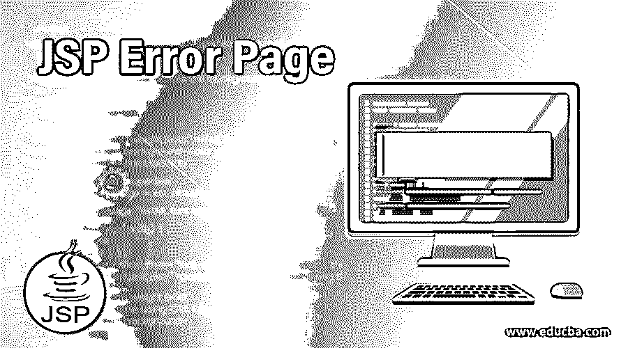
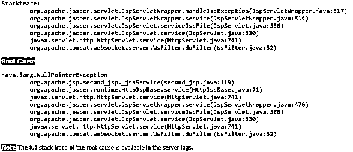

# jsp 错误页面

> 原文：<https://www.educba.com/jsp-error-page/>

## JSP 错误页面介绍

在 jsp 技术代码库中，我们为 jsp 代码库中的网页错误创建了单独的 jsp 文件。要创建错误页面，首先我们需要在 jsp 文件的初始阶段设置并分配页面指令属性。当我们需要在 jsp 页面中分配类似这些类型属性的值时，我们将其设置为错误页面值为真。然后，我们有一个单独的格式来使用一些隐式对象访问 jsp 异常。这将更有助于为 web 应用程序客户端创建定制的错误消息。

**语法**

<small>网页开发、编程语言、软件测试&其他</small>

当我们将 jsp 文件创建为错误页面时，我们可以导入页面值作为基本格式和语法，如下所示。

`<%@ page errorPage=”filename.jsp”%>
<%@ page isErrorPage=”true”%>
<%@ taglib uri=”” prefix=””%>
<html>
<body>
---some html program codes---
</body>
</html>`

上面的代码是 web 应用程序中的基本语法，我们必须以两种不同的方式设置错误页面，一种是在指令的帮助下赋值，另一种是我们必须在 jsp 文件中导入错误页面文件。

### JSP 错误页面是如何工作的？

如果我们想使用 jsp 页面作为错误页面，我们可以声明在执行 jsp 页面时会出现更多的异常。当 jsp 页面代码被执行时，它将自动调用并移动到它应该被访问的 jsp web 容器，并且如果特定的 jsp 应用程序将要抛出异常，则将控制转发到页面。如果异常发生，它应该被抛出到包括作为 jsp 页面开始的页面指令。

每当将该指令分配给页面时，该指令就会生成并创建一个类似“javax.servlet.jsp.ErrorData”类型的实例，以便容器可以检索消息、解释数据，还可以显示有关特定 jsp 应用程序中错误和异常的根本原因的错误数据信息。我们还可以使用 EL(Expression Language)表达式访问错误数据 jsp 页面，这是应用程序中错误上下文的方式之一。

使用＄{ pagecontext . error data . status code }我们可以检索页面状态代码，还可以使用＄{ pagecontext . error data . throwable }检索网页中的错误和异常的抛出。我们可以使用＄{ pagecontext . error data . throwable . cause }这样的表达式在日志文件中检索并帮助识别异常的原因。对于每种类型的 jsp，JSP 网页可以选择抛出页面中的特定错误。

每当 jsp 容器自动调用错误页面时，jsp 页面抛出异常是主要的优点之一。这有时包含异常类型，这些异常将基于其父类(称为 Throwable 类)使用异常实例被抛出到特定实例，在 jsp 页面中分配并声明异常类型。基本上错误很可能被代码忽略，因为我们偶尔或很少在页面中做一些事情。

错误一般不像异常，基本上每当代码端程序员遇到麻烦情况，比如失控，它抛出错误状态代码、消息等。在程序员代码逻辑中，比如数组的内存超出了限制，这时就会发生内存不足错误，堆栈溢出就会发生，就像这些类型的事情会超出程序员的范围一样，在编译时的情况下也会被忽略。

检查过的异常和未检查过的异常(运行时异常)是异常的一般分类，如果假设文件未找到异常，我们知道它基本上是一种异常，但最有可能的是它就像用户错误，不幸的是，特定的用户打开文件或在文件中做了一些事情，然后抛出异常，运行时异常在编译时被编码者忽略。

### 实现 JSP 错误页面的示例

下面是提到的例子:

#### 示例#1

**代码:**

`<%@ page errorPage = *"first.jsp"* %>
<html>
<head>
<title>Error Handling Example</title>
</head>
<body>
<%
int i = 1;
if (i == 1) {
throw new RuntimeException("Error occcured!!!");
}
%>
</body>
</html>
<%@ page isErrorPage = *"true"* %>
<html>
<head>
<title>Error Page</title>
</head>
<body>
<h1>Error</h1>

The error is occured.

Below are the exceptions occured and its traced: 

<pre><% exception.printStackTrace(response.getWriter()); %></pre>
</body>
</html>`

**输出:**

#### 实施例 2

**代码:**

`<html>
<head>
<title>Second Example</title>
</head>
<body>
<%
try {
int x = 1;
x = x / 0;
out.println("Result is " + x);
}
catch (Exception e) {
out.println("The exception occurred: " + e.getMessage());
}
%>
</body>
</html>`

**输出:**

#### 实施例 3

**代码:**

`<%@ page contentType="text/html;charset=UTF-8" language="java" %>
<%@ page isErrorPage="true" %>
<!DOCTYPE html>
<html>
<head>
<title>Second Page</title>
</head>
<body>
<h1>Error Page Occurs</h1>

The given Error message is: <%= exception.toString() %>

</body>
</html>
<%@ page contentType="text/html;charset=UTF-8" language="java" %>
<%@ page errorPage="https://cdn.educba.com/second.jsp" %>
<html>
<head>
<title>First Page</title>
</head>
<body>
<h1>Error Page Occurs</h1>
<%
int n = Integer.parseInt("Welcome To My Domain!");
%>
</body>
</html>`

**输出:**

**解释:**在上面的三个例子中，我们为 web 应用程序中的 jsp 使用了不同的场景。第一个示例我们在两个不同的 jsp 文件中使用了运行时异常，但是这两个文件都设置了错误值，并用于捕捉和抛出异常，第二个示例我们使用了使用数学表达式(如无穷大值)的数字，它将会发生，并且必须被捕捉并显示在网页中。最后一个示例我们再次使用了两个不同的文件，我们使用了 css 样式，将会发生显示错误，并且我们得到的输出在日志文件中有堆栈跟踪。

### 结论

在网页中，我们根据用户需求创建和定制了 web 应用程序，并且它可能会根据用户情况而变化，或者在用户浏览器页面上出现应用程序更新失败时间错误。

### 推荐文章

这是一个 JSP 错误页面的指南。在这里，我们讨论 JSP 错误页面的介绍，包括适当的语法和相应的编程示例。您也可以浏览我们的其他相关文章，了解更多信息——

1.  [JSP 面试问题](https://www.educba.com/jsp-interview-questions/)
2.  [JSP 脚本元素](https://www.educba.com/jsp-scripting-elements/)
3.  [爪哇的 EJB](https://www.educba.com/ejb-in-java/)
4.  [JSP 架构](https://www.educba.com/jsp-architecture/)

