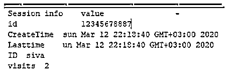

# JSP 会话

> 原文：<https://www.educba.com/jsp-session/>


## JSP 会话介绍

Jsp 是 java 服务器页面；它有助于创建动态网页。jsp 具有处理基于 web 的应用程序中的会话的会话技术 jsp 会话具有它们自己的实例 javax.servlet.http.HttpSession 它具有 html 前端代码以与后端控制器逻辑代码连接，并且还与数据库查询连接，每次查询将针对每个客户端请求执行，将创建会话 id；会话用于添加会话、删除会话和属性，我们可以借助日志获得用户请求的信息。

**语法**

<small>网页开发、编程语言、软件测试&其他</small>

jsp 使用的会话的基本语法如下。

```
<html>
<body>
<%
---------some jsp logic codes----
session.setAttribute();//session instance created and call the sessions methods
session.getAttribute();();//session instance created and call the sessions methods
%>
</body>
</html>
```

以上代码用于在 jsp 页面中创建会话；每当我们访问应用程序时，用户会话将被存储；我们可以使用数据库中的 session-id 来访问和检索信息。

### 在哪里使用 JSP 会话？

http 分为两种有状态和无状态协议；在无状态协议中，用户向服务器发送请求，服务器在连接到无状态协议后，在网页中检索响应，然后向客户端发送响应。客户端创建并打开到 web 服务器的新连接，并且服务器不在客户端历史中存储任何先前的请求数据。当时，jsp 使用了类似于会话跟踪机制的概念，它用于维护关于单个用户在某段时间内连续请求的状态。

Http 是无状态协议，因此单个用户或多个用户向服务器发送连续请求，而服务器不知道哪个客户端发送了哪个请求，因此它将保持会话状态，即 jsp 在线购物需要时间会话跟踪是基本示例，用户将把保留的商品添加到他们自己的购物车中，服务器使用会话跟踪机制确定哪个用户将把商品添加到购物车中。

对于 web 客户端和 web 服务器，有不同的方法来处理会话。有一些不同的方法来跟踪会话，如 cookies、url 重写、隐藏字段和会话 API。cookie 用于会话跟踪。每当客户端向服务器发送请求时，cookie 都是与键-值对相关的信息，如 java 哈希映射。cookie 还有助于识别客户端。url 重写通过使用 get 方法的 url 中的会话 id 来识别。最后，url 请求本身使用会话标识符来标识请求，并且还将数据附加到客户端。

Html 表单是使用 https 方法标识值的方法之一，如获取和发布请求和响应数据，这些数据也用于在隐藏的表单字段中存储用户会话信息，还有动态生成网页的概念，因为每个用户会话的整个过程都有唯一的标识符。在会话对象中，servlet 将用于提供 HTTP 会话接口，以处理 web 客户机请求和服务器对用户的响应。关于 jsp，默认的会话是自动创建的，它不存在于另一个会话中，所以如果我们创建了一个 jsp 页面并执行，那么已经为初始请求创建了会话。

我们还可以在 jsp 中设置会话设置，因为它将验证会话。因此，在验证之前，它会检查 jsp 用户请求的现有会话，以及是否需要使用 setAttributes()等会话属性方法。我们可以在会话方法中传递属性名称和值等参数。我们可以在方法中传递不同类型的属性。我们可以使用 session.getAttribute()从会话属性中检索值。

### JSP 会话的示例

下面提到了不同的例子:

#### 示例#1

**代码:**

```
<!DOCTYPE html>
<html>
<head>
<title>Sample</title>
</head>
<body>
<form action="//first.jsp">
<input type="text" placeholder="Name" name="name"><br><br>
<input type="text" placeholder="City" name="city"><br><br>
<input type="submit" value="submit"><br>
</form>
</body>
</html>
<u><%</u>@page language="java" contentType="text/html; charset=ISO-8859-1"
pageEncoding="ISO-8859-1"%>
<!DOCTYPEhtml>
<html>
<head>
<meta http-equiv="Content-Type" content="text/html; charset=ISO-8859-1">
<title>Sample</title>
</head>
<body>
<%
String name=request.getParameter("name");
String city=request.getParameter("city");
session.setAttribute("name",name);
session.setAttribute("city",city);
out.print("Welcome"+name);
out.print("<br>");
out.print("Session created successfully.");
%>
<br><a href="//WEB-INF//second.jsp">Click</a>
</body>
</html>
<u><%</u>@page language="java" contentType="text/html; charset=ISO-8859-1"
pageEncoding="ISO-8859-1"%>
<!DOCTYPE html>
<html>
<head>
<meta http-equiv="Content-Type" content="text/html; charset=ISO-8859-1">
<title>Sample Sessions </title>
</head>
<body>
<%
String name=(String)session.getAttribute("name");
String city=(String)session.getAttribute("city");
out.print("Name :"+name);
out.print("<br>");
out.print("City :"+city);
%>
</body>
</html>
```

**样本输出:**


#### 实施例 2

**代码:**

```
<%@page language="java" contentType="text/html; charset=ISO-8859-1"
pageEncoding="ISO-8859-1"%>
<%@page import="java.io.*,java.util.*"%>
<%
Date startdate = new Date(session.getCreationTime());
Date lastdate = new Date(session.getLastAccessedTime());
String s = "Welcome Back to my domain";
Integer i = new Integer(0);
String v = new String("lasytvisittimes");
String u = new String("id");
String u1 = new String("welcome");
if (session.isNew() ){
s = "Welcome to my domain";
session.setAttribute(u, u1);
session.setAttribute(v,  i);
}
i = (Integer)session.getAttribute(v);
v = v + 1;
u1 = (String)session.getAttribute(u);
session.setAttribute(v,  i);
%>
<html>
<head>
<title>Session Tracking</title>
</head>
<body>
<center>
<h1>Session Tracking</h1>
</center>
<table border="10" align="center">
<tr bgcolor="green">
<th>Session informations</th>
<th>Values</th>
</tr>
<tr>
<td>id</td>
<td><% out.print( session.getId()); %></td>
</tr>
<tr>
<td>CreateTime</td>
<td><% out.print(startdate); %></td>
</tr>
<tr>
<td>Lasttime</td>
<td><% out.print(lastdate); %></td>
</tr>
<tr>
<td>ID</td>
<td><% out.print(u1); %></td>
</tr>
<tr>
<td>visit</td>
<td><% out.print(i); %></td>
</tr>
</table>
</body>
</html>
```

**样本输出:**




#### 实施例 3

**代码:**

```
<!DOCTYPE html>
<html>
<head>
<title>Sample</title>
</head>
<body>
<form action="//samplesss//jsp//first.jsp">
<input type="text" placeholder="Name" name="name"><br><br>
<input type="text" placeholder="City" name="city"><br><br>
<input type="submit" value="submit"><br>
</form>
</body>
</html>
<%@page language="java" contentType="text/html; charset=ISO-8859-1"
pageEncoding="ISO-8859-1"%>
<%@page import="javax.servlet.*"%>
<%@page import="javax.servlet.http.*"%>
<%@page import="java.sql.*"%>
<!DOCTYPE html PUBLIC"-//W3C//DTD HTML 4.01 Transitional//EN""http://www.w3.org/TR/html4/loose.dtd">
<%
Cookie name = new Cookie("name",
request.getParameter("name"));
Cookie city = new Cookie("city",
request.getParameter("city"));
name.setMaxAge(23*20*16);
city.setMaxAge(23*20*16);
response.addCookie(name);
response.addCookie(city);
%>
<html>
<head>
<meta http-equiv="Content-Type" content="text/html; charset=ISO-8859-1">
<title>Sample</title>
</head>
<body>
<b>Name:</b>
<%= request.getParameter("name")%>
<b>City:</b>
<%= request.getParameter("city")%>
</body>
</html>
```

**样本输出:**


### 结论

JSP 在处理日志中的用户详细信息以及浏览器控制台技术(如会话、cookies 等)时有一组不同的特性。在这些会话中，用于在会话 id 的帮助下检索用户数据。

### 推荐文章

这是一个 JSP 会话指南。这里我们讨论 JSP 会话的例子和在哪里使用这个会话，以及所用会话的基本语法。您也可以看看以下文章，了解更多信息–

1.  [JSP 脚本元素](https://www.educba.com/jsp-scripting-elements/)
2.  [Java 中的 JSP](https://www.educba.com/jsp-in-java/)
3.  [JSP 生命周期](https://www.educba.com/jsp-life-cycle/)
4.  [JSP 架构](https://www.educba.com/jsp-architecture/)


