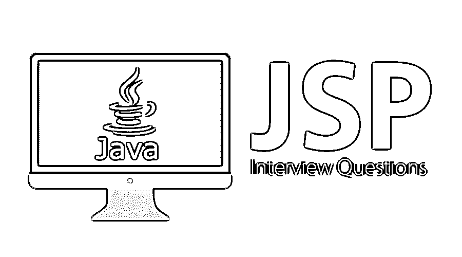

# JSP 面试问题

> 原文：<https://www.educba.com/jsp-interview-questions/>

## JSP 面试问答介绍

JSP 或 java server pages 是一种用于基于诸如 HTML、CSS、XML 等 web 技术动态生成网页的技术。JSP 是由 Sun 微系统公司在 1999 年创建的。JSP 类似于 ASP 或 PHP，唯一的区别是它使用 Java 编程语言。Apache Tomcat 或 Jetty 或任何其他带有 servlet 容器的兼容 web 服务器用于进行部署，运行 Java-Server Pages.JSP 也可以被视为 Java 的 servlet 概念的高级抽象。

JSP 代码在运行时被转换成 Servlet，因此 JSP 被视为 Servlet。缓存是在 JSP servlet 上完成的，它会被重用，直到原始 JSP 代码发生变化。 [JSP 架构](https://www.educba.com/jsp-architecture/)要么独立，要么作为 MVC 组件。通常，Java Beans 用作模型，Java servlets 用作控制器。有了像 Spring 或 JSF 这样的新框架，JSP 现在可能用得不多了，但是它对于新开发人员和学生来说仍然非常重要。

<small>网页开发、编程语言、软件测试&其他</small>

现在，如果你正在寻找一份与 JSP 相关的工作，那么你需要准备 2022 年 JSP 面试问题。的确，每个面试都因不同的职位而不同。在这里，我们准备了重要的 JSP 面试问题和答案，它们将帮助你在面试中取得成功。

因此，在这篇 2022 JSP 面试问题的文章中，我们提供了在面试中被广泛问到的 10 个最重要的 JSP 面试问题。

### 第 1 部分 JSP 面试问题(基础)

第一部分包括基本的面试问题和答案

#### 1.解释你对 JSP 生命周期阶段的理解？

**答案:**

JSP 属于 Java 组，但是 JSP 代码看起来更像 HTML 而不是 Java。它是一个 JSP 容器，翻译 JSP 页面并创建一个 servlet 类，然后在 web 应用程序中使用。

JSP 生命周期阶段描述如下:

*   **翻译—**JSP 页面代码由 JSP 容器检查并解析，生成 servlet 源代码。
*   **编译—**接下来，JSP 容器编译 JSP 类源代码。之后，它生成一个类文件。
*   **class loading–**在这个阶段，容器将类加载到内存中。
*   **实例化–**首先，实例化完成后，容器调用生成的类的无参数构造函数并将其加载到内存中。
*   **初始化—**容器，在这个阶段调用 JSP 类对象的 init 方法。在配置了带有 init 参数的 servlet 配置之后。现在，JSP 可以处理客户端请求。最常见的情况是，JSP 中的翻译和初始化在第一次请求 JSP 时就开始了。
*   **请求处理—**这是 JSP 页面中最耗时的阶段。这里 JSP 页面处理来自客户端的请求。请求处理阶段是多线程的。对于每个请求，使用一个新线程，并创建 Servlet-request 和 Servlet-response 对象。此后，调用 JSP 服务方法。
*   **销毁–**JSP 生命周期的最后一个阶段被销毁。在这个阶段，JSP 类从内存中卸载。这是在取消部署应用程序时完成的。当服务器停机时也可以这样做。

#### 2.详细阐述 JSP 生命周期方法？

**答案:**
JSP 生命周期方法描述如下:

*   **jspInit():** 在 JSP 实现的 JSP 页面中声明，这个方法在 JSP 生命周期中只调用一次。这用于初始化部署描述符中的配置参数。也可以使用 JSP 声明脚本元素覆盖该方法。覆盖是为了初始化那些可以在 JSP 页面上使用的资源。
*   **_jspService():** 由 JSP 容器为每个客户端请求调用，该方法传递请求和响应对象。此方法不能被覆盖，因此它以下划线开头。当 JSP 代码进入该方法时，默认情况下会被覆盖。不建议使用 JSP 声明脚本元素覆盖它[。作为一种标准做法，该方法在 HttpJspPage 接口中定义和声明。](https://www.educba.com/jsp-declaration/)
*   **jspDestroy():** 用于关闭应用程序或容器，从内存中卸载 JSP 时调用该方法。这个方法在 JSP 生命周期中也只被调用一次。只有在释放 JSP init 方法中创建的资源时，才应该覆盖此方法。

#### 3.提及一些可以被覆盖的 JSP 生命周期方法？

**答案:**
如上所述，jspInit()和 jspDestroy()方法可以使用 JSP 声明脚本元素在 JSP 中被覆盖。jspInit()方法被覆盖以创建可在 JSP 服务方法中使用的公共资源，并且 jspDestroy()方法应被覆盖以释放使用 jspInit()创建的公共资源。

#### 4.解释一下你对 JSP 声明的理解？

**答案:**
这是面试中问的基本 JSP 面试问题。声明用于声明 JSP 文件中 Java 代码中使用的一个或多个变量和方法。变量或方法声明在 JSP 文件中使用之前是必须的。

#### 5.解释 JSP 表达式？

**答案:**
JSP expression 不过是一个包含脚本语言表达式的元素，用于计算 JSP 文件中表达式出现处的字符串转换和插入。
上面定义的表达式元素通常可以包含任何表达式。唯一的要求是，根据 Java 语言规范，它应该是有效的。分号不能用于结束 JSP 表达式。

### 第 2 部分 JSP 面试问题(高级)

现在让我们来看看高级面试问题。

#### 6.描述 JSP 在 MVC 模型中是如何使用的？

**回答:**
JSP 可以用于 MVC 模式下的展示。它在 MVC 架构中扮演视图的角色。控制器调用模型和业务类。模型获取数据，然后将这些数据发送给 JSP 以在客户机上呈现。

#### 7.提及 JSP 文字由什么组成？

**答案:**
这是在面试中经常被问到的 JSP 面试问题。JSP 文字包含以下类型的数据格式:–

*   布尔代数学体系的
*   整数
*   线
*   浮点
*   空

#### 8.提及给定标签的不同范围值。<usebean></usebean>

**答案:**

在上面给出的标签中有 4 个值:

*   页
*   请求
*   会话和应用程序

#### 9.解释我们如何在 JSP 中配置初始化参数？

**答:**
初始化参数可以在 JSP 中配置，就像在 servlet 中一样。配置是通过带有 servlet 和 servlet 映射元素的 init-params 完成的，唯一的区别是，在 servlet 中我们不需要提供 JSP 页面位置，而在 jsp-file 元素中我们需要。

#### 10.解释一下你所理解的 JSP 动作元素或者 JSP 动作标签是什么？

**答案:**
JSP 动作元素或者动作标签不过是类似于 HTML 标签的标签。它们提供了许多有用的功能，如使用 Java Bean、请求转发、生成动态 XML 元素和包含资源等。约定是 jsp action 元素以 JSP 开始:它可以直接在 JSP 页面中使用，不需要为它导入任何标记库。也不需要导入任何其他配置更改。JSP 中一些最重要的动作元素是 jsp:useBean、jsp:setProperty、jsp:getProperty、jsp:forward 和 jsp:include。

### 推荐文章

这是 JSP 面试问题和答案列表的指南，以便候选人可以轻松地解决这些面试问题。在这篇文章中，我们研究了在面试中经常被问到的 JSP 面试问题。您也可以阅读以下文章，了解更多信息——

1.  [Java EE 面试问题](https://www.educba.com/java-ee-interview-questions/)
2.  [Spring Boot 面试问题](https://www.educba.com/spring-boot-interview-questions/)
3.  [J2EE 面试问题](https://www.educba.com/j2ee-interview-questions/)
4.  [Junit 面试问题](https://www.educba.com/junit-interview-questions/)

