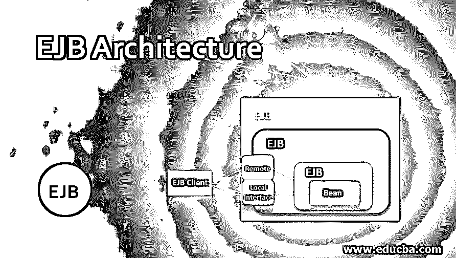
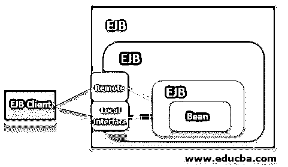

# EJB 建筑

> 原文：<https://www.educba.com/ejb-architecture/>

## EJB 建筑介绍

在这里，我们将了解 EJB 的建筑以及 JB 和 EJB 的区别。所以让我们来深入探讨一下。

**Java beans–**Java beans 将多个对象包含在一个可理解的对象中，可以从任何应用程序访问该对象。该对象可重用、可定制且易于维护。它由两个方法 setter/getter 和一个公共构造函数控制。可以使用 setter 方法更新对象中任何变量的值，并使用 getting 方法读取其值，以便进行显示或进一步处理。轻量级 Swing 和重量级抽象工具包是 Java beans 的一部分。

<small>网页开发、编程语言、软件测试&其他</small>

**Enterprise Java beans—**它是一种基于服务器的架构，符合企业环境的规范和要求。beans 在一个四层体系结构 J2EE 的容器中运行，包括客户端层、Web 层、应用层和数据层。

### JB 和 EJB 的区别

下面是表中提到的区别

| **爪哇豆** | **企业 Java bean** |
| 看得见的 | 不可见，作为远程运行 |
| Local, Single process and runs in the Client machine服务器端 beans 是可能的，但不是首选 | 在服务器端执行 |
| Applets and applications are built using generic由 Java Beans 创建的组件。 | It uses component technology but it is not built or延伸超过豆类。 |
| 它有一个外部接口来解释 bean 的功能 | 与 IDE 或外部构建工具无缝协作。 |
| Have Property editors, Customizers and Beaninfo班 | No such concepts other than what is provided by部署描述符。 |
| 没有类型，不支持事务 | 支持三种类型和事务 |

EJB 是为任何企业开发大规模分布式应用程序的理想平台，它是基于服务器的部署。客户端机器通过 EJB 远程接口(ERI)或者通过位于 EJB 应用服务器的 EJB 容器中的 home 接口连接到 EJB bean。

应用服务器中的 EJB 方法以集中的方式提供必要的业务逻辑，这些方法可以远程或本地打开，用于读取数据以及更新数据。

在该架构中，有三个组件，即、Java beans、保存这些 bean 的 EJB 容器以及存放这些容器的应用服务器。

### EJB 建筑

下面将提到 EJB 建筑

#### 1.应用服务器

这个服务器是架构中的最外层，它保存着容器。它为执行使用 beans 开发的应用程序提供了必要的环境。Web-logic、Web-sphere、JBoss、Tomcat、Wildfly 和 Glass-finish 是市场上流行的一些应用服务器。

应用服务器的主要功能是 a .管理接口，b .执行流程，c .连接数据库，d .管理其他资源。

#### 2.容器

容器是 EJB 结构中的第二个最外层，它为位于其中的企业 beans 提供以下支持服务。

*   事务性服务，如注册对象、分配远程接口、清除实例
*   监控对象的活动并协调分布式组件
*   安全服务和资源共享
*   管理 beans 的生命周期及其并发性
*   为开发人员提供一个专注于业务逻辑的平台

#### 3.豆子

安装在容器中的企业 java bean 类似于普通旧 java 对象(POJO ),它们被注册到容器中。Beans 为开发健壮、安全和大规模的业务应用程序提供了业务逻辑。

### 企业 Java Beans 的类型

企业 Java Beans 有三种类型，即。、会话 bean、实体 bean 和消息驱动 bean。

#### 1.会话 beans

它是客户端调用的最常见的 beans，涵盖了业务逻辑的主要部分。客户端可以是远程的，也可以是本地的。

*   **无状态 bean:**这些 bean 不必满足后端的状态，用于部署无状态业务逻辑。无状态 bean 非常适合单纯的数据捕获场景，在这种场景中，后端状态不是
*   **有状态 bean:**用于需要维护后端状态的场景。例如，像 shipping、cart 这样的应用程序需要跟踪后端状态，作为应用程序的一部分
*   **Singleton bean:**它是指一个类被实例化一次，并在应用程序的生命周期中保持不变。

#### 2.实体 beans

即使在应用程序关闭后，这些 bean 也会保存数据(持久化)，并且持久化可以发生在容器级别和 bean 级别。

#### 3.消息驱动的 beans

根据 Java messaging server 规范，这些 beans 在通过 message broker 发送和接收消息中起着重要作用。

### EJB 建筑的优势

以下是优点:

*   因为基于 EJB 构建的应用程序具有 API 特性，所以它可以在任何 Java 企业版(EE)应用程序上运行
*   开发人员可以专注于业务逻辑和解决业务难题
*   EJB 容器在 beans 的执行过程中提供了几种服务
*   有助于构建一个强大、安全的大型应用程序
*   它有许多可移植的组件，使当前的 java beans 应用程序焕然一新

### 结论

EJB 提供了一个健壮的平台，使用 beans 中存在的可重用业务逻辑推出大规模应用程序。EJB 选项可以在组织级别评估应用程序开发。

### 推荐文章

这是一本 EJB 建筑指南。在这里，我们讨论 EJB 的建筑和 JB 与 EJB 的区别以及优势。您也可以浏览我们推荐的其他文章，了解更多信息——

1.  什么是 EJB？
2.  [EJB 面试问题](https://www.educba.com/ejb-interview-questions/)
3.  [Java 目录](https://www.educba.com/java-directories/)
4.  [Java 中的线程组](https://www.educba.com/threadgroup-in-java/)

Secondary Sidebar

  *###### Java 技术教程

*   ***   [什么是 EJB](https://www.educba.com/what-is-ejb/)
    *   [EJB 建筑](https://www.educba.com/ejb-architecture/)
    *   [EJB 面试问题](https://www.educba.com/ejb-interview-questions/)** 

 ***   *Java servlet* ***   [什么是 Servlet](https://www.educba.com/what-is-servlet/)
    *   [Servlet API](https://www.educba.com/servlet-api/)
    *   [纤细的部件](https://www.educba.com/svelte-components/)
    *   [Java 收藏备忘单](https://www.educba.com/java-collection-cheat-sheet/)
    *   [Java 集合层次结构](https://www.educba.com/java-collection-hierarchy/)
    *   [Java 集合 api](https://www.educba.com/java-collection-api/)
    *   [Servlet 生命周期](https://www.educba.com/servlet-life-cycle/)
    *   [ServletContext](https://www.educba.com/servletcontext/)
    *   [Servlet 过滤器](https://www.educba.com/servlet-filter/)
    *   Servlet 中的[会话](https://www.educba.com/session-in-servlet/)
    *   [会话 Bean](https://www.educba.com/session-bean/)
    *   [实体 bean](https://www.educba.com/entity-beans/)
    *   [实体框架插入](https://www.educba.com/entity-framework-insert/)
    *   [什么是 JDB](https://www.educba.com/jdb/)
    *   [Java Servlet 面试问题](https://www.educba.com/java-servlet-interview-questions/)
    *   [Servlet 类型](https://www.educba.com/servlet-types/)
    *   [Servlet 监听器](https://www.educba.com/servlet-listener/)
    *   [Servlet 面试问题](https://www.educba.com/servlet-interview-questions/)** 
*   ***JSP*T3T5

    *   [JSP 页面](https://www.educba.com/jsp-page/)
    *   [JSP if else](https://www.educba.com/jsp-if-else/)
    *   [JSP 属性](https://www.educba.com/jsp-property/)
    *   [JSP 请求](https://www.educba.com/jsp-request/)
    *   [JSP 格式](https://www.educba.com/jsp-format/)
    *   [什么是 JSP](https://www.educba.com/what-is-jsp/)
    *   [Java 中的 JSP](https://www.educba.com/jsp-in-java/)
    *   [JSP 生命周期](https://www.educba.com/jsp-life-cycle/)
    *   [JSP？建筑？](https://www.educba.com/jsp-architecture/)
    *   [JSP 对象](https://www.educba.com/jsp-objects/)
    *   [JSP 中的自定义标签](https://www.educba.com/custom-tags-in-jsp/)
    *   [JSP 标签库](https://www.educba.com/jsp-tag-library/)
    *   [JSP 指令](https://www.educba.com/jsp-directives/)
    *   [JSP 脚本元素](https://www.educba.com/jsp-scripting-elements/)
    *   [JSP foreach](https://www.educba.com/jsp-foreach/)
    *   [JSP 复选框](https://www.educba.com/jsp-checkbox/)
    *   [JSP 包含](https://www.educba.com/jsp-include/)
    *   [JSP 标记库](https://www.educba.com/jsp-taglib/)
    *   [JSP 脚本程序](https://www.educba.com/jsp-scriptlet/)
    *   [JSP 声明](https://www.educba.com/jsp-declaration/)
    *   [Servlet JSP](https://www.educba.com/servlet-jsp/)
    *   [JSP 重定向](https://www.educba.com/jsp-redirect/)
    *   [JSP 转发](https://www.educba.com/jsp-forward/)
    *   [JSP 过滤器](https://www.educba.com/jsp-filters/)
    *   [JSP 格式化程序](https://www.educba.com/jsp-formatter/)
    *   [JSP 表达式](https://www.educba.com/jsp-expression/)
    *   [JSP 文件](https://www.educba.com/jsp-file/)
    *   [JSP 中的 Cookies】](https://www.educba.com/cookies-in-jsp/)
    *   [JSP 登录页面](https://www.educba.com/jsp-login-page/)
    *   [JSP 错误页面](https://www.educba.com/jsp-error-page/)
    *   [JSP 获取参数](https://www.educba.com/jsp-getparameter/)
    *   [JSP 会话](https://www.educba.com/jsp-session/)
    *   [JSP 警报](https://www.educba.com/jsp-alert/)
    *   [JSP 隐式对象](https://www.educba.com/jsp-implicit-objects/)
    *   [JSP 面试问题](https://www.educba.com/jsp-interview-questions/)**** 
*   *****Java awt***** *******   [Java 中的 AWT 是什么](https://www.educba.com/what-is-awt-in-java/)
    *   [Java ActionListener](https://www.educba.com/java-actionlistener/)
    *   [Java AWT 控件](https://www.educba.com/java-awt-controls/)
    *   [Java 鼠标监听器](https://www.educba.com/java-mouselistener/)
    *   [Java 中的 Cron 调度程序](https://www.educba.com/cron-scheduler-in-java/)
    *   [JavaMail Api](https://www.educba.com/javamail-api/)
    *   [带 Java 的机器人框架](https://www.educba.com/robot-framework-with-java/)
    *   [Java 邮件属性](https://www.educba.com/java-mail-properties/)
    *   [Java 集合集](https://www.educba.com/java-collection-set/)
    *   [Java WindowListener](https://www.educba.com/java-windowlistener/)
    *   [Java KeyListener](https://www.educba.com/java-keylistener/)
    *   [Java ItemListener](https://www.educba.com/java-itemlistener/)
    *   [Java 中的滚动条](https://www.educba.com/scrollbar-in-java/)****** 
*   *******   [什么是 JSF](https://www.educba.com/what-is-jsf/)
    *   [JSF 生命周期](https://www.educba.com/jsf-life-cycle/)
    *   [JSF 组件](https://www.educba.com/jsf-components/)
    *   [JSF 验证](https://www.educba.com/jsf-validation/)
    *   [JSF 面试问题](https://www.educba.com/jsf-interview-questions/)****** 
*   *******Java 7、Java 8 和 Java 9******* *******   [Java 7 特性](https://www.educba.com/java-7-features/)
    *   [Java 8 的新特性](https://www.educba.com/whats-new-in-java-8/)
    *   [Java 8 特性](https://www.educba.com/java-8-features/)
    *   [如何安装 Java 8](https://www.educba.com/install-java-8/)
    *   [Java 8 集合](https://www.educba.com/java-8-collections/)
    *   [Java 8 收集器](https://www.educba.com/java-8-collectors/)
    *   [Java 8 中的可选类](https://www.educba.com/optional-class-in-java-8/)
    *   [Java 8 流](https://www.educba.com/java-8-stream/)
    *   [Java 8 面试问题](https://www.educba.com/java-8-interview-questions/)
    *   [Java 9 的特性](https://www.educba.com/java-9-features/)****** 
*   *******JUnit******* *******   [JUnit Maven 依赖关系](https://www.educba.com/junit-maven-dependency/)
    *   [JUnit 注解？](https://www.educba.com/junit-annotations/)
    *   [JUnit 测试](https://www.educba.com/junit-testing/)
    *   [JUnit 测试订单](https://www.educba.com/junit-test-order/)
    *   [JUnit 5 RunWith](https://www.educba.com/junit-5-runwith/)
    *   [六月四号胃](https://www.educba.com/junit-4-maven/)
    *   [JUnit Jar](https://www.educba.com/junit-jar/)
    *   [JUnit assertEquals](https://www.educba.com/junit-assertequals/)
    *   [JUnit 5 参数化测试](https://www.educba.com/junit-5-parameterized-test/)
    *   [JUnit 依赖关系](https://www.educba.com/junit-dependency/)
    *   [JUnit 失败](https://www.educba.com/junit-fail/)
    *   [JUnit 禁用测试](https://www.educba.com/junit-disable-test/)
    *   [JUnit 断言](https://www.educba.com/junit-assert/)
    *   [JUnit in Maven](https://www.educba.com/junit-in-maven/)
    *   [JUnit 5 grade](https://www.educba.com/junit-5-gradle/)
    *   [JUnit XML](https://www.educba.com/junit-xml/)
    *   [JUnit XML 格式](https://www.educba.com/junit-xml-format/)
    *   [JUnit 月食](https://www.educba.com/junit-eclipse/)
    *   [JUnit 测试套件](https://www.educba.com/junit-test-suite/)
    *   [JUnit 参数化测试](https://www.educba.com/junit-parameterized-test/)
    *   [JUnit 断言异常](https://www.educba.com/junit-assert-exception/)
    *   [JUnit 代码覆盖率](https://www.educba.com/junit-code-coverage/)
    *   朱尼特木星
    *   [JUnit 规则](https://www.educba.com/junit-rule/)
    *   [JUnit 版本](https://www.educba.com/junit-version/)
    *   [Junit 面试问题](https://www.educba.com/junit-interview-questions/)****** 
*   *******JPA******* *******   [什么是 JPA？](https://www.educba.com/what-is-jpa/)
    *   [Java 持久性 API](https://www.educba.com/java-persistence-api/)
    *   [JPA 注释](https://www.educba.com/jpa-annotations/)
    *   [JAX-RS](https://www.educba.com/jax-rs/)
    *   [什么是 ORM？](https://www.educba.com/what-is-orm/)
    *   [JPQL](https://www.educba.com/jpql/)****** 
*   *******   [什么是 JSTL](https://www.educba.com/jstl/)
    *   [JSTL 标签](https://www.educba.com/jstl-tags/)
    *   [JSTL 替换](https://www.educba.com/jstl-replace/)****** 
*   *******   什么是 JEE？
    *   [J2EE 框架](https://www.educba.com/j2ee-framework/)
    *   [J2EE 建筑](https://www.educba.com/j2ee-architecture/)****** 
*   *******结构******* *******   [什么是 Struts？](https://www.educba.com/what-is-struts/)
    *   [Struts 框架](https://www.educba.com/struts-framework/)
    *   [Struts 架构](https://www.educba.com/struts-architecture/)****** 
*   *******蚂蚁******* *******   [阿帕奇蚂蚁](https://www.educba.com/apache-ant/)
    *   [RESTful 服务](https://www.educba.com/restful-services/)
    *   [Nutch 阿帕奇](https://www.educba.com/nutch-apache/)
    *   [小程序生命周期](https://www.educba.com/applet-life-cycle/)
    *   [阿帕奇兴趣点依赖关系](https://www.educba.com/apache-poi-dependency/)****** 
*   *******   [JDBC 批量更新](https://www.educba.com/jdbc-batch-update/)
    *   [JDBC 插入](https://www.educba.com/jdbc-insert/)
    *   [JDBC 准备了一份声明](https://www.educba.com/jdbc-preparedstatement/)
    *   [JDBC MySQL 驱动程序](https://www.educba.com/jdbc-mysql-driver/)
    *   [JFreeChart](https://www.educba.com/jfreechart/)
    *   [JDBC 更新](https://www.educba.com/jdbc-update/)
    *   [JDBC 模板](https://www.educba.com/jdbc-template/)
    *   [JDBC 交易](https://www.educba.com/jdbc-transaction/)
    *   [JDBC 类型](https://www.educba.com/jdbc-types/)
    *   [JDBC 批量插入](https://www.educba.com/jdbc-batch-insert/)
    *   [JDBC getConnection](https://www.educba.com/jdbc-getconnection/)
    *   [JDBC 连接器](https://www.educba.com/jdbc-connector/)
    *   [JDBC 数据源](https://www.educba.com/jdbc-datasource/)
    *   [JDBC 取大小](https://www.educba.com/jdbc-fetch-size/)
    *   [JDBC 结果集](https://www.educba.com/jdbc-resultset/)
    *   [JDBC 声明](https://www.educba.com/jdbc-statement/)*********  *******相关课程

#### [Java Servlet 培训课程](https://www.educba.com/software-development/courses/java-servlet-training/)

#### [JavaFX 培训课程](https://www.educba.com/software-development/courses/javafx-course/)

#### [Jmeter 测试培训课程](https://www.educba.com/software-development/courses/jmeter-certification/)******* 

