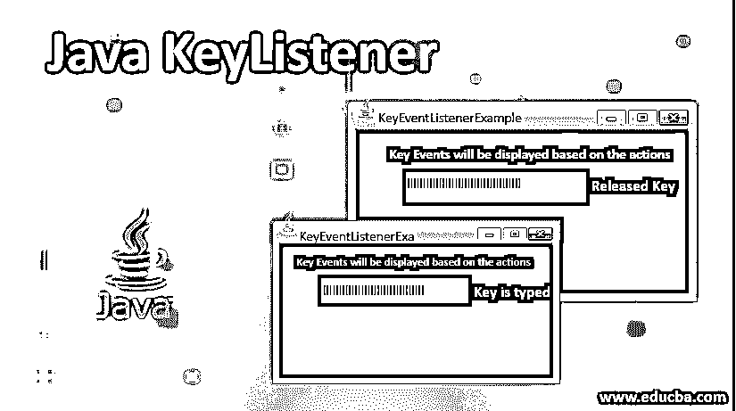
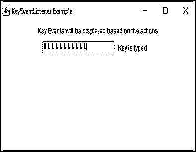
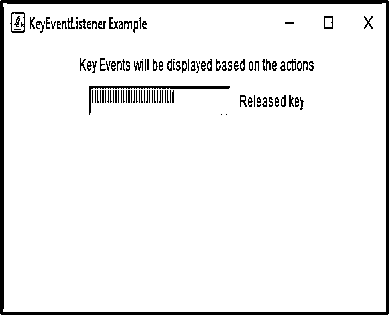
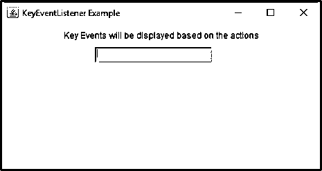
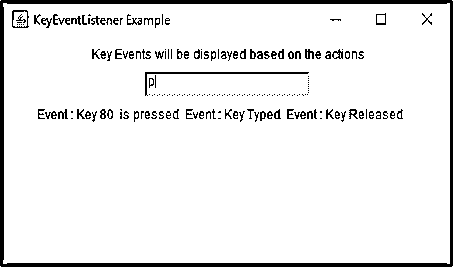
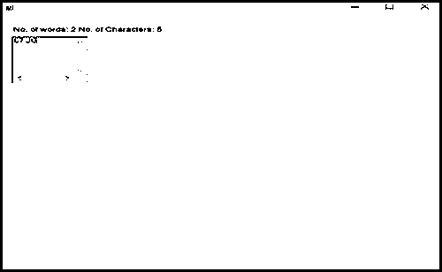

# Java KeyListener

> 原文：<https://www.educba.com/java-keylistener/>




## Java KeyListener 简介

在 Java 中，当键状态发生变化时，KeyListener 类会得到通知。这些状态包括按下、释放和类型。当您的应用程序需要添加按键上的某些功能，并且需要监控任何键盘活动时，这一点尤其有用。KeyListener 通过使用 implements 关键字工作，这可以从 java.awt.event 包中检索到。

**声明:**

<small>网页开发、编程语言、软件测试&其他</small>

可以使用以下语法声明 Java KeyListener 接口。

```
Public interface KeyListener extends EventListener
```

### Java KeyListener 方法

以下是常用的方法:

*   **按键** **(** **按键事件** **ev):** 该方法在按键被按下时被调用。
*   **key released****(****key event****ev):**当一个键被释放时，这个方法会被调用。
*   **Key typed****(****Key event****ev):**当键被键入时，该方法将被调用。

### Java KeyListener 是如何工作的？

以下几点说明了工作原理:

*   当有一个类必须处理某些关键事件时，该类中应该有一个对象来帮助实现接口。
*   由于该对象已经使用 addKeyListener 方法向侦听器注册，因此将在按键的按下、键入和释放状态下生成一个事件。
*   这将有助于调用监听器对象中的相关方法。
*   调用之后，KeyEvent 被传递给它。

### 例子

在下面的文章中，我们将会看到 Java 是如何被用来监控应用程序中发生的关键事件的。

#### 示例#1

Java 程序来演示 KeyListener。

**代码:**

```
import java.awt.FlowLayout;
import java.awt.Frame;
import java.awt.Label;
import java.awt.TextField;
import java.awt.event.KeyEvent;
import java.awt.event.KeyListener;
public class JavaKeyListenerExample implements KeyListener
{
Label lb1, lbl2, lb;
TextField tf1;
Frame fr;
String s;
JavaKeyListenerExample()
{
//create a frame
fr = new Frame("KeyEventListener Example");
//create labels lb1, lbl2 and lb
lb1= new Label(" Key Events will be displayed based on the actions", Label.*CENTER*);
lbl2= new Label();
lb= new Label();
//create a text field
tf1 = new TextField(20);
//set the layout for frame
fr.setLayout(new FlowLayout());
//add label 1 to the frame
fr.add(lb1);
//add textfield to the frame
fr.add(tf1);
//add label 2 to the frame
fr.add(lbl2);
//on clicking the button, text field data will be read
tf1.addKeyListener(this);
//set the size of frame
fr.setSize(460,250);
//set the visibility as true
fr.setVisible(true);
}
//events to be done on pressing key
public void keyPressed(KeyEvent ev)
{
lbl2.setText("Pressed Key");
}
//events to be done on releasing key
public void keyReleased(KeyEvent ev)
{
lbl2.setText(" Released key");
}
//events to be done on typing key
public void keyTyped(KeyEvent ev)
{
lbl2.setText("Key is typed");
//set the visibility as true
fr.setVisible(true);
}
public static void main(String[] args)
{
new JavaKeyListenerExample();
}
}
```

**输出:**

这个程序只是显示正在发生的关键事件。当输入任何内容时，标签将在此基础上显示。







#### 实施例 2

这个 Java 程序演示了键盘监听器，在控制台上显示某些按键事件的文本和按键代码

**代码:**

```
//Java program to demonstrate the KeyListener with texts displaying on certain Key events along with the key code
import java.awt.FlowLayout;
import java.awt.Frame;
import java.awt.Label;
import java.awt.TextField;
import java.awt.event.KeyEvent;
import java.awt.event.KeyListener;
public class JavaKeyListenerExample implements KeyListener
{
Label lb1, lbl2;
TextField tf1;
Frame fr;
String s;
JavaKeyListenerExample()
{
//create a frame
fr = new Frame("KeyEventListener Example");
//create labels lb1 and lbl2
lb1= new Label(" Key Events will be displayed based on the actions", Label.*CENTER*);
lbl2= new Label();
//create a text field
tf1 = new TextField(20);
//set the layout for frame
fr.setLayout(new FlowLayout());
//add label 1 to the frame
fr.add(lb1);
//add textfield to the frame
fr.add(tf1);
//add label 2 to the frame
fr.add(lbl2);
//on clicking the button, text field data will be read
tf1.addKeyListener(this);
//set the size of frame
fr.setSize(460,250);
//set the visibility as true
fr.setVisible(true);
}
//events to be done on pressing key
public void keyPressed(KeyEvent ev)
{
s= "Event : Key " + ev.getKeyCode() + "  is pressed ";
//set the text as label
lbl2.setText(s);
//set the visibility as true
fr.setVisible(true);
}
//events to be done on releasing key
public void keyReleased(KeyEvent ev)
{
s+=" Event : Key Released ";
//set the text as label
lbl2.setText(s);
//set the visibility as true
fr.setVisible(true);
s="";
}
//events to be done on typing key
public void keyTyped(KeyEvent ev)
{
s+=" Event : Key Typed ";
//set the text as label
lbl2.setText(s);
//set the visibility as true
fr.setVisible(true);
}
public static void main(String[] args)
{
new JavaKeyListenerExample();
}
}
```

**输出:**

在执行代码时，将出现一个带有标签的文本字段，如图所示。




一旦按下一个键，键号和发生的相应事件也将显示在下图中。




#### 实施例 3

这个 Java 程序演示了带有单词的 KeyListener，它的计数和字符数。

**代码:**

```
//Java program to demonstrate the KeyListener with words, its count and nuber of characters
import java.awt.Frame;
import java.awt.Label;
import java.awt.TextArea;
import java.awt.event.KeyEvent;
import java.awt.event.KeyListener;
public class JavaKeyListenerExample extends Frame implements KeyListener{
//label
Label lbl;
//text area
TextArea a;
JavaKeyListenerExample(){
//create a label
lbl=new Label();
//set the bounds for label
lbl.setBounds(30,50,210,30);
//create a text area
a=new TextArea();
//set the bounds for text area
a.setBounds(30 , 80 , 100 , 100);
a.addKeyListener(this);
//add label
add(lbl);
//add text area
add(a);
//set the size
setSize(600,600);
//set layout
setLayout(null);
//set the visibility as true
setVisible(true);
}
public void keyPressed( KeyEvent ev ) {
}
//on releasing the key
public void keyReleased( KeyEvent ev )
{
//get the text typed in text area
String t=a.getText();
//split the text
String w[]=t.split("\\s");
//set the text as label
lbl.setText("No. of words: "+ w.length +" No. of Characters: "+ t.length() );
}
public void keyTyped( KeyEvent ev ) {
}
//main method
public static void main(String[] args) {
new JavaKeyListenerExample();
}  }
```

**输出:**




成功执行代码后，将显示单词和字符的总数。

### 结论

它是一个类，当按键状态发生变化时，比如按键、键入或释放，它会得到通知。更多细节，如声明、方法、工作和该接口的实现将在本文档中详细讨论。

### 推荐文章

这是一个 Java KeyListener 的指南。在这里，我们讨论介绍以及它如何与不同的例子和它的代码实现一起工作。您也可以阅读以下文章，了解更多信息——

1.  [Java 中的适配器类](https://www.educba.com/java-adapter-classes/)
2.  [Java 中的字符串缓冲类](https://www.educba.com/stringbuffer-class-in-java/)
3.  [Java 中的 Else-If 语句](https://www.educba.com/else-if-statement-in-java/)
4.  [Java 流过滤器](https://www.educba.com/java-stream-filter/)


