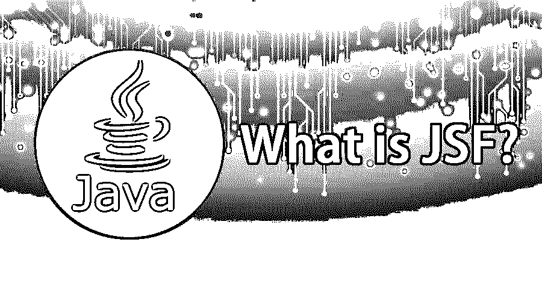

# 什么是 JSF？

> 原文：<https://www.educba.com/what-is-jsf/>

## JSF 简介

JavaServer Faces (JSF)是用于构建 Web 应用程序的标准 Java 技术。通过提供基于组件的方法，开发 Java web 接口变得更加容易。它允许访问服务器端的数据和逻辑。JavaServer Faces 本质上是一个 XML 文档，它以 rational 树的形式指定正式的组件。JSF API 提供了命令按钮、输入文本等组件。并且还帮助管理它们的状态。JSF 组件由 Java 对象支持，并有几个 Java 工具，包括数据库、标记库和远程 API。JSF 标签库在网页上添加组件，并将它们与服务器上的对象相连接。

JavaServer Faces 吸引了各种各样的开发人员，因为“业务开发人员”发现 JavaServer Faces 的开发因为拖放用户界面(UI)组件而变得简单，而“系统设计人员”因为健壮的 JSF API 而获得了无与伦比的编程灵活性。JSF 在其架构中使用了[模型-视图-控制器](https://www.educba.com/what-is-mvc/) (MVC)设计模式，为应用程序提供了更好的可维护性。

<small>网页开发、编程语言、软件测试&其他</small>

JavaServer Faces 框架背后的主要思想是封装(或包装)HTML、CSS 和 JavaScript 等客户端技术，允许开发人员或设计人员在不与这些技术进行太多交互的情况下构建 web 界面。JSF 的最新版本 JSF2 使用 Facelets 作为默认的模板系统。

### 特征

JavaServer Faces 的特性如下:

**1。基于组件的框架:** JavaServer Faces 提供内置的组件来帮助构建 web 应用程序。HTML5，Facelet 标签等。可以使用。

**2。Facelets 技术实现:** JavaServer Faces 使用 Facelets 作为其默认的视图处理程序技术。Facelets 是一个开源的 web 模板系统。它支持所有 JSF 用户界面组件，并专注于为 JSF 应用程序创建视图。

**3。表达式语言集成:**表达式语言为 UI (web 页面)与应用程序逻辑(托管 beans)的通信提供了一个重要的机制。

**4。支持 HTML5:** JSF2.2 提供了一种将 HTML5 的属性包含到 JSF 组件中的方法。

**5。简单快捷的 web 开发:**它提供了丰富的内置库和工具，可以用来快速开发 Web 应用程序。

**6。提供国际化:**这允许为不同地区创建不同语言的应用程序。

**7。Bean Annotations:**Annotations 特性是由此提供的，它有助于验证受管 Bean 中的任务，而不是 HTML 页面中的任务。

**8。默认异常处理:**有 JavaServer Faces 提供的默认异常处理来开发无 bug 的应用。

**9。模板化:**模板有助于增加这些组件的可重用性。

10。内置 AJAX 支持: AJAX 支持是由 JSF 提供的，它帮助我们在不刷新页面的情况下向服务器端提交请求。

### 它是如何工作的？

由于以组件为中心的 UI 模型设计，JSF 使用了被称为视图模板或 Facelet 视图的 XML 文件。这些 Facelets 处理请求、加载准确的视图模板、开发组件树、处理事件并向客户端呈现响应。组件的状态在每个请求终止时保存在一个称为 States saving(transient property = true)的过程中，并在下次创建该视图时恢复。对象及其状态可以由客户端或服务器端保存。

JavaServer Faces 经常与 Ajax 一起使用。Ajax 是应用程序开发技巧和技术的结合，使丰富的 ui 成为可能。Ajax 支持的组件很容易添加，以改善基于 JSF 的用户界面，因为 JSF 援助几种输出格式。JSF 2.0 的设计通过提供 Ajax 事件的开发接口来提供对 Ajax 的内置支持，允许客户端触发的任何事件通过适当的验证，以便可以调用其方法，然后通过 XML DOM 更新将结果返回给浏览器。

### JSF 的好处

以下是 JSF 的一些好处:

*   它在任何 web 应用程序的行为和表现之间提供了一个清晰的分离。我们可以清楚地创建业务逻辑和用户界面逻辑。
*   这些 API 位于 Servlet API 的顶层。这使我们能够使用多种表示技术，也有助于我们创建自己的定制组件。
*   它的设计是这样的，在 Facelets 的帮助下，它允许我们创建可重用的组件，这反过来有助于提高生产率和一致性。
*   JavaScript 代码作为组件的一部分嵌入在 JSF 中。这让开发人员不那么困惑。
*   它有一个称为注释的特性，可以减少我们应用程序的手动配置过程。
*   这为处理组件状态及其数据、确认用户输入和处理事件提供了一个健壮的体系结构。

### JSF 的缺点

以下是 JSF 的缺点:

*   JSF 的学习曲线很陡，这是 JSF 的主要劣势之一。
*   它不适合高性能应用程序。
*   这个阶段侦听器特性是不可用的，因为在阶段侦听器和受管 bean 之间没有紧密的耦合。
*   它是不可伸缩的，因为它使用会话对象在请求中存储组件的状态。

### JSP 将如何帮助职业发展？

这对于将来想要维护遗留应用程序的人来说是有用的，因为 JSF 框架有可能被用在这些应用程序中。要将 JSF 制造的系统移植到更新的技术上，还需要了解 JSF。JSF 帮助我们用更少的代码做更多的事情。除此之外，就职业发展而言，现在推荐使用基于动作的框架，该框架使用 REST 原则来简化和更强大的应用程序，如 Spring MVC。

JSF 通过在不牺牲应用程序灵活性的情况下给出 MVC 设计模式的清晰实现，解决了 Java Web 开发的许多古老问题。此外，因为 JSF 是一个 Java 标准，所以将会继续支持一个高效的开发环境，这将会大大超过其他的开发环境。JSF 有助于简化 UI 开发，但增加了处理请求生命周期的复杂性。

### 推荐文章

这是一个什么是 JSF 的指南。在这里，我们讨论 JSF 的工作、职业发展和福利。您也可以浏览我们推荐的其他文章，了解更多信息——

1.  [Linux 中的 Docker 是什么？](https://www.educba.com/what-is-docker-in-linux/)
2.  [Python 是什么](https://www.educba.com/what-is-python/)
3.  [什么是阿帕奇](https://www.educba.com/what-is-apache/)
4.  [JSF 验证](https://www.educba.com/jsf-validation/)

