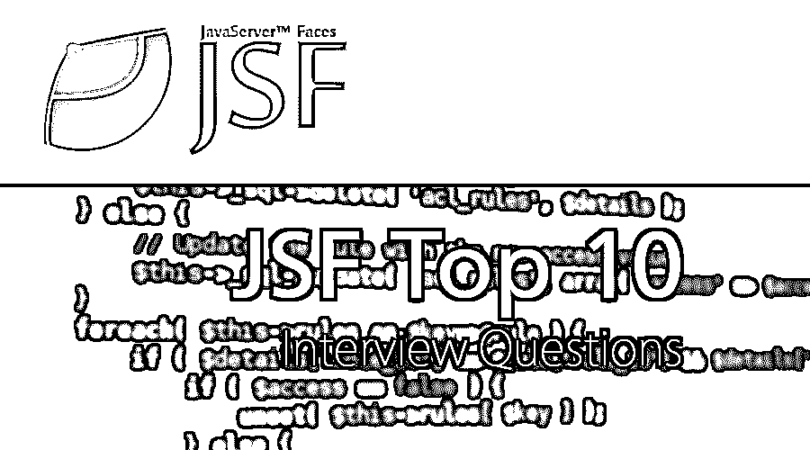

# JSF 面试问题

> 原文：<https://www.educba.com/jsf-interview-questions/>

## JSF 面试问答介绍

JSF (Java Server Faces)是 Java 规范组下的 Oracle 公司提供的 Java 规范，它完全是用 Java 编程语言编写的。JSF 用于基于组件构建网页或用户界面，是 Java 社区过程的标准，是 Java 企业版平台的一部分。它是一种 web 应用程序框架，将与 Java 技术一起用于开发需要用户界面的 web 应用程序。开发的 JSF 页面可以部署在任何符合 Java 企业版的 web 应用服务器上。

JSF 定期从 Oracle 发布稳定的版本，这些规范可以在 Github 存储库站点上获得和托管。JSF 的原始规范要求是在 2001 年提出的。

<small>网页开发、编程语言、软件测试&其他</small>

现在，如果你正在寻找一份与 JSF 相关的工作，那么你需要准备 2022 年 JSF 面试的问题。的确，每个面试都因职位不同而不同，但要通过面试，你仍然需要对 JSF 有一个清晰的了解。在这里，我们准备了重要的 JSF 面试问题和答案，这将有助于你在面试中取得成功。

在这篇 2022 年 JSF 面试问题的文章中，我们将呈现 10 个最重要和最常用的 JSF 面试问题。这些问题将帮助学生建立他们对 JSF 的概念，并帮助他们赢得面试。

### 第 1 部分-JSF 面试问题(基础)

第一部分包括基本的面试问题和答案。

#### 1.什么是 JSF，它是用来做什么的？

**答:**
JSF 是 Java Server Faces 技术和用于开发 web 应用的用户界面框架，是一种基于组件的技术来开发 UI 组件，它是由 Java Community Process 开发并给出规范的。Oracle 对其稳定版本和维护进行维护。该框架是基于 MVC(模型视图控制器)模式开发的，其中该框架位于 V-View，用于根据控制器处理的请求和模型可用的数据显示用户界面。

#### 2.JSF 有什么特色？

**答案:**
JSF 的不同特色是——

*   它是 Oracle 为开发用户界面而开发的标准 UI 框架。
*   基于组件的 UI 框架。
*   事件处理和导航模型。
*   不同的工具和应用服务器支持。
*   快速应用程序开发。
*   在 Servlet AP (Web 组件 API 规范)之上开发
*   易于使用的第三方组件
*   易于与第三方工具集成。

#### 3.JSF 有哪些应用？

**回答:**
JSF 的不同类型的应用程序是——它可以用来轻松地、有组织地开发 web 应用程序。可以在应用程序或 web 服务器中执行不同的安全特性、性能和调优操作来提高 web 应用程序的性能。可以管理不同种类的 bean 元素。

#### 4.JSF 的生命周期是什么？

**答案:**
这是 JSF 面试时问的基本问题。JSF 的生命周期包括如下不同阶段

*   恢复视图
*   应用请求
*   流程事件
*   流程验证
*   更新模型值
*   流程事件
*   调用应用程序
*   流程事件
*   呈现响应

其中生命周期的输入和输出将是来自 web 应用服务器的 Faces 请求和 Faces 响应。

#### 5.有哪些不同的 JSF 赛事？

**答案:**
存在的不同 JSF 事件有动作事件、值变化事件、阶段事件。动作事件是一种处理用户界面模块或组件中的 UI 按钮或点击变化的事件。所有类型的点击都可以在动作事件中处理。值更改事件可以是从 UI 页面更新值的任何类型，如单选按钮、文本字段、下拉列表等。阶段事件是一种在生命周期阶段开始或结束时触发的事件。

### 第 2 部分-JSF 面试问题(高级)

现在让我们来看看高级面试问题和答案

#### 6.JSF 建筑的重要元素是什么？

**答:**
JSF 架构包含不同的元素，比如在服务器端呈现为有状态对象的 UI 组件、构建器或助手类及其验证器、导航处理程序和事件处理程序。应用程序配置和资源文件，用于配置应用程序资源，以管理作为模型的 [JavaBeans](https://www.educba.com/what-is-javabeans/) 组件及其包含的特定于应用程序的行为或功能。定制标签库可用于表示事件处理程序&验证器。自定义标记库也可用于呈现 UI 组件。将存在一个 Faces Servlet 来管理客户端请求和服务器响应，还管理 JSF 视图页面和受管 beans，以及一个在后面的持久性框架来将数据库集成到 web 应用程序。

#### 7.JSF 的豆角是什么？

**答:**
JSF 的 Backing beans 是 Java Beans，用来实现 UI 或前端逻辑，以便管理业务层和 web 服务器层之间的数据流。理想情况下，每个 JSF 页面都有一个后备 bean。在 JSF 1.2 版本中，受管 bean 应该在 JSF 配置文件 facesconfig.xml 中注册，以便使其正常工作。从 JSF 2.0 版本开始，可以避免相同的配置，并且可以使用注释来应用该配置。

#### 8.JSF 的页面导航规则是什么？

**答:**
JSF 规范有自己的一套在 JSF 导航页面时指定的规则。例如，根据点击的按钮或上一个网页或 JSF 页面上的链接，必须显示或重定向哪个视图。存在一组导航规则，以便重定向页面并将数据内容呈现在设备浏览器的网页上。

#### 9.在 JSF 有哪些不同的范围？

**答案:**
这是高级 JSF 面试中问的一个问题。JSF 中可用的不同范围是应用程序范围、会话范围和视图范围。应用程序范围在整个应用程序中使用，以保持整个应用程序中用户的交互。会话范围跨越应用程序中的不同 HTTP 请求，视图范围用于保持用户与应用程序的单个 JSF 页面或视图的交互。使用的不同注释如下。

*   **应用范围**:@应用范围
*   **会话范围:**@会话范围
*   **查看范围:** @ViewScoped

#### 10.在 JSF 有哪些 facelet 标签？

**回答:**
可用的不同 facelet 标签如下:

*   模板
*   习惯
*   因素
*   去除

### 推荐文章

这是一个 JSF 面试问题和答案的列表指南，以便候选人可以轻松地解决这些面试问题。在本帖中，我们研究了 JSF 面试中经常被问到的问题。您也可以阅读以下文章，了解更多信息——

1.  [Java EE 面试问题](https://www.educba.com/java-ee-interview-questions/)
2.  [J2EE 面试问题](https://www.educba.com/j2ee-interview-questions/)
3.  [Javascript 面试问题](https://www.educba.com/javascript-interview-questions/)
4.  [Java 测试面试问题](https://www.educba.com/java-testing-interview-questions/)

