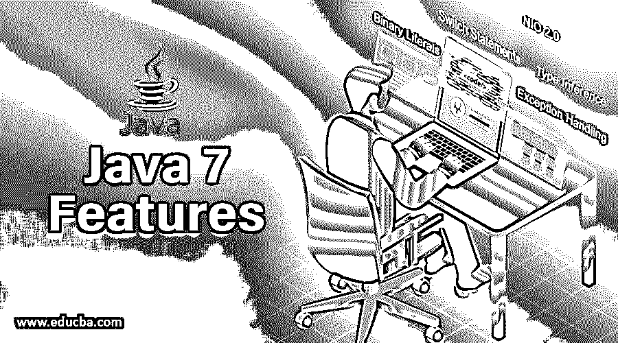

# Java 7 特性

> 原文：<https://www.educba.com/java-7-features/>

## Java 7 特性介绍

众所周知， [Java](https://www.educba.com/what-is-java/) 是一种使用 OOPs 概念的编程语言，它为多个平台生成各种程序。当你编写一个 java 程序时，字节码将在多个操作系统上运行，包括所有的 [Mac OS、Linux、](https://www.educba.com/linux-vs-mac/)和任何 windows 版本。Java 7 的特性非常重要，而且从各方面来看都很容易理解。这个最新版本的 java 有很大的改进，可以得到质量更好的程序。此外，它给你更多的安全性和稳定性，使你可以运行在你的机器上没有任何故障。当你去安装这个 java 7 时，它将确保你的程序安全运行，具有最高的安全率和极大的效率，因为它有巨大的功能。

### Java 7 的特性

Java 7 的特性如下:

<small>网页开发、编程语言、软件测试&其他</small>

#### 1.二进制文字

这是 java 7 的第一个特性，非常容易理解。众所周知，二进制以简单的术语“0”和“1”而闻名。但在 java 7 中它有其不同的二进制格式，简而言之，它用前缀‘0B’或‘0B’以二进制格式表示文字部分。这里你可以使用八进制值。我们必须明确我们是否必须使用 byte，short，int 和 long。

#### 2.Switch 语句中的字符串

Switch 语句是所有[编程语言](https://www.educba.com/best-programming-languages/)中的基本语句，它们的语法在所有语言中是不同的，它只针对两个值 i.e.int 和枚举类型。java 7 有一些额外的特性，所以在 switch 语句中，它也有改进的版本，简而言之，现在它也支持字符串类。

#### 3.自动资源管理

ARM 是用来提高程序质量的，在 ARM 之前，我们必须使用 finally 块来清理我们的资源，但不是固定的，我们必须只使用 finally 块，但清理资源是必须的，因为它用于防止我们的机器被破坏。Java 7 有很棒的特性，其中一个特性，也就是 ARM 就是用于这个目的的。所有这些清理过程都可以自动完成，我们不需要显式的资源清理。我们所要做的只是简单地初始化 try-with-resources 块中的资源，即(try (…) {…})。

#### 4.多重异常处理

如果我们看看异常处理部分，Java 7 是一个有很大改进的版本。它主要表示为抑制异常和在 catch 块中捕获多个异常。如果我们考虑名字中隐藏的异常，很明显这些异常可以被忽略，这不会产生任何问题。捕捉多个异常可以帮助您处理多个异常，因为在这个 java 7 之前，我们被限制为只有一个 Catch 块，现在我们可以利用这一点来满足我们的需求。

#### 5.改进的类型推理

以前当我们使用泛型时，我们必须为变量的类型和实际类型提供参数。随着 java 7 特性的增强，它已经有了很大的改进。这里的编译器足够智能，可以识别所有类型。

#### 6.NIO 2.0

它引入了各种特性，其中之一是 NIO 2.0，它通常被称为文件。它改变了 java 的文件格式，现在它主要作为 java.nio.file 包引入，该包也有其相关的包和属性，即 java.nio.file.attribute。它始终需要支持 I/O 文件系统。它包含了一些基本且重要的类，即 path 类，用于以自己的方式表示操作系统中的路径值，并且它[支持所有的 API](https://www.educba.com/what-is-api-in-java/) 。

### 结论

从所有这些，我们可以得出结论，java 7 有自己的特点，这对我们的基本编程非常有益。java 7 的所有特性都有自己的工作方式，这将帮助我们在有限的时间内以无错误的方式编写代码。

### 推荐文章

这是 Java 7 特性的指南。在这里，我们讨论 java 7 的 6 大特性，包括二进制文字、switch 语句中的字符串、自动资源管理等。您也可以阅读以下文章，了解更多信息——

1.  [在 JavaScript 中设置](https://www.educba.com/set-in-javascript/)
2.  [JavaFX HBox](https://www.educba.com/javafx-hbox/)
3.  [Java class not found exception](https://www.educba.com/java-classnotfoundexception/)
4.  [Java URLConnection](https://www.educba.com/java-urlconnection/)

