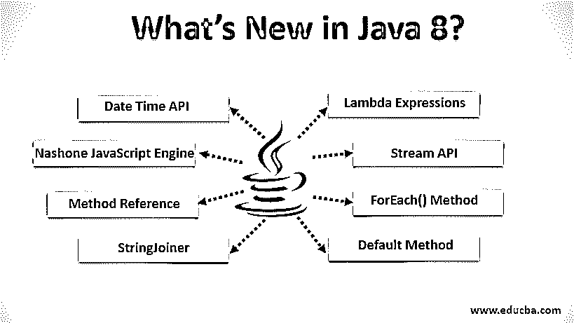

# Java 8 有什么新特性？

> 原文：<https://www.educba.com/whats-new-in-java-8/>




## Java 8 简介

众所周知，Java 是最强大的编程语言之一。2014 年 3 月 18 日，Oracle 发布了 Java 的新版本 Java SE 8。这个创新的 Java 版本主要用于软件开发平台。Java 8 中有几个特性是对现有版本的编程库、JVM 和工具的更新。据说最重要的特性是 lambda 表达式的引入，我们将会看到它和其他特性。

### Java 8 的新特性

对于 Java 编程，Java SE 8 提供了大量的特性。

<small>网页开发、编程语言、软件测试&其他</small>

*   λ表达式
*   蒸汽 api
*   ForEach()方法
*   默认方法
*   日期时间 API
*   Nashorn JavaScript 引擎
*   方法引用
*   弦乐演奏者

#### 1.λ表达式

Lambda expression 是一个匿名函数(没有名字的函数),它有助于以某种函数风格编写代码。单一抽象方法(SAM)可以通过使用表达式以清晰简洁的方式实现。由于数据可以迭代、过滤和提取，因此非常有用，尤其是在收藏库中。Lambda 表达式还有助于降低代码的复杂性。下面是 lambda 表达式的语法:

**语法:**

```
(Parameters) -> Expression
```

**代码:**

```
( a, b ) -> a + b // Expression takes 2 parameters and return the sum.
```

#### 2.steam api

Stream API 提供了一种以不同方式进行数据处理的技术，如过滤、提取、转换等。在 java.util.stream 包的帮助下，没有必要将 java.util.streams 与 Java InputStreams 或 OutputStreams 混淆，因为它们之间没有关系。Stream API 的一个主要优点是它不会改变它的源代码。即，如果一组数据被过滤，新的一组数据用过滤的数据创建，而不是修改原始源。Stream API 仅在需要时评估代码，并且不会多次迭代代码。如果必须进行迭代，则必须生成新的流。有几个预定义的方法来支持这一点。要迭代流，可以使用下面的代码。

**代码:**

```
Stream.iterate(1, elem->elem+1)
```

#### 3.ForEach()方法

为了迭代集合框架，Java SE8 提供了一个名为 forEach 的新方法，该方法在 Iterable 接口中定义。ForEach()循环可以在扩展接口 Iterable 的集合类中使用。由于该方法输入单个参数，lambda 表达式也可以作为参数传递。

**代码:**

```
age.forEach( age -> {  System.out.println(age); }); //each age is taken and printed
```

#### 4.默认方法

通常，非抽象方法不能添加到接口中。但是，在 Java 8 的情况下，它允许在接口中添加这些方法。这些方法是用关键字 default 编写的，称为默认方法。因为它们是非抽象方法，所以也可以包含方法体。有趣的是，这个特性还确保了与旧版本代码的二进制兼容性。

**代码:**

```
public interface Moveable {
default void Sound(){
System.out.println("Hi Anna, How is my sound?");
}}
```

#### 5.日期时间 api

在 Java 8 中，引入了新的时间 API 和日期 API，与其他版本的 Java 相比，处理日期的方法不同。这些类也被称为 JSR-310，310。

以下是 Java 中可用的时间和日期类。时间包:

*   Jtime。LocalDate 类
*   [本地时间类](https://www.educba.com/java-localtime/)
*   [局部日期时间类](https://www.educba.com/java-localdatetime/)
*   月班
*   偏移时间等级
*   [OffsetDateTime 类](https://www.educba.com/java-offsetdatetime/)
*   时钟类
*   ZonedDateTime class
*   ZoneId 类
*   ZoneOffset 类
*   年级群
*   年月类
*   周期类
*   持续时间类别
*   即时课堂
*   DayOfWeek enum
*   月份枚举

**代码:**

```
Clock cl = Clock.systemDefaultZone();
System.out.println(cl.getZone());
```

#### 6.Nashorn Javascript 引擎

Nashorn 是一个 JavaScript 引擎，帮助动态地执行 Java 虚拟机(JVM) 中的 JavaScript 代码。可以使用下面提到的两种方法来完成。

*   在命令行工具 jjs 的帮助下。
*   通过在 Java 源代码中设置它。

为了使用 jjs 命令行工具执行，可以执行以下步骤。

*   创建一个. js 文件。
*   将以下代码写入并保存到文件中。

**代码:**

```
var welcome = function(){
print("welcome to Nashorn Javascript Engine");
};
welcome ();
```

*   开放式命令行终端。
*   编写命令 jjs welcome.js 并单击 enter。
*   一旦命令被执行，下面的输出将被显示。

**输出**:


#### 7.方法引用

方法引用是 Java 8 中引入的另一个特性，可以在函数接口方法中使用[。换句话说，可以说它们是另一个 java 特性 lambda 表达式的子集。这是因为如果可以使用 lambda 表达式，也可以使用方法引用。](https://www.educba.com/functional-interface-in-java/)

**方法可以是:**

*   对构造函数的引用
*   静态方法的引用
*   对实例方法的引用

对静态方法的引用如下所示

**代码:**

```
Thread t=new Thread(ExampleClass::ThreadStatusMethod);
t.start();
```

#### 8.弦乐演奏者

Java 8 中增加了一个新的 final 类 StringJoiner。util 包。可以用逗号(，)、连字符(-)等分隔符来分隔字符序列。

**代码:**

```
StringJoiner Names = new StringJoiner("-"); // Here, delimiter is -
// Adding names  to StringJoiner
joinNames.add("Anna");
joinNames.add("Adam");
```

**输出:**


### 安全增强措施

除了这些特性，Java SE8 还做了其他一些安全性增强。

*   公钥加密标准 11 [(PKCS](https://www.educba.com/pkcs/) )已经扩展到包括对操作系统 Windows 的 64 位支持。
*   对于 UNIX 平台，提供了两种新的实现。它提供阻塞和非阻塞行为。
*   在 SunJCE provider 中，还添加了 AES 和 PBE 算法，如 PBEWithSHA256AndAES_128 和 PBEWithSHA512AndAES_256。
*   Java SE 8 支持服务器名称指示(SNI)扩展，该扩展扩展了 TLS/SSL 协议，以便在握手期间进行连接，从而支持服务器应用程序。

### 结论

Java SE8 是 Oracle 开发的 Java 新版本，它提供了几个特性。λ表达式被认为是其中最重要的特征。在本文档中，详细解释了 Java SE 8 的特性和安全性增强。

### 推荐文章

这是一本关于 java 8 新特性的指南？这里我们讨论新 java 8 的八个不同的特性。您也可以浏览我们的其他相关文章，了解更多信息-

1.  [Java 编程中的数组](https://www.educba.com/arrays-in-java-programming/)
2.  [基数排序 Java](https://www.educba.com/radix-sort-java/)
3.  [Java 8 中的可选类](https://www.educba.com/optional-class-in-java-8/)
4.  [Java 中的守护线程](https://www.educba.com/daemon-thread-in-java/)


