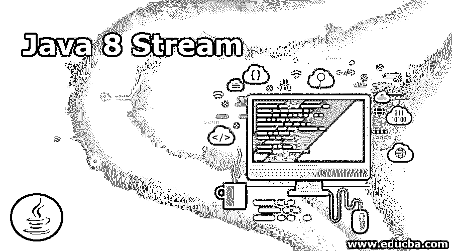

# Java 8 流

> 原文：<https://www.educba.com/java-8-stream/>

## Java 8 流简介

流是从源开始按顺序排列的一些元素的集合，形成一个聚合，其中源可以是一个数组或集合，为流提供数据。Java 8 streams 也以相同的原理工作，这意味着它基本上是一个原型或数据结构，将按顺序组织和设计，以按需执行和操作所需的数据。这些流是生成的，但对最终用户是不可见的，最终用户预测它总是在后台而不是在前台执行，但活动确实存在。

**语法:**

<small>网页开发、编程语言、软件测试&其他</small>

可以使用集合接口的两种方法通过集合来执行流的生成，集合接口描述如下:

`List<String> strings = Arrays.asList("abc", "" , "bc", "efgh" , "");
List<String> filtered = Strings.stream().filter(string - > !string.isEmpty()).collect(collectors.toList());`

**关联的退货类型如下:**

*   **stream():** 它返回一个流序列，其顺序将集合视为计算的源。
*   **parallelStream():** 返回并行流，该并行流也将集合视为其计算列表的素根。

它由许多其他方法组成，这些方法也遵循流组成集合的生成，这些方法包括:forEach、map、filter、limit 等。

### Java 8 中的 stream 是如何工作的？

Java 中的正常流概念分别由输入流和输出流组成。但是 java 8 中引入的流概念以不同的方式支持和表现。在计算和操作方面，它有自己的观点。Java 8 中引入的 Streams 是一个新的抽象层，它可以以声明的方式处理数据，就像为 SQL 查询或语句执行查询一样。开发人员使用集合框架或任何其他数据结构所面临的困难导致了执行重复检查和复杂循环的整个任务。此外，使用 Java8 流，可用于在处理器中编写并行代码的多核处理器变得简单易行。

java 8 中的 Stream 为其数据流定义了一个顺序和序列。输入作为一个对象被提供，该对象支持一些与聚合和合成相关的操作。这些输入具有一些特征，描述如下:

### Java 8 流的特点

以下是 java 8 中 Stream 的特性:

*   **Sequencing Stream:** 流中的所有元素都遵循一个序列和一个顺序，该序列和顺序按需计算一些元素，并且从不以传统方式存储这些元素。
*   **Source:** 作为输入的数据，这意味着 stream 接受集合、数组或 I/O 资源。
*   **聚合和合成:**聚合操作持续与流相关联，包括过滤、映射、限制、减少等操作。
*   **自动化 Mmanner 中的迭代:**集合涉及迭代，它要求元素在外部操作，但在内部执行迭代，它涉及并利用源元素，源元素用于作为输入馈入流中。
*   **管道化:**顾名思义，管道化是一种模式，其中生成的流自己返回，然后它们不向目标返回任何输出。此外，它利用中间操作在一些计算之后返回输出。它还包括另一个方法，即 collect()方法，用于终止流水线上的流生成操作，通常在整个流水线流的末尾找到。

### java 8 中的流方法

有许多方法用于计算流中的每个元素，例如:

*   **For each:** 该方法用于流元素的迭代。
*   **过滤:**过滤的方法是根据一定的条件和约束来剔除元素。
*   **Limit:** 这个方法用来减少整个流的元素大小。
*   **Sorted:** 这个方法作为输入流的一部分，以一种用于流排序的方式工作。
*   **并行处理:**并行处理有一个替代方案，即并行流，它可以在顺序流和并行流之间轻松切换。
*   **收集器:**执行字符串的组合，用于处理流的元素。它还返回一个列表或字符串作为返回类型。
*   **统计:**这是 java 8 Streaming 之外的一个特殊功能，用于计算所有的流统计结果。

### Java 8 流的实现实例

下面是 Java 8 流的例子:

#### 示例#1

这个程序是一个在执行 Java 流表达式之前演示列表、数组和组件的例子。

**代码:**

`import java.util.ArrayList;
import java.util.Arrays;
import java.util.List;
public class Stream_Expression_Java {
public static void main(String[] args) {
List<String> lines = Arrays.asList("Science", "Chemistry", "Maths");
List<String> result = getFilterOutput(lines, "Maths");
for (String temp11 : result) {
System.out.println(temp11);
}
}
private static List<String> getFilterOutput(List<String> lines, String filter) {
List<String> result = new ArrayList<>();
for (String line : lines) {
if (!"Chemistry".equals(line)) {
result.add(line);
}
}
return result;
}
}`

**输出:**

#### 实施例 2

这个程序用数组、列表和列表中的组件列表说明了 Java8 流表达式，其中列表组件在流和过滤的帮助下被转换成最终输出。

**代码:**

`import java.util.Arrays;
import java.util.List;
import java.util.stream.Collectors;
public class Java8StreamingStarted {
public static void main(String[] args) {
List<String> lines = Arrays.asList("Walnut", "Apricot", "almond");
List<String> result = lines.stream()
.filter(line -> !"almond".equals(line))
.collect(Collectors.toList());
result.forEach(System.out::println);
}
}`

**输出:**

#### 实施例 3

这个程序用于使用 Java 8 流将普通的字母数组转换成大写字母数组。

**代码:**

`import java.util.ArrayList;
import java.util.Arrays;
import java.util.List;
import java.util.stream.Collectors;
public class java_8_Stream {
public static void main(String[] args) {
List<String> alphabets = Arrays.asList("p", "q", "r", "s");
List<String> alphabet_Upper = new ArrayList<>();
for (String s : alphabets) {
alphabet_Upper.add(s.toUpperCase());
}
System.out.println(alphabets);
System.out.println(alphabet_Upper);
List<String> collect = alphabets.stream().map(String::toUpperCase).collect(Collectors.toList());
System.out.println(collect);
List<Integer> num = Arrays.asList(3,4,5,6,7,8);
List<Integer> collect1 = num.stream().map(n -> n * 2).collect(Collectors.toList());
System.out.println(collect1);
}
}`

**输出:**

### 结论

不同于为 Java 运行的输入流和输出流。Java 8 中的流是完全不同的，它利用作为抽象层工作的有序数据结构，然后利用用于计算和生成流的 Java 8 流 API。

### 推荐文章

这是一个 Java 8 流的指南。在这里，我们讨论 Java 8 中的介绍和 StreamWorks 的工作原理及其特性，并给出例子和代码实现。您也可以浏览我们推荐的其他文章，了解更多信息——

1.  [Java 工具](https://www.educba.com/java-tools/)
2.  [Java 中的布局](https://www.educba.com/layout-in-java/)
3.  [Java 编译器](https://www.educba.com/java-compilers/)
4.  [Java 中的合并排序](https://www.educba.com/merge-sort-in-java/)

