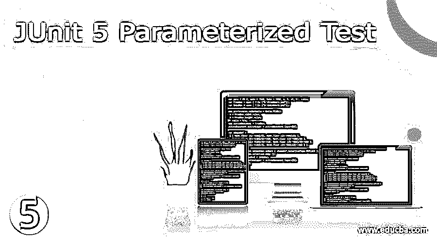
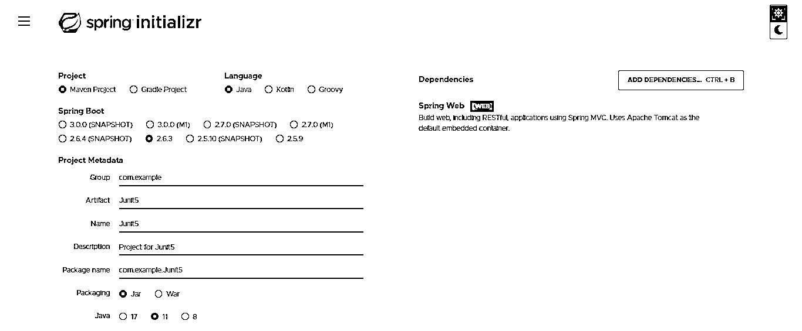
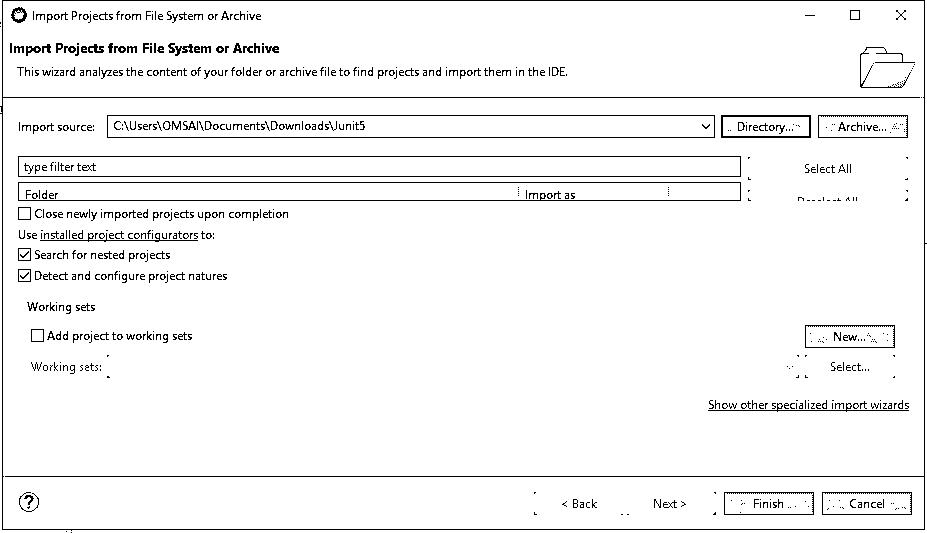
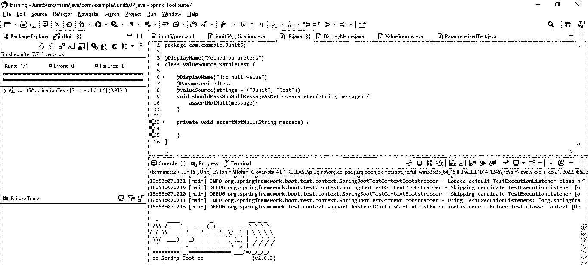

# JUnit 5 参数化测试

> 原文：<https://www.educba.com/junit-5-parameterized-test/>




## JUnit 5 参数化测试简介

JUnit 5 参数化测试是 JUnit 的这些特性之一；我们可以使用这个功能，用不同的设置多次运行相同的测试方法。JUnit 的下一个版本 JUnit 5 增加了许多新功能，使得开发开发人员测试更加容易。JUnit 平台是测试在 JVM 上运行的框架的基础；它还将定义测试引擎 API，该 API 可用于创建基于平台的测试框架。该平台还包括一个控制台启动器，用于从平台测试引擎的命令行启动平台。

### JUnit 5 参数化测试概述

*   流行的 ide 也为 JUnit 平台提供了一流的支持。例如，在 JUnit 5 中，JUnit Jupiter 将新的编程范式与测试编写和扩展的扩展概念相结合。
*   Jupiter 子项目提供了一个测试引擎，用于在平台上执行基于 Jupiter 的测试。
*   JUnit Vintage 附带了一个测试引擎，允许我们运行 JUnit 3，JUnit 4 测试必须安装在类路径或模块路径上。
*   在用 JUnit 5 构建参数化测试之前，我们必须首先保证类路径。
*   如果使用 JUnit-Jupiter 聚合器构件，我们不需要做任何事情，因为所有基本的依赖项都已经添加到了类路径中。
*   JUnit 5，Jupiter 参数化测试允许我们用不同的参数多次运行相同的测试。它们的声明类似于传统的@Test 方法，只是它们没有使用@Test 注释，而是使用@ParameterizedTest 注释。
*   参数化测试允许我们用不同的参数多次运行相同的测试。我们可以快速验证各种情况，而不必为每一种情况编写测试。我们可以在参数化测试中创建一个数据源。
*   我们还需要声明一个测试参数源。这些参数源用各种参数源注释进行了注释。
*   在 JUnit 5 中，参数化测试允许我们用不同的参数多次执行测试。它为开发人员节省了编写和运行测试的时间。我们可以像构建标准 JUnit 5 测试一样构建参数化的 JUnit 5 测试。
*   JUnit 5 参数化测试用于通过使用 JUnit 来测试应用程序值。它是测试我们应用程序的一个非常重要的工具。

### JUnit 5 参数化测试创建类

下面的例子显示了为 JUnit 5 参数化测试类创建一个类如下。

<small>网页开发、编程语言、软件测试&其他</small>

**1。第一步，我们创建一个 spring tool suite 项目模板来创建一个 JUnit 5 参数化测试类。**

在这一步中，我们提供了项目组名称 com.example，工件名称 JUnit5，项目名称 JUnit5，以及选择的 java 版本 8。还有，我们已经定义了弹簧引导版本为 2 . 6 . 3；我们正在 maven 中创建一个项目。

我们在下面的项目中选择了 spring web dependency 来创建一个类。

group–com . example 工件名称–JUnit 5

名称–JUnit 5 Spring boot–2 . 6 . 3

项目–Maven Java–8

包名–com . example . JUnit 5

项目描述-6 月 5 日的项目

依赖性——spring web、PostgreSQL 驱动程序。




**2。第二步，我们使用 spring 工具套件打开 JUnit5 项目。**

在使用 spring 初始化器生成项目之后，我们使用 spring 工具套件打开 JUnit5 项目。




**3。使用 pom.xml 文件检查项目的依赖包。**

在这一步中，我们使用 pom.xml 文件检查所有包的依赖关系。


**4。添加依赖包**

在这一步中，我们将在 pom.xml 文件中添加 JUnit 5 依赖包。

**代码:**

```
<dependency>
<groupId>org.JUnit.jupiter</groupId>
<artifactId>JUnit-jupiter-params</artifactId>
<version>5.8.1</version>
<scope>test</scope>
</dependency>
```


**5。检查创建的类文件**

在这一步中，我们检查类文件是在我们导入的项目中创建的。


### JUnit 5 参数化测试参数源

众所周知，参数化测试使用不同的参数多次运行相同的测试。

以下是论据来源。

**1。简单值—**

我们使用@ValueSource 注释将文字值传递给该方法。

**代码:**

```
public class JP {
return input == null || input.trim ().isEmpty ();
}
}
```


**2。空值和空值-**

在下面的例子中，我们将单个空值传递给参数化的测试方法。

**代码:**

```
@ParameterizedTest
@NullSource
void isBlank_ShouldReturnTrueForNullInputs(String input)
{
assertTrue (Strings.isBlank(input));
}
```


**3。枚举—**

我们使用@EnumSource 的注释来运行一个具有不同枚举值的测试。

**代码:**

```
@ParameterizedTest
@EnumSource (Month.class)
void getValueForAMonth_IsAlwaysBetweenOneAndTwelve(Month month) {
int monthNumber = month.getValue ();
assertTrue (monthNumber >= 1 && monthNumber <= 12);
}
```


**4。CSV 文字–**

假设我们想要验证字符串的 toUpperCase 方法是否返回了预期的大写结果。@ValueSource 是不够的。

**代码:**

```
@ParameterizedTest
@CsvSource ({"spring,SPRING", "sPring,sPring", "Spring,SPRING"})
void toUpperCase_ShouldGenerateTheExpectedUppercaseValue  (String input, String expected) {
String actualValue = input.toUpperCase ();
assertEquals (expected, actualValue);
}
```


### CSV 文件和方法

**1。方法**

使用参数源方法是传递更复杂参数的一种选择。

**代码:**

```
@ParameterizedTest
@MethodSource ("provideStringsForIsBlank")
void isBlank_ShouldReturnTrueForNullOrBlankStrings (String input, boolean expected)
{
assertEquals (expected, Strings.isBlank(input));
}
```


**2。CSV 文件**

我们可以引用实际的 CSV 文件，而不是将 CSV 的值发送到代码中。

**代码:**

```
@ParameterizedTest
@CsvFileSource (resources = "https://cdn.educba.com/JUnit.csv", numLinesToSkip = 1)
void toUpperCase_ShouldGenerateTheExpectedUppercaseValueCSVFile (
String input, String expected) {
String actualValue = input.toUpperCase ();
assertEquals (expected, actualValue);
}
```


### JUnit 5 参数化测试数据

下面是例子如下。

**代码:**

```
@DisplayName ("Method parameters")
class ValueSourceExampleTest {
@DisplayName ("Not null value")
@ParameterizedTest
@ValueSource(strings = {"JUnit", "Test"})
void shouldPassNonNullMessageAsMethodParameter (String message) {
assertNotNull (message);
}
private void assertNotNull(String message) {
}
}
```


使用 JUnit 测试运行应用程序。




### 结论

在 JUnit 5 中，参数化测试允许我们用不同的参数多次执行测试。它们是 JUnit 的这些特性之一；我们可以使用这个功能，用不同的设置多次运行相同的测试方法。

### 推荐文章

这是 JUnit 5 参数化测试的指南。这里我们讨论定义、概述以及如何创建一个类以及 CSV 文件和方法。您也可以看看以下文章，了解更多信息–

1.  [JUnit 5 Maven 依赖](https://www.educba.com/junit-5-maven-dependency/)
2.  [JUnit 参数化测试](https://www.educba.com/junit-parameterized-test/)
3.  朱尼特木星
4.  [JUnit 测试套件](https://www.educba.com/junit-test-suite/)


