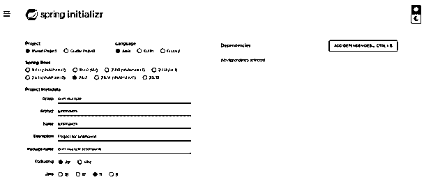
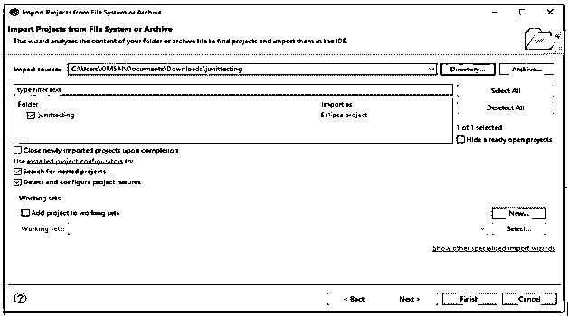
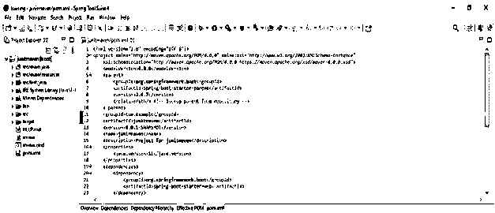
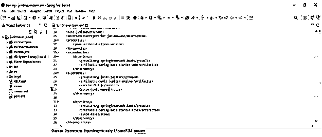
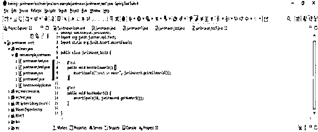
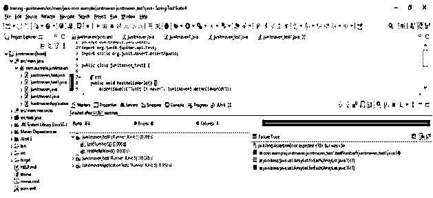
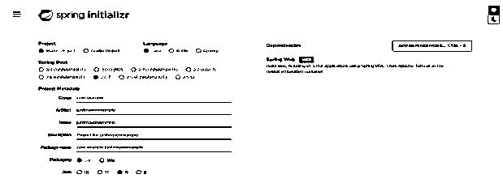
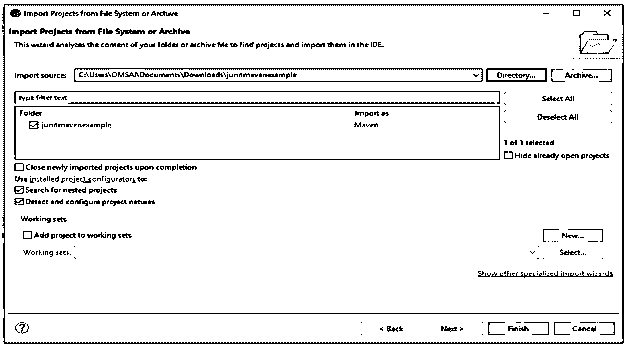
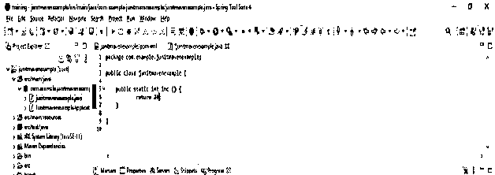
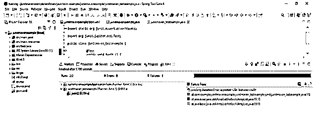

# Maven 中的 JUnit

> 原文：<https://www.educba.com/junit-in-maven/>


## Maven 中 JUnit 的定义

maven 中的 JUnit 用于从我们的项目中所需的 maven 获取所需的依赖关系，该项目中需要多个依赖关系。Maven 将支持三个版本的 JUnit，即 JUnit 3.7、JUnit 4 和 JUnit 4.7+。我们可以选择适合我们项目的版本，我们还需要根据我们在项目中使用的配置参数来选择版本。

### Maven 中的 JUnit 是什么？

*   用于测试运行的 JUnit 2.7 版本和我们选择的算法发生了变化。
*   从 JUnit 2.7 版本开始，所有版本的 JUnit 都运行有效的测试用例，在旧版本中也运行无效的测试用例，它们是令人满意的命名约定。
*   在升级 2.7 版之前的 JUnit 版本时，build 正在运行，标记为 JUnit4。它将执行检查，并通知我们正在运行的任何无效测试。这仅在升级预期测试的检查时与工具一起使用。

### 如何在 maven 中运行 JUnit？

*   它被用来测试测试用例。JUnit 平台将作为在 java 虚拟机(JVM)上测试框架的基础。JUnit 还将定义一个测试引擎 API，用于开发一个在平台上运行的测试框架。
*   JUnit 将提供一个控制台启动器，通过使用命令行和 JUnit 平台套件的引擎来启动平台，以便在平台上使用单个或多个引擎时运行定制套件。
*   下面是展示如何在 maven 中运行 JUnit 的步骤。首先，我们通过使用 spring 初始化器来创建 maven 项目。

1.  第一步，我们在 spring boot maven 中创建 JUnit 的项目模板。我们正在创建项目模板，如下所示。

*   我们已经提供了项目组名为 com.example，工件名为 JUnitmaven，项目名为 JUnitmaven，选择的 java 版本为 11。我们将 spring boot 的版本定义为 2.6.7。

group–com . example 工件名称–JUnit maven

<small>网页开发、编程语言、软件测试&其他</small>

名称–JUnit maven 弹簧靴–2 . 6 . 7

项目–Maven Java–11

包名–com . example . JUnit maven

项目描述 JUnitmaven 项目




2.在这一步中，我们提取下载的项目，并使用 spring 工具套件打开它。

*   在下面的例子中，我们可以看到我们已经提取了项目。然后我们使用 spring 工具套件打开它。




3.在这一步中，我们将检查所有项目结构及其文件，如下所示。此外，我们正在检查 pom.xml 文件是否已创建。假设没有创建这个文件，那么我们需要手动创建相同的文件。在下面的例子中创建了这个文件，所以我们不需要手动创建它。




4.在 maven 项目中添加 JUnit 依赖项。我们正在添加 JUnit 依赖，如下所示。

**代码—**

```
<dependency>
<groupId> org.JUnit.jupiter </groupId>
<artifactId> JUnit-jupiter-engine </artifactId>
<version> 5.3.1 </version>
<scope> JUnit-maven </scope>
</dependency>
```




5.添加 maven 依赖项后，我们正在开发 java 类，通过使用 JUnit maven 运行测试用例，如下所示。

**代码 1—**

```
public class JUnitmaven {
public static int getLucky () {
return 7;
}
}
```

**代码 2:**

```
public class JUnitmaven1 {
public static String getHelloWorld (){
return "JUnit in maven";
}
public static int getNumber5(){
return 5;
}
}
```


6\. After developing the java classes in this step we are developing test classes as follows. In the below example, we are using @Test annotation at the time of developing the test class.

**开发 JUnitmaven 测试类的代码—**

```
public class JUnitmaven_test {
@Test
public void testLucky () {
assertEquals (7, JUnitmaven.getLucky ());
}
}
```

**开发 JUnitmaven1 测试类的代码—**

```
public class JUnitmaven_test1 {
@Test
public void testHelloWorld () {
assertEquals ("JUnit in maven", JUnitmaven1.getHelloWorld());
}
@Test
public void testNumber5() {
assertEquals(10, JUnitmaven1.getNumber5());
}
}
```





7\. After developing all the test cases in this step we are running the test cases by using JUnit maven as follows.




### Maven 示例中的 JUnit

*   下面的例子显示了 maven 中的 JUnit 如下。在下面的例子中，我们使用 maven 项目名作为 JUnitmavenexample。
*   我们已经提供了项目组名 com.example，工件名 JUnitmavenexample，项目名 JUnitmavenexample，选择的 java 版本为 11。我们将 spring boot 的版本定义为 2.6.7。




*   在下面的例子中，我们可以看到我们已经提取了项目。然后我们使用 spring 工具套件打开它。




*   在这一步中，我们将检查所有项目结构及其文件，如下所示。此外，我们正在添加 JUnit 依赖项。我们可以看到，我们在 5.3.1 中使用了 JUnit 版本，我们还使用了 JUnit Jupiter 引擎。

**代码—**

```
<dependency>
<groupId> org.JUnit.jupiter </groupId>
<artifactId> JUnit-jupiter-engine </artifactId>
<version> 5.3.1 </version>
<scope> JUnit-maven </scope>
</dependency>
```


*   在上面的步骤中，我们已经添加了 JUnit 依赖项，现在我们正在开发一个 java 类来使用 JUnit maven 运行测试用例。

**代码—**

```
public class JUnitmavenexample {
public static int inc () {
return 20;
}
}
```




*   在开发了 java 类之后，现在我们正在使用 java 类开发一个测试类。在下面的例子中，我们使用@Test 注释来创建一个测试类。

**代码—**

```
public class JUnitmaven_testexample {
@Test
public void JUnit () {
assertEquals (20, JUnitmavenexample.JUnit1 ());
}
}
```


*   现在我们使用 JUnit maven 运行测试用例，如下所示。




### 结论

用于测试运行的 JUnit 2.7 版本和我们选择的算法发生了变化。maven 中的 JUnit 用于从我们的项目中所需的 maven 获取所需的依赖关系，JUnit maven 项目中需要多个依赖关系。

### 推荐文章

这是 Maven 中的 JUnit 指南。这里我们讨论定义，什么是 maven 中的 JUnit，如何在 Maven 中运行 JUnit，以及代码实现的例子。您也可以看看以下文章，了解更多信息–

1.  [JUnit 代码覆盖率](https://www.educba.com/junit-code-coverage/)
2.  [JUnit 断言异常](https://www.educba.com/junit-assert-exception/)
3.  朱尼特木星
4.  [JUnit assertEquals](https://www.educba.com/junit-assertequals/)


