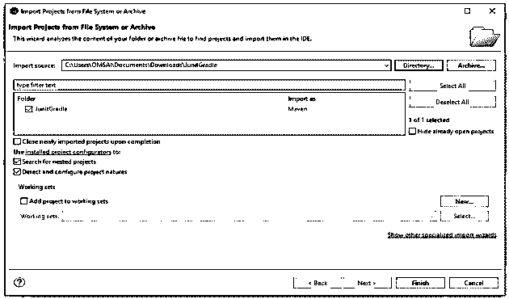
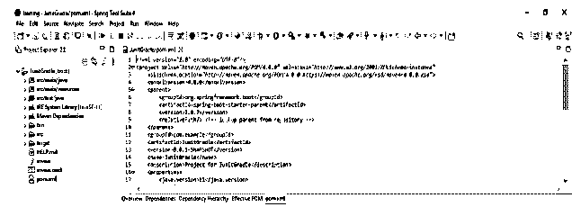
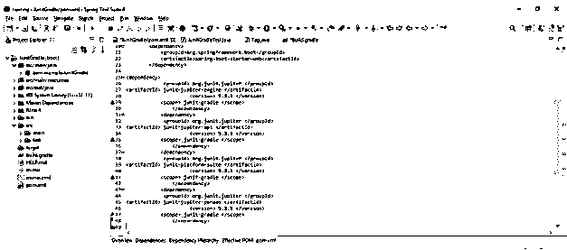
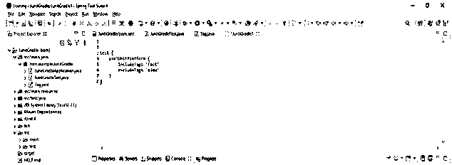
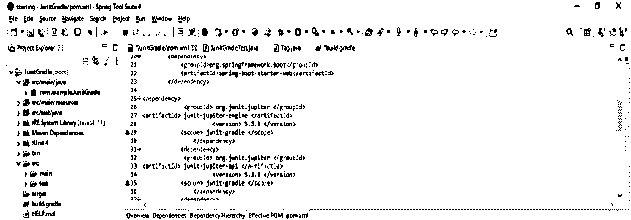
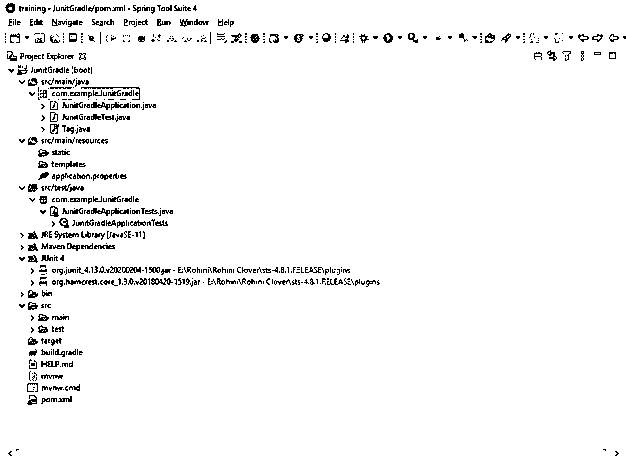

# JUnit 5 Gradle

> 原文：<https://www.educba.com/junit-5-gradle/>


## JUnit 5 Gradle 的定义

Junit 5 gradle 插件是由 Junit 平台开发的，从 4.6 版本开始，gradle 将支持在 junit 平台上执行测试的原生支持。要启用该插件，我们需要在任务名称的声明中指定 useJunitPlatform 函数作为 build。格拉德。我们可以使用“gradle–v”命令来检查 grad le 版本。标准 gradle 测试不会提供专用 DSL 来设置配置。

### 什么是 JUnit 5 Gradle？

*   我们可以通过系统属性或使用 junit-platform.properties 文件在构建脚本中提供配置参数。
*   为了运行测试，测试引擎将类路径用于实现。为了配置对 Jupiter 测试的支持，需要配置测试实现的依赖性。
*   Junit 将使用 java 日志 API 作为 java.util.logging 包来发出调试信息和警告。
*   在使用 junit 5 gradle 时，我们应该在项目中包含 junit-jupiter-api、junit-jupiter-engine、junit-platform-suite 和 junit-Jupiter-params 依赖项。

### 创建 JUnit 5 Gradle

*   我们将项目名称创建为 JunitGradle。
*   我们已经提供了项目组名为 com.example，工件名为 JunitGradle，项目名为 JunitGradle，选择的 java 版本为 11。我们将 spring boot 的版本定义为 2.6.7。

group–com . example
工件名称–JunitGradle
名称–JunitGradle
Spring boot–2 . 6 . 7
项目–Maven
Java–11
包名称–com . example . JunitGradle
项目描述–JunitGradle
T8】项目


<small>网页开发、编程语言、软件测试&其他</small>

*   在这一步中，我们提取下载的项目，并使用 spring 工具套件打开它。




*   在这一步中，我们将检查所有项目结构及其文件，如下所示。此外，我们正在检查 pom.xml 文件是否已创建。假设没有创建这个文件，那么我们需要手动创建相同的文件。在下面的例子中创建了这个文件，所以我们不需要手动创建它。




*   在项目中添加 junit 依赖项。我们正在添加 junit 依赖，如下所示。

**代码—**

```
<dependency>
      <groupId> org.junit.jupiter </groupId>
      <artifactId> junit-jupiter-engine </artifactId>
      <version> 5.3.1 </version>
      <scope> junit-gradle </scope>
</dependency>
<dependency>
      <groupId> org.junit.jupiter </groupId>
      <artifactId> junit-jupiter-api </artifactId>
      <version> 5.3.1 </version>
      <scope> junit-gradle </scope>
</dependency>
<dependency>
       <groupId> org.junit.jupiter </groupId>
       <artifactId> junit-platform-suite </artifactId>
       <version> 5.3.1 </version>
       <scope> junit-gradle </scope>
</dependency>
<dependency>
      <groupId> org.junit.jupiter </groupId>
      <artifactId> junit-jupiter-params </artifactId>
      <version> 5.3.1 </version>
      <scope> junit-gradle </scope>
</dependency>
```




*   在这一步添加了依赖关系后，我们将探索与 junit 5 和 gradle 的集成，如下所示。在下面的例子中，我们在项目中使用了两种类型的测试，即短期运行和长期运行。我们使用 junit 5 @Tag 注释，如下所示。在下面的例子中，我们使用了两个标签，即 slow_tag 和 fast_tag。我们在@Tag 注释中使用的两个标签。我们用@Test 注释为应用程序创建一个测试套件。我们使用 assertEquals 方法来运行项目的测试用例，如下所示。

**代码—**

```
public class JunitGradleTest {
@Tag ("slow")
@Test
public void testAddMaxInteger () {
assertEquals (2147, Integer.sum (2147, 3000));
}

@Tag("fast")
@Test
public void testDivide ()
{
assertThrows (ArithmeticException.class, () -> {
Integer.divideUnsigned (42, 0);
       } );
}
}
```


*   在这一步探索了集成之后，我们告诉构建工具我们正在执行哪些测试。在下面的例子中，我们使用 includeTags 来执行 junit 平台的 slow 和 fast 值。

**代码—**

```
test {
         useJUnitPlatform {
         includeTags 'fast'
         excludeTags 'slow'
         }
}
```




### Junit 5 分级设置

*   要设置 junit 5，我们需要首先在系统中安装 gradle。假设我们已经在系统中安装了 gradle，那么我们使用“gradle–v”命令检查 gradle 的版本。
*   下面的例子说明了如何检查版本。

```
gradle –v
```


*   我们需要一个 gradle 4+更高的版本来使用 junit 5。此外，我们可以使用 build.gradle 文件来配置 gradle。我们可以将以下代码放入 build.gradle 文件中，以使用适用于 junit5 的特定版本的 gradle。

**代码—**

```
test {
        useJUnitPlatform()
}
```


*   在我们的项目中使用上述代码后，junit 5 将采用我们的项目所需的 gradle 的指定版本。
*   检查完 gradle 的版本后，我们在项目中添加如下依赖项。

**代码—**

```
<dependency>
  <groupId> org.junit.jupiter </groupId>
  <artifactId> junit-jupiter-engine </artifactId>
  <version> 5.3.1 </version>
  <scope> junit-gradle </scope>
</dependency>
<dependency>
  <groupId> org.junit.jupiter </groupId>
  <artifactId> junit-jupiter-api </artifactId>
  <version> 5.3.1 </version>
  <scope> junit-gradle </scope>
</dependency>
```




*   添加完依赖项后，我们将为项目创建一个测试套件，如下所示。

**代码—**

```
@Test
public void testAdd ()
{
       assertEquals(35, Integer.sum(13, 25));
}
```


### Junit 5 gradle 项目结构

*   下面是项目结构。项目结构将从主模块开始。




*   在上面的例子中，我们可以看到项目结构是从源开始的，在源模块中包含了主包。
*   在创建新的 java 文件时，它将位于 src/main/java 文件夹下。在上面的例子中，我们用 junit5 创建了一个 spring boot 项目。
*   xml 和 build.gradle 文件在任何项目中添加依赖项和在整个项目中使用依赖项都是非常重要的。
*   为了运行依赖项，我们需要在 pom.xml 文件中添加 junit 平台套件引擎依赖项。
*   项目结构对于理解项目的流程非常有用，它将从一个模块流向另一个模块

### 结论

Junit 将使用 java 日志 API 作为 java.util.logging 包来发出调试信息和警告。Junit 5 gradle 插件是由 Junit 平台开发的，从 4.6 版本开始，gradle 将支持在 junit 平台上执行测试的原生支持。

### 推荐文章

这是 JUnit 5 Gradle 的指南。这里我们讨论定义，什么是 JUnit 5 Gradle，如何创建它，以及代码实现的例子。您也可以看看以下文章，了解更多信息–

1.  [JUnit 测试套件](https://www.educba.com/junit-test-suite/)
2.  朱尼特木星
3.  [JUnit 断言异常](https://www.educba.com/junit-assert-exception/)
4.  [JUnit 参数化测试](https://www.educba.com/junit-parameterized-test/)


