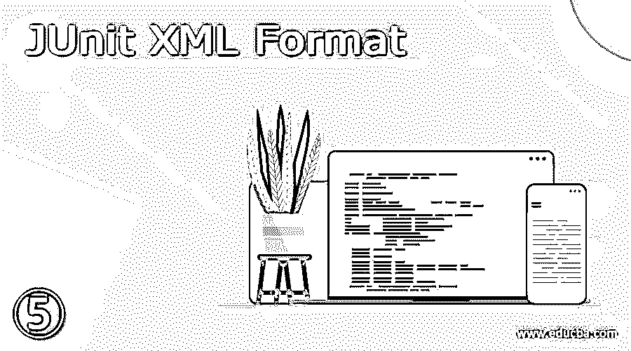
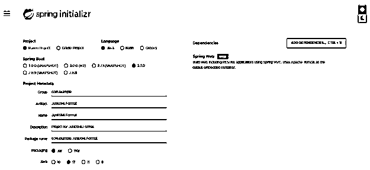
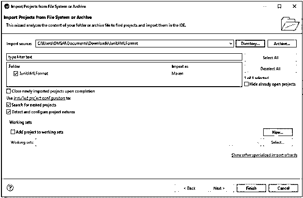
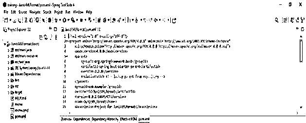
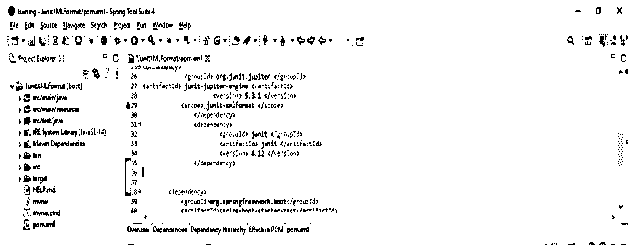
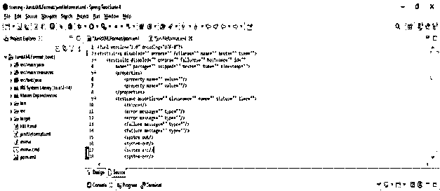
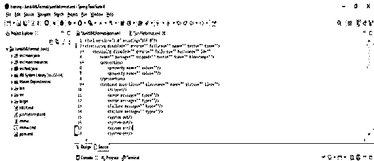
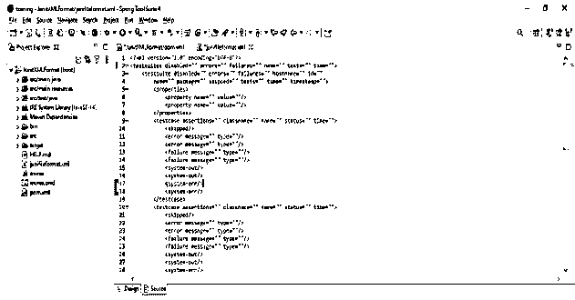
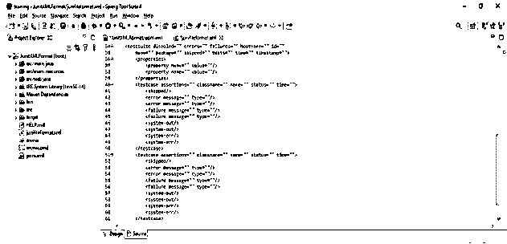
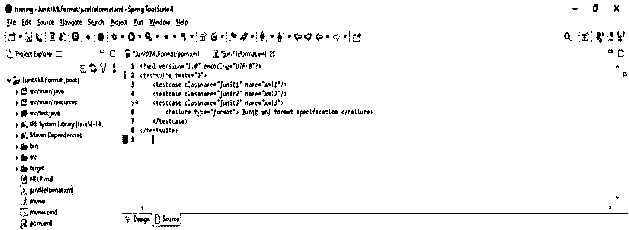

# JUnit XML 格式

> 原文：<https://www.educba.com/junit-xml-format/>




## JUnit XML 格式的定义

Junit xml 格式在许多 java 应用程序中使用，基本上，这个框架被单元测试框架使用。junit 测试将生成一个简单的 xml 文件报告，并创建测试执行。它用于生成自定义的报告，根据测试的要求，我们可以生成报告。

### 什么是 JUnit XML 格式？

*   基本上，junit 框架在 junit 中引入了 xml 文件格式，用于报告测试套件的执行情况。
*   使用 Jenkins 等带有 junit 插件的程序来处理 xml 文件，以显示测试结果。单元测试，它将支持不同类型的格式。正如我们所知，junit 是一个测试框架，它主要关注单元测试。我们可以用 xml 格式编写测试套件输出，我们的测试套件输出将以 xml 格式检索。

### JUnit XML 格式报告文件

*   $eporting 文件由 junit 插件或 Jenkins 的程序处理。网页为我们提供了示例 junit xml 文件格式，它描述了 junit Jenkins 的所有有效元素。
*   它还可以作为其他程序的模板，这些程序用于处理不同风格的不同程序。要使用 junit xml 文件格式，我们需要创建项目我们正在创建使用 junit xml 的 spring boot 项目如下。为了使用报告文件，我们需要创建一个用于测试目的的 java 类。
*   Junit testing 正在为测试执行创建 xml 格式文件。Junit 测试框架是以 xml 文件格式引入的，在测试套件的执行中使用了这种格式。
*   为了测试，junit 将支持不同类型的文件格式，包括 xml 和其他类型的格式。
*   使用 junit 会将每个 xml 文件格式的文件转换成 xml 的结果。正如我们所知，junit 包含测试套件。基本上，测试套件是根据我们在项目中使用的结果将测试聚合在一起的方法。

以下步骤显示了如何创建报告文件，如下所示。我们正在创建 spring 工具套件项目。

<small>网页开发、编程语言、软件测试&其他</small>

*   我们将项目名称创建为 JunitXMLFormat。在这一步中，我们将在 spring boot 中创建项目模板。我们提供的项目组名称为 com。例如，工件名称为 JunitXMLFormat，项目名称为 JunitXMLFormat，选择的 java 版本为 11。我们将 spring boot 的版本定义为 2.7.0。

group–com . example 工件名称–JunitXMLFormat

名称–JunitXMLFormat 弹簧靴–2 . 7 . 0

项目–Maven Java–11

包名–com . example . JunitXMLFormat

项目描述 JunitXMLFormat 项目




*   在这一步中，我们提取下载的项目，并使用 spring 工具套件打开它，如下所示。




*   在这一步，我们检查所有的项目结构和它的文件如下。此外，我们正在检查 pom.xml 文件是否已创建。假设没有创建这个文件，那么我们需要手动创建相同的文件。在下面的例子中创建了这个文件，所以我们不需要手动创建它。




*   在这一步中，我们将添加 junit 依赖项。

**代码—**

```
<dependency>
      <groupId> org.junit.jupiter </groupId>
      <artifactId> junit-jupiter-engine </artifactId>
      <version> 5.3.1 </version>
      <scope> junit-xmlformat </scope>
</dependency>
<dependency>
      <groupId> junit </groupId>
      <artifactId> junit </artifactId>
      <version> 4.12 </version>
</dependency>
```




*   在本步骤中添加了依赖项之后，我们将创建 junit 文件格式报告文件，如下所示。该文件将从 xml 版本 1.0 开始。在添加了版本和 UTF 格式之后，我们正在添加测试套件。添加测试套件后，我们将添加如下属性值。

**代码—**

```
<properties>
<property name = "" value = ""/>
<property name = "" value = ""/>
</properties>
```




*   在此步骤中添加属性后，我们将添加错误消息和失败标记，如下所示。

**代码—**

```
<error message = "" type = ""/>
<error message = "" type = ""/>
<failure message = "" type = ""/>
<failure message = "" type = ""/>
```




*   将所有标签添加到报告文件后，我们的文件如下所示。







### JUnit XML 格式规范

*   我们可以使用 Hudson 作为集成服务器，我们希望使用一个选项来发布 junit 的测试报告。
*   测试框架中的许多应用程序都使用了规格说明。默认情况下，测试将生成 xml 文件格式规范，这是一个用于测试执行的简单报告。规格用于生成报告。
*   我们也可以根据测试的需要生成报告。通过使用规范，我们可以生成 xml 格式的报告。
*   我们不需要使用 xUnit 工具进行测试，相反，我们可以使用 shell 脚本来运行测试，它将使用简单的格式返回结果。
*   我们使用测试套件名称作为测试。我们还使用了测试用例类名 junit1、junit2 和 junit3。此外，我们使用的名称是 xml1、xml2 和 xml3。在 xml 文件中打开测试套件后，我们需要关闭它。

**代码—**

```
<testsuite tests="3">
     <testcase classname = "junit1" name = "xml1"/>
     <testcase classname = "junit2" name = "xml2"/>
     <testcase classname = "junit3" name = "xml3">
         <failure type="format"> Junit xml format specification </failure>
     </testcase>
</testsuite>
```




### 结论

基本上，junit 框架在 junit 中引入了 xml 文件格式，用于报告测试套件的执行情况。它被用在很多 java 应用程序中，基本上，这个框架被用在单元测试框架中。

### 推荐文章

这是一个 JUnit XML 格式的指南。这里我们分别讨论定义，什么是 JUnit XML 格式，以及代码实现的例子。您也可以看看以下文章，了解更多信息–

1.  [JUnit 代码覆盖率](https://www.educba.com/junit-code-coverage/)
2.  [JUnit 断言异常](https://www.educba.com/junit-assert-exception/)
3.  朱尼特木星
4.  [JUnit assertEquals](https://www.educba.com/junit-assertequals/)


