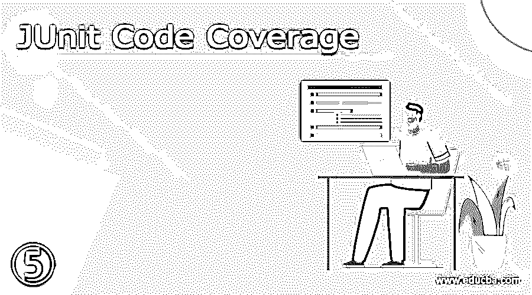
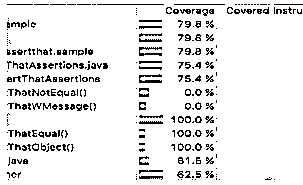
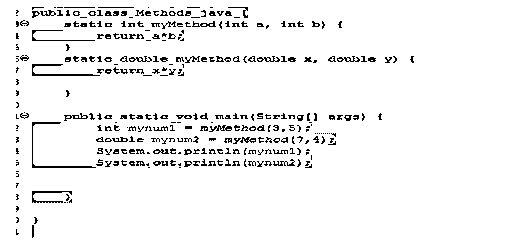

# JUnit 代码覆盖率

> 原文：<https://www.educba.com/junit-code-coverage/>




## JUnit 代码覆盖率的定义

基本上，它是一个用来维护包括 JUnit 和项目源代码在内的所有源代码的所有项目相关文档的工具。它还帮助我们显示方法和类实现的覆盖率。通常通过使用代码覆盖工具，我们可以保持代码的质量并提供更快的交付。换句话说，我们可以说它是用来确保代码质量的主要工具，并为编写测试用例提供了时间表。代码覆盖的另一个优点是它提供了圈复杂度来提高代码质量。

### JUnit 代码覆盖率介绍

代码包含是一个矩阵指针，显示运行自动化 JUnit 实验时执行的代码行。这有助于工程师区分任何单元测试对于创建的代码或最近添加的有用的代码来说都没有丢失，以便进一步开发代码质量并减少加入测试的时间表上的一些 bug。

<small>网页开发、编程语言、软件测试&其他</small>

在审查您的应用程序时，源代码审查员同样要求一个代码覆盖报告，以便您注意到您的组合 JUnit 实验是否覆盖了整个应用程序。

对于所有实验来说，包含通常检查整个代码是至关重要的。这是一个决定性的事实证明，所有可测试的代码都毫无疑问地被测试过。在这个模型中，我将展示工程师在单元实验中打开和关闭代码包含的方式。

### JUnit 代码覆盖率设置

现在，让我们看看如何进行 JUnit 代码覆盖率设置，如下所示。基本上，有两种工具可以实现代码覆盖，如下所示。

#### 黯然失色

现在让我们看看 Eclipse 和 EclEmma 的设置，如下所示。

首先，我们需要在本地机器上的 Eclipse 中安装 EclEmma。在 eclipse 中，我们可以安装 Emma 工具，它为用户提供不同种类的特性。EclEmma 的安装如下截图所示。


安装后，我们在菜单中得到一个选项，如下图所示。





在上面的截图中，我们可以看到代码覆盖率的表格结构，因为我们可以看到类文件中的绿色和红色，如下图所示。





我们还可以根据我们的需求，通过使用 maven 来实现代码覆盖。现在让我们看看如何实现圈复杂度，如下所示。

一种常见的启发式方法叫做圈复杂度。它已经存在很长时间了。托马斯·麦凯布在 1976 年开发了它。这里可以看到计算的直观描述。

*   指定一个亮点来代表技术的开始。
*   为每个限制性构建添加一个点，例如，if 条件。
*   每一个迭代设计加一分。
*   在开关说明中，为每个案例或默认模块增加一分。
*   任何额外的布尔条件加一分，例如&&或||。

分数越高，策略就越令人难以置信。麦凯布为美国国家标准与技术研究所(National Institute of Standards and Technology)撰写的一篇论文建议，你应该将分数控制在 20 分以下。考虑到圈的复杂性，最终，一个人需要宣布一段代码是否是基本的；通过任何计算确定的任何数字都只是用于该选择的手册。

**Note:** You should know that certain individuals would rather avoid utilizing cyclomatic intricacy.

许多组织正在利用 SonarQube 对他们的产品进行代码质量度量。SonarQube 给出的度量之一是圈复杂度。尽管如此，在我看来，它已经越过了不可逆转的临界点。SonarQube 通常运行在已经推送到 git 的代码上。它可以筛选一个组件分支，但是，在这个例子中，你需要一个快速的输入周期，一个不包括推给 git，然后相信服务器会处理你的分支的周期。这就是雅各布出现的地方。

### JUnit 代码覆盖工具

现在让我们看看另一个代码覆盖工具，如下所示。

#### 1.雅各布

JaCoCo 是一个开源的 Java 编程质量工具，用于评估代码的包容性，向您显示您编写的单元测试已经尝试了代码中的哪些行。除了包含之外，JaCoCo 同样涵盖了每种策略的复杂性，并让您知道一项技术中还有多少复杂性没有经过测试。

对于移植，我们需要在 POM.xml 文件中添加 maven 依赖项，如下所示。

```
<plugin>
<groupId>org.jacoco</groupId>
<artifactId>jacoco-maven-plugin</artifactId>
<version>0.8.2</version>
<executions>
<execution>
<goals>
<goal>prepare-agent</goal>
</goals>
</execution>
<execution>
<id>report</id>
<phase>prepare-package</phase>
<goals>
<goal>report</goal>
</goals>
</execution>
</executions>
</plugin>
```

项目下。xml 我们需要添加如下插件。

```
<reporting>
<plugins>
<plugin>
<groupId>org.jacoco</groupId>
<artifactId>jacoco-maven-plugin</artifactId>
<reportSets>
<reportSet>
<reports>
<!-- select non-aggregate reports -->
<report>report</report>
</reports>
</reportSet>
</reportSets>
</plugin>
</plugins>
</reporting>
```

#### 2.JCov

Java 代码包含设备有两种:第一种，向 Java 源代码添加解释并要求重新编译的工具。第二，在执行之前或执行期间检测字节码的设备。目标是通过登记运行测试时执行的代码行来发现代码的哪些部分被尝试了。

#### 3.开放三叶草

OpenClover 是 Atlassian Clover 的免费开源替代产品，由 Atlassian 于 2017 年发布的 Clover 代码库派生而来。它包含了第一个三叶草的所有亮点。

OpenClover 利用源代码插装过程，处理 Java、Groovy 和 AspectJ 方言。它的一部分亮点包括对包含估计范围的精细控制、测试增强和精炼的报告。

#### 4.宁静

Serenity 是一个开源工具库，用于评估和揭示 Java 代码的包容性。除了包含之外，重要的代码度量是估计圈复杂度、安全性、相关性和与基本面的距离。报告信息保存在项目数据集中，可通过 Jenkins/Hudson 访问。连接点向外复制了 Eclipse IDE 接口。

### 结论

我们希望通过这篇文章，您能够了解更多关于 JUnit 代码的内容。从上面的文章中，我们已经理解了 JUnit 代码覆盖的基本思想，我们也看到了 JUnit 代码覆盖的表示和例子。从本文中，我们了解了如何以及何时使用 JUnit 代码覆盖率。

### 推荐文章

这是 JUnit 代码覆盖率的指南。在这里，我们讨论定义，介绍，我们如何做 JUnit 代码覆盖设置。你也可以看看下面的文章来了解更多-

1.  [JUnit 参数化测试](https://www.educba.com/junit-parameterized-test/)
2.  朱尼特木星
3.  [JUnit 5 Maven 依赖](https://www.educba.com/junit-5-maven-dependency/)
4.  [JUnit 测试套件](https://www.educba.com/junit-test-suite/)


