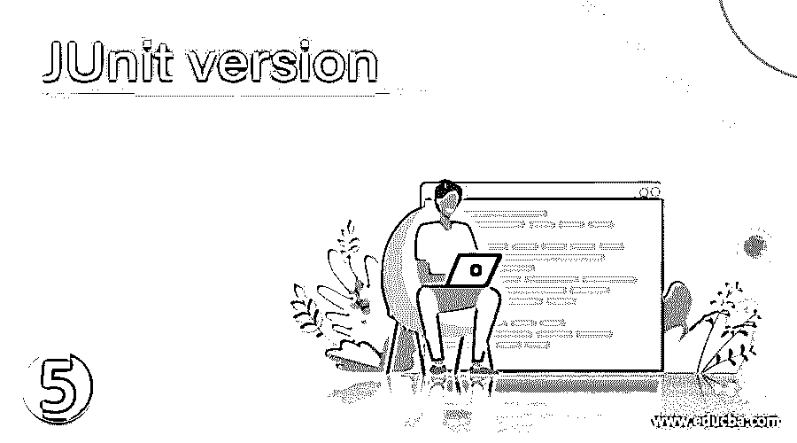

# JUnit 版本

> 原文：<https://www.educba.com/junit-version/>

## JUnit 版本介绍

JUnit 是一个开源框架，用于 Java 编程语言的单元测试。对于 Java 开发人员来说，这是一个非常有用的 TDD(测试驱动开发)框架，用于编写和执行可重复的测试用例。它是 xUnit 架构的重要部分/实例，对单元测试很重要。junit 的 org.junit 包包含运行测试用例所需的各种类和接口。到目前为止，已经发布了各种版本的 JUnit，每天都在引入新的特性，使得开发人员在其上编码和运行测试用例变得更加容易和简单。

**JUnit 的版本**

<small>网页开发、编程语言、软件测试&其他</small>

让我们详细了解各种 JUnit 版本的大致分类:

#### 1.JUnit 5

JUnit 5 是 JUnit 的最新一代。它包括关注 Java 8 和更高版本，允许开发者在 JVM 上进行各种类型的测试。JUnit 5 代的最新版本是 2021 年 2 月发布的 5.7.1。JUnit 由 3 个不同的模块组成，即

*   JUnit 平台:它基本上是启动测试框架的基础。它还为 TestEngine 定义了 API，用于开发将在该平台上运行的测试框架。
*   **JUnit Jupiter:**JUnit 5 中对于扩展和测试用例的编写，基本上是扩展模型和编程模型的结合。它提供了 TestEngine 来在平台上运行基于 Jupiter 的测试用例。
*   **JUnit Vintage:** 基本上是提供 TestEngine 在平台上运行 JUnit 3 和 JUnit 4 测试用例。

#### 2.JUnit 5.7.1

JUnit 5.7.1 中引入的主要错误修复和新功能如下:

*   用户指南中详细解释了嵌套测试。
*   新的 JUnit 方法，即“TestInstancePreDestroyCallback”有助于向开发人员确保在与@Nested 测试结合使用时，所有测试用例都得到处理。
*   Function 'ExtensionContext。即使在引发异常时，Store.getOrComputeIfAbsent()'也只会被调用一次。
*   XML 格式的遗留报告将包括所有容器级别的故障。
*   当包名等于模块名时，“ClassPathScanner”方法名“scanForClassesInPackage(String)”将返回有效的类名列表。

#### 3.JUnit 5.7.0

这个版本的 JUnit 发布于 2020 年 9 月。JUnit 5.7.0 中引入的主要错误修复和新功能如下:

*   HierarchicalTestEngine 现在支持全局资源锁。
*   注释“@testable”现在可以针对任何元素，比如包、类、方法、模块等等。
*   在“FileSelector”和“ClasspathResourceSelector”中，现在支持“FilePosition”。
*   EngineTestKits 中引入了许多变化。
*   EngineExecutionListener 中声明的所有方法都将具有空的默认实现。
*   像@Timeout、@ TestMethodOrder、TestInstanceFactory、@DisplayNameGneration 等一些 API 已经从实验性的升级到稳定的。
*   为了在一些 condition 方法的基础上启用和调整测试，引入了新的@EnabledIf 和@DisabledIf 注释。

#### 4.JUnit 5.6.2

这个版本的 JUnit 是在 2020 年 4 月推出的。JUnit 5.6.2 中引入的一些主要变化和新功能如下:

*   JUnit 4 的“描述”现在更改为“getDisplayName ”,以便在“getMethodName”显示空字符串而不是异常时生成显示名称。
*   对于与提供的“谓词”不匹配的类，“reflection support . findnestedclasses”将不再检测内部类循环。
*   如果内部类没有用“@Nested”进行注释，测试发现将不再因为形成循环的内部类层次结构而暂停。

#### 5.JUnit 5.6.1

这个版本的 Junit 发布于 2020 年 3 月。JUnit 5.6.1 中引入的一些变化和新功能如下:

*   此版本中引入的一项重要更改是，在加载 junit- platform.properties 文件时不再捕获 URL，以避免 Microsoft Windows 中的文件锁定问题。
*   如果 junit-platform.properties 中存在具有不同类路径的多个文件，那么只会向用户发出警告。
*   在这个版本中没有引入 JUnit 复古的变化。
*   此版本中引入了与 TestInstancePreDestroyCallback 相关的错误修复。

#### 6.JUnit 5.6.0

这个版本的 JUnit 发布于 2020 年 1 月。此版本中引入的一些错误修复和主要功能如下:

*   为@EnabledForJreRange 和@DisabledForJreRange 引入了新的执行条件。
*   Annotation @Order 现在允许开发人员指定相对顺序。
*   在测试执行失败期间发现的错误报告在此版本中得到了改进。
*   标记表达式中支持使用 any()和 none()。
*   对@CsvSource 和@CsvFileSource 进行了改进。
*   老式引擎的各种错误修复和性能改进的变化。

#### 7.JUnit 4

JUnit 4 发布了各种版本。最新发布的 JUnit 4 版本是 JUnit 4.13.2。在这个整体版本中，各种新特性和错误都得到了修复。其中一些列举如下:

*   在这个版本中，Java 的单元测试框架被完全重新设计。
*   此版本要求使用 Java 5 及更高版本。
*   它基本上是基于注释而不是命名约定。
*   引入了超时和异常测试功能。
*   像@Before、@BeforeClass、@After、@AfterClass 等注释都是在这个版本中引入的。
*   此版本支持命令行过滤器参数。
*   定制的测试运行者被允许创建他们自己的测试类。
*   添加了@Category 的 AnnotationValidator 框架和验证检查。
*   此版本中修复了 AssertionError 处理。
*   这个版本中引入了新的超时构造函数和工厂。

#### 8.JUnit 3

JUnit 3 版本中引入的一些功能如下所示:

*   测试方法必须以前缀“Test”开头。
*   所有的测试设备都需要从 junit.framework.TestCase 继承。
*   在此版本的测试报告中，断言被报告为失败。
*   在一个方法中使用多个断言是完全可以的。
*   在运行测试用例之前，需要做一些程序性的准备工作，之后通常会进行一些清理工作。

### 结论

上面的描述清楚地解释了 JUnit 的各种版本以及每个版本中引入的主要特性。对于一个程序员来说，理解新版本中引入的主要变化和新特性并保持更新是非常重要的。

### 推荐文章

这是一个 JUnit 版本的指南。在这里，我们讨论了 JUnit 各种版本的大致分类以及主要特性。您也可以看看以下文章，了解更多信息–

1.  [Junit 面试问题](https://www.educba.com/junit-interview-questions/)
2.  [JUnit Maven 依赖关系](https://www.educba.com/junit-maven-dependency/)
3.  [Java 库](https://www.educba.com/java-repository/)
4.  [JavaFX 动画](https://www.educba.com/javafx-animation/)

