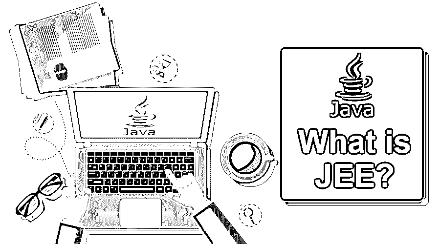

# 什么是 JEE？

> 原文：<https://www.educba.com/what-is-jee/>

## JEE 简介

JEE 是一个为开发者和第三方软件提供商提供 API(应用编程接口)的平台，用于在服务器端实现接口的所需功能。使用这些功能，用户可以根据业务需求创建自己的 web 或企业应用程序，然后在 Tomcat、Jetty 或 JBoss 等 JEE 容器上运行。

是 2018 年初以来雅加达企业版的简称。在此之前，它在 2006 年年中至 2017 年初被称为 Java 企业版，在此之前，它在 1999 年年底至 2006 年年中被普遍称为 J2EE，即 Java 2 平台企业版。它是 Java 的众多平台之一，构建在 Java SE(即 Java 标准版)之上。Jakarta Enterprise Edition 扩展了 Java SE 8，并与之后的版本兼容。

<small>网页开发、编程语言、软件测试&其他</small>

### 了解 JEE

*   顾名思义，它旨在构建大型应用程序，如企业和 web 应用程序。JEE 引用运行时在各种功能领域都有应用，其中很少包括银行、电子商务、旅游等。
*   JEE 应用程序通常由客户端和服务器端组成。客户端是最终用户通过浏览器与应用程序进行交互的地方。它主要是用前端技术编写的。
*   HTML 和 CSS 在 JSP 中被广泛用于设计这个 UI。使用 servlets 等各种技术用 Java 编写的服务器端代码旨在处理最终用户的请求，并执行后端数据库事务。那么 JEE 是由什么组成的呢？它的核心技术是什么？

### JEE 核心技术公司

以下是 JEE 的一些核心技术:

#### 网络技术

*   对于创建 web 应用程序，它为我们提供了 Servlet API，JSTL 的，即 JSP 标准标签库，从而使我们的工作变得更加容易。Servlet 接口进一步由抽象类组成，如 HTTPServlet 和 GenericServlet。
*   HTTPServlet 由 doGet 和 doPost 等方法组成，这些方法将 HttpServlet 请求和 HttpServlet 响应作为参数，帮助客户端代码和服务器端代码之间的数据交换。
*   JSP 标记库提供了一个在 JSP 中使用的预定义标记，使得开发人员的编码过程更加容易。JEE 提供的其他 API 有 JSF，它是 Java Server Faces，帮助用户界面的构建，EL 是统一表达式语言[，用于将 JSF 组件](https://www.educba.com/jsf-components/)绑定到 java beans，等等。

#### 网络服务

*   它支持两种众所周知的 web 服务风格，即 SOAP web 服务 JAX-WS 和 REST web 服务 JAX-RS(REST-表述性状态转移)。这些 web 服务利用 XML 和 JSON 在它们之间交换信息。
*   它提供了用于 RESTful web 服务的 Java API、用于 JSON 处理的 Java API(对 JSON 数据进行解码和编码)、用于 JSON 绑定的 Java API(允许将 JSON 数据绑定到 Java 类),以便数据可以在这两种形式之间轻松转换。
*   它还提供了对将 XML 绑定到 Java 类和 Java API for XML web services 的支持，以创建 SOAP 服务提供者和消费者。

#### 数据存取

*   它为数据库相关操作提供了 java 持久性 API 和 Java 事务 API。java 持久性 API 允许将数据库表与 java 类绑定，并将表列绑定到 java 类属性。
*   java 事务 API 提供了帮助在数据库上执行操作的接口。
*   Hibernate 和 iBatis 是 Java 持久性 API 的两个最流行的实现。
*   容器:它由不同的容器组成，其中有 web 容器和 EJB 容器。Web 容器作为运行 web 应用程序的运行时环境。
*   例如，很少有广泛使用的实现是 tomcat 和 jetty。在 spring 框架的情况下，容器有助于依赖注入和 Spring 提供的其他特性。

### 为什么要用？

以下是我们应该使用 JEE 的几个原因。

*   应该使用它来使 web 应用程序和企业应用程序的开发更快更容易。人们可以通过编写自己的实现来使用和定制提供的大量 API。
*   它还有助于通过 API(如 Java 安全 API)为您的应用程序提供安全性。它提供诸如身份验证、访问控制、安全的端到端通信、加密等功能。在不同 API 的帮助下，每个 API 覆盖特定的功能，可能是数据持久性或获取用户输入或提供安全性，开发人员开发大规模应用程序的任务被简化了吗？

### 我们还能用它做什么？

*   它还为我们提供了各种其他功能丰富的 API，如 JMS- Java 消息服务、批处理应用程序、验证。Java 消息传递 API 是专为企业消息传递而创建的。它在诸如为企业消息传递系统发送、接收和创建消息的功能上辅助 java 程序。
*   批处理应用程序 API 有助于执行可能需要定期运行的任务。这些通常在后台运行。验证由 Bean 验证 API 负责。它们对 [Java bean 类](https://www.educba.com/what-is-javabeans/)施加约束，也就是说，它们预先确定了这些类的属性可以包含的值的种类。这些对于避免 SQL 注入非常有用。

### 这项技术将如何帮助你的职业发展？

*   随着电子商务的快速发展和银行业的数字化，开发高质量和安全的 web 应用程序的需求也在增加。
*   它提供了一个以最少的麻烦做到这一点的机会。因此，学习信息技术会对获得一份理想的工作或晋升产生巨大的影响。

### 结论

在本文中，我们简要介绍了 JEE 提供的各种 API，以及它们如何帮助开发企业或 web 应用程序。

### 推荐文章

这是一个什么是 JEE 的指南。在这里，我们讨论了 JEE 的介绍，用途和一些核心技术以及职业发展。您也可以浏览我们推荐的其他文章，了解更多信息——

1.  [Java 工具](https://www.educba.com/java-tools/)
2.  [Java vs .Net](https://www.educba.com/java-vs-dot-net/)
3.  [Java EE 面试问题](https://www.educba.com/java-ee-interview-questions/)
4.  [Servlet 架构](https://www.educba.com/servlet-architecture/)

